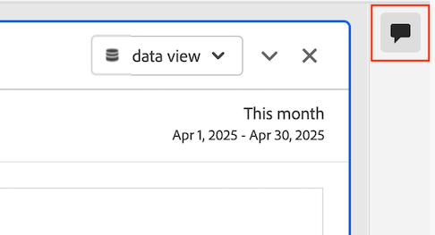

# Ajout et gestion de commentaires dans les projets {#comment-on-projects}

{{release-limited-testing}}

Les commentaires dans Analysis Workspace vous permettent de partager des informations et de poser des questions dans le cadre d’un projet Analysis Workspace. Cela peut rationaliser les discussions sur les données, en maintenant les conversations dans le contexte des données qui font l’objet de discussions.

>[!NOTE]
>
>La possibilité d’ajouter et de gérer des commentaires sur un projet peut être désactivée au niveau du projet ou de l’organisation. Si vous ne pouvez pas ajouter ni gérer de commentaires comme décrit dans cette section, l’administrateur ou le propriétaire du projet Customer Journey Analytics a désactivé cette fonctionnalité.
>
>* **Projet :** le propriétaire du projet peut désactiver cette fonctionnalité pour le projet, comme décrit dans la section [Créer des projets](/help/analysis-workspace/build-workspace-project/create-projects.md).
>* **Organisation :** l’administrateur Customer Journey Analytics peut désactiver cette fonctionnalité pour l’organisation, comme décrit dans [Préférences](/help/analysis-workspace/user-preferences.md).

## Afficher les commentaires

Vous pouvez afficher des commentaires dans la zone des commentaires dans le rail de droite ou à partir du badge de commentaire s’il en existe un.

>[!NOTE]
>
>Un projet doit être enregistré avant que la zone de commentaires ne soit visible dans le rail de droite. Si le projet n’a pas été enregistré auparavant, vous devez [enregistrer le projet](/help/analysis-workspace/build-workspace-project/save-projects.md) avant d’ajouter des commentaires.

### Afficher les commentaires dans la zone des commentaires

Tous les commentaires ajoutés dans un projet Analysis Workspace sont visibles dans la zone des commentaires du rail de droite. Le nombre total de commentaires existants s’affiche sur l’icône des commentaires .

1. Par défaut, la zone de commentaires est développée pour chaque projet dans Analysis Workspace la première fois que vous ouvrez un projet.

   Sélectionnez l’icône de la zone de commentaires dans le rail de droite d’un projet pour ouvrir ou fermer la zone de commentaires.

   

   Chaque commentaire affiche l’horodatage du jour où il a été publié. Si le commentaire a été publié le jour en cours, l’heure s’affiche. Souris au cours de la journée ou de l’heure pour afficher la date et l’heure complètes auxquelles le commentaire a été publié.

1. (Facultatif) Pour rechercher dans la zone de commentaires, sélectionnez l’icône de recherche , puis saisissez un mot ou une expression. La zone des commentaires est filtrée pour ne contenir que les commentaires contenant ce mot ou cette expression.

### Affichage des badges de commentaire dans un projet

Les commentaires ajoutés [sur une zone spécifique du projet](#comment-on-a-specific-area-of-the-project) comportent un **badge de commentaire**  qui s’affiche sur la zone du projet à laquelle le commentaire se rapporte. Sélectionnez un badge pour afficher le commentaire. Après avoir sélectionné le badge, vous pouvez sélectionner le commentaire lui-même pour le mettre en surbrillance dans la zone des commentaires dans le rail de droite.

Les nombres s’affichent sur chaque badge d’un projet et sont triés dans l’ordre dans lequel ils ont été créés. Si plusieurs commentaires sont placés dans la même zone d’un projet, le badge affiche 3 points . Sélectionnez le badge à 3 points pour afficher tous les commentaires dans cette zone.

<!-- Insert screeshot-->

Pour masquer tous les badges de commentaires d’un projet :

1. Une fois le projet ouvert dans Analysis Workspace, sélectionnez l’icône de zone de commentaires  dans le rail droit d’Analysis Workspace.

1. Au bas de la zone de commentaires, activez l’option **[!UICONTROL Masquer les badges placés]**.

## Ajouter des commentaires

Vous pouvez ajouter un commentaire qui fait référence à une zone spécifique du projet ou ajouter un commentaire général.

### Commentaire sur une partie spécifique du projet

Pour commenter une zone spécifique du projet (par exemple, une valeur de mesure dans un tableau à structure libre) :

1. Une fois le projet ouvert dans Analysis Workspace, cliquez avec le bouton droit de la souris dans la zone du projet dans laquelle vous souhaitez insérer le commentaire.

   Toutes les visualisations prennent en charge les badges de commentaire dans l’en-tête de visualisation, mais seules les visualisations suivantes prennent en charge les badges de commentaire sur des points de données spécifiques dans la visualisation :

   * Tableau à structure libre
   * Table de cohorte
   * Ligne

   <!--add screenshot-->

1. Sélectionnez **[!UICONTROL Ajouter un commentaire]**.

1. Dans le champ **[!UICONTROL Nouveau commentaire]**, spécifiez votre commentaire.

   Les commentaires peuvent contenir jusqu’à 15 000 caractères et inclure des balises de base, des liens hypertexte, des listes à puces et numérotées, ainsi que des émoticônes.

1. (Facultatif) Informez une autre personne de votre commentaire en saisissant le symbole @ suivi de son nom. Pour plus d’informations sur l’utilisation du symbole @ pour informer les autres utilisateurs, voir [Inclure les autres dans un commentaire](#include-others-in-a-comment).

1. Sélectionnez **[!UICONTROL Envoyer]**.

   Un **badge de commentaire**  est placé dans la zone du projet Workspace où vous avez ajouté le commentaire, comme décrit dans la section [Afficher les badges de commentaire dans un projet](#view-comment-badges-in-a-project). Le commentaire s’affiche également en haut de la zone des commentaires dans le rail de droite.

### Ajouter un commentaire général sur le projet

Pour ajouter des commentaires à un projet dans Analysis Workspace :

1. Une fois le projet ouvert dans Analysis Workspace, sélectionnez l’icône de zone de commentaires  dans le rail droit d’Analysis Workspace. <!-- add screen shot -->

1. Dans le champ **[!UICONTROL Nouveau commentaire]**, spécifiez votre commentaire.

   Les commentaires peuvent contenir jusqu’à 15 000 caractères et inclure des balises de base, des liens hypertexte, des listes à puces et numérotées, ainsi que des émoticônes.

1. (Facultatif) Informez une autre personne de votre commentaire en saisissant le symbole @ suivi de son nom. Pour plus d’informations sur l’utilisation du symbole @ pour informer les autres utilisateurs, voir [Inclure les autres dans un commentaire](#include-others-in-a-comment).

1. Sélectionnez **[!UICONTROL Envoyer]**.

   Le commentaire s’affiche en haut de la zone des commentaires, comme décrit dans la section [Afficher les commentaires dans la zone des commentaires](#view-comments-in-the-comments-area).

## Inclure les autres dans un commentaire

La fonction de commentaire d’Analysis Workspace facilite la collaboration avec d’autres personnes.

Tenez compte des points suivants lors de l’utilisation du symbole @ pour inclure des personnes dans un commentaire :

* Les personnes que vous incluez reçoivent des notifications en fonction de leurs paramètres de notification Adobe Experience Cloud.

  Pour plus d’informations, voir [Recevoir des notifications sur les commentaires](#receive-notifications-about-comments).

* Vous pouvez inclure dans un commentaire toute personne faisant partie de votre organisation et ayant accès à Customer Journey Analytics, mais cela ne lui accorde pas automatiquement l’accès pour modifier le projet.

Pour inclure une autre personne dans votre commentaire :

1. Saisissez le symbole @, puis commencez à saisir le prénom, le nom ou l’adresse e-mail de la personne que vous souhaitez inclure.

   

1. Sélectionnez le nom de la personne lorsqu’il apparaît dans le menu déroulant.

## Répondre à un commentaire

1. Dans Analysis Workspace, ouvrez le projet dans lequel vous souhaitez ajouter un commentaire.

1. Sélectionnez l’icône de zone de commentaires  dans le rail de droite d’Analysis Workspace, puis sélectionnez **[!UICONTROL Répondre]** en regard du commentaire auquel vous souhaitez répondre.

   Pour inclure le texte du commentaire auquel vous répondez, avec le texte d’origine encapsulé dans une balise guillemet, sélectionnez l’icône en forme de 3 points en regard du commentaire ou de la réponse spécifique auxquels vous souhaitez répondre, puis sélectionnez **[!UICONTROL Citer la réponse]**. Une réponse avec devis est un bon moyen d’indiquer à quel commentaire ou à quelle réponse votre commentaire fait référence.

   Ou

   Sélectionnez l’icône de commentaire dans le panneau ou la visualisation où le commentaire a été fait, puis sélectionnez **[!UICONTROL Répondre]**.

1. Dans le champ **[!UICONTROL Nouveau commentaire]**, spécifiez votre commentaire.

   Les commentaires peuvent contenir jusqu’à 15 000 caractères et inclure des balises de base, des liens hypertexte, des listes à puces et numérotées, ainsi que des émoticônes.

1. (Facultatif) Informez une autre personne de votre commentaire en saisissant le symbole @ suivi de son nom. Pour plus d’informations sur l’utilisation du symbole @ pour informer les autres utilisateurs, voir [Inclure les autres dans un commentaire](#include-others-in-a-comment).

1. Sélectionnez **[!UICONTROL Envoyer]**.

## Recevoir des notifications sur les commentaires

Les propriétaires de projet et [personnes spécifiques que vous mentionnez](#include-others-in-a-comment) reçoivent des notifications en fonction de leurs paramètres de notification Adobe Experience Cloud. Par défaut, ils reçoivent une notification in-app, visible à partir de l’icône [notification Experience Cloud](https://experienceleague.adobe.com/en/docs/core-services/interface/features/account-preferences#view-notifications)  dans Customer Journey Analytics.

De plus, les utilisateurs peuvent configurer les paramètres de notification d’Experience Cloud pour recevoir des notifications par e-mail et des notifications Slack en [s’abonnant aux notifications par e-mail](https://experienceleague.adobe.com/en/docs/core-services/interface/features/account-preferences#subscribe-to-in-app-and-email-notifications) et [s’abonnant aux notifications Slack](https://experienceleague.adobe.com/en/docs/core-services/interface/features/account-preferences#slack).

## Placer un badge pour un commentaire existant

Si un commentaire est disponible dans la zone des commentaires dans le rail de droite, mais qu’il n’a pas encore de badge dans le projet, vous pouvez ajouter le badge.

1. Une fois le projet ouvert dans Analysis Workspace, sélectionnez l’icône de zone de commentaires  dans le rail droit d’Analysis Workspace.

1. Sélectionnez l’icône Plus  en regard du commentaire pour lequel vous souhaitez placer un badge, puis sélectionnez **[!UICONTROL Placer un badge]**.

1. Sélectionnez la zone du projet dans laquelle vous souhaitez placer le badge pour le commentaire existant.

   Un **badge de commentaire**  est placé dans la zone du projet Workspace que vous avez sélectionné. Le commentaire s’affiche également en haut de la zone des commentaires dans le rail de droite.

   Voir [Afficher les badges de commentaire dans un projet](#view-comment-badges-in-a-project) pour plus d’informations.

Pour supprimer un badge :

1. Sélectionnez le badge à supprimer, puis sélectionnez **[!UICONTROL Supprimer le badge]**.

   Le badge est supprimé, mais le commentaire est toujours disponible dans la zone des commentaires dans le rail de droite.

## Déplacer un badge pour un commentaire existant

Vous pouvez déplacer un badge de commentaire déjà placé pour un commentaire existant.

1. Une fois le projet ouvert dans Analysis Workspace, recherchez le badge du commentaire que vous souhaitez déplacer.

1. Cliquez avec le bouton droit sur le badge, puis sélectionnez **[!UICONTROL Déplacer l’emplacement]**.

1. Sélectionnez la zone du projet dans laquelle vous souhaitez placer le badge.

<!-- add section about adding images to comments. will be available at GA. Include that "you can have a maximum of 5 images per comment, and each image can be up to 2 MB." -->

## Copier le lien vers un commentaire

Vous pouvez copier le lien vers un commentaire et partager le lien avec d’autres personnes. Seules les personnes ayant déjà accès au projet peuvent y accéder avec le lien .

Pour copier le lien vers un commentaire :

1. Une fois le projet ouvert dans Analysis Workspace, sélectionnez l’icône de zone de commentaires  dans le rail droit d’Analysis Workspace.

1. Sélectionnez l’icône Plus  en regard du commentaire dont vous souhaitez copier le lien, puis sélectionnez **[!UICONTROL Copier le lien]**.

   Le lien est copié dans le presse-papiers du système. Vous pouvez coller le lien dans un e-mail ou un autre type de message.

## Copier le texte d’un commentaire

Vous pouvez copier le corps de texte d’un commentaire et le partager avec d’autres personnes.

Pour copier le corps de texte d’un commentaire :

1. Une fois le projet ouvert dans Analysis Workspace, sélectionnez l’icône de zone de commentaires  dans le rail droit d’Analysis Workspace.

1. Sélectionnez l’icône Plus  en regard du commentaire contenant le texte à copier, puis sélectionnez **[!UICONTROL Copier le corps du texte]**.

   Le corps du texte du commentaire est copié dans le presse-papiers du système.

## J&#39;aime un commentaire

1. Une fois le projet ouvert dans Analysis Workspace, sélectionnez l’icône de zone de commentaires  dans le rail droit d’Analysis Workspace.

1. Sélectionnez **[!UICONTROL J’aime]** sous le commentaire que vous souhaitez endosser.

## Supprimer un commentaire

Lorsque vous supprimez un commentaire, le commentaire d’origine et les réponses ou pièces jointes sont également supprimés.

Les commentaires supprimés ne peuvent pas être récupérés.

Pour supprimer un commentaire :

1. Une fois le projet ouvert dans Analysis Workspace, sélectionnez l’icône de zone de commentaires  dans le rail droit d’Analysis Workspace.

1. Sélectionnez l’icône Plus  en regard du commentaire à supprimer, puis sélectionnez **[!UICONTROL Supprimer]**.

1. Sélectionnez à nouveau **[!UICONTROL Supprimer]** pour confirmer la suppression.

## Résoudre un commentaire

Lorsque vous résolvez un commentaire, il est marqué comme résolu et masqué dans la zone des commentaires. Si un badge est associé au commentaire, le badge est supprimé du projet.

Pour résoudre un commentaire :

1. Une fois le projet ouvert dans Analysis Workspace, sélectionnez l’icône de zone de commentaires  dans le rail droit d’Analysis Workspace.

1. Sélectionnez l’icône Plus  en regard du commentaire à résoudre, puis sélectionnez **[!UICONTROL Résoudre]**.

1. Sélectionnez à nouveau **[!UICONTROL Résoudre]** pour confirmer.

Par défaut, les commentaires résolus sont masqués dans la zone des commentaires. Pour afficher les commentaires résolus :

1. Sélectionnez l’icône de filtre dans la zone de commentaires, puis désélectionnez l’option **[!UICONTROL Masquer les commentaires résolus]**.
