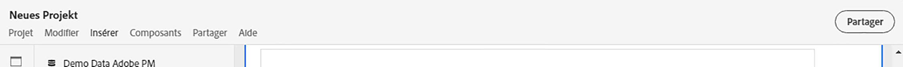
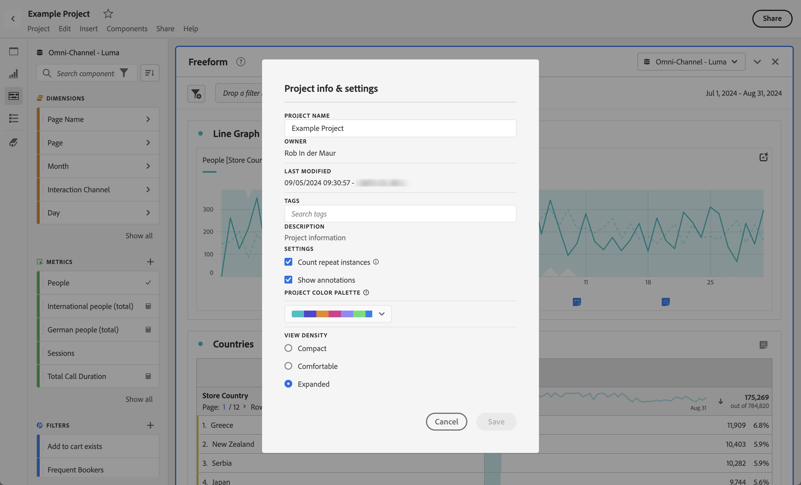
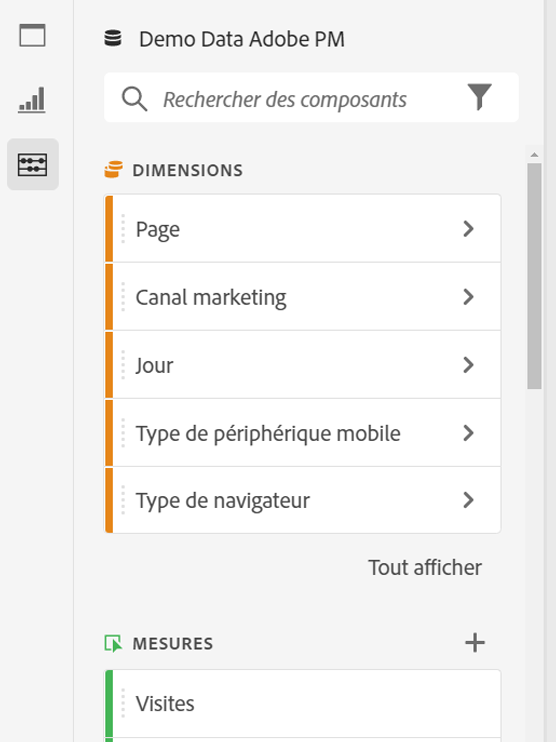
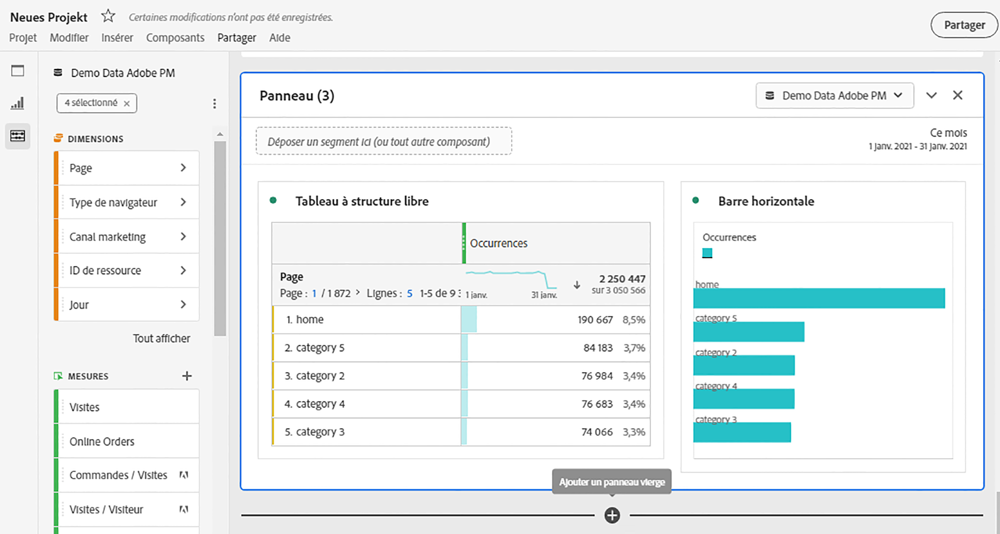
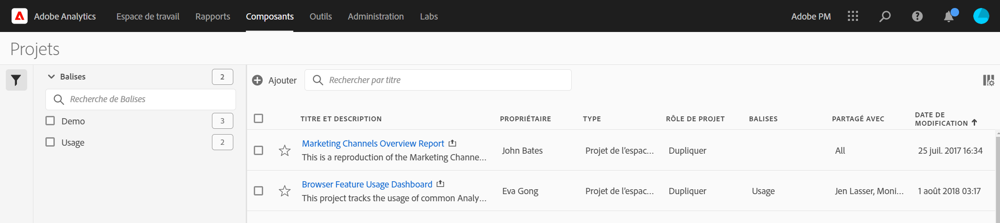

# Présentation des projets

Les projets Workspace vous permettent de combiner des panneaux, des visualisations et des composants pour concevoir votre analyse et la partager avec n’importe qui au sein de votre entreprise. Avant de commencer votre premier projet, découvrez comment accéder à vos projets, les parcourir et les gérer.

Pour accéder aux projets en Customer Journey Analytics, sélectionnez **[!UICONTROL Workspace]**.  Le gestionnaire **[!UICONTROL Projets]** répertorie tous les projets que vous possédez ou les projets qui sont partagés avec vous. Le chef de projet avec la liste Projet est également la page d’entrée par défaut du Customer Journey Analytics, sauf si vous avez configuré le système dans Préférences.

## Zone de titre

Dans la zone de titre, vous pouvez créer un projet, créer un dossier, modifier vos préférences et afficher ou masquer un panneau contenant des mosaïques supplémentaires.

* Pour afficher ou masquer un panneau de gauche qui vous permet de sélectionner entre **[!UICONTROL Projets]** et **[!UICONTROL Apprentissage]**, sélectionnez .
* Le titre affiche Projets, éventuellement ajouté avec un chemin d’accès au dossier sélectionné. Par exemple, [!UICONTROL Projets] > **[!UICONTROL Dossier d’entreprise]**. Vous pouvez sélectionner des parties de sous-dossiers individuelles pour accéder directement au dossier spécifique.
* Pour afficher les mosaïques d’un [**[!UICONTROL projet vierge]**](create-projects.md), d’une [**[!UICONTROL fiche d’évaluation mobile vierge]**](/help/mobile-app/create-scorecard.md), d’une [**[!UICONTROL analyse guidée]**](/help/guided-analysis/overview.md), d’une **[!UICONTROL ouverture de la documentation]** et d’une **[!UICONTROL ouverture des notes de mise à jour]**, sélectionnez  **[!UICONTROL Afficher plus]**}}}}. Pour masquer la zone avec des mosaïques, sélectionnez  **[!UICONTROL Afficher moins]**.
* En fonction de ce que vous choisissez d’afficher, à l’aide du [sélecteur d’affichage](#show-selector), vous pouvez modifier les préférences et effectuer des actions sur le dossier actuel visible dans **[!UICONTROL Projets]** :

  | Action | Description |
  |---|---|
  | **[!UICONTROL Créer un projet]** | Sélectionnez pour [créer un projet](create-projects.md). |
  | **[!UICONTROL Créer un dossier]** | Sélectionnez pour [créer un dossier](workspace-folders/create-folders.md). |
  |  **[!UICONTROL Modifier les préférences]** | [Modifiez les préférences](/help/analysis-workspace/user-preferences.md) pour tous vos projets. Lorsque le chemin de navigation génère un espace limité, cette action fait partie du sous-menu  . |
  | **[!UICONTROL Ajouter des projets]** | Sélectionnez pour [ajouter des projets](workspace-folders/add-projects.md) au dossier actuel. Lorsque le chemin de navigation génère un espace limité, cette action fait partie du sous-menu  . |
  | **[!UICONTROL Renommer le dossier]** | [Renomme](workspace-folders/manage-folders.md#rename-folders) le dossier actuel. |
  | **[!UICONTROL Déplacer le dossier]** | [Déplace](workspace-folders/manage-folders.md#move-folders) le dossier actif. |
  | **[!UICONTROL Supprimer le dossier]** | [Supprime](workspace-folders/manage-folders.md#delete-folders) le dossier actif. |

## Liste de projets

La liste des projets permet d’afficher tous les projets que vous possédez et qui ont été partagés avec vous. La liste contient les colonnes suivantes :

| Colonne | Description |
| --- | --- | 
|  | Lorsqu’un ou plusieurs projets sont sélectionnés, une barre d’actions bleue s’affiche au bas de l’interface Projet . Voir [Actions](#actions) pour plus d’informations. |
|  | Sélectionnez pour favoriser  ou annuler la faveur de  d’un projet. |
| **[!UICONTROL Titre et description]** | Pour modifier le projet, sélectionnez le lien de titre qui ouvre le [projet Workspace](/help/analysis-workspace/home.md). Les projets partagés avec vous sont indiqués avec . Sélectionnez  pour afficher un menu contextuel contenant plus de détails sur le projet. Sélectionnez  pour ouvrir un menu contextuel avec des actions. Voir [Actions](#actions) pour plus d’informations. |
| **[!UICONTROL Type]** | Un projet Workspace, un dossier  ou une [Fiche d’évaluation mobile](https://experienceleague.adobe.com/en/docs/analytics/analyze/mobapp/home). |
| **[!UICONTROL Balises]** | Les balises appliquées au projet. |
| Planifié | Indique si un projet est programmé pour être envoyé par courrier électronique aux destinataires. Les options sont  **[!UICONTROL On]** ou  **[!UICONTROL Off]**. Voir [Envoi de données de projet à d’autres](/help/analysis-workspace/export/t-schedule-report.md). |
| **[!UICONTROL Lien partagé (n’importe qui)]** | Si un projet est partagé avec n’importe qui, même avec les personnes qui n’ont pas accès à Analysis Workspace. Les options sont  **[!UICONTROL Active]** ou  **[!UICONTROL Inactive]**. Pour plus d’informations, voir [Partager un projet avec quiconque (sans connexion requise)](/help/analysis-workspace/curate-share/share-projects.md#share-a-project-with-anyone-no-login-required) dans [Partager des projets](/help/analysis-workspace/curate-share/share-projects.md). |
| **[!UICONTROL Rôle de projet]** | Votre rôle pour le projet. Les options sont les suivantes : Modifier, Dupliquer, Afficher. Voir [Rôles de projet](/help/analysis-workspace/curate-share/curate.md) pour plus d’informations. |
| **[!UICONTROL Vue de données]** | Vue de données à laquelle le projet est associé. |
| **[!UICONTROL Propriétaire]** | Personne qui a créé ce projet (vous ou quelqu’un qui a partagé le projet avec vous). |
| **[!UICONTROL Partagé avec]** | Utilisateurs avec lesquels le projet a été partagé. |
| **[!UICONTROL Dernière modification]** | Date et heure de dernière modification du projet. |
| **[!UICONTROL Dernière ouverture]** | Date et heure de la dernière ouverture du projet. |
| **[!UICONTROL Identifiant du projet]** | ID du projet. |
| **[!UICONTROL Période la plus longue]** | La période la plus longue de tous les panneaux ou visualisations du projet. |
| **[!UICONTROL Nombre de requêtes]** | Nombre total de requêtes contenues dans le projet. |
| **[!UICONTROL Emplacement]** | Le dossier dans lequel réside le projet. |

Passez la souris sur un en-tête de colonne pour afficher  et sélectionnez dans le menu contextuel :

* **[!UICONTROL Tri croissant]**
* **[!UICONTROL Tri descendant]**
* **[!UICONTROL Redimensionner la colonne]**. Une ligne bleue apparaît pour vous aider à redimensionner la colonne.

### Actions

Vous pouvez agir sur un ou plusieurs projets à l’aide du menu contextuel  ou de la barre d’actions bleue.

| Action | Description |
|---|---|
|  **[!UICONTROL *x *sélectionné]** | Désélectionnez les projets et dossiers sélectionnés et supprimez la barre d’actions bleue. |
|  **[!UICONTROL Supprimer]** | Supprimez un ou plusieurs projets ou dossiers. Vous êtes invité à faire une confirmation. |
|  **[!UICONTROL Partager]** | Partagez un projet. Voir [Partager un projet](/help/analysis-workspace/curate-share/share-projects.md) pour plus d’informations. |
|  Rename | Renommez un projet. Ouvre une **[!UICONTROL boîte de dialogue Renommer : *nom du projet *]**. Saisissez un nouveau nom et sélectionnez**[!UICONTROL Enregistrer ]**. |
|  **[!UICONTROL Copier]** | Copiez un ou plusieurs projets. Le projet obtient le même nom et le même suffixe `(Copy)`. |
|  **[!UICONTROL Pin]** ou **[!UICONTROL Unpin]** | Epinglez ou déépinglez un ou plusieurs projets ou dossiers. Les projets et dossiers épinglés apparaissent en haut de la liste et ignorent l’ordre de tri que vous spécifiez. |
|  **[!UICONTROL Monter]** | Déplacez un projet ou un dossier épinglé vers le haut de la liste des projets. |
|  **[!UICONTROL Déplacer vers le bas]** | Déplacez un projet ou un dossier épinglé vers le bas de la liste des projets. |
|  **[!UICONTROL Balise]** | Balisez un ou plusieurs projets ou dossiers. La boîte de dialogue **[!UICONTROL Composants de balise]** s’affiche pour sélectionner une ou plusieurs balises. Sélectionnez **[!UICONTROL Enregistrer]** pour enregistrer les balises des projets ou dossiers sélectionnés. |
|  **[!UICONTROL Approve]** ou **[!UICONTROL Unapprove]** | Approuver ou refuser l’approbation d’un projet. Seuls les administrateurs peuvent approuver les projets. |
|  **[!UICONTROL Exporter CSV]** | Exportez les projets sélectionnés dans un fichier CSV nommé `Project List.csv`. |
|  **[!UICONTROL Ajouter des projets]** | Ajoutez un ou plusieurs projets à un dossier sélectionné. Dans **[!UICONTROL Ajouter des projets]**, vous pouvez sélectionner un ou plusieurs projets. Sélectionnez **[!UICONTROL Ajouter]** pour ajouter les projets au dossier. Pour plus d’informations, voir [Ajout de projets à des dossiers](workspace-folders/add-projects.md#from-inside-a-folder) . |
|  **[!UICONTROL Déplacer vers]** | Déplacez un ou plusieurs projets sélectionnés dans un dossier. Dans le dossier **[!UICONTROL Select Folder]**, sélectionnez le dossier dans lequel déplacer le projet sélectionné et choisissez **[!UICONTROL Move]**. Pour plus d’informations, voir [Ajout de projets à des dossiers](workspace-folders/add-projects.md#from-the-project-list) . |

## Afficher le sélecteur

Vous pouvez changer l’aspect de l’interface des projets à l’aide des sélecteurs ]**de l’écran.**[!UICONTROL  Le sélecteur **[!UICONTROL Afficher]** définit les options disponibles dans la [zone Titre](#title-area) et les colonnes affichées dans la [liste Projet](#project-list).

* Pour modifier les options disponibles pour la [zone Titre](#title-area), sélectionnez **[!UICONTROL Afficher]** **[!UICONTROL Tous les projets]** ou **[!UICONTROL Afficher]** **[!UICONTROL Dossiers et projets]**.

* Pour définir les colonnes à afficher pour la [liste Projet](#project-list), sélectionnez  et, dans la boîte de dialogue **[!UICONTROL Personnaliser la table]**, sélectionnez ou désélectionnez des colonnes. Sélectionnez **[!UICONTROL Appliquer]** pour appliquer la personnalisation. Voir [Liste des projets](#project-list) pour plus d’informations sur les colonnes.

## Panneau Filtrer

Vous pouvez filtrer les projets et les dossiers dans la [liste de projets](#project-list) à l’aide du panneau de filtrage. Pour afficher ou masquer le panneau de filtrage, utilisez .

Le panneau Filtre se compose des sections suivantes.

### Balises

| Balises | Description |
|---|---|
| {width="300"} | La section **[!UICONTROL Balises]** vous permet de filtrer par balises. <ul><li>Vous utilisez  *Rechercher des balises* pour rechercher des balises que vous souhaitez utiliser pour filtrer.</li><li>Vous pouvez sélectionner plusieurs balises. Les balises disponibles dépendent des sélections effectuées dans d’autres sections du panneau de filtrage.</li><li>Les chiffres indiquent :<ul><li>**2︎⃣** : nombre de balises disponibles pour les projets résultant du filtre actuel.</li><li>7︎⃣ : nombre de projets associés à la balise spécifique.</li></ul></li></ul> |

### Vue de données

| Vue de données | Description |
|---|---|
| {width="300"} | La section **[!UICONTROL Vue des données]** vous permet de filtrer les données selon les vues. <ul><li>Vous utilisez  *Rechercher des vues de données* pour rechercher les vues de données que vous souhaitez utiliser pour filtrer.</li><li>Vous pouvez sélectionner plusieurs vues de données. Les vues de données disponibles dépendent des sélections effectuées dans d’autres sections du panneau de filtrage.</li><li>Les chiffres indiquent :<ul><li>**3︎⃣** : nombre de vues de données disponibles pour les projets résultant du filtre actuel.</li><li>4︎⃣ : nombre de projets associés à la vue de données spécifique.</li></ul></li></ul> |

### Propriétaires

| Propriétaire | Description |
|---|---|
| {width="300"} | La section **[!UICONTROL Propriétaire]** vous permet de filtrer les propriétaires. <ul><li>Vous utilisez  *Search Owners* pour rechercher les propriétaires que vous souhaitez utiliser pour filtrer.</li><li>Vous pouvez sélectionner plusieurs propriétaires. Les propriétaires disponibles dépendent des sélections effectuées dans d’autres sections du panneau de filtrage.</li><li>Les chiffres indiquent :<ul><li>**3︎⃣** : nombre de propriétaires disponibles pour les projets résultant du filtre actuel.</li><li>4︎⃣ : nombre de projets associés au propriétaire spécifique.</li></ul></li></ul> |

### Type

| Type | Description |
|---|---|
| {width="300"} | La section **[!UICONTROL Type]** vous permet de filtrer le type de projets ou de dossiers.<ul><li>Vous pouvez sélectionner une ou plusieurs des options suivantes :<ul><li> **[!UICONTROL folder]**</li><li>**[!UICONTROL Projet Espace de travail]**</li><li>**[!UICONTROL Carte de performance mobile]**</li></ul> <li>Vous pouvez sélectionner plusieurs autres filtres. Les autres filtres disponibles dépendent des sélections effectuées dans d’autres sections du panneau Filtres.</li><li>Les chiffres indiquent :<ul><li>**5︎⃣** : nombre d’autres filtres disponibles pour les projets résultant du filtre actuel.</li><li>4︎⃣ : nombre de projets associés à l’autre filtre spécifique.</li></ul></li></ul> |

### Autres filtres

| Autres filtres | Description |
|---|---|
| {width="300"} | La section **[!UICONTROL Autres filtres]** vous permet de filtrer selon d’autres filtres prédéfinis.<ul><li>Vous pouvez sélectionner une ou plusieurs des options suivantes :<ul><li> **[!UICONTROL Tout afficher]**</li><li>**[!UICONTROL Partagé avec moi]**</li><li>**[!UICONTROL Mine]**</li><li>**[!UICONTROL Approuvés]**</li><li>**[!UICONTROL Favoris]**</li></ul> Ce que vous pouvez sélectionner dépend de votre rôle et de vos autorisations.</li><li>Vous pouvez sélectionner plusieurs autres filtres. Les autres filtres disponibles dépendent des sélections effectuées dans d’autres sections du panneau Filtres.</li><li>Les chiffres indiquent :<ul><li>**5︎⃣** : nombre d’autres filtres disponibles pour les projets résultant du filtre actuel.</li><li>4︎⃣ : nombre de projets associés à l’autre filtre spécifique.</li></ul></li></ul> |

## Recherche

Utilisez la zone de recherche pour rechercher des projets et des dossiers à l’aide du champ . Commencez à saisir et la [liste de projets](#project-list) filtre automatiquement votre entrée de recherche.

La zone de recherche affiche également les filtres appliqués à partir du panneau Filtres .

* Pour supprimer un filtre, sélectionnez  dans le filtre.
* Pour supprimer tous les filtres, sélectionnez Effacer tout.

Si l’espace est limité pour afficher les filtres individuels, vous voyez **[!UICONTROL Filtrage par *x* filtres]**.

* Pour supprimer un filtre :

   1. Utilisez les **[!UICONTROL *x *filtres]** pour ouvrir un menu contextuel répertoriant les types de filtres et les filtres individuels.
   1. Utilisez  pour supprimer un filtre.

<!--

The Projects page contains the following information: 

>[!NOTE]
>
>Some columns are not displayed by default. To customize the columns you see, click the **Customize table** icon .

|  Element  | Description  |
|---|---|
| [Edit preferences](/help/analysis-workspace/user-preferences.md) | Manage settings for Analysis Workspace and its related components for all new projects or panels that you create.  |
| [Create folder](/help/analysis-workspace/build-workspace-project/workspace-folders/create-folders.md)  | Add a new folder or subfolder to the list of projects and folders. |
| [Create project](/help/analysis-workspace/build-workspace-project/create-projects.md)  | Start a new project from scratch.  |
|  Show more  |Reveals options for creating a blank project or mobile scorecard, [viewing training tutorials](https://experienceleague.adobe.com/docs/analytics-learn/tutorials/analysis-workspace/analysis-workspace-basics/analysis-workspace-introduction.html), or [viewing release notes](/help/release-notes/latest.md).  |
| Show Folders & Projects| Choose whether to show the folder structure of projects. For more information, see [About Folders in Analytics](/help/analysis-workspace/build-workspace-project/workspace-folders/about-folders.md). |
|  Customize table (icon)  | Allows you to customize the information that shows for each project on the Projects page.  |
|  Name  | Name of the Workspace project.  |
| Type | Indicates whether this is a Workspace Project, a folder, or a [Mobile Scorecard](https://experienceleague.adobe.com/docs/analytics/analyze/mobapp/home.html). |
|  Tags  |Tags that were applied to the project.  |
| Scheduled | Indicates whether projects are scheduled to be emailed to recipients on a schedule. See [Send project data to others](/help/analysis-workspace/export/t-schedule-report.md). |
| Shared link (anyone) | Projects can be shared with anyone--even with people who don't have access to Analysis Workspace. This column shows whether projects have been shared in this way. See [Share a project with anyone (no login required)](/help/analysis-workspace/curate-share/share-projects.md#share-public-link) in [Share projects](/help/analysis-workspace/curate-share/share-projects.md) for more information. |
| Data view | The data view that the project is associated with. |
| [Project Role](https://experienceleague.adobe.com/docs/analytics/analyze/analysis-workspace/curate-share/share-projects.html) | Indicates your role for the project - owners, edit, duplicate, view. |
|  Owner  | The person who created this project (either you or someone who shared the project with you.)  |
|  Shared with  | Users that the project has been shared with.  |
|  Last Modified  | Date and time when the project was last modified.  |
|  Last Opened  | Date and time when the project was last opened.  |
|  Project ID  | The ID of the project.  |
|  Longest Date Range  | The longest date range of the project.  |
|  Number of Queries  | The total number of queries contained in the project.  |
|  Location  | The folder where the project resides.  |

## Menu bar {#menu-bar}

Within a project, the menu provides options for managing your project, adding components, finding help, and more. Each menu option can also be accessed by keyboard [shortcuts](/help/analysis-workspace/build-workspace-project/fa-shortcut-keys.md).

|  Menu item  | Description  |
|---|---|
|  Project  | Includes common actions for project management, including New, Open, Save, and Save As. You can also refresh the entire project to retrieve the most recent data and definitions by clicking Refresh Project. [Download project data](/help/analysis-workspace/export/download-send.md) options enable you to export data from Workspace. **Project Info & Settings** (see below) offers many options for managing your project.  |
|  Edit  | Undo or redo your last action. Clear All will reset your project to a blank starting point. |
|  Insert  | Insert new panels or visualizations from this menu. You can also insert new panels and visualizations from the left panel.  |
|  [Components](/help/components/overview.md)  | Create new filters, calculated metric, date range, or alert components from your project. You can also create new components from the left panel. If your component definitions have recently changed, Refresh Components will retrieve the latest definitions. |
|  [Share](/help/analysis-workspace/curate-share/send-schedule-files.md)  | Curate, share and schedule PDF/CSV projects to recipients in your organization.  |
|  Help  | Access help documentation, videos, and the Analytics [Experience League community](https://experienceleaguecommunities.adobe.com/t5/adobe-analytics/ct-p/adobe-analytics-community). Manage the visibility of Workspace tips as well as the [debugger](https://experienceleague.adobe.com/en/docs/analytics-learn/tutorials/apis/using-analysis-workspace-to-build-api-2-requests). Find details about Workspace and factors that impact project [performance](/help/technotes/optimizing-performance.md).  |
|  Share button or Owner  | If you are in an Own or Edit for the project, the Share button in the top-right gives you one-click access to manage your project recipients. If you are in a Duplicate or View role for the project, you will see the project owner's name. |

### Project Info & Settings {#info-settings}

**[!UICONTROL Workspace]** > **[!UICONTROL Project]** > **[!UICONTROL Project info & settings]** provides project-level information on the currently active project.

Settings include:

|  Setting  | Description  |
|---|---|
|  Project Name  | The name given to the project. You can double-click the name to edit it.  |
|  Created By  | Project owner name  |
|  Last Modified  | Date of last modification to the project.  |
|  Tags  |Lists any tags applied to a project for easier categorization.  |
|  Description  | A description is useful for clarifying the purpose of a project. You can double-click the description to edit it.  |
|  Count repeat instances in project  | Specifies whether repeat instances are counted in reports. Note: this setting does not apply to Flow or Fallout visualizations.  |
|  [Project color palette](/help/analysis-workspace/build-workspace-project/color-palettes.md)  | You can change the categorical color palette used in Workspace, by choosing from out-of-the-box palettes that have been optimized for color blindness, or by specifying your custom palette. This feature affects many things in Workspace, including most visualizations.  |
| [View Density](/help/analysis-workspace/build-workspace-project/view-density.md) | Lets you see more data on the screen by reducing the vertical padding of the left panel, freeform tables and cohort tables. |

## Left panel

Within a project, various icons are available in the left panel, and each represents important parts of a project:

* [Panels](/help/analysis-workspace/c-panels/panels.md) 

* [Visualizations](/help/analysis-workspace/visualizations/freeform-analysis-visualizations.md)

* [Components](/help/components/overview.md)

* [Data dictionary](/help/components/data-dictionary/data-dictionary-overview.md)

* [Table of contents](/help/analysis-workspace/build-workspace-project/project-table-of-contents.md) 

Components (Dimensions, Metrics, Filters, Date Ranges) in the left panel relate to the active panel data view. The active panel is identified by the blue border that surrounds it, and the active data view is listed at the top of the component panel.

## Project canvas {#canvas}

The project canvas is where you bring together panels, tables, visualizations, and components to build your analysis. A project can contain many panels, and each panel can contain many tables and visualizations.

Panels are helpful when you want to organize your projects according to time periods, data views, or analysis use case. The active panel will have a blue border around it, and determines what components are available in the left panel.

Depending on the starting point you chose for your projects, you will either have a [freeform table](/help/analysis-workspace/visualizations/freeform-table/freeform-table.md) or a [blank panel](/help/analysis-workspace/c-panels/blank-panel.md) in the canvas to begin with. The quickest way to start analyzing is to select one or many components and simply drag & drop them into the project canvas. A table of data will automatically be rendered for you. [Learn more](/help/analysis-workspace/visualizations/freeform-table/freeform-table.md) about the different options for building a table, or leverage our [training tutorial](/help/analysis-workspace/home.md) for more guidance on building your first project.

## Project Manager {#manager}

Analysis Workspace projects can be managed under **Analytics > Components >  Projects**. The Project Manager shows the projects that a specific user created. You can transfer project ownership to a new user under Admin > Analytics Users & Assets > Transfer Assets.

In Projects Manager, you can add, tag, share, duplicate/copy, and more. Search for a project in the search bar or by using the filter options in the left panel. You can filter by tag, owners, project type and more.

The following are common actions in the Projects manager, and can be taken on one or many projects at once:

|  Action  | Description  |
|---|---|
|  Add  | Create a new project from scratch.  |
|  Tag or Approve  | Choose "Tag" or "Approve" to organize your projects and make them easier to search for.  |
|  [Share](/help/analysis-workspace/curate-share/share-projects.md)  | Make a project available to other Analysis Workspace users in your organization.  |
|  Delete  | Delete your project.  |
|  Rename  | Edit the name of your project.  |
|  Copy  | Create a duplicate copy of your project. This creates a new project and project ID. Any shares or schedules tied to the original project will not be copied. |
|  Export to CSV  | Download your project as a CSV file, which includes plain-text data.  |

-->

