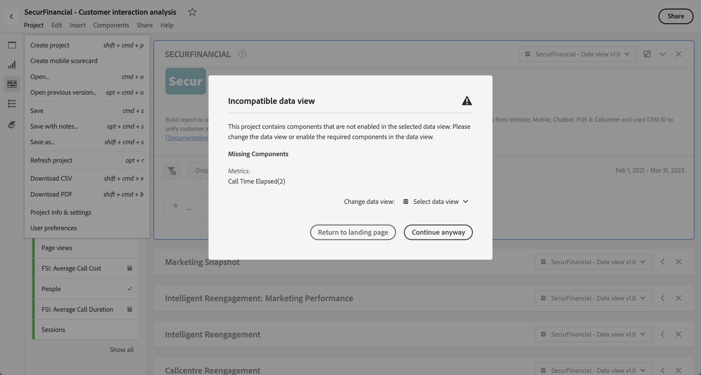

# Ouverture de projets

Vous pouvez ouvrir un projet directement à partir de la page [Projects](/help/analysis-workspace/build-workspace-project/freeform-overview.md) . Recherchez votre projet dans la liste. Utilisez [search](/help/analysis-workspace/build-workspace-project/freeform-overview.md#search) ou le [panneau de filtrage](/help/analysis-workspace/build-workspace-project/freeform-overview.md#filter-panel) pour réduire la liste.

* Sélectionnez le titre de votre projet pour l’ouvrir dans Analysis Workspace.

Vous pouvez également ouvrir un projet lorsque vous travaillez dans un autre projet.

* Sélectionnez **[!UICONTROL Ouvrir]** dans le menu **[!UICONTROL Projet]** . Une boîte de dialogue similaire à la page [Projets](/help/analysis-workspace/build-workspace-project/freeform-overview.md) s’affiche.  Utilisez [search](/help/analysis-workspace/build-workspace-project/freeform-overview.md#search) ou le [panneau de filtrage](/help/analysis-workspace/build-workspace-project/freeform-overview.md#filter-panel) pour réduire la liste.
* Sélectionnez le titre de votre projet pour l’ouvrir dans Analysis Workspace.

Si vous ne trouvez pas le projet et souhaitez démarrer un nouveau projet, sélectionnez **[!UICONTROL Créer]**.

## Ouvrir la version précédente

Pour ouvrir une version précédemment enregistrée d’un projet :

1. Sélectionnez **[!UICONTROL Ouvrir la version précédente]** dans le menu **[!UICONTROL Projet]** .

   

1. Consultez la liste des versions précédentes disponibles dans la boîte de dialogue **[!UICONTROL Versions précédemment enregistrées]** . Vous pouvez basculer entre **[!UICONTROL Toutes les versions]** et **[!UICONTROL Uniquement les versions avec des notes]**.

   Pour chaque version, la liste affiche un horodatage, l’éditeur et les notes enregistrées.

1. Sélectionnez une version précédente et cliquez sur **[!UICONTROL Charger]**.
La version précédente se charge ensuite avec une notification. La version précédente ne devient pas la version enregistrée actuelle de votre projet tant que vous n’avez pas cliqué sur **[!UICONTROL Enregistrer]**. Si vous quittez la version chargée, la dernière version enregistrée s’affiche lorsque vous souhaitez ouvrir une fois de plus une version précédente.

## Affichage de données incompatible

Lorsque vous ouvrez un projet, une boîte de dialogue d’avertissement **[!UICONTROL Affichage de données incompatible]** peut s’afficher. Cette boîte de dialogue explique que certains composants du projet ne sont pas activés dans la vue de données sélectionnée pour l’un des panneaux du projet.

Pour corriger cet avertissement, vous pouvez :

* **[!UICONTROL Modifiez la vue de données]**. Sélectionnez une vue de données appropriée à partir de la **[!UICONTROL vue de modification des données :]** . Si la vue de données sélectionnée est valide, votre projet s’ouvre dans Analysis Workspace.
* **[!UICONTROL Revenez à la page d’entrée]**. Le projet sélectionné n’est pas ouvert et vous pouvez sélectionner un autre projet.
* **[!UICONTROL Continuez quand même]**. Votre projet s’ouvre dans Analysis Workspace, mais affiche des erreurs dans certaines visualisations et les vues de données incompatibles comportent une alerte  avant le nom de la vue de données.
