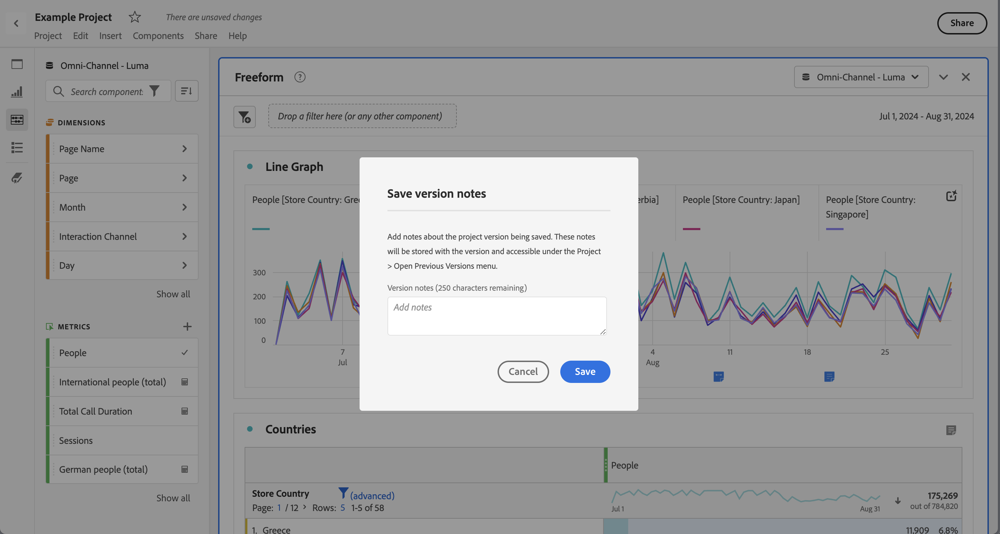

# Enregistrer des projets {#save-projects}

<!-- markdownlint-disable MD034 -->

>[!CONTEXTUALHELP]
>id="workspace_project_addnotes"
>title="Ajout de remarques"
>abstract="Ajoutez des notes sur la version du projet en cours d’enregistrement. Ces notes seront stockées avec la version et accessibles sous le menu **[!UICONTROL Projet]** > **[!UICONTROL Ouvrir la version précédente]**."

<!-- markdownlint-enable MD034 -->

Les projets dans Analysis Workspace sont automatiquement enregistrés toutes les 2 minutes. Vous pouvez également enregistrer des projets vous-même, enregistrer un projet en tant que doublon ou enregistrer un projet avec des notes de version.

## Enregistrer

Une fois votre projet ouvert dans Analysis Workspace, sélectionnez **[!UICONTROL Projet]**, puis choisissez l’une des options suivantes :

* **[!UICONTROL Enregistrer]**

  Enregistrez les modifications apportées au projet. Si le projet est partagé, les destinataires du projet verront également les modifications.

  Lorsque vous enregistrez votre projet pour la première fois, une boîte de dialogue **[!UICONTROL Enregistrer]** s’affiche.

  

   1. Indiquez ce qui suit :

      * **[!UICONTROL Nom]** (obligatoire). Nom de votre projet.
      * **[!UICONTROL Description]**. Description de votre projet.
      * **[!UICONTROL Balises]**. Recherchez des balises dans le champ [!UICONTROL *Rechercher des balises*] ou ajoutez de nouvelles balises avec **[!UICONTROL ENTRÉE]**.
      * **[!UICONTROL Dossier]**. Sélectionnez un dossier dans le menu déroulant [!UICONTROL *Sélectionner un dossier*]. Si vous ne spécifiez pas de dossier, le projet est enregistré dans le dossier actuel à partir duquel vous avez créé un projet.
      * **[!UICONTROL Notes de version]**. Ajoutez des notes de version dans la zone de texte *Ajouter des notes*.

   1. Sélectionnez **[!UICONTROL Enregistrer]** pour enregistrer votre projet.

  L’enregistrement de votre projet enregistre en fait une version de votre projet qui est stockée pendant 90 jours.

  Si vous enregistrez un projet que vous avez partagé, une boîte de dialogue d’avertissement **[!UICONTROL Enregistrer les modifications dans le projet partagé]** vous invite à confirmer l’opération.

  

   * Sélectionnez **[!UICONTROL Enregistrer]** pour enregistrer le projet.
   * Sélectionnez **[!UICONTROL Enregistrer sous]** pour enregistrer le projet en tant que projet en double avec un nouveau nom.

* **[!UICONTROL Enregistrer avec les notes]**

  

  Lorsque vous enregistrez votre projet, ajoutez des notes sur les modifications apportées au projet. Dans la boîte de dialogue Enregistrer les notes de version :

   1. Saisissez vos **[!UICONTROL Notes de version]** dans la zone de texte **[!UICONTROL Ajouter des notes]**.
   1. Sélectionnez **[!UICONTROL Enregistrer]**.

  Les notes sont stockées avec la version du projet et sont disponibles lorsque vous [ouvrez une version précédente](open-projects.md#open-previous-version) du projet. Une version enregistrée avec des notes est automatiquement stockée pendant un an.

* **[!UICONTROL Enregistrer sous]**

  

  Créez un doublon de votre projet avec un nouveau nom. La boîte de dialogue Enregistrer sous s’affiche.

   1. Indiquez ce qui suit :

      * **[!UICONTROL Nom]** (obligatoire). Nom de votre projet.
      * **[!UICONTROL Description]**. Description de votre projet.
      * **[!UICONTROL Balises]**. Recherchez des balises dans le champ [!UICONTROL *Rechercher des balises*] ou ajoutez de nouvelles balises avec **[!UICONTROL ENTRÉE]**.
      * **[!UICONTROL Dossier]**. Sélectionnez un dossier dans le menu déroulant [!UICONTROL *Sélectionner un dossier*]. Si vous ne spécifiez pas de dossier, le projet est enregistré dans le dossier actuel à partir duquel vous avez créé un projet.
      * **[!UICONTROL Notes de version]**. Ajoutez des notes de version dans la zone de texte *Ajouter des notes*.

   1. Sélectionnez **[!UICONTROL Enregistrer]** pour enregistrer votre projet.

  Vous pouvez enregistrer le projet dans un autre dossier. Le projet d’origine ne sera pas affecté.

<!-- Cannot find this option in CJA 
| **[!UICONTROL Save as template]** | Save your project as a [custom template](https://experienceleague.adobe.com/docs/analytics/analyze/analysis-workspace/build-workspace-project/starter-projects.html?lang=fr) that becomes available to your organization under **[!UICONTROL Project > New]** | 
-->

## Enregistrement automatique

>[!IMPORTANT]
>
>Même si les nouveaux projets sont enregistrés automatiquement, vous devez enregistrer chaque nouveau projet manuellement la **première** fois.
>

Tous les projets dans Analysis Workspace sont automatiquement enregistrés toutes les 2 minutes sur votre ordinateur local. Cela inclut les nouveaux projets qui ne sont pas encore enregistrés manuellement.

### Nouveaux projets

Analysis Workspace vous invite à enregistrer les nouveaux projets manuellement lorsque vous passez à un autre projet, lorsque vous fermez l’onglet du navigateur, etc.

Si, pour une raison quelconque, vous perdez inopinément l’accès à un nouveau projet avant de l’enregistrer manuellement, une version de récupération de votre projet est enregistrée sur la page de destination d’Analysis Workspace dans un dossier appelé **[!UICONTROL Projets récupérés (7 derniers jours)]**. Vous devez restaurer le projet récupéré et l’enregistrer manuellement à l’emplacement souhaité.

Restaurer un projet récupéré :

1. Accédez au dossier **[!UICONTROL Projets récupérés (7 derniers jours)]** sur la page de destination d’Analysis Workspace.

<!-- 
     
  -->

1. Ouvrez votre projet et enregistrez-le à l’emplacement souhaité.

### Projets existants

Si, pour une raison quelconque, vous quittez un projet dont les modifications n’ont pas encore été enregistrées automatiquement, Analysis Workspace vous invite à enregistrer vos modifications ou affiche un message d’avertissement.

Quelques scénarios courants :

#### Ouvrir un autre projet

Si vous ouvrez un projet supplémentaire alors que vous travaillez sur un projet qui contient des modifications qui n’ont pas encore été enregistrées automatiquement, Analysis Workspace vous invite à enregistrer le projet en cours.

Les options disponibles sont les suivantes :

* **[!UICONTROL Enregistrer]** : remplace la copie locale la plus récente de votre projet enregistrée automatiquement par vos dernières modifications.
* **[!UICONTROL Ignorer les modifications]** : ignore les dernières modifications. Le projet conserve les modifications les plus récentes enregistrées automatiquement.
* **[!UICONTROL Annuler]** : annulez l’action pour ouvrir un autre projet et conserver le projet existant ouvert.

<!--  -->

#### Quitter ou fermer un onglet

Si vous quittez la page ou fermez l’onglet du navigateur lors de l’affichage d’un projet avec des modifications qui n’ont pas encore été enregistrées automatiquement, le navigateur vous avertit que les modifications non enregistrées seront perdues. Vous pouvez choisir de quitter ou d’annuler. Le mode d’avertissement du navigateur dépend du navigateur que vous utilisez.

### Blocage du navigateur ou expiration d’une session

En cas de blocage du navigateur ou d’expiration de la session, vous recevez une invitation, lors de votre prochain accès à Analysis Workspace, à récupérer les modifications apportées à votre projet qui n’ont pas encore été enregistrées automatiquement.

* Sélectionnez **[!UICONTROL Oui]** pour restaurer le projet à partir de la copie la plus récente enregistrée automatiquement.

* Sélectionnez **[!UICONTROL Non]** pour supprimer la copie enregistrée automatiquement et ouvrir la dernière version du projet enregistrée par l’utilisateur.

<!---->

Pour les **nouveaux** projets qui n’ont jamais été enregistrés, les modifications non enregistrées ne sont pas récupérables.

<!-- Shouldn't this belong to another page?  Moved it to a new open projects page

## Open previously saved version

To open a previously saved version of a project:

1. Select **[!UICONTROL Open previous version]** from the **[!UICONTROL Project]** menu.

   

1. Review the list of previous versions available. You can switch between **[!UICONTROL All versions]** and **[!UICONTROL Only versions with notes]**.

   For each version, the list shows a timestamp
   [!UICONTROL Timestamp] and [!UICONTROL Editor] are shown, in addition to [!UICONTROL Notes] if they were added when the [!UICONTROL Editor] saved. Versions without notes are stored for 90 days; versions with notes are stored for 1 year.
1. Select a previous version and click **[!UICONTROL Load]**.
   The previous version then loads with a notification. The previous version does not become the current saved version of your project until you click **[!UICONTROL Save]**. If you navigate away from the loaded version, when you return, you will see the last saved version of the project.

-->
