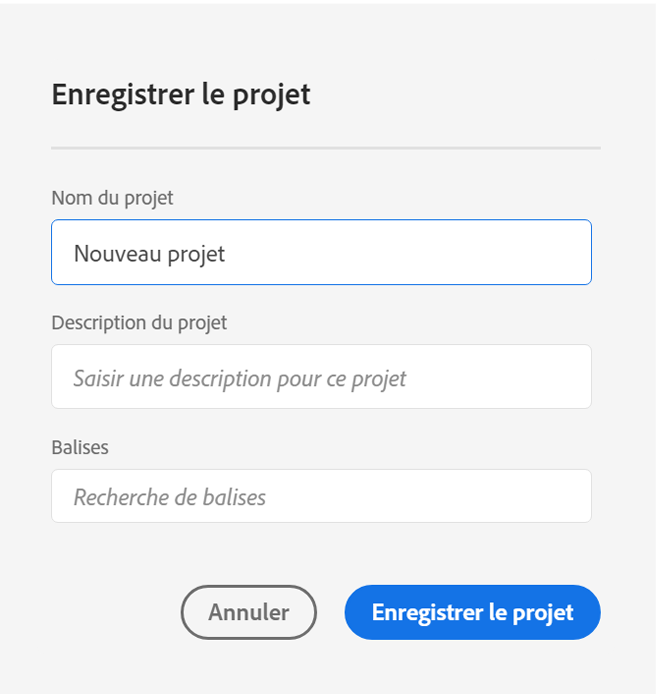
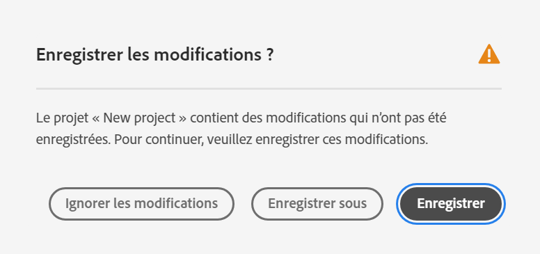
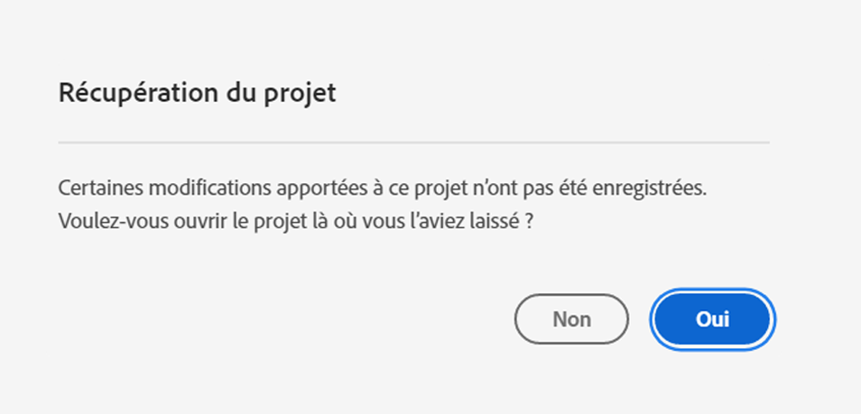

# Enregistrement des projets

Les projets dans Analysis Workspace sont automatiquement enregistrés toutes les 2 minutes.

Vous pouvez également enregistrer manuellement des projets. D’autres options, telles que l’ajout de balises ou de notes, sont disponibles lorsque vous enregistrez un projet manuellement.

## Options d’enregistrement des projets {#Save}

Plusieurs options sont disponibles lors de l’enregistrement manuel d’un projet dans Analysis Workspace.

Pour enregistrer manuellement un projet :

1. Une fois votre projet ouvert dans Analysis Workspace, sélectionnez **[!UICONTROL Projet]**, puis choisissez l’une des options suivantes :

   | Action | Description |
   |---|---| 
   | **[!UICONTROL Enregistrer]** | Enregistrez les modifications apportées au projet. Si le projet est partagé, les destinataires du projet verront également les modifications. Lorsque vous enregistrez le projet pour la première fois, vous êtes invité à lui attribuer un nom, une description (facultative) et à ajouter des balises (facultatives). |
   | **[!UICONTROL Enregistrer avec les notes]** | Avant l’enregistrement de votre projet, ajoutez des notes sur les modifications apportées au projet. Les notes sont stockées avec la version du projet et sont disponibles pour tous les éditeurs sous [!UICONTROL Projet] > [!UICONTROL Ouvrir la version précédente]. |
   | **[!UICONTROL Enregistrer sous]** | Créez un doublon du projet. Le projet d’origine ne sera pas affecté. |
   | **[!UICONTROL Enregistrer en tant que modèle]** | Enregistrez votre projet comme [modèle personnalisé](https://experienceleague.adobe.com/docs/analytics/analyze/analysis-workspace/build-workspace-project/starter-projects.html?lang=fr) disponible pour votre entreprise sous **[!UICONTROL Projet > Nouveau]** |

   

## Enregistrement automatique {#Autosave}

Tous les projets dans Analysis Workspace sont automatiquement enregistrés toutes les 2 minutes sur votre ordinateur local. Cela inclut les nouveaux projets qui ne sont pas encore enregistrés manuellement.

* **Nouveaux projets :** Même si de nouveaux projets sont enregistrés automatiquement, vous devez enregistrer chaque nouveau projet manuellement la première fois. Analysis Workspace vous invite à enregistrer les nouveaux projets manuellement lorsque vous passez à un autre projet, lorsque vous fermez l’onglet du navigateur, etc.

   Si, pour une raison quelconque, vous perdez inopinément l’accès à un nouveau projet avant de l’enregistrer manuellement, une version de récupération de votre projet est enregistrée sur la page d’entrée Analysis Workspace dans un dossier appelé `Recovered Projects (Last 7 Days)`.

   

* **Projets existants :** Si, pour une raison quelconque, vous quittez un projet avec des modifications qui ne sont pas encore enregistrées automatiquement, Analysis Workspace vous invite à enregistrer vos modifications ou fournit un message d’avertissement.

   Voici quelques scénarios courants :

### Ouvrir un autre projet

Si vous ouvrez un projet supplémentaire alors que vous travaillez sur un projet qui contient des modifications qui ne sont pas encore enregistrées automatiquement, Analysis Workspace vous invite à enregistrer le projet actif avant de le quitter.

Les options disponibles sont les suivantes :

* **Enregistrer :** Remplace la copie locale enregistrée automatiquement la plus récente de votre projet par vos dernières modifications.
* **Enregistrer sous :** Enregistre vos dernières modifications en tant que nouveau projet. Le projet d’origine n’est enregistré qu’avec les modifications enregistrées automatiquement les plus récentes.
* **Ignorer les modifications :** Ignore vos dernières modifications. Le projet conserve les modifications enregistrées automatiquement les plus récentes.

### Quitter ou fermer un onglet

Si vous quittez la page ou fermez l’onglet du navigateur lors de l’affichage d’un projet avec des modifications qui ne sont pas encore automatiquement enregistrées, le navigateur vous avertit que vos modifications non enregistrées seront perdues. Vous pouvez choisir de quitter ou d’annuler.

### Blocage du navigateur ou expiration d’une session

Si votre navigateur se bloque ou si votre session expire, la prochaine fois que vous accédez à Analysis Workspace, vous êtes invité à récupérer toutes les modifications apportées à votre projet qui ne sont pas encore enregistrées automatiquement.

Vous trouverez ci-dessous la boîte de dialogue Récupération de projet qui s’affiche la première fois que vous accédez à Analysis Workspace après un blocage ou un délai d’expiration.

Sélectionner **Oui** pour restaurer le projet à partir de la copie enregistrée automatiquement la plus récente.

Sélectionner **Non** pour supprimer la copie enregistrée automatiquement et ouvrir la dernière version enregistrée par l’utilisateur du projet.

Pour les **nouveaux** projets qui n’ont jamais été enregistrés, les modifications non enregistrées ne sont pas récupérables.

## Ouvrir la version précédente {#previous-version}

Pour ouvrir une version précédente d’un projet :

1. Accédez à **[!UICONTROL Projet]** > **[!UICONTROL Ouvrir la version précédente]**

   

1. Consultez la liste des versions antérieures disponibles.
   [!UICONTROL Date et heure] et [!UICONTROL Éditeur] s’affichent, en plus des [!UICONTROL Notes] s’ils ont été ajoutés lorsque l’[!UICONTROL Éditeur] a été enregistré. Les versions sans notes sont stockées pendant 90 jours. Les versions avec notes sont stockées pendant 1 an.
1. Sélectionnez une version précédente et cliquez sur **[!UICONTROL Charger]**.
La version précédente se charge ensuite avec une notification. La version précédente ne devient pas la version enregistrée actuelle de votre projet tant que vous n’avez pas cliqué sur **[!UICONTROL Enregistrer]**. Si vous quittez la version chargée, lorsque vous revenez, la dernière version enregistrée du projet s’affiche.
