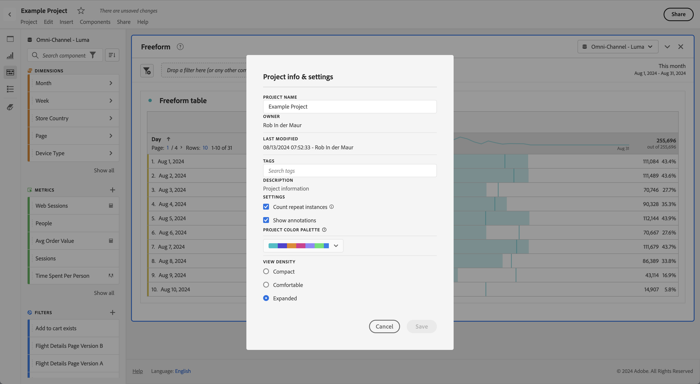

# Afficher la densité

Le réglage de la densité de l’affichage vous permet de voir plus de données sur l’écran en réduisant l’espacement vertical du panneau de gauche, dans les tableaux à structure libre et dans les tables de cohorte. Trois options sont disponibles :

>[!BEGINTABS]

>[!TAB Compact]

Il s’agit de la version avec l’affichage le plus condensé.

>[!TAB Confortable]

Il s’agit de l’affichage habituel dans Workspace.

>[!TAB Étendu]

Il s’agit de la version avec la vue la plus développée.

>[!ENDTABS]

Pour définir la densité d’affichage :

1. Dans Workspace, accédez à **[!UICONTROL Projets]** > **[!UICONTROL Informations et paramètres du projet]**.

1. Sélectionnez une option **[!UICONTROL Densité d’affichage]**, puis sélectionnez **[!UICONTROL Enregistrer]**.
