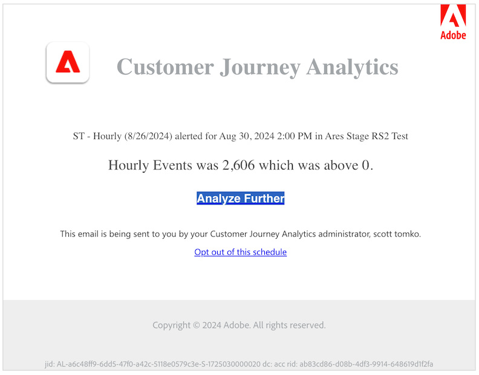

# Créer des alertes

{{release-limited-testing}}

>[!NOTE]
>
>Les alertes intelligentes ne sont disponibles que pour les clients Adobe Analytics Prime et Adobe Analytics Ultimate.

Les alertes intelligentes (ou simplement les &quot;alertes&quot;) de Customer Journey Analytics vous permettent d’être averti immédiatement en cas d’événements anormaux dans vos données.

Pour obtenir des informations d’aperçu plus détaillées sur les alertes intelligentes, reportez-vous à la section [Présentation des alertes intelligentes](/help/analysis-workspace/c-intelligent-alerts/intellligent-alerts.md).

Pour créer une alerte :

1. Commencez à créer une alerte en accédant au créateur d’alertes. Vous pouvez accéder au générateur d’alertes de l’une des façons suivantes :

   * Ouvrez un projet dans Analysis Workspace, puis sélectionnez **[!UICONTROL Composants]** > **[!UICONTROL Créer une alerte]**.
   * Ouvrez un projet dans Analysis Workspace, puis utilisez le raccourci suivant :

     `ctrl (or cmd) + shift + a`
   * Ouvrez un projet dans Analysis Workspace, sélectionnez une ou plusieurs lignes dans un tableau à structure libre, puis cliquez avec le bouton droit de la souris et sélectionnez **[!UICONTROL Créer une alerte d’après la sélection]**.

     Le créateur d’alertes est ainsi prérempli instantanément afin de créer une alerte avec les mesures et filtres corrects.
   * Dans Customer Journey Analytics, sélectionnez **[!UICONTROL Composants]** > [!UICONTROL **Alertes**] > **[!UICONTROL Créer une alerte]**.

   Le créateur d’alertes s’affiche. Les personnes qui ont créé des segments ou calculé des mesures dans Analytics connaissent bien cette interface :

   

1. Définissez les options suivantes pour configurer l’alerte :

   | Option | Description |
   |---------|----------|
   | [!UICONTROL **Titre**] | Spécifiez le nom de l’alerte. Le nom de l’alerte doit contenir le nom du rapport ou le seuil des mesures. |
   | [!UICONTROL **Description (facultatif)**] | Spécifiez une description pour l’alerte. |
   | [!UICONTROL **Granularité du temps**] | Sélectionnez la fréquence à laquelle vous souhaitez vérifier la mesure : Quotidienne, Hebdomadaire ou Mensuelle.
<b>Remarque :</b>Pour les vues de données avec un calendrier personnalisé, la granularité mensuelle n’est pas prise en charge dans le Générateur d’alertes.<!--true?-->
 |
   | [!UICONTROL **Destinataires**] | Spécifiez où envoyer l’alerte. Une alerte peut être envoyée à un utilisateur ou à un groupe Analytics, à une adresse e-mail brute ou à un numéro de téléphone.
<b>Important :</b>Le numéro de téléphone doit être précédé d’un &quot;+&quot; et d’un [code de pays](https://countrycode.org/).

Le message électronique reçu par un utilisateur après le déclenchement d’une alerte ressemble à ceci :

 |
   | [!UICONTROL **Date d’expiration**] | Définissez la date et l’heure d’expiration de l’alerte. |
   | [!UICONTROL **Délai**] | Le temps nécessaire pour que les données soient complètes et disponibles pour générer des rapports dans Customer Journey Analytics varie selon les organisations, généralement entre 3 et 9 heures après l’heure de l’événement de données. Pour que les alertes soient exactes, les données d’événement d’une période donnée doivent être complètes, ce qui signifie que l’Adobe ne reçoit plus de données d’événement pour la période spécifiée.
Pour tenir compte de ce délai d’ingestion, les alertes ont un délai par défaut de 9 heures avant leur envoi.

Vous pouvez ajuster le délai par défaut de 9 heures entre 0 et 24 heures. Cependant, réduire le délai en dessous de 9 heures peut signifier que vous signalez des données incomplètes, ce qui entraîne des informations d’alerte inexactes.

Tenez compte des points suivants lorsque vous diminuez le délai :
<ul><li>**Comprendre la disponibilité des données par rapport à l’exhaustivité des données** : bien que certaines données puissent être disponibles pour générer des rapports plus tôt, toutes les données de lot ne sont ingérées dans un jeu de données Platform qu’après une période de 3 à 9 heures. Pour que les alertes soient exactes, l’ingestion des données doit être terminée, avec toutes les données de lot disponibles dans le jeu de données.</li><li>**Déterminez le temps nécessaire pour que vos données soient complètes et disponibles dans le jeu de données** : les temps d’ingestion des données diffèrent par organisation. Assurez-vous que le délai que vous choisissez pour la remise des alertes est le même ou moins fréquent que le temps nécessaire pour que les données de lot soient disponibles dans le jeu de données Platform<!--add link? -->.</li>
**Conseil :** La manière la plus précise de connaître le temps nécessaire à l’achèvement et à l’ingestion de toutes les données par lots dans le jeu de données Platform consiste à consulter les ingénieurs de données de votre entreprise.

Vous pouvez également obtenir une idée générale du temps nécessaire à la disponibilité de la diffusion par lots dans le jeu de données Platform en créant le tableau à structure libre suivant dans Analysis Workspace :
<ol><li>Dans un tableau à structure libre dans Analysis Workspace, ajoutez une mesure [!UICONTROL **Events**] et une dimension [!UICONTROL **Day**].</li><li>Ventilez la dimension [!UICONTROL **Jour**] à l’aide d’une dimension [!UICONTROL **Heures**].
Les heures qui n’ont pas de données s’affichent avec 0.
</li></ol><li>**Compte pour les erreurs dans vos calculs** : si vous réduisez le délai par défaut, nous vous recommandons de configurer le délai d’au moins une heure de plus que le temps nécessaire à votre entreprise pour que l’ingestion des données soit complète. Par exemple, si un délai de 3 heures est nécessaire avant la fin de l’ingestion des données, définissez ce délai sur 4 heures.</li></ul>
Pour plus d’informations, reportez-vous à la section [Les temps d’ingestion des données varient en Customer Journey Analytics](/help/analysis-workspace/c-intelligent-alerts/alerts-feature-comparison.md#data-ingestion-times-vary-in-customer-journey-analytics) de l’article [ Intelligent Alerts feature compare : Customer Journey Analytics and Adobe Analytics](/help/analysis-workspace/c-intelligent-alerts/alerts-feature-comparison.md). |
   | [!UICONTROL **Envoyer une alerte lorsque**] | [!UICONTROL **L’un de ces déclencheurs de mesures**] : faites glisser et déposez des mesures (y compris des mesures calculées) ici pour créer des déclencheurs pour l’alerte.
Un message **&quot;composants incompatibles&quot;** s’affiche si toutes les mesures, dimensions ou segments de l’alerte ne sont pas compatibles avec la vue de données actuellement sélectionnée.

Déterminez le seuil que la mesure doit dépasser avant l’envoi d’une alerte. Vous pouvez définir un seuil, puis l’une des conditions suivantes :
<ul><li>il existe une anomalie</li><li>l’anomalie est supérieure à celle prévue</li><li>l’anomalie est inférieure à celle prévue</li><li>est supérieur ou égal</li><li>est inférieur ou égal</li><li>change de</li><li>Le seuil peut être défini à 90 %, 95 %, 99 %, 99,75 % ou 99,90 %.</li></ul>
[!UICONTROL **Avec tous ces filtres**] : faites glisser et déposez des segments ou des dimensions pour ajouter des filtres. Par exemple, l’ajout d’un segment &quot;Appareils mobiles uniquement&quot; signifie que la règle se déclenche uniquement pour les appareils mobiles. Vous pouvez ajouter d’autres filtres à l’aide d’une instruction ET. Pour ajouter des règles AND ou OR, cliquez sur l’icône d’engrenage.

Voir [Alertes intelligentes - cas d’utilisation](/help/analysis-workspace/c-intelligent-alerts/alerts-use-cases.md) par exemple cas d’utilisation.
 |
   | [!UICONTROL **Aperçu**] | Dans l’aperçu interactif des alertes, vous pouvez déterminer à quelle fréquence, approximativement, une alerte sera déclenchée en fonction d’une expérience antérieure.
Si, par exemple, vous définissez une granularité temporelle quotidienne, l’aperçu indique que, pour une certaine mesure, l’alerte aurait été déclenchée x fois durant les 30 ou 31 derniers jours.

Pour réduire le nombre d’alertes déclenchées, réglez le seuil dans le [Gestionnaire d’alertes](/help/analysis-workspace/c-intelligent-alerts/alert-manager.md).

 |

1. Sélectionnez [!UICONTROL **Enregistrer**].

