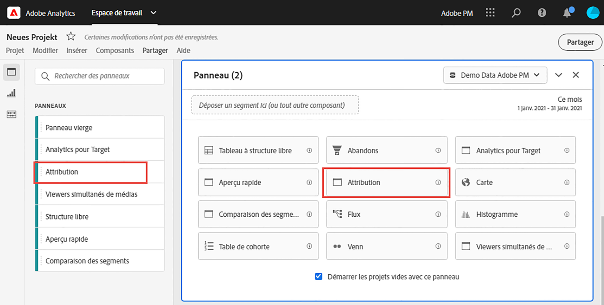
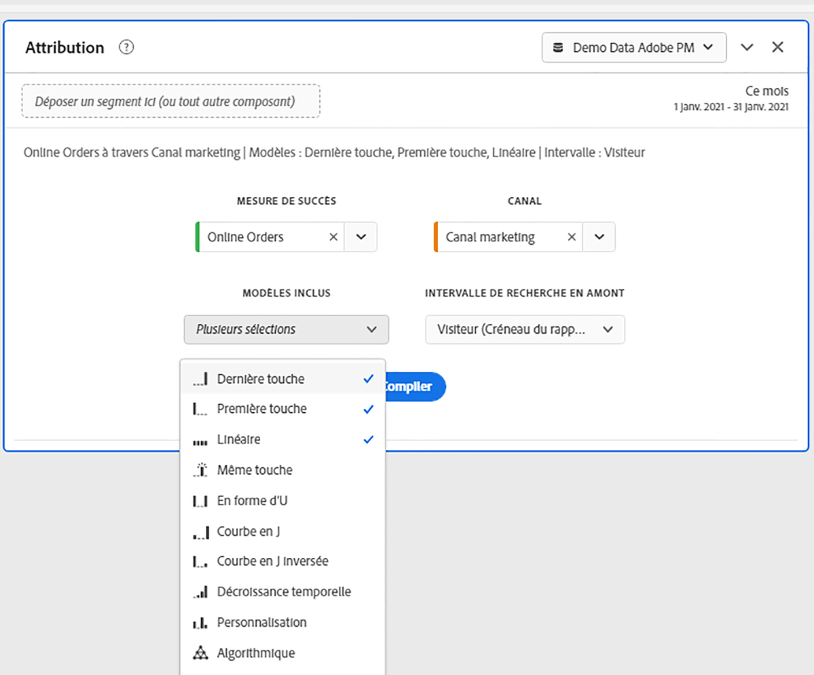
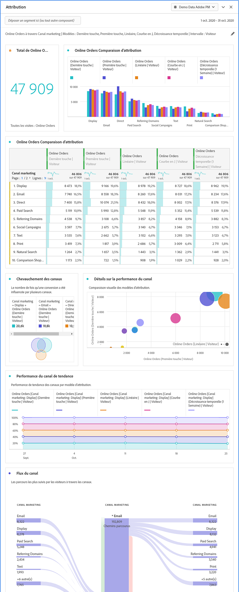

# Panneau d’attribution

Le panneau [!UICONTROL Attribution] vous permet de créer facilement une analyse comparant différents modèles d’attribution. Il s’agit d’une fonctionnalité qui vous fournit un espace de travail dédié à l’utilisation et à la comparaison des modèles d’attribution.

Customer Journey Analytics améliore l’attribution en vous permettant de :

* définir l’attribution à des médias autres que ceux achetés : tout canal, dimension, mesure ou événement peut être appliqué aux modèles (par exemple, recherche interne) et pas seulement aux campagnes marketing ;
* utiliser la comparaison illimitée de modèles d’attribution : comparez dynamiquement autant de modèles que vous le souhaitez ;
* éviter les changements de mise en œuvre : avec le traitement de la période de rapport et les sessions contextuelles, le contexte du parcours client peut être intégré et appliqué lors de l’exécution ;
* construire la session qui correspond le mieux à votre scénario d’attribution ;
* ventiler l’attribution par filtres : comparez facilement la performance de vos canaux marketing sur n’importe quel filtre important (par exemple, les nouveaux clients par rapport aux clients réguliers, le produit X par rapport au produit Y, le niveau de fidélité ou la valeur vie client (CLV)) ;
* inspecter le croisement des canaux et l’analyse multi-touch : utilisation des histogrammes et diagrammes de Venn ainsi que des résultats de l’attribution des tendances ;
* analyser visuellement des séquences marketing importantes : explorez les chemins d’accès qui ont mené à la conversion sur le plan visuel par le biais de visualisations à plusieurs nœuds de flux et d’abandons ;
* créer des mesures calculées : utilisez n’importe quel nombre de méthodes d’attribution.

## Création d’un panneau d’attribution

1. Cliquez sur l’icône du panneau à gauche.
1. Faites glisser le panneau [!UICONTROL Attribution] dans votre projet Analysis Workspace.

   

1. Ajoutez une mesure que vous souhaitez attribuer et ajoutez toute dimension à laquelle vous souhaitez l’attribuer. Par exemple, les canaux marketing ou les dimensions personnalisées, telles que les promotions internes.

   

1. Sélectionnez les modèles d’attribution et l’intervalle de recherche en amont que vous souhaitez comparer.

1. Le panneau d’attribution renvoie un riche ensemble de données et des visualisations qui comparent l’attribution de la dimension et de la mesure sélectionnées.

   

## Visualisations d’attribution

* **Mesure totale** : nombre total de conversions survenues pendant le créneau de rapport. Il s’agit des conversions qui sont attribuées pour la dimension que vous avez sélectionnée.
* **Barres de comparaison d’attribution** : compare visuellement les conversions attribuées à chacun des éléments de dimension de la dimension sélectionnée. Chaque couleur de barre représente un modèle d’attribution distinct.
* **Tableau de comparaison d’attribution** : affiche, sous forme de tableau, les mêmes données que le graphique à barres. La sélection de différentes colonnes ou lignes dans ce tableau permet de filtrer le graphique à barres ainsi que plusieurs autres visualisations du panneau. Ce tableau fonctionne de la même manière que tout autre tableau à structure libre de Workspace. Il vous permet d’ajouter des composants tels que des mesures, des filtres ou des répartitions.
* **Diagramme de chevauchement** : diagramme de Venn présentant les trois principaux éléments de dimension et la fréquence à laquelle ils participent conjointement à une conversion. Par exemple, la taille du chevauchement des bulles indique la fréquence des conversions lorsqu’une personne a été exposée aux deux éléments de dimension. La sélection d’autres lignes dans le tableau à structure libre adjacent met à jour la visualisation pour refléter votre sélection.
* **Détails sur les performances** : vous permet de comparer visuellement jusqu’à trois modèles d’attribution à l’aide d’un graphique de dispersion.
* **Performance de tendance** : affiche la tendance des conversions attribuées pour le principal élément de dimension. La sélection d’autres lignes dans le tableau à structure libre adjacent met à jour la visualisation pour refléter votre sélection.
* **Flux**: Vous permet de voir avec quels canaux les visiteurs interagissent le plus souvent, et dans quel ordre par parcours.
