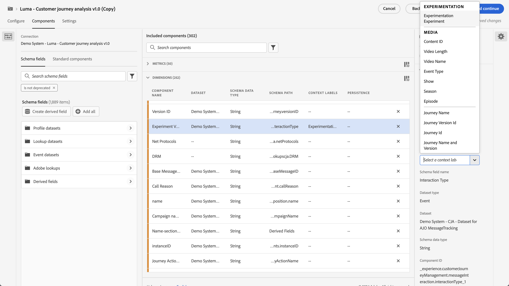

# Panneau Expérimentation

>[!NOTE]
>
>Cette fonctionnalité fait actuellement l’objet de [tests limités](/help/release-notes/releases.md).

Le panneau **[!UICONTROL Expérimentation]** permet aux analystes de comparer des variantes d’expérience utilisateur, de marketing ou de messagerie afin de déterminer la meilleure source d’un résultat spécifique. Vous pouvez évaluer l’effet élévateur et le degré de confiance de toute expérience A/B à partir de n’importe quelle plateforme d’expérimentation, en ligne, hors ligne, à partir de solutions d’Adobe, d’Adobe Journey Optimizer et même de données BYO (apportez vos propres données).

>[!IMPORTANT]
>
>À ce stade, les données [Adobe Analytics for Target](https://experienceleague.adobe.com/docs/target/using/integrate/a4t/a4t.html?lang=fr) (A4T) importées dans Adobe Experience Platform par le biais du connecteur source Analytics **ne peuvent pas** être analysées dans le panneau [!UICONTROL Expérimentation]. Nous attendons une résolution de ce problème en 2023.

## Contrôle d’accès

Le panneau Expérimentation est disponible pour tous les utilisateurs de Customer Journey Analytics (CJA). Aucun droit d’administrateur ou autre autorisation n’est requis. Toutefois, la configuration (étapes 1 et 2 ci-dessous) nécessite des actions que seuls les administrateurs peuvent effectuer.

## Étape 1 : Créer une connexion à un ou plusieurs jeux de données d’expérience

Le schéma de données recommandé consiste à placer les données de l’expérience dans un [tableau d’objets](https://experienceleague.adobe.com/docs/experience-platform/xdm/ui/fields/array.html?lang=fr) qui contient les données d’expérience et de variante dans deux dimensions distinctes. Si vos données d’expérience se trouvent dans une seule dimension avec des données d’expérience et de variante dans une chaîne délimitée, le paramètre [Sous-chaîne](/help/data-views/component-settings/substring.md) dans les vues de données vous permet de les diviser en deux pour les utiliser dans le panneau.

Une fois que les données de l’expérience ont été [ingérées](https://experienceleague.adobe.com/docs/experience-platform/ingestion/home.html?lang=fr) dans Adobe Experience Platform, [créez une connexion dans CJA](/help/connections/create-connection.md) à un ou plusieurs jeux de données d’expérience.

## Étape 2 : Ajouter des libellés de contexte dans les vues de données

Dans les paramètres des vues de données CJA, les administrateurs peuvent ajouter des [libellés de contexte](/help/data-views/component-settings/overview.md) à une dimension ou à une mesure et des services CJA comme le panneau [!UICONTROL Expérimentation] peuvent utiliser ces libellés à leurs fins. Deux libellés prédéfinis sont utilisés pour le panneau Expérimentation :

* [!UICONTROL Expérience d’expérimentation]
* [!UICONTROL Variante d’expérimentation]

Dans votre vue de données contenant des données d’expérimentation, sélectionnez deux dimensions, l’une avec les données d’expérimentation et l’autre avec les données de variante. Puis étiquetez ces dimensions avec les libellés **[!UICONTROL Expérience]** et **[!UICONTROL Variante]**.

Sans ces libellés, le panneau Expérience ne fonctionnera pas, puisqu’il n’y aura aucune expérience à utiliser.

## Étape 3 : Configurer le panneau Expérience

1. Dans CJA Workspace, faites glisser le panneau Expérimentation dans un projet.

>[!IMPORTANT]
>Si la configuration nécessaire dans les vues de données CJA n’a pas été effectuée, vous recevrez le message suivant avant de pouvoir poursuivre : « [!UICONTROL Veuillez configurer les dimensions de l’expérience et des variantes dans les vues de données] ».

1. Configurer les paramètres d’entrée du panneau.

   | Paramètre | Définition |
   | --- | --- |
   | **[!UICONTROL Expérience]** | Un ensemble de variantes sur une expérience qui ont été proposées aux utilisateurs finaux afin de déterminer laquelle il est préférable de conserver à perpétuité. Une expérience est composée de deux variantes ou plus, dont l’une est considérée comme la variante de contrôle. Ce paramètre est pré-renseigné avec des dimensions qui ont été étiquetées avec le libellé **[!UICONTROL Expérience]** dans les vues de données et l’équivalent de 3 mois de données d’expérience. |
   | **[!UICONTROL Variante de contrôle]** | Une, deux ou plusieurs modifications de l’expérience d’un utilisateur final qui sont comparées dans le but d’identifier la meilleure alternative. Une variante doit être sélectionnée comme contrôle, et une seule variante peut être considérée comme la variante de contrôle. Ce paramètre est pré-renseigné avec les dimensions qui ont été étiquetées avec le libellé  **[!UICONTROL Variante]** dans les vues de données. Ce paramètre récupère les données de variante associées à cette expérience. |
   | **[!UICONTROL Mesures de succès]** | Mesure ou mesures avec lesquelles un utilisateur compare des variantes. La variante ayant le résultat le plus souhaitable pour la mesure de conversion (la plus élevée ou la plus faible) est déclarée « variante la plus performante » d’une expérience. Vous pouvez ajouter jusqu’à 5 mesures. |
   | **[!UICONTROL Mesure de normalisation]** | La base ([!UICONTROL personnes], [!UICONTROL sessions] ou [!UICONTROL événements]) sur laquelle un test sera exécuté. Par exemple, un test peut comparer les taux de conversion de plusieurs variantes où le **[!UICONTROL Taux de conversion]** est calculé comme **[!UICONTROL Conversions par session]** ou **[!UICONTROL Conversions par personne]**. |
   | **[!UICONTROL Période]** | La période est automatiquement définie, en fonction du premier accès reçu dans CJA pour l’expérience sélectionnée. Si nécessaire, vous pouvez limiter ou étendre la période à des délais plus spécifiques. |

1. Cliquez sur **[!UICONTROL Créer]**.

## Étape 4 : Consulter la sortie du panneau

Le panneau Expérimentation renvoie un riche ensemble de données et de visualisations pour vous aider à mieux comprendre les performances de vos expériences. En haut du panneau, une ligne de résumé vous rappelle les paramètres du panneau que vous avez sélectionnés. À tout moment, vous pouvez modifier le panneau en cliquant sur l’icône de modification en forme de crayon dans le coin supérieur droit.

Vous obtenez également un résumé textuel qui indique si l’expérience est concluante ou non et résume le résultat. La conclusion repose sur la signification statistique. (Voir la « méthodologie statistique » ci-dessous.) Vous pouvez afficher des nombres de synthèse pour la variante la plus performante avec l’effet élévateur et le degré de confiance les plus élevés.

Pour chaque mesure de succès sélectionnée, un tableau à structure libre et une tendance de taux de conversion sont affichés :

Le graphique [!UICONTROL Linéaire] vous donne la performance du [!UICONTROL Contrôle] au lieu de la performance de [!UICONTROL Variante de contrôle] :

>[!NOTE]
>
>Ce panneau ne prend actuellement pas en charge l’analyse des tests A/A.

## Étape 5 : Interpréter les résultats

1. **L’expérience est concluante** : chaque fois que vous consultez le rapport d’expérimentation, Adobe analyse les données accumulées jusqu’à présent dans l’expérience et déclare une expérience « concluante » lorsque le degré de confiance valide à tout moment dépasse un seuil de 95 % pour *au moins l’une* des variantes (avec une correction Bonferonni appliquée lorsqu’il y a plus de deux bras, afin de corriger plusieurs tests d’hypothèse).

2. **Variante la plus performante** : lorsqu’une expérience est déclarée concluante, la variante ayant le taux de conversion le plus élevé est étiquetée comme « variante la plus performante ». Notez que cette variante doit être la variante de référence ou de contrôle, ou l’une des variantes qui dépasse le seuil de 95 % de degré de confiance valide à tout moment (avec des corrections Bonferonni appliquées).

3. **Taux de conversion** : le taux de conversion qui s’affiche est un ratio de la valeur de la mesure de succès par rapport à la valeur de la mesure de normalisation. Notez que cette valeur peut parfois être supérieure à 1, si la mesure n’est pas binaire (1 ou 0 pour chaque unité de l’expérience).

4. **Effet élévateur** : la synthèse du rapport d’expérience affiche l’effet élévateur sur la ligne de base, qui est une mesure de l’amélioration en pourcentage du taux de conversion d’une variante donnée par rapport à la ligne de base. Défini précisément, il s’agit de la différence de performance entre une variante donnée et la ligne de base, divisée par les performances de la ligne de base, exprimée en pourcentage.

5. **Confiance** : le degré de confiance valide en tout temps qui s’affiche est une mesure probabiliste de l’ampleur des preuves qu’une variante donnée est identique à la variante de contrôle. Un degré de confiance plus élevé indique moins de preuves relatives à l’hypothèse que la variante de contrôle et la variante de non-contrôle ont des performances similaires. Plus précisément, la confiance affichée est une probabilité (exprimée en pourcentage) que nous aurions observé une différence plus faible dans les taux de conversion entre une variante donnée et celle de contrôle, si en réalité il n’y a aucune différence dans les taux de conversion réels sous-jacents. En termes de *p*-valeurs, la confiance affichée est 1 - *p*-valeur.

>[!NOTE]
>
>Notez toutefois qu’une description complète des résultats doit tenir compte de toutes les preuves disponibles (c’est-à-dire la conception de l’expérience, la taille des échantillons, les taux de conversion, le degré de confiance, etc.), et pas seulement de la déclaration du caractère concluant ou non. Même lorsqu’un résultat n’est pas encore « concluant », il peut encore y avoir des preuves convaincantes indiquant qu’une variante est différente d’une autre (par exemple, les intervalles de confiance sont presque sans chevauchement). Idéalement, la prise de décision doit être fondée sur toutes les preuves statistiques, interprétées sur un spectre continu.

## Méthodologie statistique d’Adobe

Afin de fournir une inférence statistique facile à interpréter et sûre, Adobe a adopté une méthodologie statistique fondée sur des [Séquences de confiance valides à tout moment](https://doi.org/10.48550/arXiv.2103.06476).

Une séquence de confiance est une analogie « séquentielle » d’un intervalle de confiance. Pour comprendre ce qu’est une séquence de confiance, imaginez que vous répétiez vos expériences cent fois et calculiez une estimation de la mesure commerciale moyenne (par exemple, le taux d’ouverture d’un e-mail) et de la séquence de confiance à 95 % qui lui est associée pour *chaque nouvel utilisateur* qui entre dans l’expérience. Une séquence de confiance à 95 % inclura la valeur « True » de la mesure commerciale dans 95 des 100 expériences que vous avez exécutées. (Un intervalle de confiance à 95 % ne pouvait être calculé qu’une seule fois par expérience afin de garantir la même couverture de 95 % ; pas avec chaque nouvel utilisateur). Les séquences de confiance vous permettent donc de surveiller en permanence les expériences, sans augmenter les taux d’erreurs Faux positif, c’est-à-dire qu’elles permettent de « Jeter un coup d’œil » sur les résultats.
