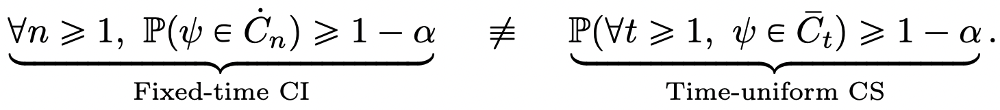

# Calculs statistiques dans le panneau d’expérimentation de CJA : Détails

Cette page documente les calculs statistiques détaillés utilisés dans le panneau d’expérimentation de CJA. Il est destiné aux utilisateurs techniques.

## Taux de conversion

Le taux de conversion ou **mean**, *μν* pour chaque variante *ν* dans une expérience est défini comme un ratio de la somme de la mesure par rapport au nombre d’unités affectées à cette mesure, *Nν*:

Ici,

- *Yiν* est la valeur de la mesure pour chaque unité *i*, qui a été affecté à une variante donnée *ν*.
- La somme sur les unités *i* dépend du choix de la mesure de normalisation.
   - If *Personnes* est la mesure de normalisation, chaque unité est une personne/un profil unique.
   - If *Sessions* est la mesure de normalisation, chaque unité est une session unique.
   - If *Événements* est la mesure de normalisation, chaque unité est un événement unique.

En règle générale, cette mesure de normalisation doit être choisie pour correspondre à votre unité d’indépendance, c’est-à-dire si le comportement d’un utilisateur dans une session est indépendant de son comportement dans une autre session, alors les sessions sont une mesure de normalisation raisonnable.

Si nécessaire, l’écart-type de l’exemple est utilisé, avec l’expression

## Effet élévateur

Effet élévateur entre une variante  *ν* et la variante de contrôle  *ν0* est le &quot;delta&quot; relatif dans les taux de conversion, défini comme

où les taux de conversion individuels sont tels que définis ci-dessus.

## Séquences de confiance

Bien qu’elle ne s’affiche pas dans le panneau d’expérience CJA, la séquence de confiance d’une variante individuelle *ν* est au coeur de la méthodologie statistique utilisée par l’Adobe et est donc défini ici (reproduit à partir de [Waudby-Smith et al.](https://doi.org/10.48550/arXiv.2103.06476)).

> Supposons que l’un d’eux soit intéressé par l’estimation d’un paramètre cible *ψ* (comme le taux de conversion d’une variante dans une expérience). Ensuite, la dichotomie entre une séquence d’intervalles de confiance &quot;à temps fixe&quot; (CI) et une séquence de confiance uniforme (CS) peut être résumée comme suit :

En d’autres termes, pour un intervalle de confiance régulier , la garantie probabiliste que le paramètre cible se trouve dans la plage de valeurs *Ċt* n’est valide qu’à une seule valeur fixe de *n* (où *n* est le nombre d’échantillons). Inversement, pour une séquence de confiance, il est garanti qu’à tout moment/toutes les valeurs de la taille de l’échantillon *t*, la valeur &quot;true&quot; du paramètre d’intérêt se trouve dans les limites *Ct*.

Cela a quelques implications profondes qui sont très importantes pour les tests en ligne :
- Le CS peut éventuellement être mis à jour chaque fois que de nouvelles données sont disponibles.
- Les expériences peuvent être surveillées en permanence, stoppées de manière adaptative ou continues.
- L’erreur type-I est contrôlée à tous les temps d’arrêt, y compris aux heures dépendantes des données.

Adobe utilise des séquences de confiance asynchrones, qui, pour une variante individuelle avec une estimation moyenne. *μ* possède le formulaire

où:
- *N* est le nombre d&#39;unités pour cette variante
- *underline* est un exemple d’estimation de l’écart type (défini précédemment)
- *α* est le niveau d’erreur type I souhaité (ou probabilité d’erreur de couverture)
- *ρ* 2 est une constante qui ajuste la taille d’échantillon à laquelle le CS est le plus serré. L&#39;Adobe a choisi une valeur universelle de *ρ* 2 = 10-2.8, qui est approprié pour les types de taux de conversion observés dans les expériences en ligne.

## Degré de confiance

La confiance utilisée par l’Adobe est une confiance &quot;valide à tout moment&quot;, obtenue en inversant la séquence de confiance pour l’effet de traitement moyen.

Pour être précis, nous notons que dans deux échantillons *t* test de la différence de moyens entre deux variantes, il existe un mappage 1:1 entre la variable *p*-value pour ce test et l’intervalle de confiance pour la différence de moyens. Par analogie, un *p*-value peut être obtenu en inversant la séquence de confiance (valide à tout moment) de l’estimateur d’effet de traitement moyen :

L’estimateur que nous utilisons est un estimateur de propension pondéré (IPW) inverse. Considérer *N = N0* + *N1* unités, les affectations de variante pour chaque unité $i$ étiquetées par *Ai=0,1* si l&#39;unité est affectée à la variante ν=0,1. Si les utilisateurs sont affectés avec une probabilité fixe (propension) *π0, (10)*, et leur mesure de résultat est la suivante : *Yi*, l’estimateur IPW est

Constatant que *f* est la fonction d&#39;influence, Waudby-Smith et al. a montré que la séquence de confiance pour cet estimateur est :

Remplacer la probabilité d’affectation par ses estimations empiriques : *π0 = N0/N*, le terme de variance peut être exprimé en termes d’estimations de moyenne d’échantillon individuelles.  *μ{0,1}* et les estimations de l&#39;écart type,  *underline{0,1}* comme :

Rappeler que pour un test d’hypothèse classique avec des statistiques de test *z = (μ1 - μ0)/ tôtp*, il existe une correspondance entre les valeurs $p$ et les intervalles de confiance :

where *Φ* est la distribution cumulée de la normale standard. Pour tout moment valide *p*-values, étant donné la séquence de confiance de l’effet de traitement moyen défini ci-dessus, nous pouvons inverser cette relation :

Enfin, la **anytime *confiance*** is

## Déclaration finale d’une expérience

Pour une expérience avec deux bras, le panneau Expérience CJA affiche un message indiquant qu’une expérience est **concluant** lorsque le degré de confiance en cours de validité dépasse 95 % (c’est-à-dire lorsqu’il est valide *p*-value est inférieur à 5 %).

Lorsque plus de deux variantes sont présentes, la correction Bonferonni est appliquée. Pour une expérience avec *k* les traitements et un traitement de base unique (contrôle), il y a *K-1* tests d&#39;hypothèse indépendants. La correction de Bonferonni signifie que nous rejetons l&#39;hypothèse nulle que le contrôle et une variante donnée ont des moyens égaux, si le moment est valide *p*-value est inférieur à un seuil de 0,05/(K-1).

## bras le plus performant

Lorsqu’une expérience est déclarée concluante, le bras le plus performant s’affiche. Il s’agit du bras le plus performant (moyenne la plus élevée ou taux de conversion), parmi l’ensemble qui comprend la commande et tous les bras ayant une *p*-value qui est inférieure au seuil de Bonferonni.