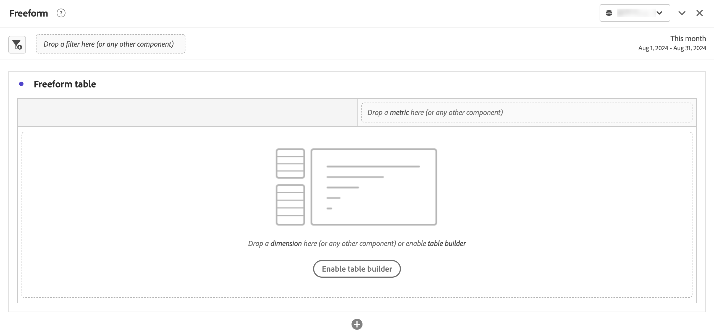

# Panneau à structure libre

>[!BEGINSHADEBOX]

_Cet article présente le panneau à structure libre dans_  _&#x200B;**Customer Journey Analytics**&#x200B;_. _Voir [Panneau à structure libre](https://experienceleague.adobe.com/fr/docs/analytics/analyze/analysis-workspace/panels/freeform-panel) pour la version_  _&#x200B;**Adobe Analytics** de cet article._

>[!ENDSHADEBOX]

Un **[!UICONTROL Panneau à structure libre]** est un panneau vierge s’ouvrant par défaut avec une visualisation [Tableau à structure libre](/help/analysis-workspace/visualizations/freeform-table/freeform-table.md).

## Utilisation

Pour utiliser un **[!UICONTROL Panneau à structure libre]**, procédez comme suit :

1. Créez un **[!UICONTROL Panneau à structure libre]**. Pour plus d’informations sur la création d’un panneau, consultez [Créer un panneau](panels.md#create-a-panel).

   

1. Consultez [Utiliser des composants dans Workspace](/help/components/use-components-in-workspace.md) pour savoir comment ajouter des composants au panneau à structure libre et à la visualisation [Tableau à structure libre](/help/analysis-workspace/visualizations/freeform-table/freeform-table.md).

>[!MORELIKETHIS]
>
>[Créer un panneau](/help/analysis-workspace/c-panels/panels.md#create-a-panel)
>[Utilisation de composants dans Workspace](/help/components/use-components-in-workspace.md)
>[Visualisation Tableau à structure libre](/help/analysis-workspace/visualizations/freeform-table/freeform-table.md)
>