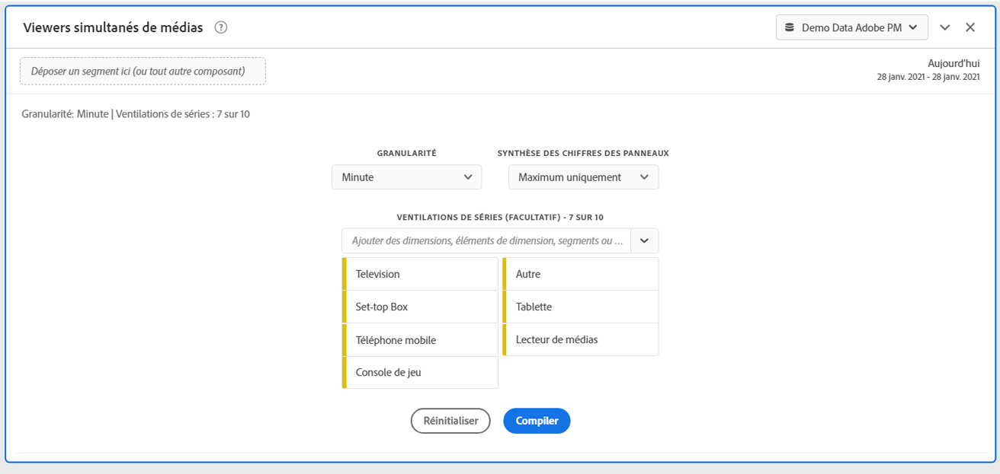
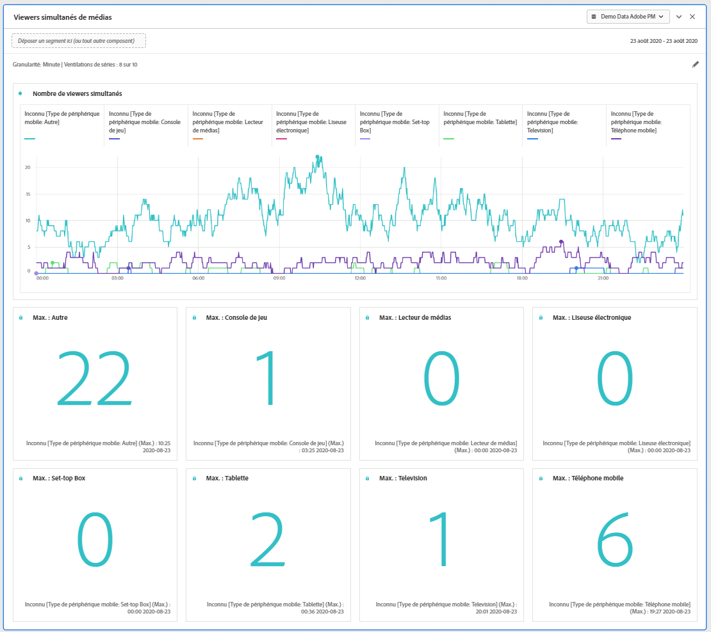
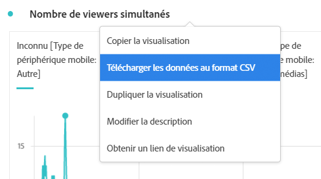

# Panneau des visionneuses simultanées de médias {#media-concurrent-viewers-panel}

<!-- markdownlint-disable MD034 -->

>[!CONTEXTUALHELP]
>id="workspace_mediaconcurrentviewers_button"
>title="Visites simultanées de médias"
>abstract="Créez un panneau pour analyser les visionneuses simultanées sur une période spécifique."

<!-- markdownlint-enable MD034 -->

<!-- markdownlint-disable MD034 -->

>[!CONTEXTUALHELP]
>id="workspace_mediaconcurrentviewers_panel"
>title="Visites simultanées de médias"
>abstract="Analysez l’évolution du nombre de visites simultanées, identifiez les pics de visites simultanées et, éventuellement, ventilez et comparez à l’aide de segments, de dimensions, d’éléments de dimension ou de périodes."

<!-- markdownlint-enable MD034 -->

>[!BEGINSHADEBOX]

_Cet article présente le panneau Visiteurs et visiteuses simultanés de médias dans_  _&#x200B;**Customer Journey Analytics**&#x200B;_. _Consultez [panneau Visiteurs et visiteuses simultanés de médias](https://experienceleague.adobe.com/fr/docs/analytics/analyze/analysis-workspace/panels/media-concurrent-viewers) pour la_ version  _&#x200B;**Adobe Analytics** de cet article._

>[!ENDSHADEBOX]

>[!NOTE]
>
>Le panneau Audience moyenne par minute de média est disponible uniquement pour les clientes et clients qui ont acheté le module complémentaire Streaming Media Collection pour Customer Journey Analytics.
>
>Pour plus d’informations, contactez votre représentant ou représentante du service commercial Adobe ou l’équipe Adobe en charge des comptes.
>

Le panneau **[!UICONTROL Visiteurs et visiteuses simultanés de médias]** permet d’analyser les visiteurs et visiteuses simultanés au fil du temps. Il fournit également des informations détaillées sur le pic d’accès simultanés et la possibilité de ventiler et de comparer.

Vous pouvez analyser les visiteurs et visiteuses simultanés pour déterminer où s’est produit le pic d’accès simultanés ou l’endroit où des abandons ont eu lieu, ce qui permet de mieux comprendre la qualité du contenu et l’engagement des personnes. Et pour faciliter le dépannage ou la planification du volume ou de l’échelle.

Dans Analysis Workspace, les visiteurs et visiteuses simultanés représentent le nombre de visiteurs et visiteuses uniques qui visualisent vos flux de médias à un moment donné, quel que soit le nombre de sessions.

>[!BEGINSHADEBOX]

Consultez  [Panneau Visiteurs et visiteuses simultanés de médias](https://video.tv.adobe.com/v/35025/?captions=fre_fr&quality=12&learn=on){target="_blank"} pour une vidéo de démonstration.

{{videoaa}}

>[!ENDSHADEBOX]

## Utilisation

Pour utiliser un panneau **[!UICONTROL Visiteurs et visiteuses simultanés de médias]**, procédez comme suit :

1. Créez un panneau **[!UICONTROL Visiteurs et visiteuses simultanés de médias]**. Pour plus d’informations sur la création d’un panneau, consultez [Créer un panneau](panels.md#create-a-panel).

1. Veillez à sélectionner une vue de données pour le panneau dont les composants sont configurés à partir de la collection de Straming Media Collection.

1. Spécifiez l’[entrée](#panel-input) du panneau.

1. Observez la [sortie](#panel-output) du panneau.

### Entrée du panneau

Vous pouvez configurer le panneau Visiteurs et visiteuses simultanés de médias à l’aide des paramètres d’entrée suivants :

| Paramètre | Description |
|---|---|
| **[!UICONTROL Période du panneau]** | La période par défaut du panneau est définie sur Aujourd’hui. Vous pouvez la modifier pour afficher un seul jour ou plusieurs mois à la fois.    La visualisation est limitée à 1440 lignes de données (par exemple, 24 heures à une granularité au niveau des minutes).  Si une combinaison de période et de granularité génère plus de 1 440 lignes, la granularité est automatiquement mise à jour pour s’adapter à la période complète. |
| **[!UICONTROL Granularité]** | La granularité par défaut est définie sur Minute. La visualisation est limitée à 1440 lignes de données (par exemple, 24 heures à une granularité au niveau des minutes).  Si une combinaison de période et de granularité génère plus de 1 440 lignes, la granularité est automatiquement mise à jour pour s’adapter à la période complète. |
| **[!UICONTROL Synthèse des chiffres des panneaux]** | Pour afficher les détails de date ou d’heure relatifs aux observateurs simultanés, une synthèse des chiffres est disponible. La valeur maximale affiche les détails concernant le pic d’accès simultanés. La valeur **[!UICONTROL minimale]** affiche les détails du creux.  Par défaut, le panneau affiche uniquement la valeur maximale, mais vous pouvez le modifier pour afficher la valeur minimale ou les deux valeurs.  Si vous utilisez des répartitions, une synthèse des chiffres s’affiche pour chacune d’elles. |
| **[!UICONTROL Répartition de la série]** | Vous pouvez ventiler votre visualisation par segments, dimensions, éléments de dimension ou périodes. Vous pouvez afficher jusqu’à 10 lignes à la fois. Les répartition sont limitées à un seul niveau. Lorsque vous faites glisser une dimension, les principaux éléments de dimension sont automatiquement sélectionnés en fonction de la période du panneau sélectionnée. Pour comparer des périodes, faites glisser deux périodes ou plus dans le segment de répartition de la série. |

Voici un exemple de panneau configuré pour une granularité **[!UICONTROL Minute]** avec une synthèse des chiffres **[!UICONTROL Maximum uniquement]**. Et ventilé par **[!UICONTROL Autre]**, **[!UICONTROL Tableau]**, **[!UICONTROL Téléphone mobile]**, **[!UICONTROL Console de jeu]**, **[!UICONTROL Lecteur multimédia]**, **[!UICONTROL Décodeur]**, **[!UICONTROL Télévision]**.

### Sortie du panneau

Le panneau Observateurs simultanés de médias renvoie un graphique en courbe et des synthèses de chiffres pour inclure des détails sur les valeurs maximales et/ou minimales d’observateurs simultanés. En haut du panneau, une ligne de résumé vous rappelle les paramètres du panneau que vous avez sélectionnés.

À tout moment, sélectionnez  pour modifier et recréer le panneau.

Si vous avez sélectionné la répartition des séries, une ligne du graphique en courbe et une synthèse des chiffres s’affichent pour chacune d’elles :

### Source de données

La seule mesure qui peut être utilisée dans ce panneau est **[!UICONTROL Visiteurs et visiteuses simultanés]** :

| Mesure | Description |
|---|---|
| **[!UICONTROL Visiteurs et visiteuses simultanés]** | Nombre de visiteurs et visiteuses uniques qui voient votre ou vos flux de médias à un moment précis, quel que soit le nombre de sessions. |

Un tableau à structure libre n’est pas disponible dans cet affichage. Pour afficher la source de données, vous pouvez la télécharger à partir du menu contextuel de visualisation sous forme de graphique en courbes et sélectionner **[!UICONTROL Télécharger les données au format CSV]**.  Les répartitions de séries sont incluses.

## Questions fréquentes

| Question | Réponse |
|---|---|
| Où se trouve le tableau à structure libre ? Comment puis-je voir la source de données ? | Le tableau à structure libre n’est pas disponible dans cet affichage. Vous pouvez télécharger la source de données à partir du menu contextuel du graphique en courbes et sélectionner **[!UICONTROL Télécharger les données au format CSV]**. |
| Pourquoi ma granularité a-t-elle changé ? | La visualisation est limitée à 1 440 lignes de données (par exemple, 24 heures à une granularité au niveau des minutes).  Si une combinaison de période et de granularité génère plus de 1 440 lignes, la granularité est automatiquement mise à jour pour s’adapter à la période complète.  Lorsque vous passez d’une période plus grande à une période plus petite, la granularité est mise à jour vers le détail le plus bas possible une fois la période modifiée. Pour afficher une granularité plus élevée, modifiez le panneau et recréez la visualisation. |
| Comment puis-je comparer les noms de vidéo, les segments, les types de contenu, etc. ? | Pour les comparer dans une visualisation unique, faites glisser des segments, des dimensions ou des éléments de dimension spécifiques dans le segment de répartition de la série.  L’affichage est limité à 10 répartitions.  Pour en afficher plus de 10, vous devez utiliser plusieurs panneaux. |
| Comment puis-je comparer des périodes ? | Pour comparer des périodes dans une seule visualisation, utilisez les répartitions des séries en faisant glisser au moins 2 périodes.  Ces périodes remplacent alors la période du panneau. |
| Comment puis-je modifier le type de visualisation ? | Ce panneau permet uniquement la visualisation des lignes pour la série temporelle. |
| Puis-je exécuter la détection des anomalies ? | Non.  La détection des anomalies n’est pas disponible pour ce panneau. |
| Pourquoi utiliser des personnes uniques plutôt que des sessions actives ? | L’utilisation de personnes uniques permet de supprimer les pics indésirables aux limites de l’affichage (où les sessions se terminent et commencent simultanément). |
| Que signifie le fait d’avoir des observateurs simultanés avec une granularité supérieure à la minute ? | Avec une granularité supérieure à une minute, les observateurs simultanés représentent la somme des observateurs simultanés uniques pour toutes les minutes de cette période. Par exemple, les visiteurs et visiteuses simultanés avec une granularité au niveau de l’heure représentent la somme des visiteurs et visiteuses simultanés uniques pour toutes les minutes de cette heure. |
| Le panneau Espace de travail affiche-t-il les mêmes informations que le rapport sur les observateurs simultanés ? | Non.  Dans Analysis Workspace, la mesure Visiteurs et visiteuses simultanés est définie comme le nombre personnes uniques qui visualisent votre flux de médias à un moment précis. Quel que soit le nombre de sessions.  Cette mesure est différente de le rapport Visiteurs et visiteuses simultanés dans la section Rapports, qui utilise les sessions simultanées actives. L’utilisation de personnes uniques entraîne la suppression des « pics » indésirables aux limites de l’affichage (où les sessions se terminent et commencent en même temps). |

<!-- For more information about Media Concurrent Viewers, visit [MA doc page]( https://url). -->

>[!MORELIKETHIS]
>
>[Créer un panneau](/help/analysis-workspace/c-panels/panels.md#create-a-panel)
>&#x200B;>[Panneau Temps de lecture de média](media-playback-time-spent.md)
>&#x200B;>[Panneau Audience moyenne par minute de média](average-minute-audience-panel.md)
>