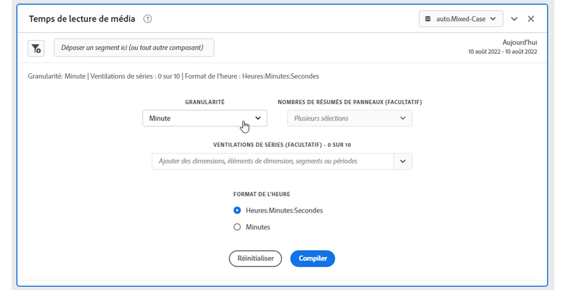
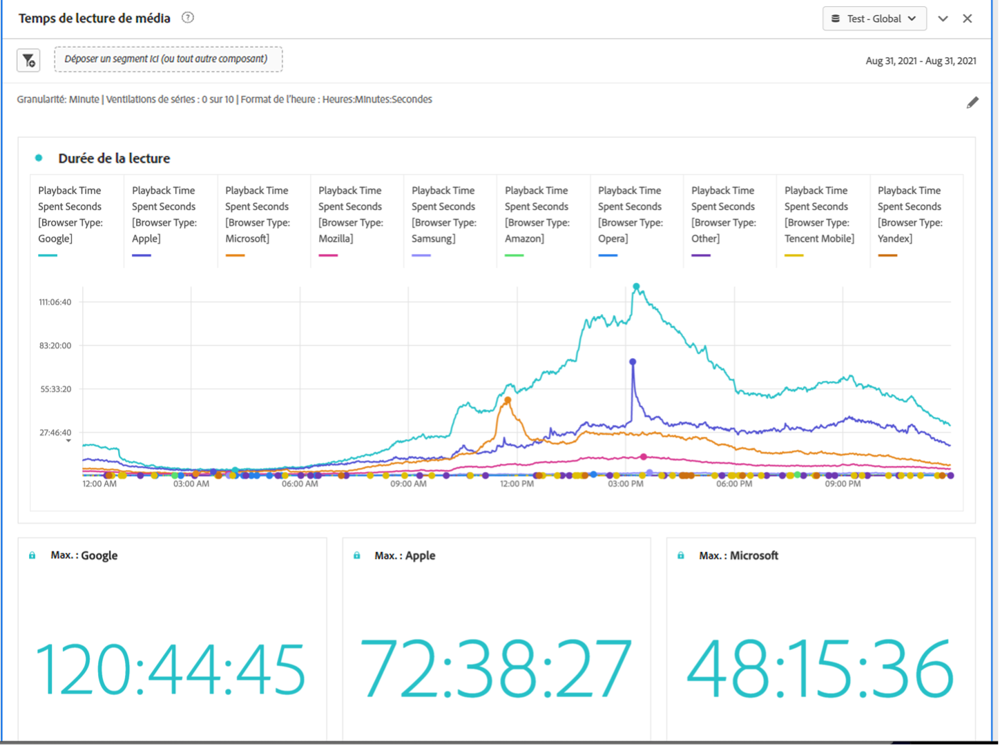

# Panneau Temps de lecture de média {#media-playback-time-spent-panel}

<!-- markdownlint-disable MD034 -->

>[!CONTEXTUALHELP]
>id="workspace_mediaplaybacktimespent_button"
>title="Temps de lecture de média"
>abstract="Créez un panneau pour analyser l’évolution de la consommation vidéo, avec différents niveaux de granularité, et la possibilité de ventiler et de comparer."

<!-- markdownlint-enable MD034 -->

<!-- markdownlint-disable MD034 -->

>[!CONTEXTUALHELP]
>id="workspace_mediaplaybacktimespent_panel"
>title="Temps de lecture de média"
>abstract="Analysez l’évolution de la consommation vidéo, sélectionnez différentes granularités et, éventuellement, ventilez et comparez à l’aide de segments, de dimensions, d’éléments de dimension ou de périodes."

<!-- markdownlint-enable MD034 -->

>[!BEGINSHADEBOX]

_Cet article présente le panneau Temps de lecture de média dans_  _&#x200B;**Customer Journey Analytics**&#x200B;_. _Consultez [panneau Temps de lecture de média](https://experienceleague.adobe.com/fr/docs/analytics/analyze/analysis-workspace/panels/media-playback-time-spent) pour la_ version  _&#x200B;**Adobe Analytics** de cet article._

>[!ENDSHADEBOX]

>[!NOTE]
>
>Le panneau Audience moyenne par minute de média est disponible uniquement pour les clientes et clients qui ont acheté le module complémentaire Streaming Media Collection pour Customer Journey Analytics.
>&#x200B;>Pour plus d’informations, contactez votre représentant ou représentante du service commercial Adobe ou l’équipe Adobe en charge des comptes.
>

Le panneau **[!UICONTROL Temps de lecture de média]** permet dʼanalyser la lecture au fil du temps. Il fournit également des informations détaillées sur le pic dʼaccès simultanés et la possibilité de ventiler et de comparer.

Dans Analysis Workspace, le temps de lecture de média représente le temps de visionnage de vos flux multimédias à un moment précis. Il comprend les pauses, la mise en mémoire tampon et le temps de démarrage.

Les clientes et clients qui ont acheté le module complémentaire Streaming Media Collection peuvent analyser le temps de lecture pour obtenir des informations précieuses sur la qualité du contenu et l’engagement des visiteurs et visiteuses. Et pour vous aider lors du dépannage ou de la planification du volume ou de l’échelle.

Le temps de lecture peut vous aider à comprendre les éléments suivants :

* Où le pic d’accès simultanés s’est produit.

* L’endroit où les abandons ont eu lieu.

>[!BEGINSHADEBOX]

Consultez  [Temps de lecture de média](https://video.tv.adobe.com/v/3446702?captions=fre_fr){target="_blank"} pour une vidéo de démonstration.

{{videoaa}}

>[!ENDSHADEBOX]

## Utilisation

Pour utiliser un panneau **[!UICONTROL Temps de lecture de média]**, procédez comme suit :

1. Créez un panneau **[!UICONTROL Temps de lecture de média]**. Pour plus d’informations sur la création d’un panneau, consultez [Créer un panneau](panels.md#create-a-panel).

1. Veillez à sélectionner une vue de données pour le panneau dont les composants sont configurés à partir de la collection de Straming Media Collection.

1. Spécifiez l’[entrée](#panel-input) du panneau.

1. Observez la [sortie](#panel-output) du panneau.

### Entrée du panneau

Vous pouvez configurer le panneau Durée de lecture des médias à lʼaide des paramètres dʼentrée suivants :

| Paramètre | Description |
|---|---|
| Période du panneau | La période par défaut du panneau est définie sur Aujourd’hui. Vous pouvez la modifier pour afficher un seul jour ou plusieurs mois à la fois. La visualisation est limitée à 1440 lignes de données (par exemple, 24 heures à une granularité au niveau des minutes). Si une combinaison de période et de granularité génère plus de 1 440 lignes, la granularité est automatiquement mise à jour pour s’adapter à la période complète. |
| Granularité | La granularité par défaut est définie sur Minute. La visualisation est limitée à 1440 lignes de données (par exemple, 24 heures à une granularité au niveau des minutes). Si une combinaison de période et de granularité génère plus de 1 440 lignes, la granularité est automatiquement mise à jour pour s’adapter à la période complète. |
| Synthèse des chiffres des panneaux | Pour afficher les détails de date ou dʼheure relatifs à la durée de la lecture, une synthèse des chiffres est disponible. La valeur maximale affiche les détails concernant le pic d’accès simultanés. La valeur minimale affiche les détails du creux. La somme additionne la durée de lecture totale de la sélection. Le panneau nʼindique par défaut que la valeur maximale, mais vous pouvez modifier cette valeur par défaut et afficher la valeur minimale, la valeur totale ou une combinaison des trois valeurs. Si vous utilisez des répartitions, une synthèse des chiffres s’affiche pour chacune d’elles. |
| Répartition de la série | Vous pouvez ventiler votre visualisation par segments, dimensions, éléments de dimension ou périodes.
- Vous pouvez afficher jusqu’à 10 lignes à la fois. Les répartitions sont limitées à un seul niveau.

- Lorsque vous faites glisser une dimension, les principaux éléments de dimension sont automatiquement sélectionnés en fonction de la période du panneau sélectionnée.
- Pour comparer des périodes, faites glisser deux périodes minimum dans le segment de répartition de la série. |
| Format de l’heure | Vous pouvez afficher le temps de lecture en `Hours:Minutes:Seconds` (par défaut) ou en `Minutes` (sʼaffiche en nombres entiers, arrondis à 0,5 vers le haut). |
| Affichage de la séquence de dates | Si vous avez placé au moins deux segments de période en tant que répartitions de la série, lʼoption permettant de sélectionner Superposition (par défaut) ou Séquentiel sʼaffiche. La superposition affiche les lignes avec un point de départ commun sur lʼaxe X afin quʼelles se déroulent en parallèle. Séquentiel affiche les lignes avec leur point de départ spécifique sur lʼaxe X. Si les données se suivent (par exemple, le segment 1 se termine à 20 h 44 et le segment 2 commence à 20 h 45), les lignes sʼaffichent de manière séquentielle. |

### Sortie du panneau

Le panneau Durée de lecture des médias renvoie un graphique en courbes et des numéros de synthèse, qui incluent des détails sur la durée maximale, minimale et/ou totale de la lecture. En haut du panneau, une ligne de résumé vous rappelle les paramètres du panneau que vous avez sélectionnés.

À tout moment, sélectionnez  pour modifier et recréer le panneau.

Si vous sélectionnez la répartition des séries, une ligne du graphique en courbe et une synthèse des chiffres s’affichent pour chacune d’elles :

### Source de données

La seule mesure pouvant être utilisée dans ce panneau est Durée de la lecture.

| Mesure | Description |
|---|---|
| Durée de la lecture | Nombre total en `hours:minutes:seconds` (ou `minutes`) de contenu affiché lors de la granularité sélectionnée, y compris la mise en pause, la mise en mémoire tampon et le temps de démarrage. |

## Questions fréquentes

| Question | Réponse |
|---|---|
| Où se trouve le tableau à structure libre ? Comment puis-je voir la source de données ? | 

Le tableau à structure libre n’est pas disponible dans cet affichage. Pour télécharger la source de données, à partir du menu contextuel du graphique linéaire, sélectionnez l’option de téléchargement du fichier CSV.
 |
| 
Pourquoi ma granularité a-t-elle changé ?
 | 
La visualisation est limitée à 1 440 lignes de données (par exemple, 24 heures à une granularité au niveau des minutes). Si une combinaison de période et de granularité génère plus de 1 440 lignes, la granularité est automatiquement mise à jour pour s’adapter à la période complète.

Lorsque vous passez d’une période plus grande à une période plus petite, la granularité est mise à jour vers le détail le plus bas possible une fois la période modifiée. Pour afficher une granularité plus élevée, modifiez le panneau et recréez la visualisation.
 |
| 

Comment puis-je comparer les noms de vidéo, les segments, les types de contenu, etc. ?
 | 
Pour les comparer dans une seule visualisation, faites glisser des segments, des dimensions ou des éléments de dimension spécifiques dans le segment de répartition de la série.

L’affichage est limité à 10 répartitions. Pour en afficher plus de 10, vous devez utiliser plusieurs panneaux.
 |
| Comment puis-je comparer des périodes ? | Pour comparer des périodes dans une seule visualisation, utilisez les répartitions des séries en faisant glisser au moins 2 périodes. Ces périodes remplacent la période du panneau. |
| Comment puis-je modifier le type de visualisation ? | 

Ce panneau permet uniquement la visualisation des lignes pour la série temporelle.
 |
| Puis-je exécuter la détection des anomalies ? | 

Non. La détection des anomalies n’est pas disponible pour ce panneau.
 |

>[!MORELIKETHIS]
>
>[Créer un panneau](/help/analysis-workspace/c-panels/panels.md#create-a-panel)
>&#x200B;>[Panneau Audience moyenne par minute de média](average-minute-audience-panel.md)
>&#x200B;>[Panneau Visiteurs et visiteuses simultanés de médias](media-concurrent-viewers.md)
>
