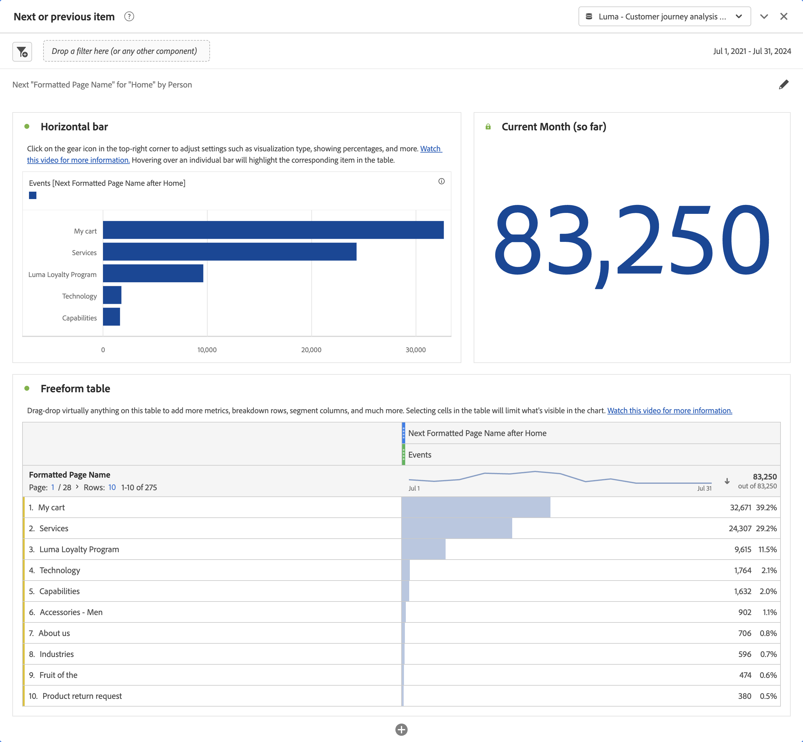

# Panneau Élément suivant ou précédent {#next-or-previous-item-panel}

>[!CONTEXTUALHELP]
>id="workspace_nextorpreviousitem_button"
>title="Élément suivant ou précédent"
>abstract="Créez un panneau pour comprendre les dimensions précédentes des personnes ou la dimension suivante à laquelle ils accèdent."

>[!CONTEXTUALHELP]
>id="workspace_nextorpreviousitem_panel"
>title="Élément suivant ou précédent"
>abstract="Analysez les endroits les plus courants d’où viennent les visiteurs et visiteuses et ceux où ils vont ensuite. Spécifiez la dimension, l’élément de dimension, la direction et le conteneur à utiliser pour la visualisation."

>[!BEGINSHADEBOX]

_Cet article présente le panneau Élément suivant ou précédent dans_  _&#x200B;**Customer Journey Analytics**&#x200B;_. _Voir [Panneau Élément suivant ou précédent](https://experienceleague.adobe.com/fr/docs/analytics/analyze/analysis-workspace/panels/next-previous) pour la_  _&#x200B;**version Adobe Analytics** de cet article._

>[!ENDSHADEBOX]

Le panneau **[!UICONTROL Élément suivant ou précédent]** contient un certain nombre de tableaux et de visualisations pour identifier l’élément de dimension suivant ou précédent pour une dimension spécifique. Par exemple, vous pouvez vouloir explorer les pages auxquelles les clientes et clients ont accédé le plus souvent après avoir consulté la page d’accueil.

## Utilisation {#use}

>[!CONTEXTUALHELP]
>id="workspace_nextorpreviousitem_container"
>title="Conteneur"
>abstract="Sélectionnez le conteneur pour déterminer la portée de votre recherche."

Pour utiliser un panneau **[!UICONTROL Élément suivant ou précédent]**, procédez comme suit :

1. Créez un panneau **[!UICONTROL Élément suivant ou précédent]**. Pour plus d’informations sur la création d’un panneau, consultez [Créer un panneau](panels.md#create-a-panel).

1. Spécifiez l’[entrée](#panel-input) du panneau.

1. Observez la [sortie](#panel-output) du panneau.

### Entrée du panneau

Vous pouvez configurer le panneau [!UICONTROL Élément suivant ou précédent] à lʼaide des paramètres dʼentrée suivants :

| Entrée | Description |
| --- | --- |
| **[!UICONTROL Dimension]** | Sélectionnez la dimension pour laquelle vous souhaitez explorer les éléments suivants ou précédents. |
| **[!UICONTROL Élément de dimension]** | Sélectionnez l’élément de dimension spécifique au centre de votre requête suivante/précédente. |
| **[!UICONTROL Direction]** | Indiquez si vous recherchez l’élément de dimension [!UICONTROL Suivant] ou [!UICONTROL Précédent]. |
| **[!UICONTROL Conteneur]** | Sélectionnez le conteneur, **[!UICONTROL Compte global]** [!BADGE B2B Edition]{type=Informative url="https://experienceleague.adobe.com/fr/docs/analytics-platform/using/cja-overview/cja-b2b/cja-b2b-edition" newtab=true tooltip="Customer Journey Analytics B2B Edition"}, **[!UICONTROL Compte]** [!BADGE B2B Edition]{type=Informative url="https://experienceleague.adobe.com/fr/docs/analytics-platform/using/cja-overview/cja-b2b/cja-b2b-edition" newtab=true tooltip="Customer Journey Analytics B2B Edition"}, **[!UICONTROL Groupe d’achat]** [!BADGE B2B Edition]{type=Informative url="https://experienceleague.adobe.com/fr/docs/analytics-platform/using/cja-overview/cja-b2b/cja-b2b-edition" newtab=true tooltip="Customer Journey Analytics B2B Edition"}, **[!UICONTROL Opportunité]** [!BADGE B2B Edition]{type=Informative url="https://experienceleague.adobe.com/fr/docs/analytics-platform/using/cja-overview/cja-b2b/cja-b2b-edition" newtab=true tooltip="Customer Journey Analytics B2B Edition"}, **[!UICONTROL Session]** ou **[!UICONTROL Personne]**, pour déterminer la portée de votre recherche. |

{style="table-layout:auto"}

Sélectionnez **[!UICONTROL Créer]** pour créer le panneau.

### Sortie du panneau

Le panneau [!UICONTROL Élément suivant ou précédent] renvoie un riche ensemble de données et de visualisations pour vous aider à mieux comprendre les occurrences qui suivent ou précèdent des éléments de dimension spécifiques.

| Visualisation | Description |
| --- | --- |
| **[!UICONTROL Barre horizontale]** | Répertorie les éléments suivants (ou précédents) en fonction de l’élément de dimension que vous sélectionnez. Survoler une barre individuelle met en surbrillance l’élément correspondant dans le tableau à structure libre. |
| **[!UICONTROL Numéro de résumé]** | Synthèse des chiffres de haut niveau de toutes les occurrences d’éléments de dimension suivants ou précédents pour le mois en cours (jusqu’à présent). |
| **[!UICONTROL Tableau à structure libre]** | Répertorie les éléments suivants (ou précédents) en fonction de l’élément de dimension que vous sélectionnez, sous forme de tableau. Par exemple, quelles étaient les pages les plus populaires (par occurrences) auxquelles les personnes ont accédé après (ou avant) la page d’accueil ou la page de l’espace de travail. |

{style="table-layout:auto"}

>[!MORELIKETHIS]
>
>[Créer un panneau](/help/analysis-workspace/c-panels/panels.md#create-a-panel)
>
