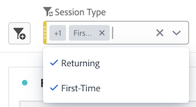

# Panneaux - Aperçu

Un [!UICONTROL panneau] est un ensemble de tableaux et de visualisations. Vous pouvez accéder aux panneaux à partir de l’icône située en haut à gauche dans Workspace ou à partir d’un [panneau vierge](/help/analysis-workspace/c-panels/blank-panel.md). Les panneaux sont utiles lorsque vous souhaitez organiser vos projets en fonction de périodes de temps, de vues de données ou de cas dʼutilisation dʼanalyse.

## Types de panneaux

Les types de panneau suivants sont disponibles dans Analysis Workspace pour [!UICONTROL Customer Journey Analytics] :

| Nom du panneau | Description |
| --- | --- |
| [Panneau vierge](/help/analysis-workspace/c-panels/blank-panel.md) | Faites votre choix parmi les panneaux et visualisations disponibles pour démarrer votre analyse. |
| [Panneau Quick Insights](quickinsight.md) | Construisez rapidement un tableau de forme libre et une visualisation d’accompagnement afin d’analyser et de découvrir des informations plus rapidement. |
| [Panneau d’attribution](attribution.md) | Comparez et visualisez rapidement de nombreux modèles d’attribution en utilisant n’importe quelle dimension ou mesure de conversion. |
| [Panneau à structure libre](freeform-panel.md) | Effectuez des comparaisons et des répartitions illimitées, puis ajoutez des visualisations pour raconter une histoire riche en données. |
| [Panneau Observateurs simultanés de médias](media-concurrent-viewers.md) | Analysez les visionneuses au fil du temps, avec des informations sur la simultanéité la plus élevée, et sur la capacité à ventiler et à comparer. |
| [Panneau Temps de lecture de média](/help/analysis-workspace/c-panels/media-playback-time-spent.md) | L’analyse du temps de lecture permet de déterminer où s’est produit le pic d’accès simultanés mais aussi où des abandons ont eu lieu. |

Les panneaux [!UICONTROL Quick Insights], [!UICONTROL Vierge] et [!UICONTROL À structure libre] constituent un excellent point de départ pour votre analyse. [!UICONTROL Attribution IQ] est réservé à des analyses plus poussées. Un bouton `"+"` est disponible dans les projets afin que vous puissiez ajouter des panneaux vierges à tout moment.

Le panneau de démarrage par défaut est le panneau [!UICONTROL à structure libre], mais vous pouvez également choisir d’utiliser le [panneau vierge](/help/analysis-workspace/c-panels/blank-panel.md) par défaut.

## Calendrier {#calendar}

Le calendrier du panneau contrôle la plage de compte-rendu des performances des tableaux et des visualisations dans un panneau.

Remarque : si un composant de période (violet) est utilisé dans un tableau, une visualisation ou une zone de dépôt de panneau, il remplace le calendrier du panneau.

Vous pouvez appliquer une période au niveau de la minute dans les paramètres avancés du calendrier du panneau. Si vous créez des rapports sur une période qui sʼétale sur plusieurs jours, lʼheure de début sʼapplique au premier jour et lʼheure de fin au dernier jour de celle-ci.

## Zone de dépôt {#dropzone}

La zone de dépôt des panneaux vous permet dʼappliquer des filtres et des filtres déroulants à tous les tableaux et visualisations dʼun panneau. Vous pouvez appliquer un ou plusieurs filtres à un panneau.

### Filtres

Faites glisser et déposez les filtres du rail de gauche dans la zone de dépôt du panneau pour commencer à filtrer votre panneau. Répétez cette procédure pour ajouter des filtres supplémentaires au panneau. Les filtres s’affichent côte à côte en haut du panneau.

### Filtres ad hoc

Vous pouvez également faire glisser les composants qui ne sont pas des filtres directement vers la zone de dépôt pour créer des filtres ad hoc, ce qui vous permet de gagner du temps et vous évite de passer par le créateur de filtres. Les filtres ainsi créés sont automatiquement définis comme des filtres de niveau d’événement. Vous pouvez modifier cette définition en cliquant sur lʼicône dʼinformations (i) à côté du filtre, puis sur lʼicône de modification en forme de crayon, et la modifier dans le créateur de filtres.

Les filtres ad hoc sont un type de filtre rapide et sont locaux au projet. Ils ne s’affichent pas dans le rail de gauche à moins que vous ne les rendiez publics.

Pour en savoir plus, voir [Filtres rapides](/help/components/filters/quick-filters.md).

### Filtres déroulants statiques

Les filtres déroulants statiques permettent d&#39;interagir avec les données de manière contrôlée. Par exemple, vous pouvez ajouter un filtre déroulant pour les types d’appareils mobiles afin de pouvoir filtrer le panneau par tablette, téléphone mobile ou bureau.

Les filtres déroulants statiques peuvent également être utilisés pour consolider de nombreux projets en un seul. Par exemple, si vous avez plusieurs versions dʼun même projet avec des filtres Pays différents, vous pouvez les fusionner en un seul projet et ajouter un filtre déroulant Pays.

#### Création de filtres déroulants statiques

* Pour les filtres déroulants utilisant des éléments de dimension, sélectionnez une seule dimension dans le rail de gauche et déposez-la dans la zone de dépôt du panneau. **pendant la conservation`[Shift]`**. Un filtre de menu déroulant est ainsi créé avec tous les éléments de dimension associés à cette dimension.

  Ou, si vous souhaitez que le filtre déroulant inclue uniquement des éléments de dimension spécifiques associés à une dimension, cliquez sur l’icône de flèche vers la droite en regard de la dimension souhaitée dans le rail de gauche. Cette action affiche tous les éléments de dimension disponibles. Sélectionnez plusieurs éléments de dimension de cette liste à l’aide de la case `[Shift + Click]` ou `[Ctrl + Click]`, puis déposez-les dans la zone de dépôt du panneau **pendant la conservation** `[Shift]`.

* Pour les filtres de liste déroulante utilisant un seul type de composant (par exemple, seules les dimensions, les filtres ou uniquement les mesures), sélectionnez plusieurs éléments du même type dans le rail de gauche à l’aide de `[Shift + Click]` ou `[Ctrl + Click]`, puis déposez-les dans la zone de dépôt du panneau **pendant la conservation`[Shift]`**.

  Un filtre déroulant unique est créé avec les composants que vous avez sélectionnés.

* Pour les filtres déroulants utilisant un mélange de types de composants (par exemple, 2 mesures et 3 filtres), sélectionnez plusieurs composants à l’aide de la fonction `[Shift + Click]` ou `[Ctrl + Click]`. Déposez la sélection dans la zone de dépôt du panneau **tout en maintenant la touche`[Shift]`** enfoncée. Dans ce contexte, tous les types de composants sont traités comme des filtres déroulants distincts. Par exemple, si vous incluez à la fois des mesures et des éléments de dimension dans votre sélection, deux filtres déroulants distincts sont créés : un filtre déroulant inclut des éléments de dimension et l’autre inclut des mesures.

  

Un clic droit sur un filtre déroulant permet d’obtenir les options suivantes :

* **[!UICONTROL Menu déroulant Supprimer]**: supprime le filtre de liste déroulante du panneau.
* **[!UICONTROL Supprimer le libellé]**: supprimez le texte au-dessus d’un filtre de liste déroulante. Pour modifier le libellé, sélectionnez l&#39;icône représentant un crayon.
* **[!UICONTROL Ajouter un libellé]** : lorsque vous ajoutez un filtre déroulant à un projet, un libellé est automatiquement défini sur le nom du composant. Si vous supprimez le libellé, vous pouvez l’ajouter à nouveau avec cette option.
* **[!UICONTROL Sélection requise]**: nécessite qu’un filtre soit défini sur le panneau.

[Regardez la vidéo](https://experienceleague.adobe.com/docs/analytics-learn/tutorials/analysis-workspace/using-panels/using-panels-to-organize-your-analysis-workspace-projects.html?lang=fr) pour en savoir plus sur l’ajout de filtres de menu déroulant à votre projet.

#### Utilisation de filtres déroulants statiques

Pour filtrer le panneau, les utilisateurs peuvent utiliser le menu déroulant de filtrage de l’une des façons suivantes :

* Appliquez un seul filtre au panneau en sélectionnant le filtre dans la liste déroulante.

* Appliquez plusieurs filtres au panneau en sélectionnant plusieurs filtres dans le filtre déroulant. Le panneau est filtré pour inclure l’un des filtres sélectionnés.

  

### Filtres déroulants dynamiques

Les filtres déroulants dynamiques vous permettent de déterminer les valeurs disponibles en fonction des données dans la plage de rapports du panneau et des valeurs dans d’autres filtres déroulants. Vous pouvez par exemple créer deux listes déroulantes dynamiques à l’aide d’une dimension Pays et d’une dimension Villes. Lorsque vous sélectionnez un pays dans la liste déroulante UICONTROL Pays, la liste déroulante Villes s’adapte dynamiquement pour n’afficher que les villes de ce pays.

Ce même concept s’applique à toutes les dimensions. Seuls les éléments de dimension qui apparaissent dans la période du panneau et les filtres sélectionnés sont visibles. Les éléments de dimension sélectionnés dans les filtres déroulants statiques affectent les valeurs disponibles dans les filtres déroulants dynamiques. Cependant, l’inverse n’est pas vrai : les éléments de dimension sélectionnés dans les filtres déroulants dynamiques n’affectent pas les valeurs disponibles dans les filtres déroulants statiques.

La sélection manuelle d’éléments de dimension est possible si vous prévoyez qu’un élément de dimension donné sera collecté ultérieurement. Vous pouvez également effacer un filtre déroulant dynamique afin qu’il ne contienne aucune valeur, permettant ainsi à d’autres filtres déroulants dynamiques de contenir plus de valeurs. Sélectionnez **[!UICONTROL Réinitialiser tous]** pour effacer la sélection de tous les filtres déroulants de ce panneau.

Pour créer un filtre déroulant dynamique :

* Faites glisser et déposez une seule dimension dans la zone de dépôt du panneau **tout en maintenant la touche`[Shift]`** enfoncée.
* Les filtres déroulants dynamiques ne sont pas disponibles pour les mesures, les filtres ou les périodes.
* Cliquez avec le bouton droit de la souris sur un filtre déroulant et sélectionnez **[!UICONTROL Supprimer le filtre]** pour le supprimer.

Un clic droit sur un filtre déroulant dynamique permet d’obtenir les mêmes options que les filtres déroulants statiques.

## Menu contextuel {#right-click}

Pour accéder à d’autres fonctionnalités d’un panneau, faites un clic droit sur l’en-tête du panneau.

Les paramètres suivants sont disponibles :

| Paramètre | Description |
| --- | --- |
| [!UICONTROL Insérer la copie du panneau/de la visualisation] | Permet de coller (« insérer ») la copie d’un panneau ou d’une visualisation à un autre emplacement au sein du projet, ou dans un tout autre projet. |
| [!UICONTROL Copier le panneau] | Permet de faire un clic droit et de copier un panneau de sorte que vous puissiez l’insérer à un autre emplacement au sein du projet, ou dans un tout autre projet. |
| [!UICONTROL Dupliquer le panneau] | Crée un double exact du panneau actuel, que vous pouvez ensuite modifier. |
| [!UICONTROL Réduire/Développer tous les panneaux] | Réduit et développe tous les panneaux du projet. |
| [!UICONTROL Réduire/Développer toutes les visualisations dans le panneau] | Réduit et développe toutes les visualisations du panneau actif. |
| [!UICONTROL Modifier la description] | Ajouter (ou modifier) une description textuelle du panneau. |
| [!UICONTROL Obtenir un lien vers le panneau] | Permet de renvoyer un utilisateur vers un panneau spécifique dans un projet. Lorsque l’utilisateur clique sur le lien, le destinataire doit se connecter avant d’être dirigé vers le panneau exact auquel il est lié. |
