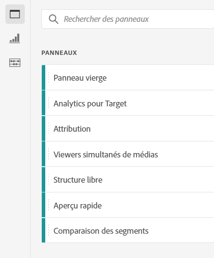
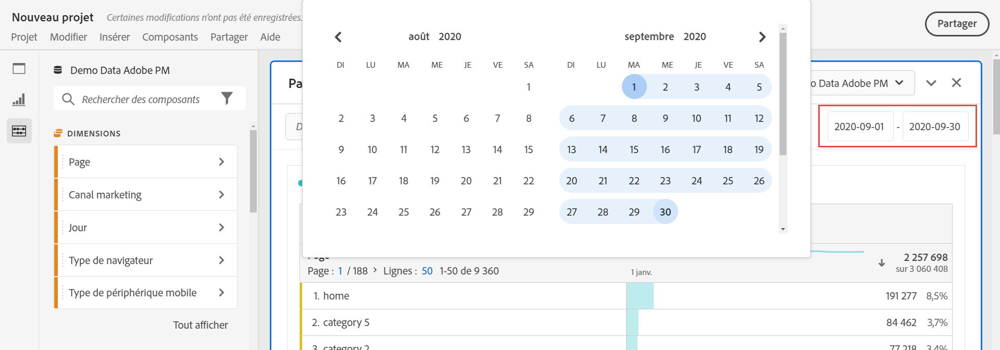
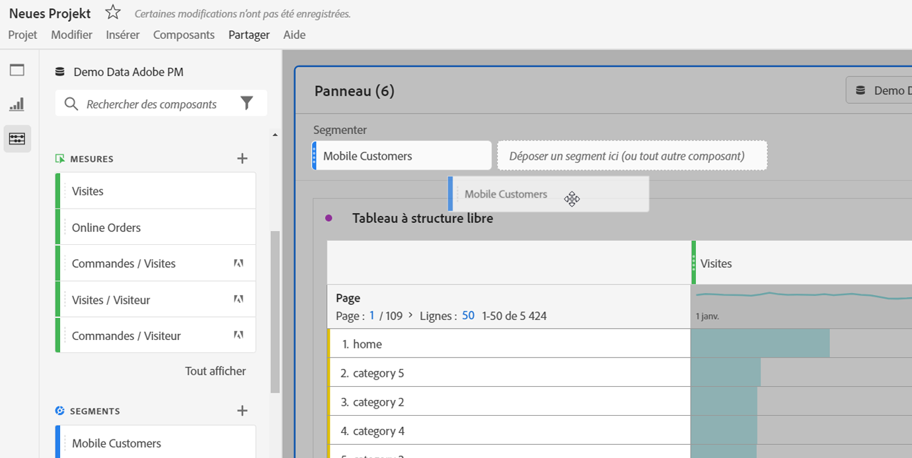
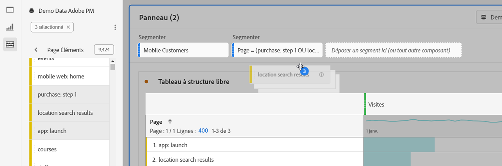
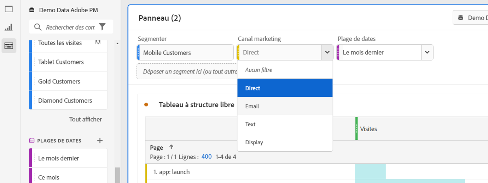
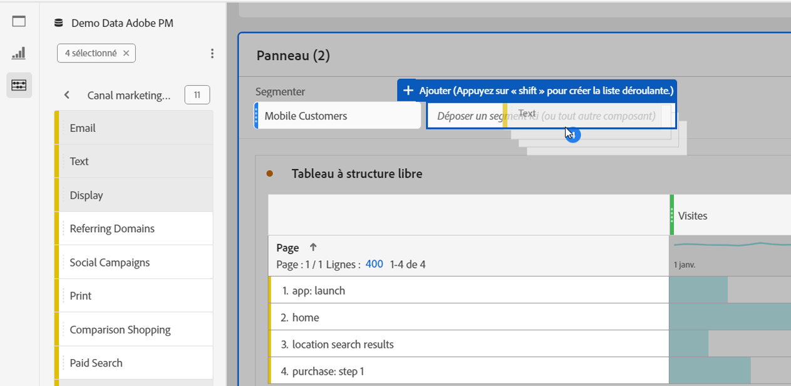
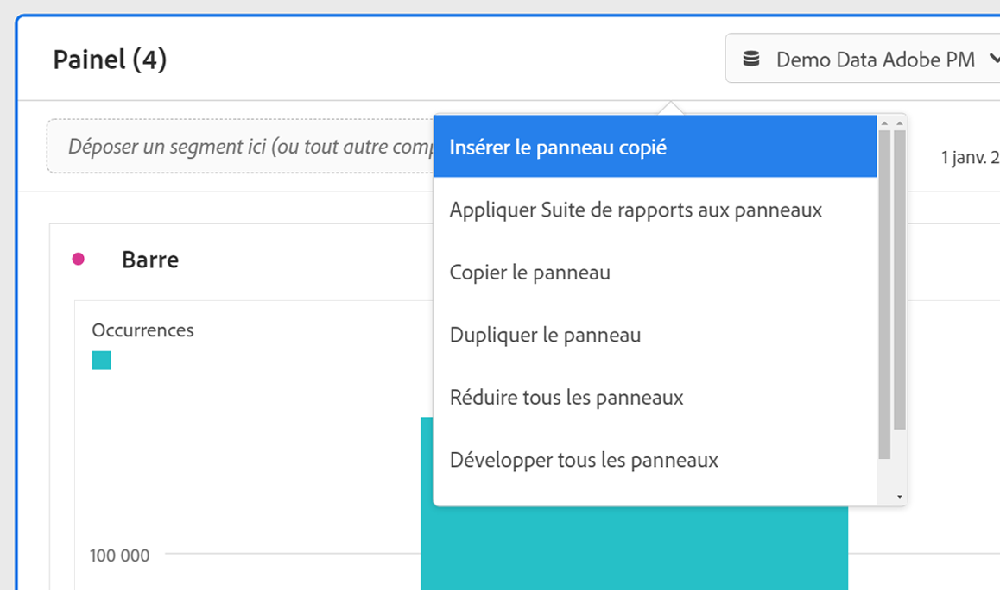

# Panneaux - Aperçu

Un [!UICONTROL panneau] est un ensemble de tableaux et de visualisations. Vous pouvez accéder aux panneaux à partir de l’icône située en haut à gauche dans Espace de travail ou à partir d’un [panneau vierge](/help/analysis-workspace/c-panels/blank-panel.md). Les panneaux sont utiles lorsque vous souhaitez organiser vos projets en fonction de périodes de temps, de vues de données ou de cas dʼutilisation dʼanalyse.

## Types de panneaux

Les types de panneau suivants sont disponibles dans Analysis Workspace pour [!UICONTROL Customer Journey Analytics] :

| Nom du panneau | Description |
| --- | --- |
| [Panneau vierge](/help/analysis-workspace/c-panels/blank-panel.md) | Faites votre choix parmi les panneaux et visualisations disponibles pour démarrer votre analyse. |
| [Panneau Quick Insights](quickinsight.md) | Construisez rapidement un tableau de forme libre et une visualisation d’accompagnement afin d’analyser et de découvrir des informations plus rapidement. |
| [Panneau d’attribution](attribution.md) | Comparez et visualisez rapidement de nombreux modèles d’attribution en utilisant n’importe quelle dimension ou mesure de conversion. |
| [Panneau à structure libre](freeform-panel.md) | Effectuez des comparaisons et des ventilations illimitées, puis ajoutez des visualisations pour raconter une histoire riche en données. |
| [Panneau des visionneuses simultanées de médias](media-concurrent-viewers.md) | Analysez les visionneuses au fil du temps, avec des informations sur la simultanéité la plus élevée, et sur la capacité à ventiler et à comparer. |
| [Panneau Temps de lecture de média](media-playback-timespent/media-playback-time-spent.md) | Analysez le temps de lecture passé pour déterminer où s’est produit le pic d’accès simultané ou où des abandons ont eu lieu. |

Les panneaux [!UICONTROL Quick Insights], [!UICONTROL Vierge] et [!UICONTROL À structure libre] constituent un excellent point de départ pour votre analyse. [!UICONTROL Attribution IQ] est réservé à des analyses plus poussées. Un bouton `"+"` est disponible dans les projets afin que vous puissiez ajouter des panneaux vierges à tout moment.

Le panneau de démarrage par défaut est le panneau [!UICONTROL à structure libre], mais vous pouvez également choisir d’utiliser le [panneau vierge](/help/analysis-workspace/c-panels/blank-panel.md) par défaut.

## Calendrier {#calendar}

Le calendrier du panneau contrôle la plage de compte-rendu des performances des tableaux et des visualisations dans un panneau.

Remarque : si un composant de période (violet) est utilisé dans un tableau, une visualisation ou une zone de dépôt de panneau, il remplace le calendrier du panneau.

Vous pouvez appliquer une période au niveau de la minute dans les paramètres avancés du calendrier du panneau. Si vous créez des rapports sur une période qui sʼétale sur plusieurs jours, lʼheure de début sʼapplique au premier jour et lʼheure de fin au dernier jour de celle-ci.

## Zone de dépôt {#dropzone}

La zone de dépôt des panneaux vous permet dʼappliquer des filtres et des filtres déroulants à tous les tableaux et visualisations dʼun panneau. Vous pouvez appliquer un ou plusieurs filtres à un panneau. Le titre au-dessus de chaque filtre peut être modifié en cliquant sur le crayon de modification. Vous pouvez également faire un clic droit pour le supprimer complètement.

### Filtres

Faites glisser et déposez un filtre du rail de gauche dans la zone de dépôt du panneau pour commencer à filtrer le panneau.

### Filtres ad hoc

Vous pouvez également faire glisser les composants qui ne sont pas des filtres directement vers la zone de dépôt pour créer des filtres ad hoc, ce qui vous permet de gagner du temps et vous évite de passer par le créateur de filtres. Les filtres ainsi créés sont automatiquement définis comme des filtres de niveau accès. Vous pouvez modifier cette définition en cliquant sur lʼicône dʼinformations (i) à côté du filtre, puis sur lʼicône de modification en forme de crayon, et la modifier dans le créateur de filtres.

Les filtres ad hoc sont locaux au projet et ne sʼafficheront pas dans le rail de gauche, à moins que vous ne les rendiez publics.

### Filtres de menu déroulant {#dropdown-filter}

Outre les filtres, les filtres déroulants vous permettent dʼinteragir avec les données de manière contrôlée. Par exemple, vous pouvez ajouter un filtre déroulant pour les types dʼéquipement mobile afin de filtrer le panneau par tablette, téléphone mobile ou bureau.

Les filtres de menu déroulant peuvent également servir à fusionner plusieurs projets. Par exemple, si vous avez plusieurs versions dʼun même projet avec des filtres Pays différents, vous pouvez les fusionner en un seul projet et ajouter un filtre déroulant Pays.

Pour créer des filtres de menu déroulant :

1. Pour créer un filtre de menu déroulant à l’aide des [!UICONTROL éléments de dimension], comme les valeurs dans la dimension [!UICONTROL canal marketing], cliquez sur l’icône de flèche vers la droite située à côté de votre dimension dans le rail de gauche. Cette opération expose tous les éléments disponibles. Sélectionnez un ou plusieurs éléments de composant dans le rail de gauche et déposez-les dans la zone de dépôt du panneau **tout en maintenant la touche Maj enfoncée**. Cela permet de transformer les composants en filtre déroulant plutôt quʼen filtre unique.
1. Pour créer un filtre déroulant à lʼaide dʼautres composants tels que les mesures, les filtres ou les périodes, sélectionnez un type de composant dans le rail de gauche et déposez-le dans la zone de dépôt du panneau **tout en maintenant la touche Maj enfoncée**.
1. Sélectionnez l’une des options de la liste déroulante pour modifier les données du panneau. Vous pouvez également choisir de ne pas filtrer les données du panneau en sélectionnant **[!UICONTROL Pas de filtre]**.

[Regardez la vidéo](https://experienceleague.adobe.com/docs/analytics-learn/tutorials/analysis-workspace/using-panels/using-panels-to-organize-your-analysis-workspace-projects.html?lang=fr) pour en savoir plus sur l’ajout de filtres de menu déroulant à votre projet.

## Menu contextuel {#right-click}

Pour accéder à d’autres fonctionnalités d’un panneau, faites un clic droit sur l’en-tête du panneau.

Les paramètres suivants sont disponibles :

| Paramètre | Description |
| --- | --- |
| [!UICONTROL Insérer la copie du panneau/de la visualisation] | Permet de coller (« insérer ») la copie d’un panneau ou d’une visualisation à un autre emplacement au sein du projet, ou dans un tout autre projet. |
| [!UICONTROL Copier le panneau] | Permet de faire un clic droit et de copier un panneau de sorte que vous puissiez l’insérer à un autre emplacement du projet, ou dans un tout autre projet. |
| [!UICONTROL Dupliquer le panneau] | Crée un double exact du panneau actuel, que vous pouvez ensuite modifier. |
| [!UICONTROL Réduire/Développer tous les panneaux] | Réduit et développe tous les panneaux du projet. |
| [!UICONTROL Réduire/Développer toutes les visualisations dans le panneau] | Réduit et développe toutes les visualisations du panneau actif. |
| [!UICONTROL Modifier la description] | Ajouter (ou modifier) une description textuelle du panneau. |
| [!UICONTROL Obtenir un lien vers le panneau] | Permet de renvoyer un utilisateur vers un panneau spécifique dans un projet. Lorsque l’utilisateur clique sur le lien, le destinataire doit se connecter avant d’être dirigé vers le panneau exact auquel il est lié. |
