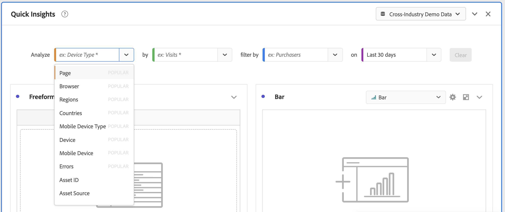

# Panneau d’aperçu rapide {#quick-insights-panel}

<!-- markdownlint-disable MD034 -->

>[!CONTEXTUALHELP]
>id="workspace_quickinsights_button"
>title="Aperçu rapide"
>abstract="Créez un panneau afin de créer rapidement un tableau à structure libre pour accompagner la visualisation afin d’analyser et d’exposer plus rapidement les informations."

<!-- markdownlint-enable MD034 -->

>[!BEGINSHADEBOX]

_Cet article présente le panneau Quick Insights dans_  _**Customer Journey Analytics**_. _Voir [Panneau Quick Insights](https://experienceleague.adobe.com/fr/docs/analytics/analyze/analysis-workspace/panels/quickinsight) pour la version_  _**Adobe Analytics** de cet article._

>[!ENDSHADEBOX]

[!UICONTROL Aperçu rapide] fournit des conseils aux non-analystes et aux nouveaux utilisateurs d’[!UICONTROL Analysis Workspace] pour savoir comment répondre rapidement et facilement à des besoins professionnels. Il s’agit également d’un outil idéal pour les utilisateurs expérimentés qui souhaitent une réponse rapide à une question simple sans avoir à créer eux-mêmes un tableau.

Lorsque vous commencez à utiliser [!UICONTROL Analysis Workspace], vous vous demandez peut-être :

* quelles visualisations sont les plus utiles,
* quelles dimensions et quelles mesures peuvent optimiser les informations,
* où glisser-déposer des éléments,
* où créer un filtre,
* etc.

Pour vous aider à répondre à ces questions, l’[!UICONTROL Aperçu rapide] utilise un algorithme qui vous présente les dimensions, les mesures, les filtres et les périodes les plus populaires utilisés par votre entreprise. Cet algorithme est basé sur l’utilisation des composants de données par votre propre entreprise dans [!UICONTROL Analysis Workspace]. Les dimensions, mesures et filtres marqués comme [!UICONTROL POPULAIRE] dans la liste déroulante sont indiqués ici :

[!UICONTROL Aperçu rapide] vous permet :

* de créer correctement un tableau de données et une visualisation correspondante dans [!UICONTROL Analysis Workspace] ;
* d’apprendre la terminologie et le vocabulaire des éléments et des composants de base d’[!UICONTROL Analysis Workspace] ;
* d’effectuer des répartitions simples de dimensions, d’ajouter plusieurs mesures ou de comparer facilement des filtres dans un [!UICONTROL tableau à structure libre].
* de modifier ou de tester divers types de visualisation pour trouver rapidement et intuitivement l’outil de recherche pour votre analyse.

## Terminologie clé de base

Voici quelques-uns des termes de base que vous devez connaître. Chaque tableau de données se compose d’au moins deux blocs de création (composants) que vous utilisez pour décrire vos données.

| Bloc de construction (composant) | Définition |
|---|---|
| **[!UICONTROL Dimension]** | Les dimensions sont des descriptions ou caractéristiques de données de mesure qui peuvent être affichées, ventilées et comparées dans un projet. Il s’agit de valeurs et de dates non numériques qui se ventilent en éléments de dimension. Par exemple, *navigateur* ou *page* sont des dimensions. |
| **[!UICONTROL Élément de dimension]** | Les éléments de dimension sont des valeurs individuelles d’une dimension. Par exemple, les éléments de dimension pour la dimension Navigateur seraient *Chrome*, *Firefox*, *Edge*, etc. |
| [!UICONTROL Mesure] | Les mesures sont des informations quantitatives sur l’activité des individus, telles que les affichages, les clics publicitaires, les actualisations, la durée moyenne de consultation, les unités, les commandes, le chiffre d’affaires, etc. |
| **[!UICONTROL Visualisation]** | Workspace offre [une variété de visualisations](/help/analysis-workspace/visualizations/freeform-analysis-visualizations.md) pour créer des représentations visuelles de vos données. Par exemple, des graphiques à barres, des graphiques en anneau, des histogrammes, des graphiques en courbes, des cartes, des nuages de points, etc. |
| **[!UICONTROL Répartition des dimensions]** | Une répartition de dimension est un moyen de répartir une dimension en fonction d’autres dimensions. Par exemple, vous pouvez répartir les États américains en fonction des périphériques mobiles pour obtenir le nombre de visites via des périphériques mobiles par État. Vous pouvez également répartir les périphériques mobiles par types de périphériques mobiles, par régions, par campagnes internes, etc. |
| **[!UICONTROL Filtrer]** | Les filtres vous permettent d’identifier des sous-ensembles d’individus selon des caractéristiques ou des interactions avec le site web. Par exemple, vous pouvez créer des filtres [!UICONTROL Personnes] basés sur des : <li>Attributs : type de navigateur, appareil, nombre de visites, pays, sexe.</li><li>Interactions : campagnes, recherche par mots-clés, moteur de recherche.</li><li>Sorties et entrées : personnes provenant de Facebook, d’une page de destination définie, d’un domaine référent.</li><li> Variables personnalisées : champ de formulaire, catégories définies, ID de client. |

## Utilisation

Pour utiliser un panneau **[!UICONTROL Aperçu rapide]** :

1. Créez un panneau **[!UICONTROL Aperçu rapide]**. Pour obtenir des instructions sur comment créer un panneau, consultez [Créer un panneau](panels.md#create-a-panel).

1. Lorsque vous utilisez pour la première fois un panneau **[!UICONTROL Aperçu rapide]**, vous pouvez suivre le court [!UICONTROL tutoriel d’introduction] qui vous apprend quelques principes de base. Sélectionnez  à côté du titre du panneau Aperçu rapide et sélectionnez **[!UICONTROL Tutoriel d’introduction]** dans la fenêtre contextuelle.

1. Spécifiez l’[entrée](#panel-input) du panneau.

1. Observez la [sortie](#panel-output) du panneau.

### Entrée du panneau

Sélectionnez vos blocs de création :

* **[!UICONTROL Analyser]** : spécifiez une dimension (orange)
* **[!UICONTROL Par]** : spécifiez une mesure (vert)
* **[!UICONTROL Filtrer par]** : spécifiez un filtre (bleu)
* **[!UICONTROL Sur]** : spécifiez une période (violet).

Pour que la visualisation fonctionne correctement, vous devez sélectionner au moins une dimension et une mesure.

Vous pouvez spécifier les blocs de création de trois manières :

* Glissez et déposez les composants à partir du panneau de gauche.
* Commencez à saisir du texte dans l’un des champs des blocs de création. Lorsque l’entrée est trouvée, le champ de bloc de création se remplit automatiquement avec les valeurs possibles.
* Spécifiez une liste déroulante de bloc de création (par exemple `Country` dans **[!UICONTROL Analyser]**) et recherchez la liste des valeurs possibles (à l’aide de ) pour la valeur que vous souhaitez utiliser (par exemple, **[!UICONTROL Code de pays]**).

Sélectionnez **[!UICONTROL Effacer]** pour effacer tous les champs de saisie.

### Sortie du panneau

1. Lorsque vous avez ajouté au moins une dimension et une mesure, vous pouvez voir les résultats.

   

   * Tableau à structure libre avec la dimension (code de pays) et la mesure (sessions), filtré par sessions web pour les 12 derniers mois.

   * Une visualisation correspondante, dans ce cas un [graphique à barres](/help/analysis-workspace/visualizations/bar.md). La visualisation qui est générée dépend du type de données que vous avez ajoutées au tableau. Toutes les données temporelles (telles que les [!UICONTROL Sessions] par jour/mois) sont présentées par défaut sous forme de graphique [!UICONTROL en courbes]. Toutes les données non temporelles (telles que les [!UICONTROL Sessions] par [!UICONTROL Appareil]) sont présentées sous forme de graphique [!UICONTROL à barres]. Vous pouvez modifier le type de visualisation en cliquant sur la flèche déroulante en regard du type de visualisation.

1. Essayez d’affiner un peu plus votre recherche comme décrit ci-dessous, sous [Plus de conseils](#more-tips).

1. Vous pouvez enregistrer votre projet à l’aide de **[!UICONTROL Projet > Enregistrer]**.

## Plus de conseils

D’autres astuces utiles s’affichent dans le [!UICONTROL Créateur d’Aperçu rapide], dont certaines dépendent de votre dernière action.

* Tout d’abord, vous pouvez consulter le tutoriel **[!UICONTROL Plus de conseils]**. Ce tutoriel s’affiche 24 heures après que vous avez créé un projet avec au moins une dimension et une mesure. Sélectionnez  à côté du titre du panneau Aperçu rapide et sélectionnez **[!UICONTROL Plus de conseils]** dans la fenêtre contextuelle.

  

* Vous pouvez analyser plusieurs dimensions et mesures, combiner ou comparer des filtres et spécifier une période :

  

   * Dimension **[!UICONTROL Analyser]** **[!UICONTROL Répartie par]** : vous pouvez utiliser jusqu’à 3 niveaux de répartition sur les dimensions pour analyser en détail les données afin d’obtenir les informations dont vous avez réellement besoin. Voir les sections ➊, ➋, et ➌.

   * Ajouter d’autres mesures **[!UICONTROL Par]** : vous pouvez ajouter jusqu’à 2 mesures supplémentaires. Voir les sections ➍ et ➎.

   * **[!UICONTROL Filtrer par]** : vous pouvez ajouter jusqu’à 2 filtres supplémentaires. Par exemple, ajoutez Réservations en tant que filtre et combinez ce filtre avec les filtres Personnes réservant fréquemment et Personnes voyageant pour la première fois, que vous comparez. Voir les sections ➏, ➐, et ➑.

   * Sur : vous pouvez spécifier la période. Voir la section ➒.

## Limites connues

Si vous essayez d’effectuer des modifications directement dans le tableau, le panneau [!UICONTROL Aperçu rapide] ne sera plus synchronisé. Sélectionnez **[!UICONTROL Resynchroniser le créateur]** en haut à droite du panneau pour restaurer les paramètres précédents de l’[!UICONTROL Aperçu rapide].

Vous recevez un avertissement avant d’effectuer un ajout directement dans le tableau :

Dans le cas contraire, si la création se fait directement, le tableau se comporte comme un tableau à structure libre traditionnel, sans les fonctionnalités utiles pour les nouveaux utilisateurs et les nouvelles utilisatrices.

>[!MORELIKETHIS]
>
>[Créer un panneau](/help/analysis-workspace/c-panels/panels.md#create-a-panel)
>