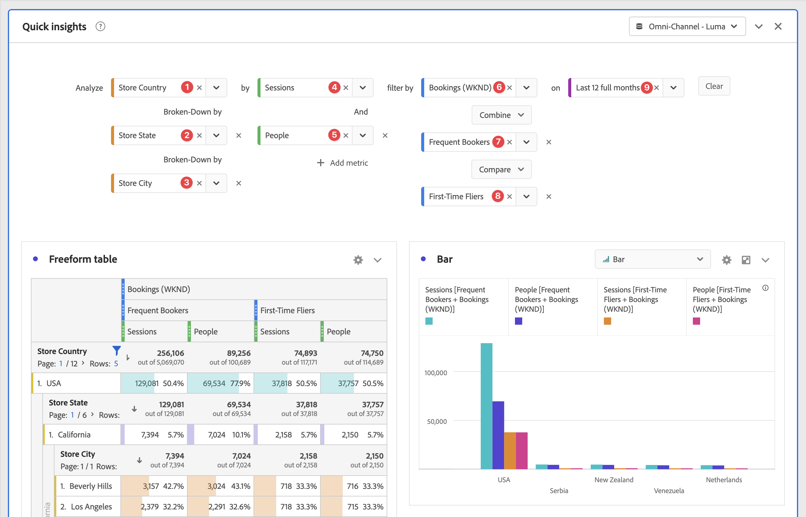

# Panneau Aperçu rapide {#quick-insights-panel}

<!-- markdownlint-disable MD034 -->

>[!CONTEXTUALHELP]
>id="cja_workspace_quickinsights_button"
>title="Aperçu rapide"
>abstract="Créez un panneau afin de créer rapidement un tableau à structure libre et la visualisation qui l’accompagne afin d’analyser et d’obtenir plus rapidement les informations."

<!-- markdownlint-enable MD034 -->

[!UICONTROL Aperçu rapide] fournit des conseils aux non-analystes et aux nouveaux utilisateurs d’[!UICONTROL Analysis Workspace] pour savoir comment répondre rapidement et facilement à des besoins professionnels. Il s’agit également d’un outil idéal pour les utilisateurs expérimentés qui souhaitent une réponse rapide à une question simple sans avoir à créer eux-mêmes un tableau.

Lorsque vous commencez à utiliser cet [!UICONTROL Analysis Workspace], vous pouvez vous demander :

* les visualisations les plus utiles,
* les dimensions et mesures susceptibles de faciliter les insights,
* où faire glisser des éléments,
* où créer un filtre,
* et plus encore.

Pour vous aider à répondre à ces questions, [!UICONTROL Quick insights] utilise un algorithme qui vous présente les dimensions, mesures, filtres et périodes les plus populaires utilisés par votre entreprise. Cet algorithme est basé sur l’utilisation des composants de données par votre propre entreprise dans [!UICONTROL Analysis Workspace]. En fait, vous voyez des dimensions, des mesures et des filtres balisés avec [!UICONTROL POPULAR] dans la liste déroulante, comme illustré ici :

[!UICONTROL Aperçu rapide] vous permet :

* de créer correctement un tableau de données et une visualisation correspondante dans [!UICONTROL Analysis Workspace] ;
* d’apprendre la terminologie et le vocabulaire des éléments et des composants de base d’[!UICONTROL Analysis Workspace] ;
* d’effectuer des répartitions simples de dimensions, d’ajouter plusieurs mesures ou de comparer facilement des filtres dans un [!UICONTROL tableau à structure libre].
* de modifier ou de tester divers types de visualisation pour trouver rapidement et intuitivement l’outil de recherche pour votre analyse.

## Terminologie clé de base

Vous trouverez ci-dessous quelques-uns des termes de base que vous devez connaître. Chaque tableau de données se compose de deux blocs de création (composants) ou plus que vous utilisez pour décrire vos données.

| Bloc de construction (composant) | Définition |
|---|---|
| **[!UICONTROL Dimension]** | Les dimensions sont des descriptions ou caractéristiques de données de mesure qui peuvent être affichées, ventilées et comparées dans un projet. Il s’agit de valeurs et de dates non numériques qui se ventilent en éléments de dimension. Par exemple, *browser* ou *page* est une dimension. |
| **[!UICONTROL Élément de dimension]** | Les éléments de dimension sont des valeurs individuelles d’une dimension. Par exemple, les éléments de dimension pour la dimension de navigateur seraient *Chrome*, *Firefox*, *Edge* ou d’autres éléments. |
| [!UICONTROL Mesure] | Les mesures sont des informations quantitatives sur l’activité des individus, telles que les affichages, les clics publicitaires, les actualisations, la durée moyenne de consultation, les unités, les commandes, le chiffre d’affaires, etc. |
| **[!UICONTROL Visualisation]** | Workspace propose [un certain nombre de visualisations](/help/analysis-workspace/visualizations/freeform-analysis-visualizations.md) pour créer des représentations visuelles de vos données. tels que les graphiques à barres, les graphiques en anneau, les histogrammes, les graphiques en courbes, les cartes, les tracés différés, etc. |
| **[!UICONTROL Répartition des dimensions]** | Une ventilation de dimension est un moyen de ventiler une dimension selon d’autres dimensions. Par exemple, vous pouvez ventiler les États américains en fonction des périphériques mobiles pour obtenir les visites des périphériques mobiles par état. Vous pouvez également ventiler les périphériques mobiles par types de périphériques mobiles, par régions, par campagnes internes, etc. |
| **[!UICONTROL Filtrer]** | Les filtres permettent d’identifier des sous-ensembles de personnes en fonction de caractéristiques ou d’interactions web. Par exemple, vous pouvez créer des filtres [!UICONTROL Personnes] basés sur <li>attributs : type de navigateur, appareil, nombre de visites, pays, sexe ou</li><li>interactions : campagnes, recherche de mots-clés, moteur de recherche ou</li><li>sorties et entrées : personnes provenant de Facebook, d’une landing page définie, d’un domaine référent ou</li><li> variables personnalisées : champ de formulaire, catégories définies, ID de client. |

## Sélectionnez l’option  

Pour utiliser un panneau **[!UICONTROL Quick insights]** :

1. Créez un panneau **[!UICONTROL Quick insights]** . Pour plus d’informations sur la création d’un panneau, voir [Création d’un panneau](panels.md#create-a-panel).

1. Lorsque vous utilisez pour la première fois un panneau **[!UICONTROL Quick insights]**, vous pouvez passer par le court [!UICONTROL tutoriel d’introduction] qui vous apprend quelques principes de base. Sélectionnez  en regard du titre du panneau Quick insights et sélectionnez **[!UICONTROL Intro tutorial]** dans la fenêtre contextuelle.

1. Spécifiez la [entrée](#panel-input) pour le panneau.

1. Observez la [sortie](#panel-output) pour le panneau.

### Entrée de panneau

Sélectionnez vos blocs de création :

* **[!UICONTROL Analyser]** - spécifiez une dimension (orange)
* **[!UICONTROL by]** - spécifiez une mesure (vert)
* **[!UICONTROL filter by]** - spécifiez un filtre (bleu)
* **[!UICONTROL on]** - spécifiez une plage de données (violet).

Pour que la visualisation fonctionne correctement, vous devez sélectionner au moins une dimension et une mesure.

Vous pouvez spécifier les blocs de création de trois manières :

* Faites glisser et déposez des composants à partir du panneau de gauche.
* Commencez à saisir dans l’un des champs de bloc de création. Lorsque l’entrée est trouvée, le champ de bloc de création est automatiquement renseigné avec les valeurs possibles.
* Spécifiez une liste déroulante de bloc de création (par exemple `Country` dans **[!UICONTROL Analyser]**) et recherchez la liste des valeurs possibles (à l’aide de ) pour la valeur que vous souhaitez utiliser (par exemple, **[!UICONTROL Code pays]**).

Sélectionnez **[!UICONTROL Effacer]** pour effacer tous les champs de saisie.

### Sortie de panneau

1. Lorsque vous avez ajouté au moins une dimension et une mesure, vous pouvez consulter les résultats.

   

   * Un tableau à structure libre avec la dimension (code pays) et la mesure (sessions), filtrés par sessions web pour les 12 derniers mois.

   * Une visualisation correspondante, dans ce cas un [graphique à barres](/help/analysis-workspace/visualizations/bar.md). La visualisation qui est générée dépend du type de données que vous avez ajoutées au tableau. Toutes les données temporelles (telles que [!UICONTROL Sessions] par jour/mois) sont présentées sous la forme d’un graphique [!UICONTROL Ligne]. Toutes les données non temporelles (telles que [!UICONTROL Sessions] par [!UICONTROL Appareil]) sont présentées sous la forme d’un graphique [!UICONTROL Barre]. Vous pouvez modifier le type de visualisation en cliquant sur la flèche déroulante en regard du type de visualisation.

1. Essayez d&#39;ajouter d&#39;autres améliorations comme décrit ci-dessous sous [Plus de conseils](#more-tips)

1. Vous pouvez enregistrer votre projet à l’aide de **[!UICONTROL Projet > Enregistrer]**.

## Plus de conseils

D’autres astuces utiles s’affichent dans le [!UICONTROL créateur de Quick Insights], dont certaines selon votre dernière action.

* Tout d&#39;abord, vous pouvez suivre le tutoriel **[!UICONTROL Plus de conseils]** . Ce tutoriel s’affiche 24 heures après la création d’un projet avec au moins une dimension et une mesure. Sélectionnez  en regard du titre du panneau Quick insights et sélectionnez **[!UICONTROL More Conseils]** dans la fenêtre contextuelle.

  

* Vous pouvez analyser plusieurs dimensions et mesures, combiner ou comparer des filtres et spécifier une plage de données :

  

   * **[!UICONTROL Analyser]** dimension **[!UICONTROL Ventilation par]** : vous pouvez utiliser jusqu’à 3 niveaux de ventilations sur les dimensions pour analyser en détail les données dont vous avez réellement besoin. Voir les sections, et .

   * Ajouter d’autres mesures **[!UICONTROL par]** : vous pouvez ajouter jusqu’à 2 mesures supplémentaires. Voir les questions relatives à la guerre froide et à la guerre froide.

   * **[!UICONTROL filter by]** : vous pouvez ajouter jusqu’à 2 filtres supplémentaires. Par exemple, ajoutez Bookings en tant que filtre et combinez ce filtre avec les filtres Fréquence des réservations et Première valeur par défaut que vous comparez. Voir ➏, ➐, et ➑.

   * sur : vous pouvez spécifier la plage de données. Voir ➒.

## Limites connues

Si vous essayez de modifier directement dans le tableau, le panneau [!UICONTROL Quick Insights] peut ne plus être synchronisé. Sélectionnez **[!UICONTROL Resynchroniser le créateur]** en haut à droite du panneau pour restaurer les paramètres précédents de [!UICONTROL  Quick Insights].

Vous recevez un avertissement avant d’ajouter un élément directement dans le tableau :

Dans le cas contraire, la création directe entraîne le comportement du tableau en tant que tableau à structure libre traditionnel, sans les fonctionnalités utiles pour les nouveaux utilisateurs.

>[!MORELIKETHIS]
>
>[Créer un panneau](/help/analysis-workspace/c-panels/panels.md#create-a-panel)
>