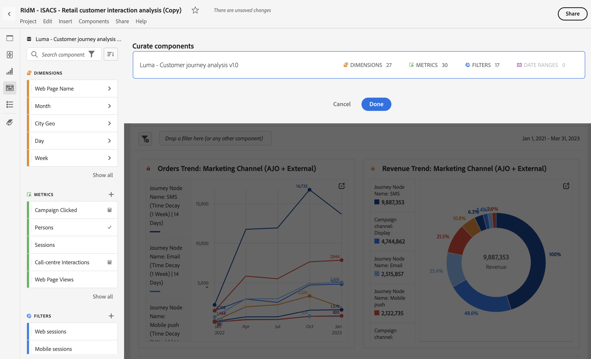

# Traitement des projets

Le traitement vous permet de limiter les composants (dimensions, mesures, segments, périodes) avant de partager un projet. Lorsqu’une personne destinataire ouvre le projet, elle voit un ensemble limité de composants que vous avez traités à sa place. Le traitement est une étape facultative mais recommandée avant de partager un projet.

>[!NOTE]
> Les profils de produit constituent le principal mécanisme contrôlant ce que voit un utilisateur. Ils sont gérés via [CX Enterprise Admin Console](https://experienceleague.adobe.com/fr/docs/core-services/interface/administration/admin-tool-experience-cloud). La curation est un segment secondaire.

## Appliquer le traitement du projet

1. Sélectionnez **[!UICONTROL Partager]** > **[!UICONTROL Traiter les données du projet]**.
Les composants utilisés dans le projet sont automatiquement ajoutés.
Si un projet comporte plusieurs vues de données, une cible de dépôt de traitement s’affiche pour chaque vue de données du projet.
1. (Facultatif) Pour ajouter d’autres composants, faites glisser ceux que vous souhaitez partager du panneau de gauche vers la zone de dépôt **[!UICONTROL Traiter les composants]** pour la vue de données.
1. Sélectionnez **[!UICONTROL Terminé]**.

<!--
Curation can also be applied from the [!UICONTROL Share] menu by selecting **[!UICONTROL Curate and Share]**. This option automatically curates the project to the components in use in the project. You can add additional components following the steps above.
-->

Lorsqu’une personne destinataire ouvre un projet traité, elle ne voit que l’ensemble de composants traités que vous avez définis :

## Suppression du traitement du projet

Pour supprimer la curation du projet et restaurer l’ensemble complet des composants dans le panneau de gauche, procédez comme suit :

1. Sélectionnez **[!UICONTROL Partager]** > **[!UICONTROL Traiter les données du projet]**.
1. Sélectionnez **[!UICONTROL Supprimer le traitement]**.
1. Sélectionnez **[!UICONTROL Terminé]**.

## Options de traitement des composants

Dans un projet traité, la personne destinataire a la possibilité de **[!UICONTROL Tout afficher]** dans le panneau de gauche. [!UICONTROL Tout afficher] révèle différents ensembles de composants, en fonction des éléments suivants :

* Niveau d’autorisation de l’utilisateur ou l’utilisatrice (faisant ou non partie de l’équipe d’administration)
* Rôle du projet (propriétaire/éditeur ou non)
* Type de curation appliquée (au niveau du projet)

| Type de traitement | Visible par l’administrateur | Visible par le propriétaire du projet non administrateur (ou disposant du rôle de modification) | Visible par le rôle de duplication non administrateur |
| --- | --- | --- | --- |
| **Composants *masqués* dans une vue de données** | Tous les composants de la vue de données sont disponibles pour la création de rapports (sélectionnez **[!UICONTROL Tout afficher]** pour afficher les composants masqués). | Non disponible pour la création de rapports | Non disponible pour la création de rapports |
| **Composants ajoutés ou supprimés d’une vue de données** | Seuls les composants ajoutés à la vue de données (masqués ou non). Les administrateurs et administratrices ne peuvent pas créer de rapports sur des champs ou des composants qui ne sont pas définis dans la vue de données. | Uniquement les composants ajoutés à la vue de données, ou ceux appartenant à l’utilisateur ou partagés avec lui. Les composants masqués ne sont pas disponibles (comme pour la curation des suites de rapports virtuelles). | Seuls les composants ajoutés à la vue de données ne sont pas masqués et sont inclus dans la curation du projet. |
| **Composants traités dans un projet** | Tous les composants de la vue de données qui sont disponibles pour la création de rapports (sélectionnez **[!UICONTROL Tout afficher]** pour afficher les composants masqués). | Tous les composants non masqués de la vue de données (pour les afficher, cliquez sur « Tout afficher »). | Seuls les composants traités, plus tous les composants appartenant à lʼutilisateur ou partagés avec lui. |
| **Projet traité utilisant une vue de données avec des composants masqués** | Tous les composants de données qui sont disponibles pour la création de rapports (sélectionnez **[!UICONTROL Tout afficher]** pour afficher les composants masqués et non traités). | Tous les composants non traités du projet, tous les composants non masqués de la vue de données et tous les composants appartenant à lʼutilisateur ou partagés avec lui. | Seuls les composants traités, plus tous les composants appartenant à lʼutilisateur ou partagés avec lui. |
