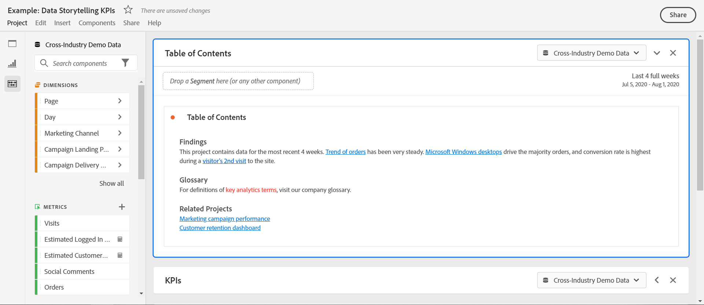

# Création de liens partageables

analysis workspace offre de nombreuses méthodes pour partager un projet avec vos utilisateurs, notamment la possibilité d’obtenir un lien vers un projet ou une partie spécifique d’un projet. Les utilisateurs qui reçoivent un lien doivent se connecter à Adobe Analytics avant d’accéder au projet.

## Obtenir le lien du projet {#project-link}

Pour partager un lien vers le projet complet, accédez à **[!UICONTROL Partager > Obtenir le lien du projet]**. Si le destinataire du lien n&#39;a pas reçu de [rôle du projet](https://docs.adobe.com/content/help/fr-FR/analytics/analyze/analysis-workspace/curate-share/share-projects.html), les administrateurs reçoivent **[!UICONTROL Peut modifier]** et que les non-administrateurs reçoivent **[!UICONTROL Peut duplicata]** expériences.

## Obtenir le panneau ou le lien de visualisation {#panel-link}

Vous pouvez également partager un lien vers une partie spécifique d’un projet, telle qu’un panneau ou une visualisation individuelle. On parle parfois de liaison interne. Cela peut s’avérer utile pour attirer l’attention de vos utilisateurs sur les informations clés du projet.

* Dans n’importe quel en-tête de panneau, cliquez avec le bouton droit de la souris **[!UICONTROL Obtenir le lien du panneau]**
* Dans n’importe quel tableau ou en-tête de visualisation, cliquez avec le bouton droit de la souris **[!UICONTROL Obtenir le lien de visualisation]**

[Regarder la vidéo](https://www.youtube.com/watch?v=lvmAdKNfWQw) comment créer des liens et les utiliser pour diriger des destinataires vers des parties spécifiques de votre projet.

## Utilisation de liens dans une table des matières {#TOC}

Pour tirer parti des différentes options de lien, il est conseillé d’inclure toujours une table des matières en haut de votre projet Workspace. Dans la table des matières, vous pouvez créer des liens vers d’autres projets pertinents, des panneaux spécifiques et des visualisations spécifiques. Cela permet au destinataire du projet de naviguer plus facilement.

[Regarder la vidéo](https://www.youtube.com/watch?v=Xo6fTguWm-M) sur la création d’une table des matières à l’aide de liens et de l’éditeur de texte enrichi de Workspace.

