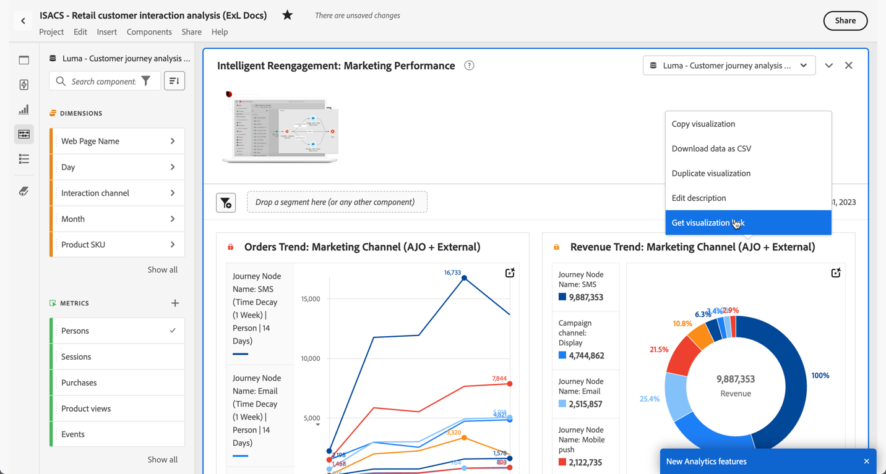

# Création de liens partageables

Analysis Workspace offre de nombreuses méthodes pour partager un projet avec les utilisateurs, notamment la possibilité d’obtenir un lien vers un projet ou une partie spécifique d’un projet. Certains types de liens requièrent que le destinataire se connecte à Customer Journey Analytics avant d’accéder au projet, d’autres non.

## Obtenir un lien de projet à partager avec d’autres utilisateurs et utilisatrices de Workspace {#project-link}

Pour partager un lien vers un projet, accédez au projet à partager, puis sélectionnez **[!UICONTROL Partager]** > **[!UICONTROL Obtenir le lien du projet]** (ou **[!UICONTROL Partager]** > **[!UICONTROL Partager avec les utilisateurs Workspace]** > **[!UICONTROL Partager par lien]**). Les utilisateurs et utilisatrices avec qui vous partagez le lien doivent se connecter.

Si le destinataire du lien n’a pas reçu de [rôle de projet](/help/analysis-workspace/curate-share/share-projects.md), les administrateurs reçoivent les expériences **[!UICONTROL Modifier l’original]** et les non-administrateurs reçoivent **[!UICONTROL Modifier la copie]**.

## Obtenir un lien en lecture seule à partager avec n’importe qui

Vous pouvez partager un lien en lecture seule vers les projets Analysis Workspace avec des personnes qui n’ont pas accès à Customer Journey Analytics.

Pour plus d’informations, voir [Partager avec tout le monde](/help/analysis-workspace/curate-share/share-projects.md#share-a-project-with-anyone-no-login-required).

## Obtenir un lien vers un panneau ou une visualisation {#panel-link}

Vous pouvez également partager un lien vers une partie spécifique d’un projet, telle qu’un panneau ou une visualisation individuelle. On parle parfois d’intra-liens. Cela peut s’avérer utile pour attirer l’attention de vos utilisateurs et utilisatrices sur les points clés du projet.

* Dans le menu contextuel d’un en-tête de panneau, sélectionnez **[!UICONTROL Obtenir le lien du panneau]**
* Dans le menu contextuel d’un en-tête de visualisation, sélectionnez **[!UICONTROL Obtenir le lien de la visualisation]**

>[!BEGINSHADEBOX]

Voir  [Lien à l’intérieur ou à l’extérieur de votre projet](https://experienceleague.adobe.com/docs/analytics-learn/tutorials/analysis-workspace/visualizations/intra-linking-in-analysis-workspace.html?lang=fr){target="_blank"} pour une vidéo de démonstration.

>[!ENDSHADEBOX]

## Utilisation de liens dans une table des matières {#TOC}

Une astuce pour tirer parti des différentes options de lien consiste à toujours inclure une [table des matières](/help/analysis-workspace/build-workspace-project/project-table-of-contents.md) en haut de votre projet Workspace. Dans la table des matières, vous pouvez créer des liens vers d’autres projets pertinents, des panneaux et des visualisations spécifiques. Cela facilite la navigation pour le destinataire du projet.

