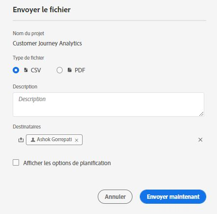
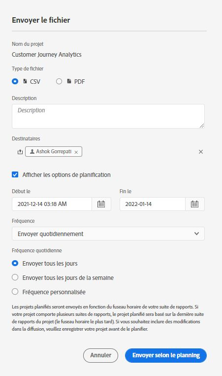

# Planification de projets

>[!NOTE]
>
>Vous consultez la documentation d’Analysis Workspace pour Customer Journey Analytics. L’ensemble de ses fonctionnalités diffère légèrement de celui d’[Analysis Workspace dans la version Adobe Analytics traditionnelle](https://docs.adobe.com/content/help/fr-FR/analytics/analyze/analysis-workspace/home.html). [En savoir plus...](/help/getting-started/cja-aa.md)

Dans le **menu Partager** de Workspace, vous pouvez envoyer des projets Analysis Workspace par courrier électronique aux destinataires sélectionnés. Les fichiers peuvent être envoyés au format CSV ou PDF.

## Envoyer le fichier maintenant

Pour envoyer un fichier immédiatement aux destinataires par courrier électronique :

1. Cliquez sur **Partager > Envoyer le fichier maintenant**.
1. Spécifiez le type de fichier (CSV ou PDF).
1. (Facultatif) Ajoutez une description qui sera incluse dans le courrier électronique pour décrire le fichier reçu.
1. Ajoutez des destinataires ou des groupes. Vous pouvez également saisir les adresses électroniques.
1. Cliquez sur **Envoyer maintenant**.
1. (Facultatif) Cliquez sur **Afficher les options de planification** pour planifier une livraison.

## Envoyer le fichier selon le calendrier

Pour envoyer un fichier selon un calendrier récurrent aux destinataires par courrier électronique :

1. Cliquez sur **Partager > Envoyer le fichier selon le calendrier**.
1. Spécifiez le type de fichier (CSV ou PDF).
1. (Facultatif) Ajoutez une description qui sera incluse dans le courrier électronique pour décrire le fichier reçu.
1. Ajoutez des destinataires ou des groupes. Vous pouvez également saisir les adresses électroniques.
1. Précisez la période pendant laquelle la livraison doit être effectuée en modifiant les entrées Début le et Fin le. La date de fin doit se situer dans un délai d’un an à compter du jour de la création ou de la modification de la planification.
1. Spécifiez la fréquence de livraison. Chaque fréquence offre différentes personnalisations.
1. Cliquez sur **Envoyer selon le calendrier**.

## Gestionnaire de projets planifiés

Les projets Analysis Workspace planifiés peuvent être gérés sous **Analytics > Composants > Projets planifiés**.

Dans le Gestionnaire de projets planifiés, vous pouvez modifier et supprimer les calendriers de projets récurrents. Utilisez la barre de recherche ou les options de filtre dans le rail de gauche pour rechercher un calendrier. Vous pouvez filtrer par balise, calendriers approuvés, propriétaires, etc.

Actions courantes du Gestionnaire de projets planifiés :

| Action | Description |
|---|---|
| **Modifier le planning** | Cliquez sur le titre du planning pour mettre à jour les paramètres de livraison. |
| **Supprimer le planning** | Sélectionnez le projet planifié dans la liste, puis cliquez sur Supprimer dans le menu. Cela supprime le planning sélectionné pour le projet ; le projet lui-même n’est pas supprimé. |
| **Ajout de balises** | Sélectionnez le projet planifié dans la liste, puis « Balise » ou « Approuver » pour organiser vos plannings et faciliter les recherches. |
| **Afficher les plannings échoués** | Accédez au rail de gauche > Autres filtres > Échec pour afficher les plannings qui ont échoué. |
| **Afficher les plannings expirés** | Accédez au rail de gauche > Autres filtres > Expiré pour afficher les plannings qui ont expiré. Cliquez sur le titre du planning pour planifier une nouvelle livraison. |
| **Afficher l’ID de planning** | Accédez aux options relatives aux colonnes dans le coin supérieur droit et ajoutez la colonne ID de planning dans le tableau. L’ID planifié est souvent utile pour le débogage. |

Le Gestionnaire de planification des projets affiche les éléments créés par un utilisateur spécifique. Si le compte d’utilisateur est désactivé dans l’application, toutes les livraisons planifiées sont interrompues.
