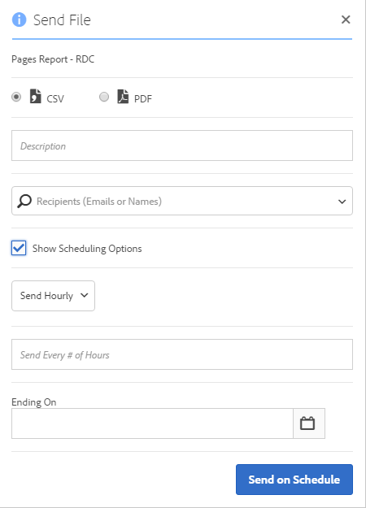

# Envoi d’un fichier – Planification de la livraison d’un projet

>[!NOTE] Vous consultez la documentation de l’Analysis Workspace à Customer Journey Analytics. Son ensemble de fonctionnalités diffère légèrement de celui des [Analysis Workspace dans le Analytics](https://docs.adobe.com/content/help/fr-FR/analytics/analyze/analysis-workspace/home.html)traditionnel de Adobe. [En savoir plus...](/help/getting-started/cja-aa.md)

Envoyez un projet Analysis Workspace par courrier électronique ou planifiez une livraison.

1. [Créez un projet Analysis Workspace](https://docs.adobe.com/content/help/en/analytics/analyze/analysis-workspace/build-workspace-project/t-freeform-project.html) et enregistrez-le.
1. Cliquez sur **[!UICONTROL Partager]** > **[!UICONTROL Envoyer le fichier selon le calendrier]**.

   

1. Sur la page [!UICONTROL Envoyer le fichier], sélectionnez le format de fichier (CSV ou PDF).

   

1. Ajoutez des adresses électroniques de destinataires ou leur nom et cliquez sur **[!UICONTROL Envoyer maintenant]**.
1. (Facultatif) Cliquez sur **[!UICONTROL Afficher les options de planification]** pour planifier une livraison et cliquez sur **[!UICONTROL Envoyer selon le calendrier]**.
1. Gérez les projets planifiés dans **[!UICONTROL Composants]** > [Projets planifiés](/help/analysis-workspace/curate-share/schedule-projects.md).
