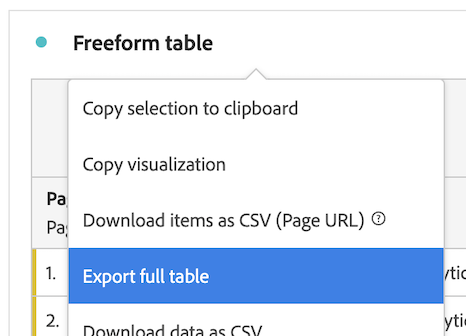

# Exporter des tableaux complets dans le cloud {#full-table-export}

<!-- markdownlint-disable MD034 -->

>[!CONTEXTUALHELP]
>id="cja-upgrade-full-table-export"
>title="Créer des exports de tableaux complets pour obtenir des fonctionnalités similaires à celles de Data Warehouse"
>abstract="Les export de tableaux complets sont disponibles dès que vous voyez des données dans Analysis Workspace. Vous pouvez créer ou planifier des exportations de tables complètes selon vos besoins.  Vous pouvez créer des exportations de tables complètes en quelques minutes seulement si vous savez déjà quelles données inclure dans l&#39;exportation."

<!-- markdownlint-enable MD034 -->

Dans Customer Journey Analytics, vous pouvez exporter des tables complètes d’Analysis Workspace vers des destinations cloud désignées.

D’autres méthodes d’export de rapports Customer Journey Analytics sont également disponibles, comme décrit dans la section [Vue d’ensemble de l’export](/help/analysis-workspace/export/export-project-overview.md).

## Comprendre les exports de tableaux complets

Vous pouvez exporter des tableaux complets d’Analysis Workspace vers des fournisseurs de services cloud tels que Google, Azure, Amazon et Adobe.

[Les avantages de l’exportation complète des tableaux](#advantages-of-full-table-export) incluent la possibilité d’exporter des millions de lignes, d’inclure des mesures calculées, de structurer la sortie des données en valeurs concaténées, etc.

Lorsque vous exportez des tableaux complets, tenez compte des points suivants :

* Avant d’exporter des données vers le cloud, assurez-vous que vos tables, votre environnement et vos autorisations répondent aux [ exigences minimales d’exportation ](#minimum-requirements).

* Certains [fonctionnalités](#unsupported-features) et certains [composants](#unsupported-components) ne sont pas pris en charge lors de l’export de tableaux complets vers le cloud.

Procédez comme suit lors de l’export de tableaux complets vers le cloud :

1. [Configurer un compte cloud](/help/components/exports/cloud-export-accounts.md)

1. [Configurer un emplacement sur le compte](/help/components/exports/cloud-export-locations.md)

1. [Exporter un tableau complet depuis Workspace](#export-full-tables)

1. Accédez aux données dans le cloud dans votre compte cloud et [Gérer les exportations dans Adobe](/help/components/exports/manage-exports.md)

## Exporter des tableaux complets  {#export-from-workspace}

<!-- markdownlint-disable MD034 -->

>[!CONTEXTUALHELP]
>id="cja-export-details"
>title="Détails"
>abstract="Spécifiez le nom de l’export. Vous pouvez également ajouter une description et des balises. Ces informations permettent d’identifier l’export dans le tableau des exports et dans les notifications par e-mail."

<!-- markdownlint-enable MD034 -->

<!-- markdownlint-disable MD034 -->

>[!CONTEXTUALHELP]
>id="cja-export-data-structure"
>title="Structure des données"
>abstract="Ceci est le tableau à structure libre que vous exportez. Vous pouvez modifier la structure des données en faisant glisser des composants du panneau de gauche vers le tableau. Vous pouvez appliquer un filtre en faisant glisser un composant dans la zone de filtre. Le tableau se met à jour dynamiquement lorsque vous ajoutez des composants à la zone de travail."

<!-- markdownlint-enable MD034 -->

<!-- markdownlint-disable MD034 -->

>[!CONTEXTUALHELP]
>id="export-manifest"
>title="Inclure le fichier manifeste"
>abstract="Lorsque cette option est sélectionnée, un fichier manifeste est inclus dans toute diffusion d’export réussie. Le fichier de manifeste vous permet de confirmer que tous les fichiers ont bien été diffusés."

<!-- markdownlint-enable MD034 -->

<!-- markdownlint-disable MD034 -->

>[!CONTEXTUALHELP]
>id="cja-export-schedule"
>title="Planifier"
>abstract="Sélectionnez la fréquence à laquelle l’export doit avoir lieu. Sélectionnez Envoyer maintenant (une seule fois) pour lancer l’export immédiatement. Les exports planifiés sont lancés à la date et à l’heure que vous spécifiez."

<!-- markdownlint-enable MD034 -->

<!-- markdownlint-disable MD034 -->

>[!CONTEXTUALHELP]
>id="cja-export-destination"
>title="Destination"
>abstract="Sélectionnez le compte cloud et l’emplacement où vous souhaitez que les données soient envoyées. Vous pouvez choisir un compte et un emplacement existants ou sélectionner « Ajouter » pour les créer. Spécifiez les utilisateurs, les utilisatrices et les groupes à avertir en cas d’échec ou d’expiration des exports."

<!-- markdownlint-enable MD034 -->

<!-- markdownlint-disable MD034 -->

>[!CONTEXTUALHELP]
>id="cja-export-file-format"
>title="Format du fichier"
>abstract="Lors du choix du format de fichier parquet, certains caractères spéciaux inclus dans les noms des composants sont remplacés par un trait de soulignement (_). Consultez le lien ci-dessous pour obtenir la liste complète des caractères remplacés."

<!-- markdownlint-enable MD034 -->

<!-- markdownlint-disable MD034 -->

>[!CONTEXTUALHELP]
>id="cja-export-notifications"
>title="Notifications"
>abstract="Ajoutez les utilisateurs et les groupes qui doivent recevoir des notifications lorsque cette exportation échoue ou arrive à expiration."

<!-- markdownlint-enable MD034 -->

>[!NOTE]
>
>Avant d’exporter des données comme décrit dans cette section, pour en savoir plus sur l’export de tableaux complets, consultez la section [Comprendre l’export de tableaux complets](#understand-full-table-export) ci-dessus.

Pour exporter des tableaux complets à partir d’Analysis Workspace, procédez comme suit :

1. Si ce n’est pas déjà fait, configurez un compte et un emplacement d’exportation, comme décrit dans [Configurer des comptes d’exportation dans le cloud](/help/components/exports/cloud-export-accounts.md) et [Configurer des emplacements d’exportation](/help/components/exports/cloud-export-locations.md).

1. Dans Analysis Workspace, cliquez avec le bouton droit de la souris sur l’en-tête d’un tableau à structure libre pour afficher le menu contextuel, puis sélectionnez [!UICONTROL **Exporter le tableau complet**].

   

1. Dans la boîte de dialogue [!UICONTROL **Nouvel export de tableau complet**], spécifiez les informations suivantes :

   | Nom du champ | Fonction |
   |---------|----------|
   | Nom | Spécifiez le nom de l’export. Ce nom s’affiche dans la liste des exports. |
   | Balises | Vous pouvez appliquer une balise existante à l’export ou créer une balise et l’appliquer. 
Pour appliquer une balise existante à l’export, sélectionnez une balise dans le menu déroulant. Toutes les balises de votre entreprise peuvent être appliquées.
 
Pour créer une balise, saisissez son nom, puis appuyez sur Entrée.

Tenez compte des points suivants lors de l’application de balises à un export : <ul><li>Les balises que vous appliquez peuvent être filtrées ou recherchées dans le tableau des exports.</li> <li>Les balises appliquées à un projet ne sont pas automatiquement appliquées lors de l’export d’un tableau complet, comme décrit dans la section « Configurer les colonnes sur la page des exports » de la section [Gérer les exports](/help/components/exports/manage-exports.md). (Lorsque vous [planifiez un projet complet pour l’exportation](/help/analysis-workspace/export/t-schedule-report.md), toutes les balises appliquées au projet sont automatiquement appliquées à l’exportation.) </li></ul> |
   | Description | Ajoutez une description à l’export. Vous pouvez choisir d’afficher les descriptions sous forme d’une colonne dans la [page Exports](/help/components/exports/manage-exports.md) lors de l’affichage des exports. |
   | Vue de données | Sélectionnez la vue de données qui contient les composants que vous souhaitez inclure dans l’export. Le menu déroulant  Vue des données se trouve dans le coin supérieur gauche de la boîte de dialogue.  
**Remarque :** si vous sélectionnez une vue de données à laquelle il manque des composants déjà inclus dans votre tableau de données, vous êtes invité à effacer et à recréer le panneau à l’aide des composants inclus dans la vue de données sélectionnée. 
 |
   | Structure des données | Affiche le tableau à structure libre que vous exportez. Vous pouvez modifier la structure des données en faisant glisser des composants du panneau de gauche vers le tableau. Vous pouvez appliquer un filtre en faisant glisser un composant dans la zone de filtre. Le tableau est mis à jour de manière dynamique au fur et à mesure que vous ajoutez des composants à la zone de travail. Vous pouvez inclure jusqu’à 10 colonnes.
Tous les segments qui ont été appliqués au tableau complet dans le projet apparaissent au-dessus du tableau. Vous pouvez appliquer un segment ou un groupe de segments à une exportation.
 |
   | Fenêtre de rapport | Sélectionnez la période de création de rapports à inclure dans chaque fichier d’export. Les options incluent [!UICONTROL **Aujourd’hui**], **[!UICONTROL Hier]**, **[!UICONTROL Les 7 derniers jours]**, **[!UICONTROL Les 30 derniers jours]**, **[!UICONTROL Cette semaine]** et **[!UICONTROL Ce mois-ci]**. 
Cette option ne s’affiche pas lorsque la variable **[!UICONTROL Fréquence d’export]** est définie sur **[!UICONTROL Envoyer maintenant (une seule fois)]**.
 |
   | Tout effacer | Efface le contenu du tableau de données. Vous pouvez ainsi commencer à créer un tableau directement dans la boîte de dialogue d’export du nouveau tableau complet. |
   | Format du fichier | Choisissez si les données exportées doivent être au format .csv, .json ou .parquet. 
Lors du choix du format de fichier parquet, les caractères suivants inclus dans les noms des composants sont remplacés par un trait de soulignement (_) : <ul><li>&#39; &#39; - Espace ASCII</li><li>&#39;,&#39; - virgule ASCII</li><li>&#39;;&#39; - deux-points ASCII</li><li>&#39;{&#39; ou &#39;}&#39; - Accolade ouverte/fermée ASCII</li><li>&#39;(&#39; ou &#39;)&#39; - parenthèse ouverte/fermée ASCII</li><li>&#39;\n&#39; - nouvelle ligne ASCII</li><li>&#39;\t&#39; - Onglet ASCII</li><li>&#39;=&#39; - ASCII est égal à</li></ul>
 |
   | Inclure le fichier manifeste | Lorsqu’il est activé, un fichier manifeste est inclus dans toute diffusion d’exportation réussie. 
Le fichier manifeste vous permet de confirmer que tous les fichiers ont bien été diffusés. Il comprend les informations suivantes :
 <ul><li>Liste de tous les fichiers diffusés</li><li>Somme de contrôle MD5 de chaque fichier</li></ul>
Les données exportées sont disponibles sous la forme d’un fichier compressé dans la destination cloud que vous avez configurée, comme décrit dans [Configuration des comptes d’export cloud](/help/components/exports/cloud-export-accounts.md) et [Configuration des emplacements d’export cloud](/help/components/exports/cloud-export-locations.md).

Le nom du fichier compressé est le suivant, selon que vous avez choisi le format de fichier **[!UICONTROL csv]**, **[!UICONTROL json]** ou **[!UICONTROL parquet]** :
<ul> <li>`cja-export-{reportInstanceId}-{idx}.csv.gz`</li><li>`cja-export-{reportInstanceId}-{idx}.json.gz`</li><li>`cja-export-<instanceId>-<idx>.snappy.parquet`
Chaque colonne du fichier parquet est compressée.
</li></ul>
Sélectionnez le format de fichier dans le champ **[!UICONTROL Format de fichier]** ci-dessus.
 |
   | Fréquence | Définissez la planification de la fréquence d’export. 
Vous pouvez choisir [!UICONTROL **Envoyer maintenant (une seule fois)**] pour envoyer l’export une seule fois. Lorsque vous sélectionnez cette option, l’export est lancé immédiatement.

Vous pouvez également choisir d’envoyer l’export selon un planning défini. Lors d’un envoi selon un planning, les options comprennent **[!UICONTROL Quotidien]**, **[!UICONTROL Hebdomadaire]**, **[!UICONTROL Mensuel par jour de la semaine]**, **[!UICONTROL Mensuel par jour du mois]**, **[!UICONTROL Annuel par jour du mois]** et **[!UICONTROL Annuel par date spécifique]**. 
 
Lors de la sélection d’une fréquence d’export, tenez compte des points suivants :
<ul><li>Les options du champ **[!UICONTROL Intervalle de recherche en amont]** changent en fonction de ce que vous sélectionnez ici.</li><li>D’autres champs de configuration s’affichent en fonction de l’option choisie.</li></ul> |
   | Début le | Jour et heure auxquels l’export planifié doit commencer. 
Cette option n’est disponible que lors du choix d’une fréquence d’export planifié.
 |
   | Se termine le | Jour et heure d’expiration de l’export planifié. L’export planifié ne s’exécute plus après la date et l’heure que vous avez définies. 
Cette option n’est disponible que lors du choix d’une fréquence d’export planifié.
 |
   | Afficher les destinations pour tous les utilisateurs | Les administrateurs système peuvent sélectionner cette option pour afficher tous les comptes et emplacements, quelle que soit la personne qui les a créés. |
   | Compte | Sélectionnez le compte d’export dans le cloud où vous souhaitez que les données soient envoyées. 
Si vous n’avez pas encore configuré de compte cloud à utiliser, vous pouvez également configurer un nouveau compte :<ol><li>Dans le menu déroulant **[!UICONTROL Compte]**, sélectionnez **[!UICONTROL Ajouter un compte]** puis spécifiez les informations suivantes :<ul><li>**[!UICONTROL Nom du compte d’emplacement]** : spécifiez un nom pour le compte d’emplacement. Ce nom apparaît lors de la création d’un emplacement. </li><li>**[!UICONTROL Description de compte d’emplacement]** : fournissez une brève description du compte pour le différencier des autres comptes du même type de compte.</li><li>**Rendre le compte disponible pour tous les utilisateurs de votre organisation** : sélectionnez cette option si vous souhaitez autoriser d’autres utilisateurs de votre organisation à utiliser le compte.</li><li>**[!UICONTROL Type de compte]** : sélectionnez le type de compte cloud vers lequel vous exportez. Les types de compte disponibles sont Amazon S3 Role ARN, Google Cloud Platform, Azure SAS, Azure RBAC, Snowflake et Zone de destination des données AEP.</li></ul><li>Pour terminer la configuration de votre compte, sélectionnez le lien ci-dessous, correspondant au **[!UICONTROL type de compte]** sélectionné :<ul><li>[Zone de destination des données AEP](/help/components/exports/cloud-export-accounts.md#aep-data-landing-zone)</li><li>[Amazon S3 Role ARN](/help/components/exports/cloud-export-accounts.md#amazon-s3-role-arn)</li><li>[Google Cloud Platform](/help/components/exports/cloud-export-accounts.md#google-cloud-platform)</li><li>[Azure SAS](/help/components/exports/cloud-export-accounts.md#azure-sas)</li><li>[RBAC Azure](/help/components/exports/cloud-export-accounts.md#azure-rbac)</li><li>[Snowflake](/help/components/exports/cloud-export-accounts.md#snowflake)</li></ul></ol> |
   | Emplacement | Sélectionnez l’emplacement sur le compte où vous souhaitez que les données d’export soient envoyées.
Si vous n’avez pas encore configuré de compte cloud à utiliser, vous pouvez également configurer un nouveau compte :<ol><li>Dans le menu déroulant **[!UICONTROL Emplacement]**, sélectionnez **[!UICONTROL Ajouter un emplacement]** puis spécifiez les informations suivantes :<ul><li>**[!UICONTROL Nom]** : nom de l’emplacement.</li><li>**[!UICONTROL Description]** : fournissez une brève description de l’emplacement pour le différencier des autres emplacements sur le compte compte.</li><li>**Rendre l’emplacement disponible pour tous les utilisateurs de votre organisation** : sélectionnez cette option si vous souhaitez autoriser d’autres utilisateurs de votre organisation à utiliser l’emplacement.</li><li>**[!UICONTROL Compte d’emplacement]** : sélectionnez le compte sur lequel vous souhaitez créer l’emplacement.</li></ul><li>Pour terminer la configuration de votre emplacement, sélectionnez le lien ci-dessous, qui correspond au type de compte que vous avez sélectionné dans le champ **[!UICONTROL Compte d’emplacement]** :<ul><li>[Zone de destination des données AEP](/help/components/exports/cloud-export-locations.md#aep-data-landing-zone)</li><li>[Amazon S3 Role ARN](/help/components/exports/cloud-export-locations.md#amazon-s3-role-arn)</li><li>[Google Cloud Platform](/help/components/exports/cloud-export-locations.md#google-cloud-platform)</li><li>[Azure SAS](/help/components/exports/cloud-export-locations.md#azure-sas)</li><li>[RBAC Azure](/help/components/exports/cloud-export-locations.md#azure-rbac)</li><li>[Snowflake](/help/components/exports/cloud-export-locations.md#snowflake)</li></ul> |
   | Notifications | Ajoutez les utilisateurs et les groupes qui doivent recevoir des notifications lorsque cette exportation échoue ou arrive à expiration. Commencez à saisir le nom ou l’adresse e-mail d’un utilisateur ou d’une utilisatrice, ou commencez à saisir le nom d’un groupe, puis sélectionnez-le lorsqu’il apparaît dans la liste déroulante. |

   {style="table-layout:auto"}

1. Sélectionnez [!UICONTROL **Enregistrer**] pour enregistrer l’export.

   Les données sont envoyées au compte cloud que vous avez spécifié à la fréquence que vous avez spécifiée.

1. (Facultatif) Après avoir créé l’export, que vous ayez choisi de l’envoyer maintenant ou selon un planning défini, vous pouvez l’afficher et le gérer sur la [page Exports](/help/components/exports/manage-exports.md) et l’afficher dans les [journaux d’export](/help/components/exports/manage-export-logs.md).

## Gérer des exports

Une fois les données exportées à partir d’Analysis Workspace, vous pouvez modifier, exporter à nouveau, dupliquer, baliser ou supprimer des exports existants, comme décrit dans la section [Gérer les exports](/help/components/exports/manage-exports.md).

## Avantages de l’exportation de tables complètes {#advantages}

L’export de données Customer Journey Analytics vers le cloud vous permet d’effectuer les opérations suivantes :

* Exportez vers un emplacement partagé, tel que la Zone de destination des données Adobe Experience Platform, Google Cloud Platform, Microsoft Azure, Amazon S3 ou Snowflake.

* Stockez de grandes quantités de données historiques.

  Ce type de données peut être utilisé pour détecter des tendances à long terme afin d’obtenir des renseignements commerciaux et, finalement, conduire à une meilleure prise de décision commerciale.

* Exportez les tableaux complets qui contiennent des milliers ou des millions de lignes (3 millions, 30 millions, 150 millions ou 300 millions de lignes, selon le type de licence). Les autres méthodes d’export autorisent un maximum de 50 000 lignes.

* Incluez les mesures calculées dans les données Customer Journey Analytics exportées.

* Structure la sortie des données en tant que valeurs concaténées.

* Exportez une fois ou selon un planning. (Également disponible avec [autres options d’export](/help/analysis-workspace/export/export-project-overview.md).)

* Exportez des fichiers au format CSV, JSON ou Parquet. (Également disponible avec [autres options d’export](/help/analysis-workspace/export/export-project-overview.md).)

* Exporter les tableaux contenant plusieurs dimensions.

## Configuration minimale requise

Assurez-vous que vos tableaux, votre environnement et vos autorisations répondent aux exigences suivantes :

* **Tables :** toutes les tables doivent inclure au moins une dimension dans la ligne et une mesure dans chaque colonne pour être prises en charge avec une exportation de table complète.

* **Environnement :** assurez-vous que les [adresses IP](/help/technotes/ip-addresses.md) et [domaines](/help/technotes/domains.md) utilisés par Customer Journey Analytics sont autorisés via le pare-feu de leur entreprise.

* **Autorisations :** dans le Adobe Admin Console, un profil de produit disposant de l’autorisation **[!UICONTROL Exportation complète de la table]** doit être affecté aux utilisateurs pour exporter des tables complètes. Pour plus d’informations sur l’attribution d’une autorisation à un profil de produits dans Admin Console, consultez [Autorisation Customer Journey Analytics dans Admin Console](/help/technotes/access-control.md).

  >[!NOTE]
  >
  >  Les personnes dotées du rôle [Administrateur ou administratrice de produit](/help/technotes/access-control.md#product-admin-role) ont toujours accès à l’export de tableaux complets ; il n’est pas nécessaire de leur attribuer l’autorisation **[!UICONTROL Export de tableau complet]**.

## Fonctionnalités non prises en charge

Les fonctionnalités suivantes ne sont pas prises en charge et sont automatiquement supprimées des exports de tableaux complets :

* Pourcentages
* Totaux
* Filtrage de la recherche
* Lignes statiques
* Alignement des dates
* Mesures issues de jeux de données de résumé
* Éléments de dimension dynamiques

  Les éléments de dimension dynamiques sont créés lorsque vous déposez une dimension sur un en-tête de colonne dans un tableau à structure libre, ce qui entraîne le filtrage dynamique de la colonne par les 5 premiers éléments de dimension. Dans Analysis Workspace, ces 5 principaux éléments de dimension sont mis à jour chaque fois que vous chargez le projet. Dans une exportation de table complète, ces éléments de dimension deviennent statiques. Pour plus d’informations, consultez [Éléments de dimension dynamiques ou statiques dans les tableaux à structure libre](/help/analysis-workspace/visualizations/freeform-table/column-row-settings/manual-vs-dynamic-rows.md).
* Les dimensions de la première répartition sont converties et ajoutées en tant que dimension secondaire dans la ligne du tableau exporté. Les autres répartitions ne sont pas incluses dans le tableau.
* Le tri n’est pas pris en charge pour la plupart des jeux de données ; les données peuvent être triées pour les petits jeux de données.

## Composants non pris en charge

Les composants suivants ne sont pas pris en charge et Analysis Workspace vous invite à les supprimer de votre tableau lors d’un export de tableau complet :

* Mesures calculées qui utilisent des fonctions non prises en charge dans la définition de mesure (voir [Fonctions de mesure calculées non prises en charge](#unsupported-calculated-metric-functions) pour plus d’informations)
* Composants dont l’exportation a été restreinte par un administrateur (voir la section *Segment sur les politiques de gouvernance des données dans les vues de données* dans [Libellés et politiques](/help/data-views/data-governance.md) pour plus d’informations)
* Toute dimension répondant à l’ensemble des critères suivants :
   * est créé à partir d’un champ qui fait partie d’un [tableau d’objets](/help/use-cases/object-arrays.md) (similaire aux variables à plusieurs valeurs dans Adobe Analytics) ;
   * A la [persistance activée](/help/data-views/component-settings/persistence.md).
   * N’utilise pas de [dimension de liaison](/help/use-cases/data-views/binding-dimensions-metrics.md).
* Dimensions multiples provenant de champs faisant référence à différents [tableaux d’objets](/help/use-cases/object-arrays.md). (Plusieurs dimensions référençant le même tableau d’objets sont autorisées.)
* Plus de 10 dimensions et 10 mesures par rapport (jusqu’à 10 dimensions et 10 mesures sont prises en charge).
* Dans les colonnes de tableau :
   * Périodes
   * Dimensions
* Dans les lignes de tableau :
   * Mesures calculées
   * Mesures
   * Périodes
   * Segments

## Prise en charge des fonctions de mesures calculées

Les sections de base et avancées suivantes répertorient les fonctions de mesures calculées prises en charge lors de l’exportation de tableaux complets :

### Prise en charge des fonctions de base

| Fonction de base | Statut de la prise en charge |
|---------|----------|
| Valeur absolue |  pris en charge |
| Column Maximum |  pris en charge |
| Column Minimum |  pris en charge |
| Column Sum |  pris en charge |
| Count |  pris en charge |
| Exponent |  pris en charge |
| Mean |  pris en charge |
| Median |  non pris en charge |
| Modulo |  pris en charge |
| Percentile |  non pris en charge |
| Power Operator |  pris en charge |
| Quartile |  non pris en charge |
| Row Count |  pris en charge |
| Row Max |  pris en charge |
| Row Min |  pris en charge |
| Row Sum |  pris en charge |
| Round |  pris en charge |
| Square Root |  pris en charge |
| Standard Deviation |  non pris en charge |
| Variance |  Prévu |

### Prise en charge des fonctions avancées

#### Fonctions algèbres

| Fonction avancée | Statut de la prise en charge |
|---------|----------|
| Base de log 10 (algèbre exponentielle) |  pris en charge |
| Racine Du Cube (Algèbre Exponentielle) |  pris en charge |
| Log Naturel (Algèbre Exponentielle) |  pris en charge |
| Plancher (algèbre de réglage numérique) |  pris en charge |

#### Fonctions logiques

| Fonction avancée | Statut de la prise en charge |
|---------|----------|
| If (Logique) |  pris en charge |

#### Fonctions booléennes

| Fonction avancée | Statut de la prise en charge |
|---------|----------|
| Not (Logique D’Opérateur Booléen) |  pris en charge |
| Ou (Logique D’Opérateur Booléen) |  pris en charge |
| Et (Logique D’Opérateur Booléen) |  pris en charge |

#### Fonctions de comparaison

| Fonction avancée | Statut de la prise en charge |
|---------|----------|
| Inférieur À (Logique De Comparaison) |  pris en charge |
| Inférieur ou égal à (logique de comparaison) |  pris en charge |
| Equal (logique de comparaison) |  pris en charge |
| Supérieur ou égal à (logique de comparaison) |  pris en charge |
| Supérieur À (Logique De Comparaison) |  pris en charge |
| Non Égal À (Logique De Comparaison) |  pris en charge |

#### Fonctions de trigonométrie

| Fonction avancée | Statut de la prise en charge |
|---------|----------|
| Pi |  pris en charge |
| Sinus (Standard) |  pris en charge |
| Cosine (Standard) |  pris en charge |
| Tangente (standard) |  pris en charge |
| Arc Sinus (Standard) |  pris en charge |
| Arc Cosinus (Standard) |  pris en charge |
| Tangente Arc (Standard) |  pris en charge |

#### Fonctions hyperboliques

| Fonction avancée | Statut de la prise en charge |
|---------|----------|
| Cosinus hyperbolique |  pris en charge |
| Sinus hyperbolique |  pris en charge |
| Tangente hyperbolique |  pris en charge |

#### Fonctions WASKR

| Fonction avancée | Statut de la prise en charge |
|---------|----------|
| Confiance (WASKR) |  non pris en charge |
| Confiance (inférieure) (WASKR) |  non pris en charge |
| Confiance (supérieure) (WASKR) |  non pris en charge |

#### Fonctions de distribution

| Fonction avancée | Statut de la prise en charge |
|---------|----------|
| T-Score (Student T-Distribution) |  non pris en charge |
| Test En T (Distribution En T De L’Étudiant) |  non pris en charge |
| CDF-T (Student T-Distribution) |  non pris en charge |
| Z-Score (Distribution Normale) |  non pris en charge |
| Test Z (Distribution Normale) |  non pris en charge |
| CDF-Z (distribution normale) |  non pris en charge |

#### Fonctions de régression

| Fonction avancée | Statut de la prise en charge |
|---------|----------|
| Coefficient De Corrélation (Régression Exponentielle) |  non pris en charge |
| Intercept (régression exponentielle) |  non pris en charge |
| Y Prédit (Régression Exponentielle) |  non pris en charge |
| Pente (régression exponentielle) |  non pris en charge |
| Coefficient De Corrélation (Régression Linéaire) |  non pris en charge |
| Intercept (régression linéaire) |  non pris en charge |
| Y Prédit (Régression Linéaire) |  non pris en charge |
| Pente (Régression Linéaire) |  non pris en charge |
| Coefficient De Corrélation (Régression Du Log) |  non pris en charge |
| Intercept (régression du journal) |  non pris en charge |
| Y Prédit (Régression Du Journal) |  non pris en charge |
| Pente (Régression Du Log) |  non pris en charge |
| Coefficient De Corrélation (Régression De Puissance) |  non pris en charge |
| Intercept (régression de puissance) |  non pris en charge |
| Y Prévu (Régression De Puissance) |  non pris en charge |
| Pente (régression de puissance) |  non pris en charge |
| Coefficient de corrélation (régression quadratique) |  non pris en charge |
| Intercept (régression quadratique) |  non pris en charge |
| Y Prédit (Régression Quadratique) |  non pris en charge |
| Pente (Régression Quadratique) |  non pris en charge |
| Coefficient De Corrélation (Régression Réciproque) |  non pris en charge |
| Intercept (régression réciproque) |  non pris en charge |
| Y Prédit (Régression Réciproque) |  non pris en charge |
| Pente (Régression Réciproque) |  non pris en charge |

#### Autres fonctions avancées

| Fonction avancée | Statut de la prise en charge |
|---------|----------|
| Nombre distinct approximatif |  Prévu |
| Cumulatif |  Prévu |
| Moyenne cumulée |  Prévu |
| Effet élévateur |  Prévu |
| Variance de l’échantillon |  Prévu |

## Comportement d’attribution

L’export de tableau complet prend en charge les mesures calculées qui n’utilisent pas un modèle d’attribution par défaut (comme décrit dans la section *Utiliser un modèle d’attribution autre que celui par défaut* dans [Paramètres de colonne](/help/analysis-workspace/visualizations/freeform-table/column-row-settings/column-settings.md)).

Si un modèle d’attribution autre que celui par défaut est utilisé dans un rapport, le modèle d’attribution utilisé dans le rapport est ignoré ou conservé, selon que le rapport comporte une ou plusieurs dimensions :

* **Pour les rapports qui incluent l’attribution de mesure dans une seule dimension :** [Attribution de mesure](/help/data-views/component-settings/attribution.md) remplace le [modèle d’attribution](/help/data-views/component-settings/persistence.md) comme cela est normalement fait lors de l’utilisation de l’attribution de mesure.

  Par exemple, une attribution de mesure « première touche » remplace une attribution de dimension « le plus récent ».

* **Pour les rapports qui incluent l’attribution de mesures sur plusieurs dimensions en même temps :** [Attribution de mesure](/help/data-views/component-settings/attribution.md) est appliquée en plus de la dimension [modèle d’attribution](/help/data-views/component-settings/persistence.md).

  Par exemple, une attribution de mesure « première touche » est appliquée en plus d’une attribution de dimension « le plus récent ». En outre, l’attribution de mesure est appliquée aux paires d’éléments de dimension post-allouées comme s’il s’agissait d’éléments de dimension uniques, plutôt qu’à chaque élément de dimension indépendamment comme cela est normalement fait dans un tableau à structure libre.

  >[!NOTE]
  >
  >Les rapports multidimensionnels ne sont pris en charge que lors de l’export de données vers le cloud, comme décrit dans cet article.

## Comparaison avec Data Warehouse

Si vous utilisiez auparavant Data Warehouse pour exporter des données Adobe Analytics, le tableau suivant peut vous aider à comprendre les différences entre l’export de tableaux complets dans Customer Journey Analytics et l’export de données avec Data Warehouse dans Adobe Analytics.

| Fonctionnalité | Export de tableau complet dans Customer Journey Analytics | Data Warehouse dans Adobe Analytics |
|---------|----------|---------|
| Créer un rapport personnalisé | Oui | Oui |
| Mesures calculées | Oui | Non |
| Segments | Oui | Limitées |
| Dimensions | Limite de 10 | Illimitées |
| Mesures | Limite de 10 | Illimitées |
| Lignes de rapport | Limite de 3 millions, 30 millions, 150 millions ou 300 millions, selon le niveau | Illimitées |
| Nombre de rapports | Illimitées | Illimitées |
| Diffusion ad hoc (unique) | Oui | Oui |
| Planifier une diffusion récurrente | Oui | Oui |
| Diffusion par e-mail | Non | Oui |
| FTP/SFTP | Non | Ancienne prise en charge |
| Azure | Oui | Oui |
| Amazon S3 | Oui | Oui |
| Google Cloud Platform | Oui | Oui |
| Snowflake | Oui | Non |
| Fréquence de diffusion | Quotidien | Toutes les heures |
