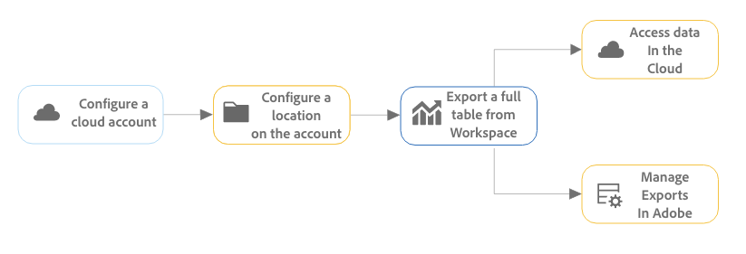

# Exportation des rapports des Customer Journey Analytics dans le cloud

Vous pouvez exporter les tables complètes de Workspace à partir de Customer Journey Analytics et envoyer des exportations vers des destinations cloud désignées.

D’autres méthodes d’exportation de rapports de Customer Journey Analytics sont également disponibles, comme décrit dans la section [Présentation de l’exportation](/help/analysis-workspace/export/export-project-overview.md).

## Présentation de l’export table complète

Vous pouvez exporter des tableaux complets d’Analysis Workspace vers des fournisseurs cloud tels que Google, Azure, Amazon et Adobe.

[Avantages de l’exportation de tables complètes dans le cloud](#advantages-of-exporting-to-the-cloud) inclure la possibilité d’exporter des millions de lignes, d’inclure des mesures calculées, de structurer la sortie des données dans des valeurs concaténées, etc.

Lors de l’exportation de tableaux complets, tenez compte des points suivants :

* Avant d’exporter vers le cloud, assurez-vous que vos tableaux, votre environnement et vos autorisations respectent les [exigences d’exportation](#export-requirements).

* Certains [features](#unsupported-features) et [components](#unsupported-components) ne sont pas prises en charge lors de l’exportation de tables complètes dans le cloud.

Procédez comme suit pour exporter des tables complètes vers le cloud :

1. [Configuration d’un compte cloud](/help/components/exports/cloud-export-accounts.md)

1. [Configuration d’un emplacement sur le compte](/help/components/exports/cloud-export-locations.md)

1. [Exportation d’un tableau complet à partir de Workspace](#export-full-tables-from-analysis-workspace)

1. [Accès aux données dans le cloud](#view-exported-data-and-manifest-file) et [Gestion des exportations dans Adobe](/help/components/exports/manage-exports.md)

## Exportation de tableaux complets à partir d’Analysis Workspace

>[!NOTE]
>
>Avant d’exporter des données comme décrit dans cette section, découvrez l’exportation complète d’un tableau dans la [Présentation de l’export table complète](#understand-full-table-export) ci-dessus.

Pour exporter des tables complètes à partir d’Analysis Workspace :

1. Si ce n’est déjà fait, configurez un compte et un emplacement d’exportation, comme décrit dans la section [Configuration des comptes d’exportation cloud](/help/components/exports/cloud-export-accounts.md).

1. Dans Analysis Workspace, cliquez avec le bouton droit de la souris sur le tableau à structure libre contenant les données à exporter.

1. Sélectionner [!UICONTROL **Exporter le tableau complet**].

   

1. Dans le [!UICONTROL **Nouvel export table complète**] , spécifiez les informations suivantes :

   | Nom du champ | Fonction |
   |---------|----------|
   | Nom | Indiquez un nom pour l’exportation. Ce nom apparaît dans la liste des exports. |
   | Balises | Vous pouvez appliquer une balise existante à l’exportation ou en créer une et l’appliquer. 
Pour appliquer une balise existante à l’exportation, sélectionnez-la dans le menu déroulant. Toutes les balises de votre société peuvent être appliquées.<!-- double-check this -->.
 
Pour créer une nouvelle balise, saisissez son nom, puis appuyez sur Entrée.

Tenez compte des points suivants lors de l’application de balises à une exportation : <ul><li>Les balises que vous appliquez peuvent être filtrées ou recherchées dans le tableau des exports.</li> <li>Les balises appliquées à un projet ne sont pas automatiquement appliquées lors de l’exportation d’un tableau complet, comme décrit dans la section &quot;Configurer les colonnes sur la page d’exportation&quot; dans [Gestion des exportations](/help/components/exports/manage-exports.md). (Une autre solution consiste à [planification d’un projet complet pour l’exportation](/help/analysis-workspace/export/t-schedule-report.md), toutes les balises appliquées au projet sont automatiquement appliquées à l’exportation.)  <!-- Right now we don't have a column for them on the exports table, so this isn't true. Jaden is adding the column. --></li></ul> |
   | Description | Ajoutez une description à l’exportation. Vous pouvez choisir d’afficher les descriptions sous la forme d’une colonne dans la [Page Exporter](/help/components/exports/manage-exports.md) lors de l’affichage d’exportations. |
   | Vue de données | Sélectionnez la vue de données contenant les composants que vous souhaitez inclure dans l’exportation. Le menu déroulant Vue des données se trouve dans le coin supérieur gauche de la boîte de dialogue et peut être identifié par l’icône Vue des données..  
**Remarque :** Si vous choisissez une vue de données qui ne contient pas de composants déjà inclus dans votre tableau de données, vous êtes invité à effacer le tableau de données et à le recréer à l’aide des composants inclus dans la vue de données sélectionnée. 
 |
   | Intervalle de recherche en amont | Sélectionnez la période de création de rapports à inclure dans chaque fichier d’exportation. Les options incluent [!UICONTROL **Aujourd&#39;hui**], [!UICONTROL **Hier**], [!UICONTROL **7 derniers jours**], [!UICONTROL **30 derniers jours**], [!UICONTROL **Cette semaine**], et [!UICONTROL **Ce mois-ci**]. 
Cette option n’est pas affichée lorsque la variable [!UICONTROL **Fréquence des exports**] est défini sur [!UICONTROL **Envoyer maintenant (une fois)**]. |
   | Tableau des données | Affiche le tableau à structure libre que vous exportez. Vous pouvez modifier le tableau de données en faisant glisser des composants du rail de gauche vers le tableau. Le tableau est mis à jour dynamiquement à mesure que vous ajoutez des composants à la zone de travail.  
Les segments appliqués au tableau complet du projet apparaissent en haut de chaque colonne du tableau.
 |
   | Effacer | Efface le contenu du tableau de données. Cela vous permet de commencer à créer un nouveau tableau directement dans la boîte de dialogue d’exportation Nouveau tableau complet. |
   | Fréquence des exportations | Définissez le planning de la fréquence d’exportation. 
Vous pouvez choisir [!UICONTROL **Envoyer maintenant (une fois)**] pour envoyer l&#39;export une seule fois. Lorsque vous sélectionnez cette option, l’exportation est lancée immédiatement.
Vous pouvez également choisir d’envoyer l’exportation selon un calendrier défini. Lors d’un envoi selon un calendrier, les options incluent : [!UICONTROL **Qualité**], [!UICONTROL **Hebdomadaire**], [!UICONTROL **Mensuel par jour de la semaine**], [!UICONTROL **Mensuellement par jour du mois**], [!UICONTROL **Annuellement par jour du mois**], et [!UICONTROL **Annuellement par date spécifique**]. 

Lorsque vous sélectionnez une fréquence d’exportation, tenez compte des points suivants :
<ul><li>Les options du [!UICONTROL **Intervalle de recherche en amont**] changent en fonction de ce que vous sélectionnez ici.<!-- if they're doing Daily, then we might not let them look back to the last year... --></li><li>D’autres champs de configuration s’affichent en fonction de l’option choisie.</li></ul> |
   | Démarrage le | Jour et heure auxquels l’exportation planifiée doit commencer. 
Cette option est disponible uniquement lors du choix d’une fréquence d’exportation planifiée.
 |
   | Fin le | Jour et heure d’expiration de l’exportation planifiée. L’exportation planifiée ne s’exécute plus après la date et l’heure que vous avez définies. 
Cette option est disponible uniquement lors du choix d’une fréquence d’exportation planifiée.
 |
   | Format du fichier | Indiquez si les données exportées doivent être au format .csv ou .json . |
   | Compte | Sélectionnez le compte d’exportation cloud où vous souhaitez que les données soient envoyées. 
Ou, si vous n’avez pas encore configuré de compte cloud à utiliser, vous pouvez configurer un nouveau compte :<ol><li>Sélectionnez [!UICONTROL **Ajouter un compte**], puis spécifiez les informations suivantes :<ul><li>[!UICONTROL **Nom du compte d’emplacement**]: indiquez le nom du compte de l’emplacement. Ce nom apparaît lors de la création d’un emplacement. </li><li>[!UICONTROL **Description du compte d’emplacement**]: fournissez une brève description du compte afin de le différencier des autres comptes du même type de compte.</li><li>[!UICONTROL **Type de compte**]: sélectionnez le type de compte cloud vers lequel vous exportez. Les types de compte disponibles sont Amazon S3 Role ARN, Google Cloud Platform, Azure SAS, Azure RBAC, Snowflake et AEP Data Landing Zone.</li></ul><li>Pour terminer la configuration de votre compte, suivez le lien ci-dessous qui correspond à la variable [!UICONTROL **Type de compte**] vous avez sélectionné :<ul><li>[Zone d’entrée des données AEP](/help/components/exports/cloud-export-accounts.md#aep-data-landing-zone)</li><li>[APERÇU du rôle Amazon S3](/help/components/exports/cloud-export-accounts.md#amazon-s3-role-arn)</li><li>[Google Cloud Platform](/help/components/exports/cloud-export-accounts.md#google-cloud-platform)</li><li>[Azure SAS](/help/components/exports/cloud-export-accounts.md#azure-sas)</li><li>[Azure RBAC](/help/components/exports/cloud-export-accounts.md#azure-rbac)</li><li>[Snowflake](/help/components/exports/cloud-export-accounts.md#snowflake)</li></ul></ol> |
   | Nom de l’emplacement | Sélectionnez l’emplacement sur le compte où vous souhaitez que les données d’exportation soient envoyées.
Ou, si vous n’avez pas encore configuré l’emplacement que vous souhaitez utiliser sur le compte que vous avez sélectionné, vous pouvez configurer un nouvel emplacement :<ol><li>Sélectionner [!UICONTROL **Ajouter un emplacement**], puis spécifiez les informations suivantes : <ul><li>[!UICONTROL **Nom**]: nom de l’emplacement.</li><li>[!UICONTROL **Description**]: fournissez une brève description de l’emplacement pour le différencier des autres emplacements du compte.</li><li>[!UICONTROL **Compte d’emplacement**]: sélectionnez le compte dans lequel vous souhaitez créer l’emplacement.</li></ul><li>Pour terminer la configuration de votre emplacement, suivez le lien ci-dessous qui correspond au type de compte que vous avez sélectionné dans la variable [!UICONTROL **Compte d’emplacement**] field :<ul><li>[Zone d’entrée des données AEP](/help/components/exports/cloud-export-locations.md#aep-data-landing-zone).</li><li>[APERÇU du rôle Amazon S3](/help/components/exports/cloud-export-locations.md#amazon-s3-role-arn)</li><li>[Google Cloud Platform](/help/components/exports/cloud-export-locations.md#google-cloud-platform)</li><li>[Azure SAS](/help/components/exports/cloud-export-locations.md#azure-sas)</li><li>[Azure RBAC](/help/components/exports/cloud-export-locations.md#azure-rbac)</li><li>[Snowflake](/help/components/exports/cloud-export-locations.md#snowflake)</li></ul> |

   {style="table-layout:auto"}

1. Sélectionner [!UICONTROL **Enregistrer**] pour enregistrer l’exportation.

   Les données sont envoyées au compte cloud que vous avez spécifié à la fréquence que vous avez spécifiée.

1. (Facultatif) Une fois l’exportation créée, que vous ayez choisi de l’envoyer maintenant ou selon un calendrier défini, vous pouvez l’afficher et la gérer sur la page [Page Exporter](/help/components/exports/manage-exports.md) et affichez-la dans le [Exporter les logs](/help/components/exports/manage-export-logs.md).

## Gestion des exportations

Une fois les données exportées depuis Analysis Workspace, vous pouvez modifier, réexporter, dupliquer, baliser ou supprimer des exportations existantes, comme décrit dans la section [Gestion des exportations](/help/components/exports/manage-exports.md).

## Affichage des données exportées et du fichier manifeste

### Données exportées

Les données exportées sont disponibles sous la forme d’un fichier compressé dans la destination de cloud que vous avez configurée, comme décrit dans la section [Configuration des comptes d’exportation cloud](/help/components/exports/cloud-export-accounts.md) et [Configuration des emplacements d’exportation cloud](/help/components/exports/cloud-export-locations.md).

Le nom du fichier compressé est le suivant, selon que vous avez choisi le format de fichier CSV ou JSON :

* `cja-export-{reportInstanceId}-{idx}.csv.gz`

* `cja-export-{reportInstanceId}-{idx}.json.gz`

>[!NOTE]
>
>Vous choisissez le format du fichier dans la variable [!UICONTROL **Format du fichier**] lors de l’export du tableau, comme décrit dans la section [Exportation de tableaux complets à partir d’Analysis Workspace](#export-full-tables-from-analysis-workspace).

### Fichier de manifeste 

Un fichier manifeste avec un nom de fichier `cja-export-{reportInstanceId}-{idx}.json.gz` est inclus avec toute diffusion d’exportation réussie contenant au moins un fichier. Le fichier de manifeste vous permet de confirmer que tous les fichiers ont bien été remis. Elle comprend les informations suivantes :

* Liste de tous les fichiers qui ont été distribués

* Somme de contrôle MD5 de chaque fichier

<!-- add in  what the file name, structure, and file format will be -->

## Avantages de l’exportation vers le cloud

L’exportation de données Customer Journey Analytics vers le cloud vous permet d’effectuer les opérations suivantes :

* Exportez vers un emplacement partagé, tel que Adobe Experience Platform Data Landing Zone, Google Cloud Platform, Microsoft Azure, Amazon S3 ou Snowflake.

* Stocker de grandes quantités de données historiques.

  Ce type de données peut être utilisé pour détecter des tendances à long terme afin d’obtenir des renseignements sur les entreprises et, en fin de compte, conduire à une meilleure prise de décision commerciale.

* Exportez des tables complètes qui contiennent des milliers ou des millions de lignes (3 millions, 30 millions, 150 millions ou 300 millions de lignes, selon le type de licence). Les autres méthodes d’exportation peuvent contenir, au maximum, 50 000 lignes.

* Incluez des mesures calculées dans les données de Customer Journey Analytics exportées.

* Sortie de données de structure sous forme de valeurs concaténées.

* Exporter une fois ou selon un calendrier. (Également disponible avec [autres options d’exportation](/help/analysis-workspace/export/export-project-overview.md).)

* Exportez des fichiers au format CSV ou JSON. (Également disponible avec [autres options d’exportation](/help/analysis-workspace/export/export-project-overview.md).)

* Exportez des tableaux contenant plusieurs dimensions.

## Exigences d’exportation {#export-requirements}

### Configuration minimale

Assurez-vous que vos tableaux, votre environnement et vos autorisations répondent aux exigences suivantes :

* **Tableaux :** Tous les tableaux doivent inclure au moins une dimension dans la ligne et une mesure dans chaque colonne pour être pris en charge avec un export tableau complet.

* **Environnement :** Assurez-vous que la variable [Adresses IP](/help/technotes/ip-addresses.md) et [Domaines](/help/technotes/domains.md) Les utilisateurs de Customer Journey Analytics sont autorisés à travers le pare-feu de leur entreprise.

* **Autorisations :** Dans Adobe Admin Console, un profil de produit contenant la variable [!UICONTROL **Exportation de tableau complet**] autorisation qui lui est affectée pour exporter des tables complètes. Pour plus d’informations sur l’attribution d’une autorisation à un profil de produit dans le Admin Console, voir [Autorisation du Customer Journey Analytics dans Admin Console](/help/technotes/access-control.md).

  >[!NOTE]
  >
  >  Les utilisateurs auxquels est affectée la variable [Rôle d’administrateur de produit](/help/technotes/access-control.md#product-admin-role) ont toujours accès à l’exportation de tables complètes ; il n’est pas nécessaire de leur attribuer la variable [!UICONTROL **Exportation de tableau complet**] autorisation.

### Fonctionnalités non prises en charge

Les fonctionnalités suivantes ne sont pas prises en charge et sont automatiquement supprimées des exportations de tableau complet :

* Pourcentages
* Totaux
* Filtrage de recherche
* Lignes statiques
* Alignement des dates
* Dimensions dynamiques

  Pour plus d’informations, voir [Éléments de dimension dynamiques ou statiques dans les tableaux à structure libre](/help/analysis-workspace/visualizations/freeform-table/column-row-settings/manual-vs-dynamic-rows.md).
* Les Dimensions de la première ventilation sont converties et ajoutées en tant que dimension secondaire dans la ligne du tableau exporté ; toute autre ventilation n’est pas incluse dans le tableau.
* Le tri n’est pas pris en charge pour la plupart des jeux de données ; les données peuvent être triées pour les petits jeux de données.

### Composants non pris en charge

Les composants suivants ne sont pas pris en charge et Analysis Workspace vous invite à les supprimer de votre tableau lorsque vous effectuez une exportation dans un tableau complet :

* Mesures calculées qui utilisent des fonctions de base ou avancées dans la définition de mesure (voir [Fonctions de base](/help/components/calc-metrics/cm-functions.md) et [Fonctions avancées](/help/components/calc-metrics/cm-adv-functions.md) pour plus d’informations)
* Composants dont l’exportation a été restreinte par un administrateur (voir la section *Filtrage des stratégies de gouvernance des données dans les vues de données* dans [Étiquettes et stratégies](/help/data-views/data-governance.md) pour plus d’informations)
* Toute dimension qui répond à tous les critères suivants :
   * A été créé à partir d’un champ qui fait partie d’un [tableau d’objets](/help/use-cases/object-arrays.md) (similaire aux variables à plusieurs valeurs dans Adobe Analytics)
   * Has [persistence activée](/help/data-views/component-settings/persistence.md)
   * N’utilise pas un [dimension de liaison](/help/use-cases/data-views/binding-dimensions-metrics.md)
* Plus de 5 dimensions et 5 mesures par rapport (jusqu’à 5 dimensions et 5 mesures sont prises en charge)
* Dans les colonnes du tableau :
   * Périodes
   * Dimensions
* Dans les lignes du tableau :
   * Mesures calculées
   * Mesures
   * Périodes
   * Filtres

### Comportement d’attribution

L’exportation dans un tableau complet prend en charge les mesures calculées qui utilisent un modèle d’attribution autre que celui par défaut (comme décrit dans la section *Utilisation d’un modèle d’attribution différent du modèle par défaut* dans [Paramètres des colonnes](/help/analysis-workspace/visualizations/freeform-table/column-row-settings/column-settings.md)).

Si un modèle d’attribution autre que celui par défaut est utilisé dans un rapport, le modèle d’attribution utilisé dans le rapport est ignoré ou conservé, selon si le rapport comporte une seule dimension ou plusieurs dimensions :

* **Pour les rapports qui incluent l’attribution de mesures dans une seule dimension :** [Attribution des mesures](/help/data-views/component-settings/attribution.md) remplace le paramètre [modèle d&#39;attribution](/help/data-views/component-settings/persistence.md) comme cela est normalement fait lors de l’utilisation de l’attribution de mesures.

  Par exemple, une attribution de mesure &quot;Première touche&quot; remplace une attribution de dimension &quot;plus récente&quot;.

* **Pour les rapports qui incluent l’attribution de mesures sur plusieurs dimensions en même temps :** [Attribution des mesures](/help/data-views/component-settings/attribution.md) s’applique en plus de la dimension [modèle d&#39;attribution](/help/data-views/component-settings/persistence.md).

  Par exemple, une attribution de mesure &quot;Première touche&quot; est appliquée en plus d’une attribution de dimension &quot;la plus récente&quot;. En outre, l’attribution de mesures sera appliquée aux paires d’éléments de dimension post-allouées comme s’il s’agissait d’éléments de dimension uniques, plutôt que de chaque élément de dimension indépendamment, comme cela est normalement fait dans un tableau à structure libre.

  >[!NOTE]
  >
  >Les rapports multidimensionnels ne sont pris en charge que lors de l’exportation de données vers le cloud, comme décrit dans cet article.

## Comparaison de l’exportation de table complète (en Customer Journey Analytics) avec Data Warehouse (dans Adobe Analytics)

Si vous avez précédemment utilisé Data Warehouse pour exporter des données Adobe Analytics, le tableau suivant peut vous aider à comprendre les différences entre l’exportation de tableaux complets dans Customer Journey Analytics et l’exportation de données avec Data Warehouse dans Adobe Analytics.

| Fonctionnalité | Exportation de table complète en Customer Journey Analytics | Data Warehouse dans Adobe Analytics |
|---------|----------|---------|
| Création d’un rapport personnalisé | Oui | Oui |
| Mesures calculées | Oui | Non |
| Segments | Oui | Limitées |
| Dimensions | Limite de 5 | Illimitées |
| Mesures | Limite de 5 | Illimitées |
| Lignes de création de rapports | Limite de 3 millions, 30 millions, 150 millions ou 300 millions, selon le niveau | Illimitées |
| Nombre de rapports | Illimitées | Illimitées |
| Diffusion ad hoc (ponctuelle) | Oui | Oui |
| Planifier une diffusion récurrente | Oui | Oui |
| Diffusion Email | Non | Oui |
| FTP/SFTP | Non | Prise en charge héritée |
| Azure | Oui | Oui |
| Amazon S3 | Oui | Oui |
| Google Cloud Platform | Oui | Oui |
| Snowflake | Oui | Non |
| Fréquence de diffusion | Quotidien | Toutes les heures |
