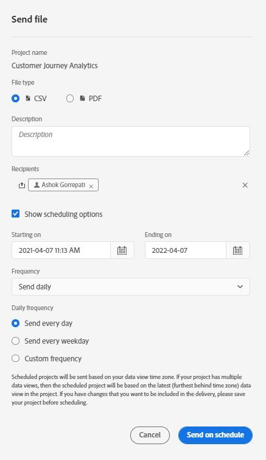

# Envoi de données de Customer Journey Analytics à d’autres par courrier électronique

Vous pouvez exporter des rapports de Customer Journey Analytics en les envoyant par courrier électronique aux destinataires sélectionnés. Vous pouvez envoyer des fichiers ad hoc ou configurer des fichiers à envoyer selon un calendrier. Les fichiers peuvent être envoyés au format CSV ou PDF.

Toutes les balises appliquées au projet sont automatiquement appliquées à l’exportation.

D’autres méthodes d’exportation de données de Customer Journey Analytics sont également disponibles, comme décrit dans la section [Présentation de l’exportation](/help/analysis-workspace/export/export-project-overview.md).

## Envoyer le fichier maintenant {#now}

Pour envoyer immédiatement un fichier aux destinataires par courrier électronique :

1. Cliquez sur **[!UICONTROL Partager] > [!UICONTROL Exporter le fichier]**.
1. Spécifiez le type de fichier :
   * [!UICONTROL **CSV**] : choisissez cette option si vous souhaitez des données en texte brut.
   * [!UICONTROL **PDF**] : choisissez cette option si vous souhaitez que le fichier téléchargé contienne tous les tableaux et visualisations affichés (visibles) dans le projet.
1. (Facultatif) Ajoutez une description qui sera incluse dans l’e-mail pour décrire le fichier reçu.
1. Ajoutez des destinataires ou des groupes. Vous pouvez également saisir les adresses électroniques.
1. (Uniquement pour les clients de Healthcare Shield) Indiquez un mot de passe. Voir la section Protection par mot de passe d’un rapport planifié.
1. (Facultatif) Cliquez sur **[!UICONTROL Afficher les options de planification]** pour planifier une livraison.
1. Cliquez sur **[!UICONTROL Envoyer maintenant]**.

## Envoyer le fichier selon le calendrier {#schedule}

Pour envoyer un fichier selon un calendrier récurrent aux destinataires par email :

1. Cliquez sur **[!UICONTROL Partager] > [!UICONTROL Planifier l’export de fichier]**.
1. Spécifiez le type de fichier (CSV ou PDF).
1. (Facultatif) Ajoutez une description qui sera incluse dans le courrier électronique pour décrire le fichier reçu.
1. Ajoutez des destinataires ou des groupes. Vous pouvez également saisir les adresses électroniques.
1. (Uniquement pour les clients de Healthcare Shield) Indiquez un mot de passe. Voir la section Protection par mot de passe d’un rapport planifié.
1. Précisez la période pendant laquelle la livraison doit être effectuée en modifiant les entrées Début le et Fin le. La date de fin doit se situer dans un délai d’un an à compter du jour de la création ou de la modification de la planification.
1. Spécifiez la fréquence de livraison. Chaque fréquence offre différentes personnalisations.
1. Cliquez sur **[!UICONTROL Envoyer selon le calendrier]**.

## Gestionnaire de projets planifiés {#manager}

Les projets Analysis Workspace planifiés peuvent être gérés sous **[!UICONTROL Analytics] > [!UICONTROL Composants] > [!UICONTROL Projets planifiés]**.

Dans le Gestionnaire de projets planifiés, vous pouvez modifier et supprimer les calendriers de projets récurrents. Utilisez la barre de recherche ou les options de filtre dans le rail de gauche pour rechercher un calendrier. Vous pouvez filtrer par balise, calendriers approuvés, propriétaires, etc.

| Champ | Description |
| --- | --- |
| [!UICONTROL Favoris] | Sélectionnez l’icône en forme d’étoile pour marquer ce planning comme favori. |
| [!UICONTROL Identifiant de planning] | Cet identifiant est principalement utilisé à des fins de débogage. |
| [!UICONTROL Titre et description] | Titre et description de ce projet. |
| [!UICONTROL Propriétaire] | Personne qui a créé le projet et qui en est propriétaire. |
| [!UICONTROL Balises] | (facultatif) Le balisage est un moyen efficace d’organiser les projets. Tous les utilisateurs peuvent créer des balises et en appliquer une ou plusieurs à un projet. Néanmoins, vous ne pouvez afficher les balises que pour les projets que vous possédez ou qui ont été partagés avec vous. |
| [!UICONTROL Délivrés À] | Le ou les personnes destinataires de ce projet planifié. |
| [!UICONTROL Date d’expiration] | Vous pouvez définir la date d’expiration sur un an au maximum, quelle que soit la fréquence de planification. |
| [!UICONTROL Fréquence] | Fréquence à laquelle vous souhaitez envoyer ce projet planifié aux personnes destinataires. |
| [!UICONTROL Heure d’exécution] | Heure à laquelle ce projet planifié est envoyé. |
| [!UICONTROL Nombre de requêtes] | Nombre de requêtes concernant ce projet. |

Actions courantes du Gestionnaire de projets planifiés :

| Action | Description |
|---|---|
| **[!UICONTROL Modifier le planning]** | Cliquez sur le titre du planning pour mettre à jour les paramètres de livraison. |
| **[!UICONTROL Supprimer le planning]** | Sélectionnez le projet planifié dans la liste, puis cliquez sur Supprimer dans le menu. Cela supprime le planning sélectionné pour le projet ; le projet lui-même n’est pas supprimé. |
| **[!UICONTROL Ajout de balises]** | Sélectionnez le projet planifié dans la liste, puis « Balise » ou « Approuver » pour organiser vos plannings et faciliter les recherches. |
| **[!UICONTROL Afficher les plannings échoués]** | Accédez au rail de gauche > Autres filtres > Échec pour afficher les plannings qui ont échoué. |
| **[!UICONTROL Afficher les plannings expirés]** | Accédez au rail de gauche > Autres filtres > Expiré pour afficher les plannings qui ont expiré. Cliquez sur le titre du planning pour configurer une nouvelle diffusion. |
| **[!UICONTROL Afficher l’ID de planning]** | Accédez aux options relatives aux colonnes dans le coin supérieur droit et ajoutez la colonne ID de planning dans le tableau. L’ID planifié est souvent utile pour le débogage. |

Le Gestionnaire de planification des projets affiche les éléments créés par un utilisateur spécifique. Si le compte utilisateur est désactivé dans l’application, toutes les diffusions planifiées s’arrêtent.
Pour plus d’informations, voir [Projets planifiés](/help/components/scheduled-projects-manager.md).

## Protéger un projet planifié par mot de passe {#password}

>[!NOTE]
>
>L’option de protection par mot de passe d’un projet planifié s’affiche uniquement pour les clients Customer Journey Analytics qui ont acheté le produit complémentaire [Healthcare Shield](https://business.adobe.com/solutions/industries/healthcare.html).

Adobe utilise le mot de passe pour chiffrer les projets planifiés, qu’ils soient envoyés au format .pdf ou .csv.

Une fois que votre entreprise a acheté le SKU du Bouclier de santé et qu’il a été activé pour celui-ci, l’invite de création d’un mot de passe pour un projet planifié s’affiche dans les circonstances suivantes :

* Lorsqu’une personne crée un projet planifié.

* Lorsqu’un projet planifié existant est sur le point d’être envoyé. Le projet actuellement planifié est désactivé tant que la protection par mot de passe n’est pas en place. Le propriétaire du projet planifié reçoit un courrier électronique l’informant de cette exigence.

### Exigences relatives au mot de passe

Les exigences en matière de mot de passe sont conformes aux normes de l’Adobe, qui nécessitent un minimum de 8 caractères avec au moins un numéro et un caractère spécial.

### Protéger un nouveau projet planifié par mot de passe

1. Après avoir enregistré votre projet, accédez à **[!UICONTROL Partager]** > **[!UICONTROL Envoyer le fichier maintenant]** ou **[!UICONTROL Partager]** > **[!UICONTROL Envoyer le fichier selon le calendrier]**.
1. Suivez les instructions ci-dessus, sous [Envoyer le fichier maintenant](https://experienceleague.adobe.com/docs/analytics-platform/using/cja-workspace/curate-share/t-schedule-report.html?lang=fr#now) ou [Envoyer le fichier selon le calendrier](https://experienceleague.adobe.com/docs/analytics-platform/using/cja-workspace/curate-share/t-schedule-report.html?lang=fr#schedule).

### Protéger un projet planifié existant par mot de passe

Avant la planification d’un projet, le propriétaire du projet reçoit un courrier électronique similaire à celui-ci :

1. Connectez-vous à Customer Journey Analytics.
1. Sélectionnez **[!UICONTROL Afficher le projet planifié]**.
1. Dans la boîte de dialogue **[!UICONTROL Modifier le projet planifié]**, saisissez un mot de passe et saisissez-le à nouveau.
1. Informez les destinataires du projet planifié de ce mot de passe. Ne distribuez pas le mot de passe aux personnes qui ne sont pas des destinataires du projet planifié.
