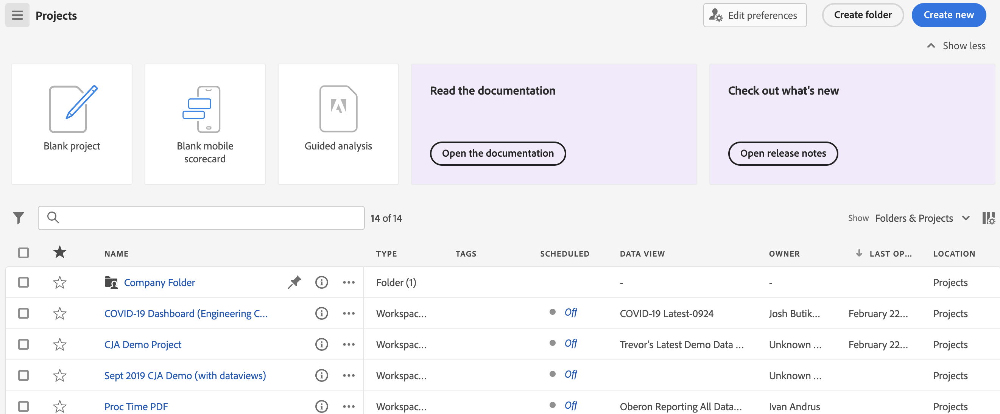

# Aperçu d’Analysis Workspace

analysis workspace est un outil de navigation flexible qui vous permet de créer rapidement des analyses et de partager des informations. L’interface par glisser-déposer vous permet de concevoir votre analyse, d’ajouter des visualisations pour donner vie aux données, de traiter un jeu de données, de partager et de planifier des projets avec toute personne de votre organisation.

Si vous n&#39;avez que quelques minutes, regardez ce bref aperçu pour voir ce qui est possible.

>[!VIDEO](https://video.tv.adobe.com/v/26266/?quality=12)

## Connexion à Adobe Analytics {#login}

Pour début à l’aide d’Analysis Workspace, connectez-vous à Adobe Analytics en accédant à [experience.adobe.com/analytics](https://experience.adobe.com/analytics). Vous accédez à la page d’accueil de la liste de projet Workspace si un projet spécifique n’a pas été sélectionné pour vous auparavant.

## Utilisation du didacticiel Formation {#training-tutorial}

Une fois connecté, votre première étape doit être le didacticiel de formation Analysis Workspace, qui vous guide tout au long de la terminologie et des étapes courantes pour créer votre première analyse dans Workspace. Pour commencer le didacticiel, cliquez sur **[!UICONTROL Créer un projet]** puis sélectionnez **Didacticiel de formation** dans le nouveau mode de projet.

## Créer un nouveau projet {#new-project}

Une fois le didacticiel terminé, vous êtes prêt à commencer à créer votre premier projet. Le **nouveau projet modal** propose différentes options pour démarrer votre analyse. Vous pouvez choisir de début à partir d’un projet vide ou [carte de performance mobile vide](https://docs.adobe.com/content/help/fr-FR/analytics/analyze/mobapp/curator.html), selon que vous prévoyez de partager votre analyse à partir du navigateur ou de l’application mobile Adobe Analytics tableaux de bord.

Vous pouvez également commencer votre analyse à partir de la version prédéfinie **templates**, soit des modèles standard fournis par l’Adobe, soit des modèles personnalisés créés par votre entreprise. Plusieurs modèles différents sont disponibles, selon l’analyse ou le cas d’utilisation que vous avez en tête. [En savoir plus](/help/analysis-workspace/build-workspace-project/starter-projects.md) à propos des différentes options de modèle disponibles.

## Créer votre analyse {#analysis}

Dans votre projet Workspace, **panneaux, tableaux, visualisations et composants** sont accessibles à partir du rail de gauche. Ce sont les blocs de construction de votre projet.

### Composants

**Composants** sont des dimensions, des mesures, des segments ou des plages de dates, qui peuvent tous être combinés dans une **[!UICONTROL Tableau à structure libre]** au début de répondre à la question de votre entreprise. Veillez à vous familiariser avec chacun des [type de composant](/help/components/overview.md) avant de plonger dans votre analyse. Une fois que vous avez maîtrisé la terminologie des composants, vous pouvez commencer à faire glisser et déposer vers [créer votre analyse](/help/analysis-workspace/build-workspace-project/freeform-overview.md) dans un **[!UICONTROL Tableau à structure libre]**.

### Visualisations

**Visualisations**, par exemple, une barre ou un graphique en courbes, sont ensuite ajoutés au-dessus des données pour les rendre visuellement vivantes. Sur le rail de l’extrême gauche, sélectionnez le milieu. **[!UICONTROL Visualisations]** pour afficher la liste complète de [visualisations](/help/analysis-workspace/visualizations/freeform-analysis-visualizations.md) disponible.

### Panneaux

**Panneaux** sont utilisés pour organiser votre analyse au sein d’un projet et peuvent contenir de nombreux tableaux et visualisations. De nombreux panneaux fournis en Analysis Workspace génèrent un ensemble complet d’analyses basées sur quelques entrées d’utilisateurs. Sur le rail de l’extrême gauche, sélectionnez le haut **[!UICONTROL Panneaux]** pour afficher la liste complète de [panneaux](/help/analysis-workspace/c-panels/panels.md) disponible.

## Ressources supplémentaires {#resources}

* adobes offres centaines [Didacticiels de formation vidéo Analytics](https://docs.adobe.com/content/help/en/analytics-learn/tutorials/overview.html).
