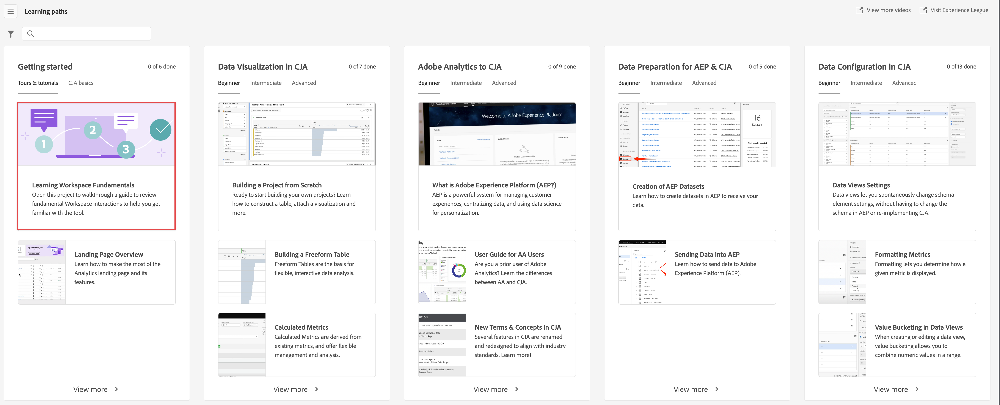

# Aperçu d’Analysis Workspace

Analysis Workspace est un outil de navigation flexible qui vous permet de créer rapidement des analyses et de partager des informations. L’interface par glisser-déposer vous permet de concevoir votre analyse, d’ajouter des visualisations pour donner vie aux données, de traiter un jeu de données, de partager et de planifier des projets avec toute personne de votre organisation.

Si vous ne disposez que de quelques minutes, regardez ce bref aperçu pour voir ce qui est possible.

>[!VIDEO](https://video.tv.adobe.com/v/26266/?quality=12&captions=fre_fr)

## Connexion à Adobe Analytics {#login}

Pour commencer à utiliser Analysis Workspace, connectez-vous à Adobe Analytics en accédant à [experience.adobe.com/analytics](https://experience.adobe.com/analytics). Si vous n’avez pas encore sélectionné de projet spécifique, vous arrivez sur la page d’accueil de la liste de projets Workspace.

## Utilisation du tutoriel de formation {#training-tutorial}

Une fois connecté, votre première étape doit être le didacticiel de formation à Analysis Workspace, qui vous explique la terminologie et les étapes courantes pour créer votre première analyse dans Workspace. Pour commencer le tutoriel, cliquez sur **[!UICONTROL Créer un projet]** puis sélectionnez **Tutoriel de formation** dans la fenêtre modale du nouveau projet.

## Créer un nouveau projet {#new-project}

Une fois le tutoriel terminé, vous êtes prêt à commencer à créer votre premier projet. La **fenêtre modale du nouveau projet** propose différentes options pour démarrer votre analyse. Vous pouvez choisir de commencer à partir d’un projet vide ou d’une [fiche d’évaluation mobile vide](https://docs.adobe.com/content/help/fr-FR/analytics/analyze/mobapp/curator.html), selon que vous prévoyez de partager votre analyse à partir du navigateur ou de l’application mobile des tableaux de bord Adobe Analytics.

Vous pouvez également commencer votre analyse à partir de **modèles** prédéfinis, soit des modèles standard fournis par Adobe, soit des modèles personnalisés créés par votre entreprise. Plusieurs modèles différents sont disponibles, selon l’analyse ou le cas pratique que vous avez en tête. [En savoir plus](/help/analysis-workspace/build-workspace-project/starter-projects.md) à propos des différentes options de modèle disponibles.

## Créer votre analyse {#analysis}

Dans votre projet Workspace, les **panneaux, tables, visualisations et composants** sont accessibles à partir du rail de gauche. Ce sont les blocs de construction de votre projet.

### Composants

Les **composants** sont les dimensions, les mesures, les segments ou les périodes, qui peuvent tous être combinés dans un **[!UICONTROL tableau à structure libre]** pour commencer à répondre à votre interrogation professionnelle. Veillez à vous familiariser avec chaque [type de composant](/help/components/overview.md) avant d’aller plus loin dans votre analyse. Une fois que vous maîtrisez la terminologie des composants, vous pouvez commencer à faire glisser et déposer des éléments vers [Créer votre analyse](/help/analysis-workspace/build-workspace-project/freeform-overview.md) dans un **[!UICONTROL tableau à structure libre]**.

### Visualisations

Les **visualisations**, par exemple, une barre ou un graphique en courbes, sont ensuite superposées aux données pour leur donner vie. Sur le rail de l’extrême gauche, sélectionnez l’icône **[!UICONTROL Visualisations]** du milieu pour afficher la liste complète des [visualisations](/help/analysis-workspace/visualizations/freeform-analysis-visualizations.md) disponible.

### Panneaux

Les **panneaux** permettent d’organiser votre analyse au sein d’un projet et peuvent contenir de nombreux tableaux et visualisations. De nombreux panneaux fournis dans Analysis Workspace génèrent un ensemble complet d’analyses basées sur quelques entrées d’utilisateurs. Sur le rail de l’extrême gauche, sélectionnez l’icône **[!UICONTROL Panneaux]** du dessus pour afficher la liste complète des [panneaux](/help/analysis-workspace/c-panels/panels.md) disponible.

## Ressources supplémentaires {#resources}

* Adobe propose des centaines de [tutoriels de formation vidéo à Analytics](https://docs.adobe.com/content/help/en/analytics-learn/tutorials/overview.html).
