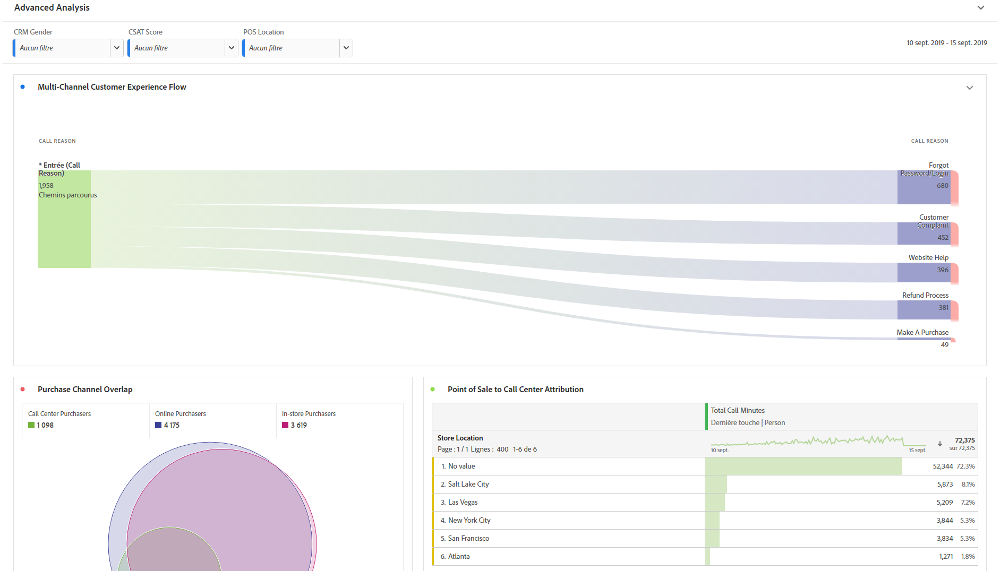
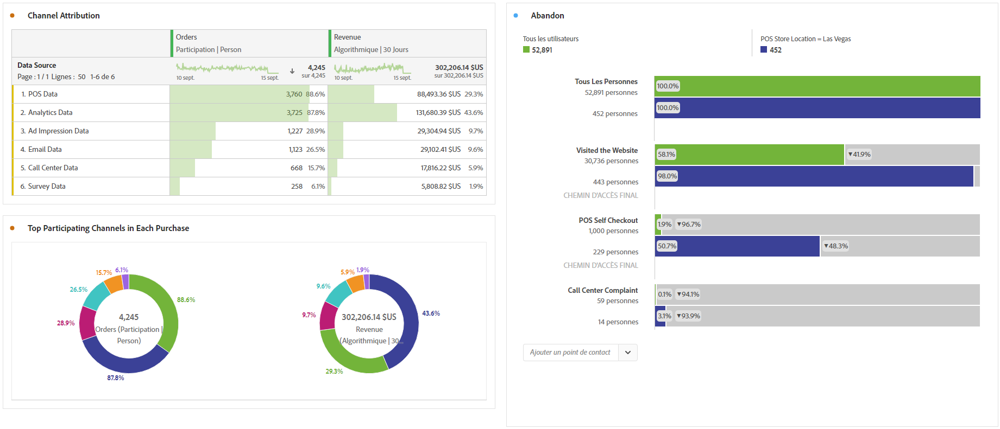

# Exécution d’une analyse avancée

>[!NOTE] Vous consultez la documentation de l’Analysis Workspace à Customer Journey Analytics. Son ensemble de fonctionnalités diffère légèrement de celui des [Analysis Workspace dans le Analytics](https://docs.adobe.com/content/help/fr-FR/analytics/analyze/analysis-workspace/home.html)traditionnel de Adobe. [En savoir plus...](/help/getting-started/cja-aa.md)

L’analyse avancée exploite des fonctionnalités telles que les diagrammes de [flux](/help/analysis-workspace/visualizations/c-flow/flow.md) , le QI d’attribution, les diagrammes d’abandons [et les ventilations de](/help/analysis-workspace/visualizations/fallout/fallout-flow.md) [dimensions.](/help/components/dimensions/t-breakdown-fa.md)

