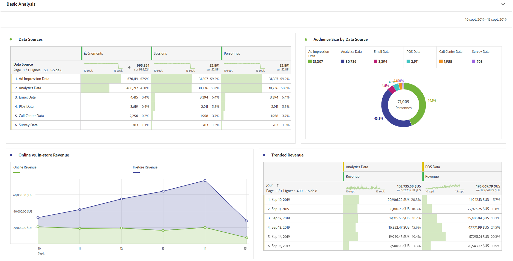
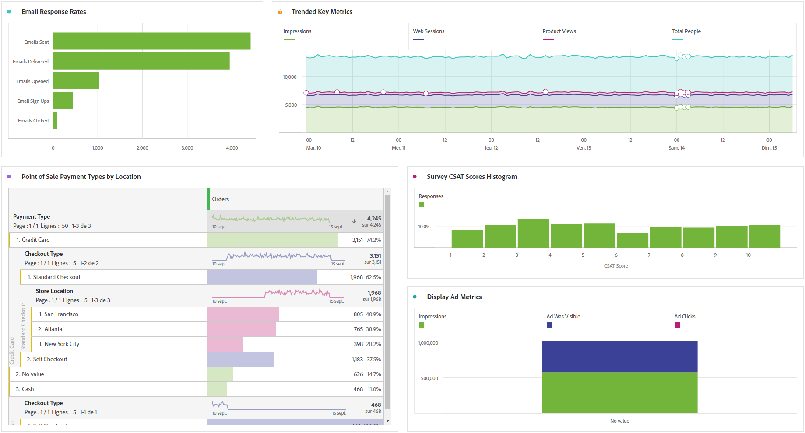

# Exécution d’une analyse de base

>[!NOTE]
>
>Vous consultez la documentation d’Analysis Workspace pour Customer Journey Analytics. L’ensemble de ses fonctionnalités diffère légèrement de celui d’[Analysis Workspace dans la version Adobe Analytics traditionnelle](https://experienceleague.adobe.com/docs/analytics/analyze/analysis-workspace/home.html?lang=fr). [En savoir plus...](/help/getting-started/cja-aa.md)

Après avoir créé des connexions et des vues de données, analysez les données que vous avez introduites en utilisant la puissance et la flexibilité d’Analysis Workspace. N’hésitez pas à expérimenter et à introduire des dimensions et des mesures, des paramètres de changement de dimension et d’attribution de mesures, des noms conviviaux, des fuseaux horaires, des paramètres de session, etc.

Voici un exemple de visualisations de base dans Espace de travail. Par exemple, vous pouvez

* Créer un rapport de classement indiquant les sources de données présentant le plus grand nombre d’événements, de sessions et de personnes.

* Créer un rapport de tendance des recettes en ligne par rapport aux recettes en magasin, pour comparer les deux sources de données au fil du temps.

* Dépeindre la taille de l’audience selon les sources de données, telles que les données d’impression publicitaire, de Customer Journey Analytics, d’e-mails, de point de vente, de centres d’appels et d’enquête.

