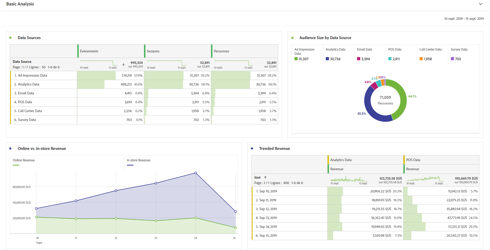
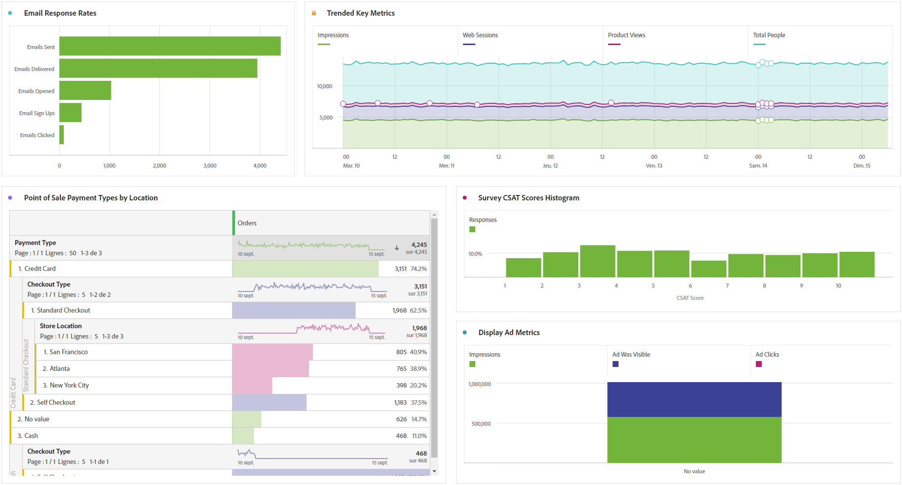

# Exécution d’une analyse de base

Customer Journey Analytics vous permet d’analyser les données avec la puissance et la flexibilité d’Analysis Workspace.

>[!TIP]
>
>Si aucune donnée n’est disponible dans Analysis Workspace, veillez à suivre le [processus d’ingestion des données](/help/data-ingestion/data-ingestion.md), qui comprend les éléments suivants :<ul><li>[Créer une connexion](/help/connections/create-connection.md#create-and-configure-the-connection)  Assurez-vous que la connexion est configurée pour importer de nouvelles données, renvoyer des données, ou les deux.</li><li>[Ajouter des jeux de données](/help/connections/create-connection.md#add-and-configure-datasets)</li><li>[Créer des vues de données](/help/data-views/create-dataview.md)</li></ul>

N’hésitez pas à expérimenter et à introduire des dimensions et des mesures, des paramètres de changement de dimension et d’attribution de mesures, des noms conviviaux, des fuseaux horaires, des paramètres de session, etc.

Voici un exemple de visualisations de base dans Espace de travail. Par exemple, vous pouvez

* Créer un rapport de classement indiquant les sources de données présentant le plus grand nombre d’événements, de sessions et de personnes.

* Créer un rapport de tendance des recettes en ligne par rapport aux recettes en magasin, pour comparer les deux sources de données au fil du temps.

* Dépeindre la taille de l’audience selon les sources de données, telles que les données d’impression publicitaire, de Customer Journey Analytics, d’e-mails, de point de vente, de centres d’appels et d’enquête.

