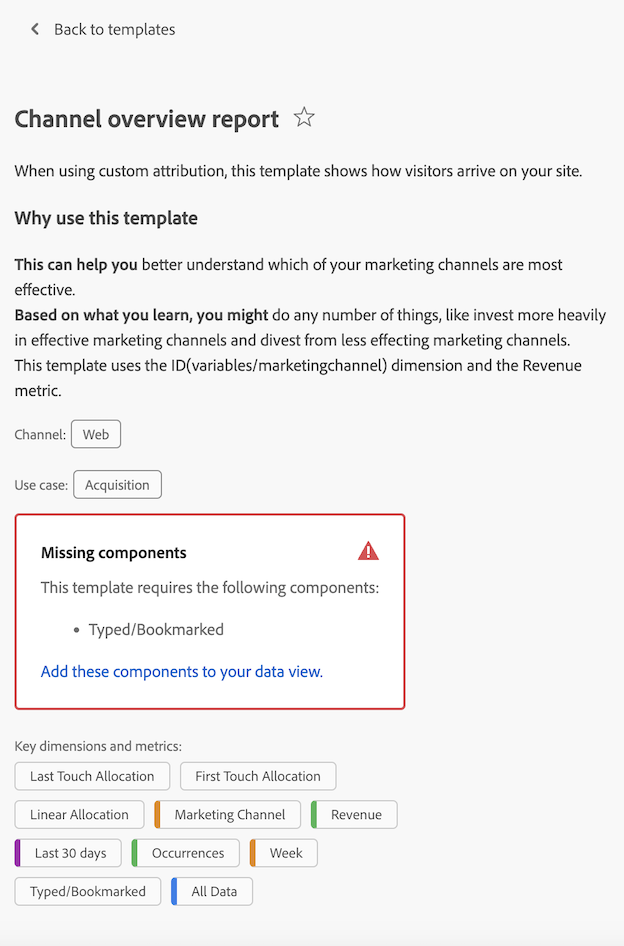

# Créer et gérer des modèles

Les administrateurs et administratrices peuvent créer des modèles et les enregistrer pour que d’autres personnes de leur société de connexion puissent les utiliser.

Les membres de la société de connexion peuvent utiliser ces modèles d’entreprise comme décrit dans la section [Utiliser des modèles](/help/analysis-workspace/templates/use-templates.md).

## Créer un modèle {#create-templates}

<!-- markdownlint-disable MD034 -->

>[!CONTEXTUALHELP]
>id="use-case-ajo-template"
>title="Utiliser un modèle dans Journey Optimizer"
>abstract="Lorsque vous utilisez ce modèle dans Journey Optimizer, la vue de données définie comme vue de données par défaut dans Adobe Journey Optimizer est utilisée, quelle que soit la vue de données sélectionnée avec ce modèle dans Customer Journey Analytics."

<!-- markdownlint-enable MD034 -->

Pour créer un modèle pouvant être utilisé par des personnes de votre société de connexion, procédez comme suit :

1. Dans Analysis Workspace, créez un projet à l’état souhaité.

1. Sélectionnez [!UICONTROL **Projet**] > **[!UICONTROL Enregistrer en tant que modèle...]**.

   

1. Spécifiez les informations suivantes dans la boîte de dialogue [!UICONTROL Enregistrer en tant que modèle] :

   | Champ | Description |
   |---------|----------|
   | **[!UICONTROL Nom]** | Attribuez un nom explicite au modèle. |
   | **[!UICONTROL Description]** | Fournissez une brève description du modèle qui décrit ses utilisations prévues. |
   | **[!UICONTROL Pourquoi utiliser ce modèle]** | Fournissez une brève explication pour informer les personnes de l’organisation sur la manière dont ce modèle peut être utilisé. Cette explication s’affiche sur la page Prévisualisation du modèle. |
   | **[!UICONTROL Canaux]** | Sélectionnez les canaux applicables qui s’appliquent à ce modèle. Vous pouvez sélectionner plusieurs canaux : **[!UICONTROL Web]**, **[!UICONTROL Mobile]**, **[!UICONTROL Cross-canal]**, **[!UICONTROL Centre d’appel]** et **[!UICONTROL En magasin]**.
Les sélections que vous choisissez déterminent l’emplacement d’affichage du modèle et les segments qui s’appliquent aux utilisateurs et utilisatrices qui y accèdent à partir de la page Modèles d’organisation.
 |
   | **[!UICONTROL Cas d’utilisation]** | Sélectionnez tous les cas d’utilisation qui s’appliquent à ce modèle. Vous pouvez sélectionner plusieurs cas d’utilisation : **[!UICONTROL Engagement]**, **[!UICONTROL Conversion]**, **[!UICONTROL Audience]**, **[!UICONTROL Acquisition]** et **[!UICONTROL Journey Optimizer]**. 
Les sélections que vous choisissez déterminent l’emplacement du modèle sur la page Modèles d’organisation. Les utilisateurs et utilisatrices peuvent accéder au modèle ou filtrer la liste par cas d’utilisation. 

**Remarque :** lorsque vous sélectionnez l’option **[!UICONTROL Journey Optimizer]**, le modèle peut être utilisé dans Adobe Journey Optimizer. Dans Journey Optimizer, un menu déroulant est disponible sur la page **[!UICONTROL Rapports]**, ce qui permet aux utilisateurs et aux utilisatrices de sélectionner ce modèle ou le modèle par défaut. Pour plus d’informations, consultez [Commencer avec l’expérience mise à jour de création de rapports](https://experienceleague.adobe.com/fr/docs/journey-optimizer/using/reporting/channel-report/report-gs-cja) dans la documentation de Journey Optimizer.

Tenez compte des points suivants si vous sélectionnez l’option Journey Optimizer :
<ul><li>Cette option est disponible uniquement si les données Journey Optimizer existent dans la vue de données que vous utilisez dans Customer Journey Analytics.</li><li>Lorsque vous utilisez ce modèle dans Journey Optimizer, la vue de données définie comme vue de données par défaut dans Adobe Journey Optimizer est utilisée, quelle que soit la vue de données sélectionnée avec ce modèle dans Customer Journey Analytics.  Pour plus d’informations sur la définition d’une vue de données par défaut dans Journey Optimizer, consultez la section [Compatibilité](/help/data-views/create-dataview.md#compatibility) dans [Créer ou modifier une vue de données](/help/data-views/create-dataview.md).</li></ul> |
   | **[!UICONTROL Type d’activité de Journey Optimizer]** | Choisissez le type d’activité Journey Optimizer à associer à ce modèle : **[!UICONTROL Campagnes]**, **[!UICONTROL Parcours]**, **[!UICONTROL Pages de destination]**, **[!UICONTROL Rapports]** ou **[!UICONTROL Abonnements]**. 
Laissez ce champ vide si vous souhaitez que ce modèle soit associé à tous les types d’activité.

Ce champ s’affiche uniquement si **[!UICONTROL Journey Optimizer]** est sélectionné dans le champ **[!UICONTROL Cas d’utilisation]**.
 |
   | **[!UICONTROL Activité Journey Optimizer]** | Choisissez l’activité Journey Optimizer à associer à ce modèle. 
Laissez ce champ vide si vous souhaitez que ce modèle soit associé à toutes les activités du type d’activité sélectionné.

Ce champ s’affiche uniquement si **[!UICONTROL Journey Optimizer]** est sélectionné dans le champ **[!UICONTROL Cas d’utilisation]**.
 |
   | **[!UICONTROL Étiquettes]** | Spécifiez les balises à appliquer au modèle. Les personnes peuvent filtrer la liste des modèles en fonction des balises que vous ajoutez. |

1. Sélectionnez [!UICONTROL **Enregistrer en tant que modèle**].

Pour plus d’informations sur la façon dont les utilisateurs et utilisatrices peuvent créer un projet basé sur un modèle, consultez [Créer un projet basé sur un modèle](/help/analysis-workspace/templates/use-templates.md#create-a-project-based-on-a-template) dans [Utiliser des modèles](/help/analysis-workspace/templates/use-templates.md).

## Modifier ou supprimer un modèle

Les administrateurs et administratrices peuvent modifier ou supprimer des modèles d’entreprise.

1. Dans Analysis Workspace, sélectionnez l’onglet [!UICONTROL **Workspace**] puis, sous **[!UICONTROL Modèles]** dans le rail de gauche, sélectionnez les modèles **[!UICONTROL _login_company_name _]**.

1. Si vous affichez des modèles dans une vue Colonnes , procédez comme suit :

   1. Accédez au modèle à modifier ou supprimer, puis sélectionnez l’icône d’informations en regard du nom du modèle.

      

   1. Sélectionnez **[!UICONTROL Prévisualisation]**.

   1. Sélectionnez l’icône Plus, puis sélectionnez **[!UICONTROL Modifier]** ou **[!UICONTROL Supprimer]**.

      

1. Si vous affichez des modèles dans un mode Carte , procédez comme suit :

   1. Recherchez le modèle à modifier ou à supprimer.

      

   1. Pointez sur le modèle, puis sélectionnez **[!UICONTROL Prévisualisation]**.

   1. Sélectionnez l’icône Plus, puis sélectionnez **[!UICONTROL Modifier]** ou **[!UICONTROL Supprimer]**.

      

1. Si vous modifiez un modèle, apportez les modifications souhaitées, puis sélectionnez [!UICONTROL **Projet**] > **[!UICONTROL Enregistrer en tant que modèle...]**.

   

1. Spécifiez les informations suivantes dans la boîte de dialogue [!UICONTROL Enregistrer en tant que modèle] :

   | Champ | Description |
   |---------|----------|
   | **[!UICONTROL Nom]** | Attribuez un nom explicite au modèle. |
   | **[!UICONTROL Description]** | Fournissez une brève description du modèle qui décrit ses utilisations prévues. |
   | **[!UICONTROL Pourquoi utiliser ce modèle]** | Fournissez une brève explication pour informer les personnes de l’organisation sur la manière dont ce modèle peut être utilisé. Cette explication s’affiche sur la page Prévisualisation du modèle. |
   | **[!UICONTROL Canaux]** | Sélectionnez les canaux applicables qui s’appliquent à ce modèle. Vous pouvez sélectionner plusieurs canaux : **[!UICONTROL Web]**, **[!UICONTROL Mobile]**, **[!UICONTROL Cross-canal]**, **[!UICONTROL Centre d’appel]** et **[!UICONTROL En magasin]**. Si aucun canal n’est sélectionné, le modèle est inclus avec tous les canaux.
Les sélections que vous choisissez déterminent l’emplacement d’affichage du modèle et les filtres qui s’appliquent aux utilisateurs et utilisatrices qui y accèdent à partir de la page Modèles d’organisation.
 |
   | **[!UICONTROL Cas d’utilisation]** | Sélectionnez tous les cas d’utilisation qui s’appliquent à ce modèle. Vous pouvez sélectionner plusieurs cas d’utilisation : **[!UICONTROL Engagement]**, **[!UICONTROL Conversion]**, **[!UICONTROL Audience]**, **[!UICONTROL Acquisition]** et **[!UICONTROL Journey Optimizer]**. 
Les sélections que vous choisissez déterminent l’emplacement du modèle sur la page Modèles d’organisation. Les utilisateurs et utilisatrices peuvent accéder au modèle ou filtrer la liste par cas d’utilisation. 

**Remarque :** lorsque vous sélectionnez l’option **[!UICONTROL Journey Optimizer]**, le modèle peut être utilisé dans Adobe Journey Optimizer. Dans Journey Optimizer, un menu déroulant est disponible sur la page **[!UICONTROL Rapports]**, ce qui permet aux utilisateurs et aux utilisatrices de sélectionner ce modèle ou le modèle par défaut. Pour plus d’informations, consultez [Commencer avec l’expérience mise à jour de création de rapports](https://experienceleague.adobe.com/fr/docs/journey-optimizer/using/reporting/channel-report/report-gs-cja) dans la documentation de Journey Optimizer.

Tenez compte des points suivants si vous sélectionnez l’option Journey Optimizer :
<ul><li>Cette option est disponible uniquement si les données Journey Optimizer existent dans la vue de données que vous utilisez dans Customer Journey Analytics.</li><li>Lorsque vous utilisez ce modèle dans Journey Optimizer, la vue de données définie comme vue de données par défaut dans Adobe Journey Optimizer est utilisée, quelle que soit la vue de données sélectionnée avec ce modèle dans Customer Journey Analytics.  Pour plus d’informations sur la définition d’une vue de données par défaut dans Journey Optimizer, consultez la section [Compatibilité](/help/data-views/create-dataview.md#compatibility) dans [Créer ou modifier une vue de données](/help/data-views/create-dataview.md).</li></ul> |
   | **[!UICONTROL Type d’activité de Journey Optimizer]** | Choisissez le type d’activité Journey Optimizer à associer à ce modèle : **[!UICONTROL Campagnes]**, **[!UICONTROL Parcours]**, **[!UICONTROL Pages de destination]**, **[!UICONTROL Rapports]** ou **[!UICONTROL Abonnements]**. 
Laissez ce champ vide si vous souhaitez que ce modèle soit associé à tous les types d’activité.

Ce champ s’affiche uniquement si **[!UICONTROL Journey Optimizer]** est sélectionné dans le champ **[!UICONTROL Cas d’utilisation]**.
 |
   | **[!UICONTROL Activité Journey Optimizer]** | Choisissez l’activité Journey Optimizer à associer à ce modèle. 
Laissez ce champ vide si vous souhaitez que ce modèle soit associé à toutes les activités du type d’activité sélectionné.

Ce champ s’affiche uniquement si **[!UICONTROL Journey Optimizer]** est sélectionné dans le champ **[!UICONTROL Cas d’utilisation]**.
 |
   | **[!UICONTROL Étiquettes]** | Spécifiez les balises à appliquer au modèle. Les personnes peuvent filtrer la liste des modèles en fonction des balises que vous ajoutez. |

1. Sélectionnez [!UICONTROL **Enregistrer en tant que modèle**]/

## Renommer, baliser ou approuver des modèles

Les administrateurs et administratrices peuvent renommer, baliser et approuver les modèles d’entreprise.

1. Dans Analysis Workspace, sélectionnez l’onglet [!UICONTROL **Workspace**], puis **[!UICONTROL Projets]** dans le rail de gauche.

1. Sélectionnez l’icône de filtre pour filtrer la liste des projets.

1. Dans le rail de filtrage, sélectionnez **[!UICONTROL Autres filtres]**, puis **[!UICONTROL Modèles d’entreprise]**.

   Une liste des modèles d’entreprise s’affiche. Aucun projet standard ne s’affiche sauf ceux épinglés.

   Les modèles d’entreprise peuvent être identifiés par l’ qui précède le nom du modèle.

   

1. Cliquez sur l’icône des points de suspension **...** en regard d’un modèle pour afficher les options disponibles.

   

1. Sélectionnez **[!UICONTROL Renommer]**, **[!UICONTROL Balise]** ou **[!UICONTROL Approuver]**.

   Vous pouvez également modifier un modèle, ou en supprimer un, comme décrit dans la section [Modifier ou supprimer des modèles](#edit-or-delete-templates).

1. (Facultatif) Pour revenir à la vue normale, dans le rail de filtrage, désélectionnez **[!UICONTROL Modèles d’entreprise]**.

## Ajouter les composants manquants à la vue de données d’un modèle donné

Par défaut, certains modèles fournis par Adobe ne fonctionnent pas, car ils contiennent des composants qui ne figurent pas dans votre vue de données.

Pour chaque composant manquant, un libellé de contexte correspondant est disponible dans votre vue de données. Vous devez soit ajouter le libellé de contexte correspondant à un composant qui se trouve déjà dans votre vue de données, soit ajouter un nouveau composant à votre vue de données et y ajouter le libellé de contexte.

Pour ajouter des composants manquants à un modèle, procédez comme suit :

1. Dans Analysis Workspace, sélectionnez l’onglet [!UICONTROL **Workspace**] puis, sous **[!UICONTROL Modèles]** dans le rail de gauche, sélectionnez **[!UICONTROL Modèles Adobe]**.

1. Sélectionnez l’icône de filtre pour filtrer la liste des modèles.

1. Sélectionnez **[!UICONTROL Pas prêt à l’emploi]** pour afficher les modèles qui nécessitent des composants qui ne figurent pas dans votre vue de données.

   

1. Recherchez un modèle qui n’est pas encore prêt à être utilisé avec votre vue de données.

1. Effectuez l’une des opérations suivantes :

   * **Si vous affichez des modèles dans une vue Colonnes** , procédez comme suit :

      1. Accédez au modèle qui n’est pas encore prêt à être utilisé avec votre vue de données, puis sélectionnez l’icône d’informations à côté du nom du modèle.

         

      1. Sélectionnez **[!UICONTROL Prévisualisation]**.

         

   * **Si vous affichez des modèles dans un mode Carte** , procédez comme suit :

      1. Recherchez le modèle qui n’est pas encore prêt à être utilisé avec votre vue de données.

         

      1. Pointez sur le modèle, puis sélectionnez **[!UICONTROL Prévisualisation]**.

         

1. Dans la section **[!UICONTROL Composants manquants]**, une liste des composants manquants de la vue de données s’affiche. Sélectionnez **[!UICONTROL Ajouter ces composants à votre vue de données]**.

   La page de configuration de la vue de données s’affiche dans un nouvel onglet.

1. Sélectionnez l’onglet **[!UICONTROL Composants]** pour la vue de données.

   

1. Pour chaque composant répertorié comme manquant dans le modèle, effectuez l’une des opérations suivantes dans l’onglet **[!UICONTROL Composants]** :

   * Dans la section **[!UICONTROL Composants inclus]**, sélectionnez un composant déjà inclus dans la vue de données que vous souhaitez utiliser pour le composant manquant.

   * Ajoutez un nouveau composant à la vue de données que vous souhaitez utiliser pour le composant manquant, puis sélectionnez le composant.

     Pour ajouter un nouveau composant à la vue de données, recherchez dans la liste des champs de schéma, puis faites-le glisser dans la section **[!UICONTROL Composants inclus]**.

1. Une fois le composant sélectionné, recherchez le menu déroulant **[!UICONTROL Libellés de contexte]** dans la colonne de droite.

   

1. Dans le menu déroulant **[!UICONTROL Libellés de contexte]**, sélectionnez le libellé de contexte qui porte le même nom que le composant manquant.

1. Sélectionnez **[!UICONTROL Enregistrer et continuer]**.

1. Pour chaque composant manquant, répétez le processus d’ajout du libellé de contexte correspondant à un composant dans la vue de données.

## Accéder à un modèle d’entreprise

Comme pour les modèles fournis par Adobe, les utilisateurs et utilisatrices de l’entreprise peuvent accéder aux modèles créés par les administrateurs et administratrices.

Pour plus d’informations sur l’accès à un modèle d’entreprise, consultez [Accès et exécution d’un modèle](/help/analysis-workspace/templates/use-templates.md#access-and-run-a-template) dans [Utilisation de modèles](/help/analysis-workspace/templates/use-templates.md).

## Masquer lʼonglet Modèles

Les administrateurs et administratrices peuvent masquer l’onglet Modèles pour tous les utilisateurs et utilisatrices de leur organisation.

1. Accédez à **[!UICONTROL Customer Journey Analytics]** > **[!UICONTROL Composants]** > **[!UICONTROL Préférences]** > **[!UICONTROL Entreprise]**.
1. Sélectionnez l’option **[!UICONTROL Masquer l’onglet Modèles]**.
