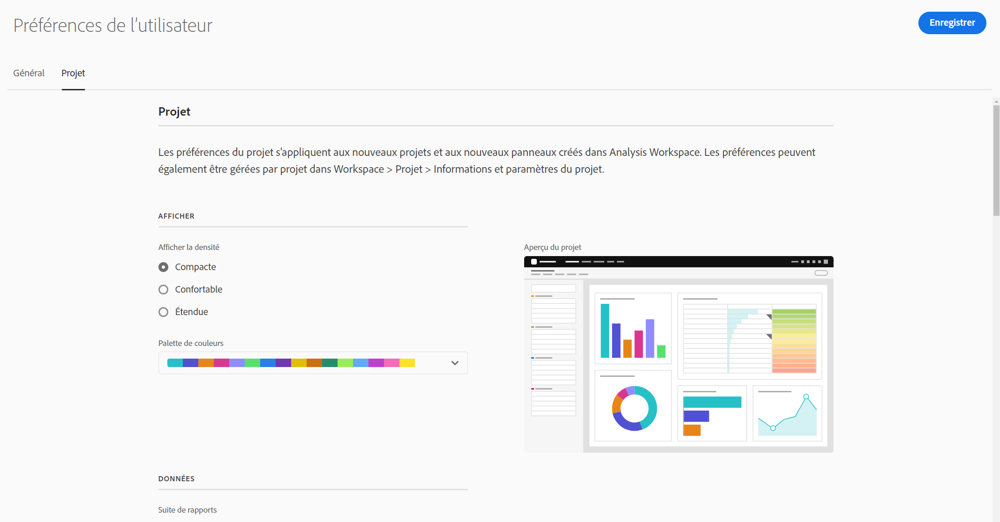
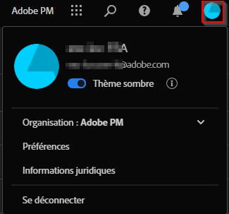

# Préférences de l’utilisateur

La page [!UICONTROL Composants] > [!UICONTROL Préférences utilisateur] vous permet de gérer les paramètres dʼAnalysis Workspace et les composants associés pour vos utilisateurs. Les préférences utilisateur sʼappliquent à *tous* les nouveaux projets ou panneaux.

## Préférences générales

Les préférences générales sʼappliquent à votre expérience Customer Journey Analytics dans le navigateur.

| Préférence | Options |
| --- | --- |
| Landing page | <ul><li>Liste des projets (par défaut)</li><li>Projet vierge</li><li>Projet spécifique</li></ul> |
| Astuces | <ul><li>Activé (par défaut)</li><li>Désactivé</li></ul> |

## Préférences du projet

Les préférences du projet sʼappliquent aux nouveaux projets et aux nouveaux panneaux créés dans Analysis Workspace. Les préférences peuvent également être gérées par projet dans Espace de travail > Projet > Informations et paramètres du projet.

| Section | Préférence | Options |
| --- | --- | --- |
| **Afficher** |  |  |
|  | [Afficher la densité](https://experienceleague.adobe.com/docs/analytics-platform/using/cja-workspace/build-workspace-project/view-density.html?lang=fr) | <ul><li>Compact</li><li>Confortable</li><li>Développé (par défaut)</li></ul> |
|  | [Palette de couleurs](https://experienceleague.adobe.com/docs/analytics-platform/using/cja-workspace/build-workspace-project/color-palettes.html?lang=fr) | <ul><li>Palettes fournies par Adobe (par défaut)</li><li>Palettes personnalisées</li></ul> |
| **Data** (Données) |  |  |
|  | [Calendrier](https://experienceleague.adobe.com/docs/analytics-platform/using/cja-workspace/panels/panels.html?lang=fr#calendar) | Liste des périodes prêtes à lʼemploi, y compris **[!UICONTROL Ce mois]** (par défaut) |
|  | [Type de panneau](https://experienceleague.adobe.com/docs/analytics-platform/using/cja-workspace/panels/panels.html?lang=fr) | <ul><li>À structure libre (par défaut)</li><li>Vide</li><li>Aperçu rapide</li></ul> |
|  | Format du nombre | <ul><li>1 000,00 (par défaut)</li><li>1.000,00</li><li>1 000,00</li></ul> |
|  | Séparateur CSV | <ul><li>Virgule (par défaut)</li><li>Point-virgule</li><li>Deux-points</li><li>Tube</li><li>Point</li><li>un espace</li><li>Tabulation</li></ul> |

## [!UICONTROL Thème sombre]

Si vous préférez afficher un arrière-plan sombre pour votre interface utilisateur de Customer Journey Analytics, vous pouvez activer le [!UICONTROL Thème sombre].

1. Cliquez sur lʼicône dʼutilisateur dʼExperience Cloud en haut à droite.

   

1. Déplacez le bouton bascule du **[!UICONTROL Thème sombre]** vers la droite.

