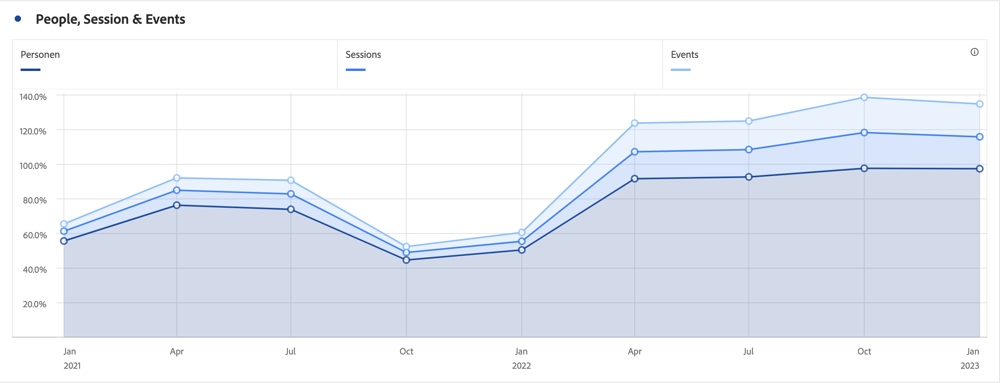

# Aires (empilées)

>[!BEGINSHADEBOX]

_Cet article présente les visualisations Surface et Aires empilées dans_  _&#x200B;**Customer Journey Analytics**._ _Voir [Aires et aires empilées](https://experienceleague.adobe.com/fr/docs/analytics/analyze/analysis-workspace/visualizations/area) pour la version_ AdobeAnalytics de cet article.** _

>[!ENDSHADEBOX]

La visualisation Surface comporte une option standard et une option empilée.

## Zone {#area}

<!-- markdownlint-disable MD034 -->

>[!CONTEXTUALHELP]
>id="workspace_area_button"
>title="Graphe à couches"
>abstract="Créez une visualisation de graphe à couches pour représenter l’intersection de plusieurs mesures."

<!-- markdownlint-enable MD034 -->

La visualisation  **[!UICONTROL Surface]** est semblable à un graphique linéaire, mais avec une zone colorée sous la ligne. Utilisez un graphique Surface si vous avez plusieurs mesures et souhaitez visualiser la zone exprimée par l’intersection de plusieurs mesures.

## Aires empilées {#area-stacked}

<!-- markdownlint-disable MD034 -->

>[!CONTEXTUALHELP]
>id="workspace_areastacked_button"
>title="Aires empilées"
>abstract="Créez une visualisation de graphe à couches pour représenter l’empilement de plusieurs mesures."

<!-- markdownlint-enable MD034 -->

La visualisation  **[!UICONTROL Aires empilées]** est semblable à la visualisation Surface, mais chaque série commence au-dessus de la série précédente.

Utilisez l’option **[!UICONTROL Empilé à 100 %]** dans  **[!UICONTROL Paramètres]** pour transformer le graphique en visualisation empilée à 100 %.

>[!BEGINSHADEBOX]

Voir  [Visualisation de zone](https://experienceleague.adobe.com/fr/docs/customer-journey-analytics-learn/tutorials/analysis-workspace/visualizations/add-area-visualizations){target="_blank"} pour une vidéo de démonstration.

>[!ENDSHADEBOX]

>[!MORELIKETHIS]
>
>[Ajouter une visualisation à un panneau](/help/analysis-workspace/visualizations/freeform-analysis-visualizations.md#add-visualizations-to-a-panel)
>[Paramètres de visualisation](/help/analysis-workspace/visualizations/freeform-analysis-visualizations.md#settings)
>[Menu contextuel de visualisation](/help/analysis-workspace/visualizations/freeform-analysis-visualizations.md#context-menu)
>
