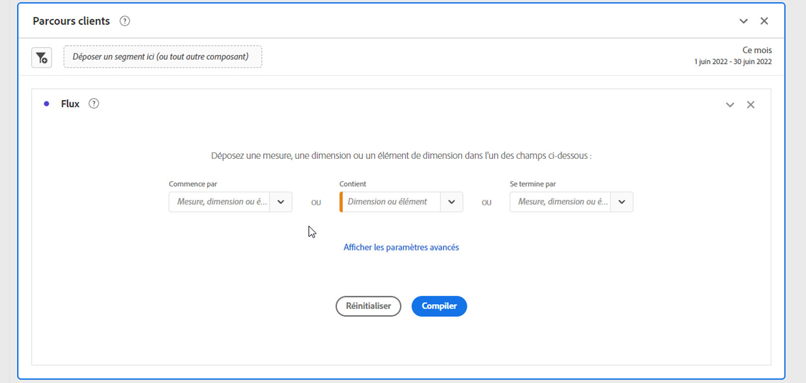
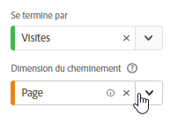
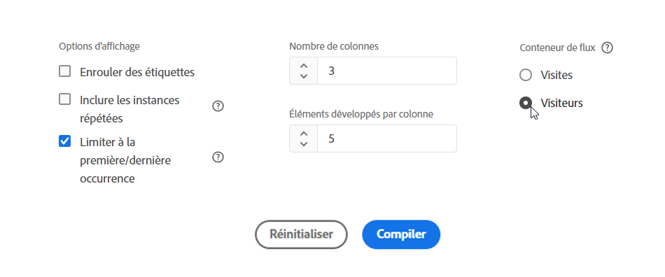
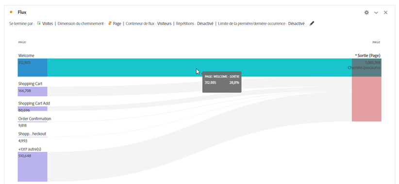
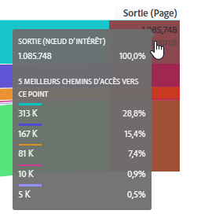

# Configuration d’une visualisation de flux

La visualisation Flux mise à jour vous permet de comprendre le parcours qui résulte ou qui mène à un événement de conversion spécifique sur votre site web ou votre application. Elle trace un chemin d’accès à travers vos dimensions (et éléments de dimension) ou mesures. Le flux vous permet de configurer le début ou la fin du chemin qui vous intéresse, ou d’analyser tous les chemins qui traversent une dimension ou un élément de dimension.

La nouvelle expérience [!UICONTROL flux] améliore votre workflow de plusieurs façons :

* Vous pouvez désormais choisir de commencer ou de terminer votre chemin par la combinaison d’une mesure et d’une dimension de cheminement.
* Cette expérience contient des [!UICONTROL Paramètres avancés] pour vous permettre de personnaliser davantage le [!UICONTROL flux].
* Le nouveau bouton « Créer » permet de gagner du temps dans l’analyse en vous permettant de configurer le parcours en une seule fois, puis d’effectuer des requêtes, et de créer automatiquement plusieurs colonnes et nœuds à la fois.

## Étapes de configuration {#configure}

1. Pour commencer à créer un diagramme de flux, ajoutez un panneau vierge à votre projet, puis cliquez sur l’icône Visualisations dans le rail de gauche. Faites ensuite glisser la visualisation Flux dans le panneau. Vous pouvez aussi faire glisser la visualisation [!UICONTROL Flux] dans un projet existant.

1. Ancrez votre visualisation Flux à l’aide de l’une des trois options suivantes :

   * [!UICONTROL Commence par] (mesures, dimensions ou éléments) ou
   * [!UICONTROL Contient] (dimensions ou éléments) ou
   * [!UICONTROL Se termine par] (mesures, dimensions ou éléments)

   Chacune de ces catégories est présentée à l’écran comme une « zone de dépôt ». Vous pouvez remplir la zone de dépôt de trois manières :

   * Utilisez le menu déroulant pour sélectionner des mesures ou des dimensions.
   * Faites glisser des éléments de la liste des dimensions ou mesures.
   * Utilisez la recherche pour rechercher les mesures ou la dimension que vous recherchez.

   Supposons, par exemple, que vous souhaitiez suivre tout ce qui mène à un événement de passage en caisse. Faites glisser une dimension ou une mesure liée au passage en caisse (telle que [!UICONTROL La commande existe]) dans la zone de dépôt **[!UICONTROL Se termine par]**.

1. Si vous choisissez une mesure, vous devez également fournir une [!UICONTROL Dimension de cheminement], comme illustré ici, que vous utiliserez pour créer le chemin. La valeur par défaut est [!UICONTROL Page].

   

   >[!IMPORTANT]
   >
   >Les mesures calculées ne peuvent pas être déposées dans les zones de dépôt **[!UICONTROL Commence par]** ou **[!UICONTROL Se termine par]**.

1. (Facultatif) Cliquez sur **[!UICONTROL Afficher les paramètres avancés]** pour configurer les paramètres avancés :

   

   | Paramètre | Description |
   | --- | --- |
   | **[!UICONTROL Développer les étiquettes]** | Habituellement, les étiquettes sur les éléments de flux sont tronquées pour gagner de l’espace à l’écran, mais vous pouvez afficher l’étiquette complète en cochant cette case.  Valeur par défaut = non coché. |
   | **[!UICONTROL Inclure des instances de répétition]** | Les visualisations de flux sont basées sur des instances d’une dimension. Ce paramètre vous donne la possibilité d’inclure ou d’exclure des instances de répétition, telles que des rechargements de page. Toutefois, les répétitions ne peuvent pas être supprimées des visualisations de flux qui incluent des dimensions à valeurs multiples, comme des listVars, listProps, s.product, eVars de marchandisage, etc. Valeur par défaut = non coché. |
   | **[!UICONTROL Limiter à la première/dernière occurrence]** | Limitez les chemins à ceux qui commencent/se terminent par la première/dernière occurrence d’une dimension/élément/mesure. Consultez la section ci-dessous intitulée &quot;Exemple de scénario pour &quot;limite à la première/dernière occurrence&quot; pour une explication plus détaillée. |
   | **[!UICONTROL Nombre de colonnes]** | Détermine le nombre de colonnes souhaité dans le diagramme Flux. |
   | **[!UICONTROL Éléments développés par colonne]** | Nombre d’éléments à inclure dans chaque colonne. |
   | **[!UICONTROL Conteneur de flux]** | <ul><li>Visite</li><li>Visiteur</li></ul> Permet de basculer entre Visite et Visiteur afin d’analyser le cheminement du visiteur. Ces paramètres permettent de comprendre l’engagement des visiteurs au niveau des visiteurs (à l’échelle de toutes visites) ou de contraindre l’analyse à une seule visite. |

1. Cliquez sur **[!UICONTROL Créer]**.

## Afficher et modifier la sortie Flux {#output}

Un résumé de la configuration Flux s’affiche en haut du diagramme. Les tracés dans le diagramme sont proportionnels. Les tracés plus épais sont ceux pour lesquels l’activité est la plus intense.

Pour approfondir l’analyse des données, vous disposez de plusieurs options :

* Le diagramme de flux est interactif. Pointez sur le diagramme pour modifier les détails présentés.

* Si vous cliquez sur un nœud du diagramme, les détails correspondants s’affichent. Cliquez de nouveau sur le nœud pour le réduire.

   

* Vous pouvez filtrer une colonne pour n’afficher que certains résultats, tels que l’inclusion et l’exclusion, la spécification de critères, etc.

* Cliquez sur le signe plus (+) à gauche pour développer une colonne.

* Utilisez les options de clic droit décrites ci-dessous pour personnaliser davantage la sortie.

* Cliquez sur l’icône en forme de crayon en regard du résumé de la configuration pour modifier davantage le flux ou le recréer avec différentes options.

* Vous pouvez également exporter le diagramme Flux pour procéder à une analyse approfondie dans un fichier CSV de projet en sélectionnant **[!UICONTROL Projet]** > **[!UICONTROL Télécharger CSV]**.

## Filtrage

Au-dessus de chaque colonne, un filtre s’affiche lorsque vous pointez dessus. En cliquant sur le filtre, vous obtenez la même boîte de dialogue de filtre qui existe actuellement dans le tableau à structure libre. Ce filtre fonctionne de la même manière que dans le tableau à structure libre.

* Utilisez les paramètres avancés pour inclure ou exclure certains critères avec notre liste d&#39;opérateurs.
* Une fois que vous avez filtré un élément de la liste, cette colonne spécifique reflète le filtrage. (Le filtre le réduit pour afficher uniquement l’élément autorisé dans le filtre ou supprime tous les éléments, à l’exception de celui que vous souhaitez dans le filtre.
* Toutes les colonnes en aval et en amont doivent persister tant que les données se déversent dans les noeuds restants.
* Une fois appliquée, l’icône de filtre apparaît en bleu au-dessus de la colonne qu’elle filtre.
* Pour supprimer un filtre, cliquez sur l’icône de filtre pour ouvrir le menu de filtre. Supprimez les filtres appliqués, puis cliquez sur **[!UICONTROL Enregistrer]**. Le flux doit revenir à son état précédent, non filtré.

## Options du menu contextuel {#right-click}

| Option | Description |
|--- |--- |
| [!UICONTROL Se concentrer sur ce nœud] | Fait la mise au point sur le nœud sélectionné. Le nœud d’intérêt s’affiche au centre du diagramme Flux. |
| [!UICONTROL Recommencer] | Vous renvoie au générateur de diagrammes Structure libre, d’où vous pouvez créer un autre diagramme Flux. |
| [!UICONTROL Créer un segment à partir de ce point du flux] | Création d’un segment. Ouvre le Créateur de segments, d’où vous pouvez configurer le nouveau segment. |
| [!UICONTROL Ventilation] | Permet de ventiler le nœud d’après les dimensions, les mesures ou le temps disponibles. |
| [!UICONTROL Tendance] | Permet de créer un diagramme de tendance pour le nœud. |
| [!UICONTROL Développer toute la colonne] | Permet de développer une colonne pour afficher tous les nœuds. Par défaut, seuls les cinq premiers nœuds sont présentés. |
| [!UICONTROL Réduire toute la colonne] | Permet de masquer tous les nœuds d’une colonne. |
| [!UICONTROL Exclure un élément]/[!UICONTROL Restaurer les éléments exclus] | Supprime un noeud spécifique de la colonne et le crée automatiquement en tant que filtre en haut de la colonne. Pour restaurer l’élément exclu, cliquez de nouveau avec le bouton droit de la souris et sélectionnez **[!UICONTROL Restaurer un élément exclu]**. vous pouvez également ouvrir le filtre dans la partie supérieure de la colonne et supprimer le cadre de contrôle avec l’élément que vous venez d’exclure. |

## Exemple de scénario pour &quot;limiter à la première/dernière occurrence&quot;

Lorsque vous utilisez cette option, gardez à l’esprit que :

* **[!UICONTROL Limiter à la première/dernière occurrence]** compte uniquement la première ou la dernière occurrence de la série. Toutes les autres occurrences de la variable **[!UICONTROL Commence par]** ou **[!UICONTROL Se termine par]** Les critères sont ignorés.
* Si utilisé avec une **[!UICONTROL Commence par]** , seule la première occurrence correspondant au critère de début est incluse.
* Si utilisé avec une **[!UICONTROL Se termine par]** , seule la dernière occurrence correspondant au critère de fin sera incluse.
* La série utilisée diffère selon le conteneur. Si vous utilisez la variable **[!UICONTROL Visite]** , la série d’accès correspond à la session . Si vous utilisez la variable **[!UICONTROL Visiteur]** , la série d’accès correspond à tous les accès d’un utilisateur donné dans la période fournie.
* Le **[!UICONTROL Limiter à la première/dernière occurrence]** peut être configurée dans les paramètres avancés lors de l’utilisation d’une mesure ou d’un élément de Dimension dans les champs &quot;Commence par&quot; ou &quot;Se termine par&quot;.

Exemple de série d’accès :

Accueil > Produits > Ajouter au panier > Produits > Ajouter au panier > Facturation > Confirmation de commande

### Examinez une analyse de flux à l’aide des paramètres suivants :

* Commencer par[!UICONTROL  Ajouter au panier] (Élément de Dimension)
* [!UICONTROL Page] dimension de cheminement
* [!UICONTROL Visite] container

Si &quot;Limiter à la première/dernière occurrence&quot; est désactivé, cette seule série d’accès comptabilise 2 occurrences de &quot;Ajouter au panier&quot;.
Sortie de flux attendue : &quot;Ajouter au panier&quot; (2) —> &quot;Produits&quot; (1) -> &quot;Facturation&quot; (1)

Cependant, si l’option &quot;Limiter à la première/dernière occurrence&quot; est activée, seule la première occurrence de &quot;Ajouter au panier&quot; est incluse dans l’analyse.
Sortie de flux attendue : &quot;Ajouter au panier&quot; (1) —> &quot;Produits&quot; (1)

### Tenez compte de la même série d’accès, mais en utilisant les paramètres suivants :

* Se termine par [!UICONTROL Ajouter au panier] (Élément de Dimension)
* [!UICONTROL Page] dimension de cheminement
* [!UICONTROL Visite] container

If **[!UICONTROL Limiter à la première/dernière occurrence]** is *disabled*, cette série unique d’accès comptabilise 2 occurrences de &quot;Ajouter au panier&quot;.
Sortie de flux attendue : &quot;Produits&quot; (2) &lt;— &quot;Ajouter au panier&quot; (2)

Cependant, si **[!UICONTROL Limiter à la première/dernière occurrence]** is *enabled*, seule la dernière occurrence de [!UICONTROL Ajouter au panier] serait inclus dans l’analyse.
Sortie de flux attendue : &quot;Produits&quot; (1) &lt;— &quot;Ajouter au panier&quot; (1)
