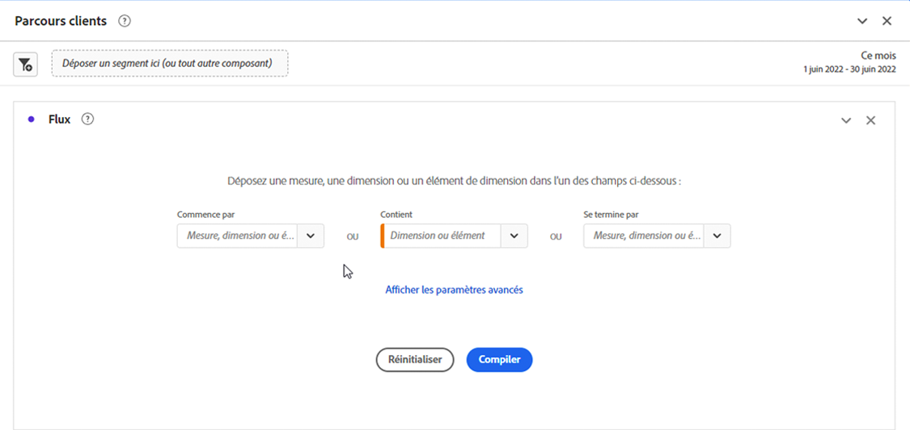

# Configurer une visualisation de flux {#configure-a-flow-visualization}

>[!CONTEXTUALHELP]
>id="workspace_flow_container"
>title="Conteneur de flux"
>abstract="Sélectionnez le conteneur à utiliser pour afficher (les nombres du) le cheminement."

Les visualisations de flux vous aident à comprendre le parcours provenant d’un événement de conversion spécifique sur votre site web ou votre application. Ou menant à un événement de conversion spécifique. La visualisation trace un chemin d’accès à travers vos dimensions (et éléments de dimension) ou mesures.

Vous pouvez configurer le début ou la fin du chemin qui vous intéresse. Vous pouvez également analyser tous les chemins qui traversent une dimension ou un élément de dimension.

.

## Utilisation

1. Ajoutez une visualisation  **[!UICONTROL Flux]**. Voir [Ajouter une visualisation à un panneau](../freeform-analysis-visualizations.md#add-visualizations-to-a-panel).

1. Ancrez votre visualisation de flux à l’aide de l’une des options suivantes :

   * [!UICONTROL **Commence par**] (mesures, dimensions ou éléments) ou
   * [!UICONTROL **Contient**] (dimensions ou éléments) ou
   * [!UICONTROL **Se termine par**] (mesures, dimensions ou éléments)

   Chacune de ces catégories est présentée à l’écran comme une *zone de dépôt*. Il existe 3 manières de renseigner la zone de dépôt :

   * Utiliser le menu déroulant pour sélectionner des mesures ou des dimensions.
   * Faites glisser et déposez les dimensions ou les mesures à partir du panneau de gauche.
   * Commencez à saisir le nom d’une dimension ou d’une mesure, puis sélectionnez-la lorsqu’elle apparaît dans la liste déroulante.

   >[!IMPORTANT]
   >
   >Les mesures calculées ne peuvent pas être utilisées dans les champs **[!UICONTROL Commence par]** ou **[!UICONTROL Se termine par]**.

1. Si vous choisissez une mesure, vous devez également fournir une [!UICONTROL **Dimension de cheminement**] à utiliser comme chemin d’accès menant au composant sélectionné ou en provenant, comme illustré ici. La valeur par défaut est [!UICONTROL **Page**].

   

1. (Facultatif) Sélectionnez **[!UICONTROL Afficher les paramètres avancés]** pour configurer l’une des options suivantes :

   | Paramètre | Description |
   | --- | --- |
   | **[!UICONTROL Développer les étiquettes]** | Habituellement, les étiquettes sur les éléments de flux sont tronquées pour gagner de l’espace à l’écran, mais vous pouvez afficher l’étiquette complète en cochant cette case.  Valeur par défaut = non coché. |
   | **[!UICONTROL Inclure des instances de répétition]** | Les visualisations Flux sont basées sur des instances d’une dimension. Ce paramètre vous donne la possibilité d’inclure ou d’exclure des instances de répétition, telles que des actualisations de page. Toutefois, les répétitions ne peuvent pas être supprimées des visualisations Flux qui incluent des dimensions à valeurs multiples, comme des listVars, listProps, s.product, eVars de marchandisage, etc. 
Par défaut, cette option est désactivée.
 |
   | **[!UICONTROL Limiter à la première/dernière occurrence]** | Limitez les chemins à ceux qui commencent ou se terminent par la première ou la dernière occurrence d’une dimension, d’un élément ou d’une mesure. Voir [Limiter à la première/dernière occurrence](#example-scenario-for-limit-to-firstlast-occurrence) pour obtenir une explication plus détaillée. |
   | **[!UICONTROL Nombre de colonnes]** | Nombre de colonnes souhaité dans le diagramme de flux. Vous pouvez spéficier 5 colonnes maximum. |
   | **[!UICONTROL Éléments développés par colonne]** | Nombre d’éléments à inclure dans chaque colonne. Vous pouvez spécifier un maximum de 10 éléments développés par colonne. |
   | **[!UICONTROL Conteneur de flux]** | Vous pouvez basculer entre **[!UICONTROL Compte global]** [!BADGE B2B edition]{type=Informative url="https://experienceleague.adobe.com/en/docs/analytics-platform/using/cja-overview/cja-b2b/cja-b2b-edition" newtab=true tooltip="Customer Journey Analytics B2B edition"}, **[!UICONTROL Compte]** [!BADGE B2B edition]{type=Informative url="https://experienceleague.adobe.com/en/docs/analytics-platform/using/cja-overview/cja-b2b/cja-b2b-edition" newtab=true tooltip="Customer Journey Analytics B2B edition"}, **[!UICONTROL Opportunité]** [!BADGE B2B edition]{type=Informative url="https://experienceleague.adobe.com/en/docs/analytics-platform/using/cja-overview/cja-b2b/cja-b2b-edition" newtab=true tooltip="Customer Journey Analytics B2B edition"}, **[!UICONTROL Groupe d’achat]** [!BADGE B2B edition]{type=Informative url="https://experienceleague.adobe.com/en/docs/analytics-platform/using/cja-overview/cja-b2b/cja-b2b-edition" newtab=true tooltip="Customer Journey Analytics B2B edition"}, **[!UICONTROL Sessions]** et **[!UICONTROL Person]** pour analyser le cheminement. Ces paramètres permettent de comprendre l’engagement des personnes au niveau des personnes (sur les sessions) ou de contraindre l’analyse à une seule session. |

   >[!IMPORTANT]
   >
   >La combinaison du **[!UICONTROL Nombre de colonnes]** et des **[!UICONTROL Éléments développés par colonne]** détermine le nombre de requêtes sous-jacentes requises pour créer la visualisation de flux. Plus ces nombres sont élevés, plus le rendu d’une visualisation prend du temps.

1. Sélectionnez la **[!UICONTROL Version]**.

### Exemple

Supposons que vous souhaitiez tracer le chemin suivi par les utilisateurs et utilisatrices vers et depuis les pages les plus appréciées de votre site.

1. Créez une visualisation Flux comme décrit ci-dessus.
1. Faire glisser la dimension [!UICONTROL **Page**] dans le champ **[!UICONTROL Contient]**, puis sélectionner la [!UICONTROL **Version**].
1. La visualisation Flux s’appuie sur la page la plus vue, visible dans le nœud activé, au centre de la visualisation. Vous pouvez également voir les pages principales qui mènent à cette page (à gauche du nœud activé) ainsi que les pages principales qui mènent hors de cette page (à droite du nœud activé).
1. Analysez les données du flux, comme décrit dans la section [Configurer](#configure).

## Configurer

Un résumé de la configuration Flux s’affiche en haut des visualisations. Les tracés dans le diagramme sont proportionnels. Les tracés plus épais sont ceux pour lesquels l’activité est la plus intense.

Pour approfondir l’analyse des données, vous disposez de plusieurs options :

* Le diagramme de flux est interactif. Pointez sur le diagramme pour modifier les détails présentés.

* Si vous sélectionnez un nœud du diagramme, les détails correspondants s’affichent. Sélectionnez de nouveau le nœud pour le réduire.

  

* Vous pouvez filtrer une colonne pour n’afficher que certains résultats, tels que l’inclusion et l’exclusion, la spécification de critères, etc.

* Sélectionnez  sur le côté gauche ou droit pour développer une colonne.

* Pour personnaliser la sortie, utilisez les options du [menu contextuel](#context-menu).

* Pour modifier le flux ou le recréer avec différentes options, sélectionnez  en regard du résumé de la configuration.

## Filtre

Un filtre  apparaît au-dessus de chaque colonne lorsque vous pointez dessus. En sélectionnant le filtre, vous verrez s’afficher une boîte de dialogue de filtre identique à celle qui se trouve actuellement dans le tableau à structure libre. Voir [Filtrer et trier](freeform-table/../../freeform-table/filter-and-sort.md).

* Utilisez **[!UICONTROL Afficher les paramètres avancés]** pour configurer les paramètres avancés afin d’inclure ou d’exclure certains critères avec une liste d’opérateurs. Voir [Filtres et tri](../freeform-table/filter-and-sort.md) pour plus d’informations.
* Une fois que vous avez filtré une colonne, cette dernière reflète le filtrage. Un  bleu indique que la colonne est filtrée.  Le filtre réduit la colonne pour afficher uniquement l’élément autorisé dans le filtre. Ou il supprime tous les éléments, à l’exception de celui que vous souhaitez dans le filtre.
* Toutes les colonnes en aval et en amont doivent être conservées tant que les données alimentent les nœuds restants.
* Pour supprimer un filtre, sélectionnez  pour en ouvrir le menu. Supprimez les filtres appliqués, puis sélectionnez **[!UICONTROL Enregistrer]**. Le flux doit revenir à son état précédent, c’est-à-dire non filtré.

## Menu contextuel

Utilisez un menu contextuel sur n’importe quel nœud de la visualisation Flux avec les options suivantes :

| Option | Description |
|--- |--- |
| **[!UICONTROL Se concentrer sur ce nœud]** | Fait la mise au point sur le nœud sélectionné. Le nœud d’intérêt s’affiche au centre du diagramme Flux. |
| **[!UICONTROL Recommencer]** | Vous renvoie au créateur de diagrammes à structure libre, dans lequel vous pouvez créer un autre diagramme de flux. |
| **[!UICONTROL Créer un filtre pour ce chemin]** | Création d’un filtre. Cette sélection vous redirige vers le créateur de filtres, dans lequel vous pouvez configurer le nouveau filtre. |
| **[!UICONTROL Répartition]** | Permet de ventiler le nœud d’après les dimensions, les mesures ou le temps disponibles. |
| **[!UICONTROL Filtrer la colonne]** | Les mêmes options de filtre que celles disponibles dans le tableau à structure libre s’affichent. Pour plus d’informations sur les options disponibles, reportez-vous à la section « Appliquer un filtre simple ou avancé à un tableau » de la section [Filtrer et trier des tableaux](/help/analysis-workspace/visualizations/freeform-table/filter-and-sort.md). |
| **[!UICONTROL Exclure un élément]** ou **[!UICONTROL Restaurer les éléments exclus]** | Supprime un nœud donné de la colonne et le transforme automatiquement en filtre en haut de la colonne. Pour restaurer l’élément exclu, sélectionnez **[!UICONTROL Restaurer un élément exclu]** dans le menu contextuel. Vous pouvez également ouvrir le filtre en haut de la colonne et supprimer le rectangle contenant l’élément que vous venez d’exclure. |
| **[!UICONTROL Tendance]** | Permet de créer un diagramme de tendance pour le nœud. |
| **[!UICONTROL Afficher la colonne suivante]**/**[!UICONTROL Afficher la colonne précédente]** | Affiche la colonne suivante (à droite) ou précédente (à gauche) de la visualisation. |
| **[!UICONTROL Masquer la colonne]**n | Masque la colonne sélectionnée dans la visualisation. |
| **[!UICONTROL Développer toute la colonne]** | Permet de développer une colonne pour afficher tous les nœuds. Par défaut, seuls les cinq premiers nœuds sont présentés. |
| **[!UICONTROL Créer une audience à partir de la sélection]** | Crée une audience en fonction de la colonne sélectionnée. |
| **[!UICONTROL Réduire toute la colonne]** | Permet de masquer tous les nœuds d’une colonne. |

## Limiter à la première/dernière occurrence

Lorsque vous utilisez cette option, gardez à l’esprit que :

* **[!UICONTROL Limiter à la première/dernière occurrence]** compte uniquement la première ou la dernière occurrence de la série. Toutes les autres occurrences du critère **[!UICONTROL Commence par]** ou **[!UICONTROL Se termine par]** sont ignorées.
* Si vous utilisez cette option avec un flux **[!UICONTROL Commence par]**, seule la première occurrence correspondant au critère de début est incluse.
Dans l’exemple ci-dessous, **toutes** les occurrences des éléments *Ajouter au panier* et *Catégorie principale de produit* dans chaque étape du flux sont incluses.
  

  Dans l’exemple ci-dessous, seules les **premières** occurrences des éléments *Ajouter au panier* et *Catégorie principale de produit* dans chaque étape du flux sont incluses.
  
* Si vous utilisez cette option avec un flux **[!UICONTROL Se termine par]**, seule la dernière occurrence correspondant au critère de fin est incluse.
Dans l’exemple ci-dessous, **toutes** les occurrences des éléments *Catégorie principale de produit* et *Ajouter au panier* dans chaque étape du flux sont incluses.
  

  Dans l’exemple ci-dessous, seules les **dernières** occurrences des éléments *Catégorie principale de produit* et *Ajouter au panier* à chaque étape du flux sont incluses.
  
* La série utilisée diffère en fonction du conteneur. Si vous utilisez le conteneur **[!UICONTROL Personne]**, la série d’événements correspond à la session. Si vous utilisez le conteneur **[!UICONTROL Session]**, la série d’événements correspond à tous les événements d’une personne donnée dans la période fournie.
* L’option **[!UICONTROL Limiter à la première/dernière occurrence]** peut être configurée dans les paramètres avancés lors de l’utilisation d’une mesure ou d’un élément de dimension dans les champs **[!UICONTROL Commence par]** ou **[!UICONTROL Se termine par]**.

>[!MORELIKETHIS]
>
>[Ajouter une visualisation à un panneau](/help/analysis-workspace/visualizations/freeform-analysis-visualizations.md#add-visualizations-to-a-panel)
>[Paramètres de visualisation](/help/analysis-workspace/visualizations/freeform-analysis-visualizations.md#settings)
>[Menu contextuel de visualisation](/help/analysis-workspace/visualizations/freeform-analysis-visualizations.md#context-menu)
>

