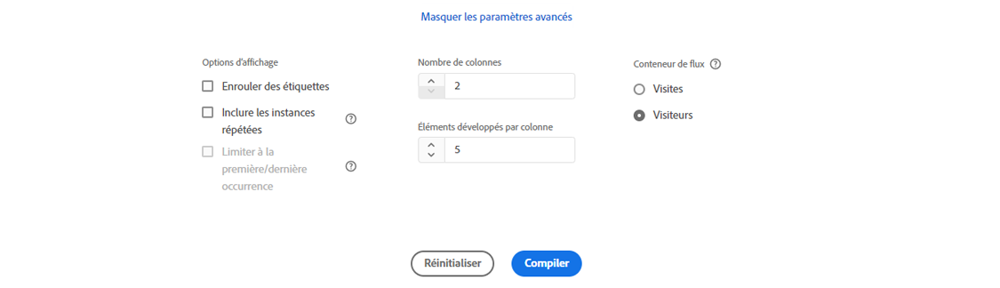

# Configuration d’une visualisation de flux

Les visualisations de flux vous aident à comprendre le parcours qui découle d’un événement de conversion spécifique sur votre site web ou votre application ou qui le conduit à un événement de conversion spécifique. Elle trace un chemin d’accès à travers vos dimensions (et éléments de dimension) ou mesures.

Les visualisations de flux vous permettent de configurer le début ou la fin du chemin qui vous intéresse, ou d’analyser tous les chemins qui traversent une dimension ou un élément de dimension.

## Créer une visualisation de flux {#configure}

1. Ajoutez un panneau vierge à votre projet, sélectionnez l’icône Visualisations dans le rail de gauche, puis faites glisser le [!UICONTROL **Flux**] dans le panneau.

   OU

   Ajoutez une visualisation de l’une des manières décrites dans la section &quot;Ajouter des visualisations à un panneau&quot; de la section [Visualisations - Aperçu](/help/analysis-workspace/visualizations/freeform-analysis-visualizations.md).

1. Ancrer votre visualisation Flux à l’aide de l’une des options suivantes :

   * [!UICONTROL **Commence par**] (mesures, dimensions ou éléments) ou
   * [!UICONTROL **Contient**] (dimensions ou éléments) ou
   * [!UICONTROL **Se termine par**] (mesures, dimensions ou éléments)

   Chacune de ces catégories est présentée à l’écran comme une « zone de dépôt ». Il existe 3 manières de renseigner la zone de dépôt :

   * Utiliser le menu déroulant pour sélectionner des mesures ou des dimensions.
   * Faites glisser des dimensions ou des mesures depuis le rail de gauche.
   * Commencez à saisir le nom d’une dimension ou d’une mesure, puis sélectionnez-la lorsqu’elle apparaît dans la liste déroulante.

   >[!IMPORTANT]
   >
   >Les mesures calculées ne peuvent pas être utilisées dans la variable  **[!UICONTROL Commence par]** ou **[!UICONTROL Se termine par]** champs.

1. Si vous choisissez une mesure, vous devez également fournir une [!UICONTROL **Dimension de cheminement**] à utiliser comme chemin d’accès menant à ou à partir du composant sélectionné, comme illustré ici. La valeur par défaut est [!UICONTROL **Page**].

   

1. (Facultatif) Sélectionnez **[!UICONTROL Afficher les paramètres avancés]** pour configurer l’une des options suivantes :

   

   | Paramètre | Description |
   | --- | --- |
   | **[!UICONTROL Développer les étiquettes]** | Habituellement, les étiquettes sur les éléments de flux sont tronquées pour gagner de l’espace à l’écran, mais vous pouvez afficher l’étiquette complète en cochant cette case.  Valeur par défaut = non coché. |
   | **[!UICONTROL Inclure des instances de répétition]** | Les visualisations de flux sont basées sur des instances d’une dimension. Ce paramètre vous donne la possibilité d’inclure ou d’exclure des instances de répétition, telles que des rechargements de page. Toutefois, les répétitions ne peuvent pas être supprimées des visualisations de flux qui incluent des dimensions à valeurs multiples, comme des listVars, listProps, s.product, eVars de marchandisage, etc. 
Par défaut, cette option est désactivée.
 |
   | **[!UICONTROL Limiter à la première/dernière occurrence]** | Limitez les chemins à ceux qui commencent/se terminent par la première/dernière occurrence d’une dimension/élément/mesure. Voir la section ci-dessous, [Exemple de scénario pour &quot;limiter à la première/dernière occurrence&quot;](#example-scenario-for-limit-to-firstlast-occurrence), pour une explication plus détaillée. |
   | **[!UICONTROL Nombre de colonnes]** | Nombre de colonnes souhaité dans le diagramme Flux. |
   | **[!UICONTROL Éléments développés par colonne]** | Le nombre d’éléments que vous souhaitez dans chaque colonne. |
   | **[!UICONTROL Conteneur de flux]** | <ul><li>Visite</li><li>Visiteur</li></ul> Permet de basculer entre Visite et Visiteur afin d’analyser le cheminement du visiteur. Ces paramètres permettent de comprendre l’engagement des visiteurs au niveau des visiteurs (à l’échelle de toutes visites) ou de contraindre l’analyse à une seule visite. |

1. Sélectionner **[!UICONTROL Build]**.

>[!INFO]
>
>**Exemple :** Supposons que vous souhaitiez tracer le chemin suivi par les utilisateurs vers et depuis les pages les plus populaires de votre site.
>
>Pour ce faire, vous devez
>1. Commencez à créer une visualisation de flux comme décrit ci-dessus.
>1. Faites glisser le [!UICONTROL **Page**] dans la **[!UICONTROL Contient]** champ, puis sélectionnez [!UICONTROL **Build**].
>1. La visualisation Flux s’appuie sur la page la plus visualisée, visible dans le noeud d’intérêt au centre de la visualisation. Vous pouvez également voir les pages principales qui mènent à cette page (à gauche du noeud de focus) ainsi que les pages principales qui mènent hors de cette page de focus (à droite du noeud de focus).
>1. Analysez les données dans le flux, comme décrit dans la section [Affichage et modification de la sortie Flux](#view-and-change-the-flow-output).

## Afficher et modifier la sortie Flux {#output}

Un résumé de la configuration Flux s’affiche en haut du diagramme. Les tracés dans le diagramme sont proportionnels. Les tracés plus épais sont ceux pour lesquels l’activité est la plus intense.

Pour approfondir l’analyse des données, vous disposez de plusieurs options :

* Le diagramme de flux est interactif. Pointez sur le diagramme pour modifier les détails présentés.

* Si vous cliquez sur un nœud du diagramme, les détails correspondants s’affichent. Cliquez de nouveau sur le nœud pour le réduire.

  

* Vous pouvez filtrer une colonne pour n’afficher que certains résultats, tels que l’inclusion et l’exclusion, la spécification de critères, etc.

* Cliquez sur le signe plus (+) à gauche pour développer une colonne.

* Utilisez les options de clic droit décrites ci-dessous pour personnaliser davantage la sortie.

* Cliquez sur l’icône en forme de crayon en regard du résumé de la configuration pour modifier davantage le flux ou le recréer avec différentes options.

* Vous pouvez également exporter le diagramme Flux pour procéder à une analyse approfondie dans un fichier CSV de projet en sélectionnant **[!UICONTROL Projet]** > **[!UICONTROL Télécharger CSV]**.

## Filtrage

Un filtre apparaît au-dessus de chaque colonne lorsque vous le survolez avec votre curseur. En cliquant sur le filtre, vous verrez s’afficher une boîte de dialogue de filtre identique à celle qui se trouve actuellement dans le tableau à structure libre. Ce filtre fonctionne de la même manière que celui du tableau à structure libre.

* Utilisez les paramètres avancés pour inclure ou exclure certains critères avec notre liste d’opérateurs.
* Une fois que vous avez filtré un élément de la liste, la colonne en question reflète le filtrage. (Le filtre la réduit et affiche uniquement l’élément autorisé dans le filtre ou supprime tous les éléments à l’exception de celui que vous avez sélectionné dans le filtre.)
* Toutes les colonnes en aval et en amont doivent être conservées tant que les données alimentent les nœuds restants.
* Une fois appliquée, l’icône de filtre devient bleue au-dessus de la colonne filtrée.
* Pour supprimer un filtre, cliquez sur l’icône de filtre pour en ouvrir le menu. Supprimez les filtres appliqués, puis cliquez sur **[!UICONTROL Enregistrer]**. Le flux doit revenir à son état précédent, c’est-à-dire non filtré.

## Options du menu contextuel {#right-click}

| Option | Description |
|--- |--- |
| [!UICONTROL Se concentrer sur ce nœud] | Fait la mise au point sur le nœud sélectionné. Le nœud d’intérêt s’affiche au centre du diagramme Flux. |
| [!UICONTROL Recommencer] | Vous renvoie au générateur de diagrammes Structure libre, d’où vous pouvez créer un autre diagramme Flux. |
| [!UICONTROL Créer un filtre pour ce chemin d’accès] | Création d’un filtre. Vous accédez alors au Créateur de filtres, où vous pouvez configurer le nouveau filtre. |
| [!UICONTROL Répartition] | Permet de ventiler le nœud d’après les dimensions, les mesures ou le temps disponibles. |
| [!UICONTROL Filtre Colonne] | Les mêmes options de filtre apparaissent que dans le tableau à structure libre. Pour plus d’informations sur les options disponibles, voir la section &quot;Appliquer un filtre simple ou avancé à un tableau&quot; dans [Filtrage et tri des tableaux](/help/analysis-workspace/visualizations/freeform-table/filter-and-sort.md). |
| [!UICONTROL Exclure un élément]/[!UICONTROL Restaurer les éléments exclus] | Supprime un nœud donné de la colonne et le transforme automatiquement en filtre en haut de la colonne. Pour restaurer l’élément exclu, cliquez de nouveau avec le bouton droit de la souris et sélectionnez **[!UICONTROL Restaurer un élément exclu]**. Vous pouvez également ouvrir le filtre en haut de la colonne et supprimer le rectangle contenant l’élément que vous venez d’exclure. |
| [!UICONTROL Tendance] | Permet de créer un diagramme de tendance pour le nœud. |
| Afficher la colonne suivante / Afficher la colonne précédente | Affiche la colonne suivante (à droite) ou précédente (à gauche) de la visualisation. |
| Masquer la colonne | Masque la colonne sélectionnée dans la visualisation. |
| [!UICONTROL Développer toute la colonne] | Permet de développer une colonne pour afficher tous les nœuds. Par défaut, seuls les cinq premiers nœuds sont présentés. |
| Créer une audience à partir de la sélection | Crée une audience à partir de la colonne sélectionnée. |
| [!UICONTROL Réduire toute la colonne] | Permet de masquer tous les nœuds d’une colonne. |

## Exemple de scénario de limitation à la première/dernière occurrence

Lorsque vous utilisez cette option, gardez à l’esprit que :

* **[!UICONTROL Limiter à la première/dernière occurrence]** compte uniquement la première ou la dernière occurrence de la série. Toutes les autres occurrences du critère **[!UICONTROL Commence par]** ou **[!UICONTROL Se termine par]** sont ignorées.
* Si vous utilisez cette option avec un flux **[!UICONTROL Commence par]**, seule la première occurrence correspondant au critère de début est incluse.
* Si vous utilisez cette option avec un flux **[!UICONTROL Se termine par]**, seule la dernière occurrence correspondant au critère de fin est incluse.
* La série utilisée diffère en fonction du conteneur. Si vous utilisez la variable **[!UICONTROL Visite]** , la série d’événements correspond à la session . Si vous utilisez la variable **[!UICONTROL Visiteur]** , la série d’événements correspond à tous les événements d’un utilisateur donné dans la période fournie.
* L’option **[!UICONTROL Limiter à la première/dernière occurrence]** peut être configurée dans les paramètres avancés lors de l’utilisation d’un élément de mesure ou de dimension dans les champs « Commence par » ou « Se termine par ».

Exemple de série d’événements :

Accueil > Produits > Ajouter au panier > Produits > Ajouter au panier > Facturation > Confirmation de commande

### Prenons une analyse de flux aux paramètres suivants :

* Commencer par [!UICONTROL Ajouter au panier] (élément de dimension)
* Dimension du cheminement [!UICONTROL Page]
* Conteneur de [!UICONTROL visites]

Si &quot;Limiter à la première/dernière occurrence&quot; est désactivé, cette série unique d’événements comptabilise 2 occurrences de &quot;Ajouter au panier&quot;.
Sortie de flux attendue :
« Ajouter au panier » (2) —> « Produits » (1)
-> « Facturation » (1)

Cependant, si l’option &quot;Limiter à la première/dernière occurrence&quot; est activée, seule la première occurrence de &quot;Ajouter au panier&quot; est incluse dans l’analyse.
Sortie de flux attendue :
« Ajouter au panier » (1) —> « Produits » (1)

### Tenez compte de la même série d’événements, mais en utilisant les paramètres suivants :

* Se termine par [!UICONTROL Ajouter au panier] (élément de dimension)
* Dimension du cheminement [!UICONTROL Page]
* Conteneur de [!UICONTROL visites]

If **[!UICONTROL Limiter à la première/dernière occurrence]** is *disabled*, cette série unique d’événements comptabilise 2 occurrences de &quot;Ajouter au panier&quot;.
Sortie de flux attendue :
« Produits » (2) &lt;— « Ajouter au panier » (2)

Cependant, si l’option **[!UICONTROL Limiter à la première/dernière occurrence]** est *activée*, seule la dernière occurrence d’[!UICONTROL Ajouter au panier] est incluse dans l’analyse.
Sortie de flux attendue :
« Produits » (1) &lt;— « Ajouter au panier » (1)
