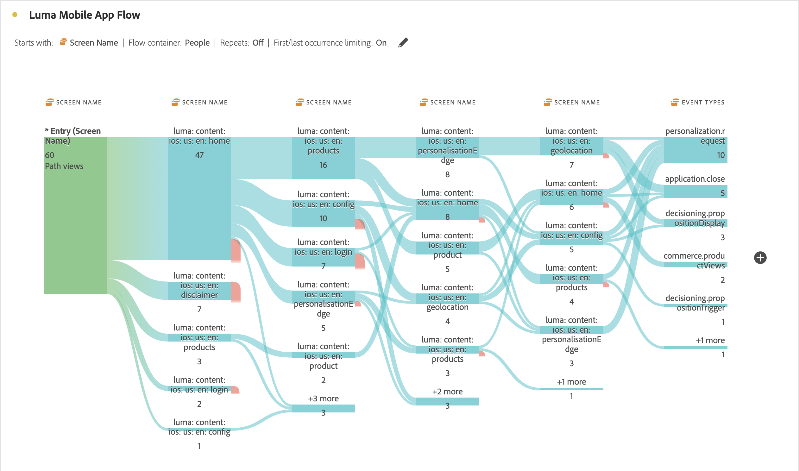

# Flux interdimensionnels

Un flux interdimensionnel vous permet d’examiner les chemins d’accès pour les utilisateurs et utilisatrices sur plusieurs dimensions. Cet article explique comment utiliser ce flux pour deux cas d’utilisation : interactions et événements liés à des applications mobiles, ainsi que comment les campagnes génèrent des visites web.

<!--
A dimension label at the top of each Flow column makes using multiple dimensions in a flow visualization more intuitive:

-->

## Interactions et événements liés aux applications mobiles

La dimension [!UICONTROL Nom d’écran] est utilisée dans cet exemple de flux pour voir comment les utilisateurs utilisent les différents écrans (scènes) de l’application. L’écran supérieur renvoyé est **[!UICONTROL luma: content: ios: en: home]**, qui est la page d’accueil de l’application :

Pour explorer l’interaction entre les écrans et les types d’événements (par exemple, ajouter au panier, achats, etc.) dans cette application, effectuez un glisser-déposer de la dimension **[!UICONTROL Types d’événement]** :

* En plus de toute étape disponible dans le flux, pour remplacer cette dimension :

  

* En dehors de la visualisation du flux actuel, pour ajouter la dimension :

  

La visualisation de flux ci-dessous montre le résultat de l’ajout de la dimension **[!UICONTROL Types d’événements]** . La visualisation fournit des informations sur le cheminement des utilisateurs de l’application mobile dans différents écrans de l’application avant d’ajouter des produits à un panier, de fermer l’application, de se voir présenter une offre, etc.

## Comment les campagnes génèrent des visites web

Vous souhaitez analyser les campagnes qui génèrent des visites sur le site web. Vous créez une visualisation de flux avec le **[!UICONTROL nom de campagne]** comme dimension.

Vous remplacez la dernière dimension **[!UICONTROL Nom de campagne]** par la dimension **[!UICONTROL Nom de page formatée]** et ajoutez une autre dimension **[!UICONTROL Nom de page formatée]** à la fin de la visualisation de flux.

Vous pouvez placer le pointeur de la souris sur l’un des flux pour afficher plus de détails. Par exemple, quelles campagnes ont entraîné un passage en caisse.

