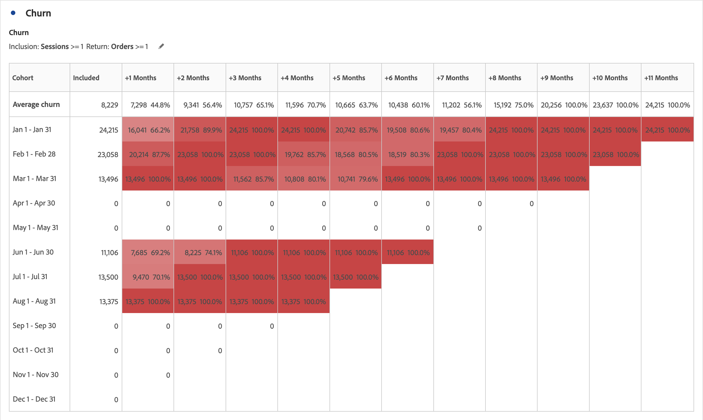
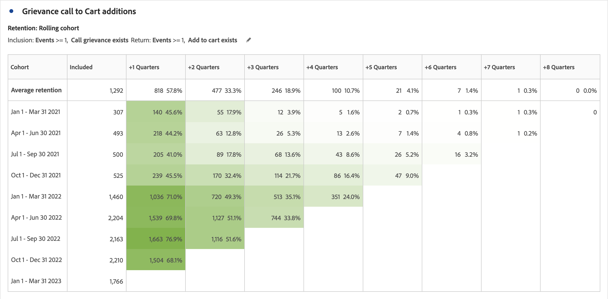
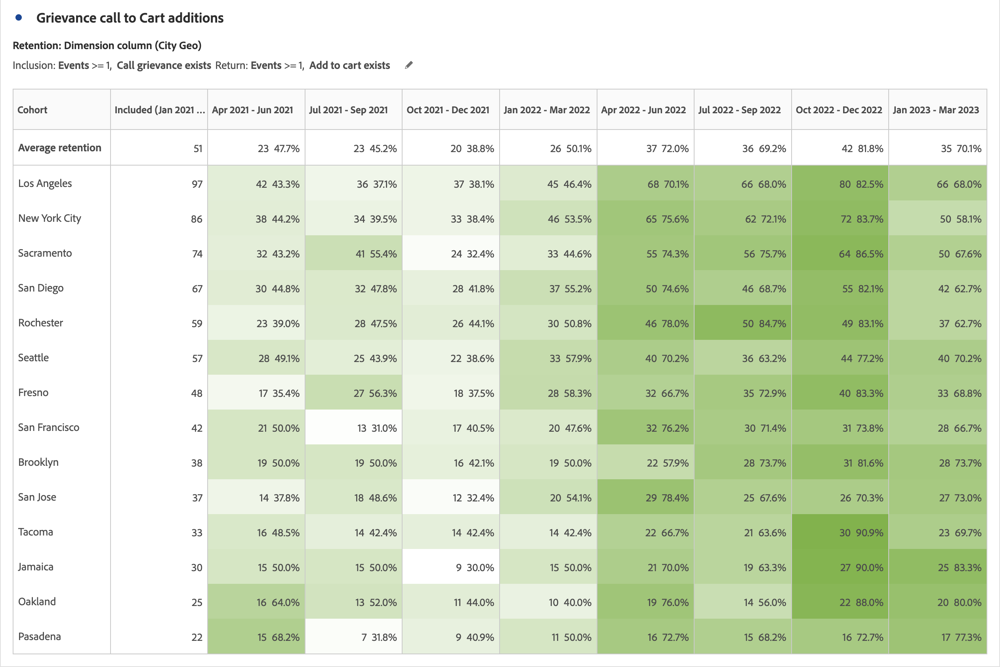

# Vue d’ensemble de la table de cohorte {#cohort-table-overview}

<!-- markdownlint-disable MD034 -->

>[!CONTEXTUALHELP]
>id="workspace_cohorttable_button"
>title="Table de cohorte"
>abstract="Créez une visualisation de cohorte pour regrouper les utilisateurs et utilisatrices en fonction de la fin d’un événement et analyser l’évolution de l’engagement et de l’attrition client."

<!-- markdownlint-enable MD034 -->

<!-- markdownlint-disable MD034 -->

>[!CONTEXTUALHELP]
>id="workspace_cohorttable_panel"
>title="Table de cohorte"
>abstract="Regroupez les utilisateurs et utilisatrices en fonction de la fin d’un événement, puis analysez l’évolution de l’engagement et de l’attrition client. Spécifiez des paramètres supplémentaires tels que la granularité, le type d’analyse des cohortes et l’utilisation ou non du calcul variable. Vous pouvez définir des options avancées pour créer un tableau de latence ou une cohorte de dimension personnalisée en fonction d’une dimension sélectionnée."

<!-- markdownlint-enable MD034 -->

>[!BEGINSHADEBOX]

_Cet article présente le tableau de cohortes dans_  _&#x200B;**Customer Journey Analytics**._ _Voir [Tableau de cohortes](https://experienceleague.adobe.com/fr/docs/analytics/analyze/analysis-workspace/visualizations/cohort-table/cohort-analysis) pour la version_  _&#x200B;**Adobe Analytics** de cet article._

>[!ENDSHADEBOX]

Une *cohorte* est un groupe de personnes partageant des caractéristiques communes au cours d’une période spécifique. Une visualisation  **[!UICONTROL Table de cohorte]** s’avère utile, par exemple, pour savoir de quelle façon une cohorte réagit par rapport à une marque. Vous pouvez facilement déceler des changements de tendances, pour y réagir en conséquence. (Vous trouverez des explications sur l’[!UICONTROL analyse des cohortes] sur le Web, tel le cours [Cohort Analysis 101](https://fr.wikipedia.org/wiki/Cohort_analysis) (en anglais).)

Après avoir créé un rapport de cohorte, vous pouvez en traiter les composants (dimensions, mesures et segments spécifiques), puis partager le rapport avec les personnes de votre choix. Consultez la section [Traitement et partage](/help/analysis-workspace/curate-share/curate.md).

Exemples d’utilisation de la [!UICONTROL Table de cohorte] :

* Lancez des campagnes conçues pour déclencher une action spécifique.
* Ajustez le budget marketing exactement au bon moment au cours du cycle de vie des clients.
* Sachez reconnaître quand terminer un essai ou une offre pour en optimiser la valeur.
* Trouvez des idées de test A/B dans des domaines tels que le prix, le cheminement de mise à niveau, etc.

La [!UICONTROL Table de cohorte] est disponible pour tous les clientes et clients Customer Journey Analytics avec des droits d’accès à [!UICONTROL Analysis Workspace].

>[!BEGINSHADEBOX]

Consultez  [Analyse des cohortes dans Analysis Workspace](https://experienceleague.adobe.com/fr/docs/analytics-learn/tutorials/analysis-workspace/cohort-analysis/cohort-analysis-workspace){target="_blank"} pour une vidéo de démonstration.

{{videoaa}}

>[!ENDSHADEBOX]

>[!IMPORTANT]
>
>Lʼ[!UICONTROL analyse de cohortes] ne prend pas en charge les mesures qui ne peuvent pas être segmentées (y compris les mesures calculées), les mesures non entières (telles que le chiffre d’affaires) ou les occurrences. Seules les mesures pouvant être utilisées dans les segments sont compatibles avec une [!UICONTROL analyse de cohortes], mais elles ne peuvent être augmentées que de 1 à la fois.

Les tables de cohorte de Customer Journey Analytics prennent en charge les mesures à base double (ou à base numérique en général). Par exemple, la valeur Purchase.Value (double) peut être utilisée comme mesure d’inclusion/retour. En outre, toutes les mesures transmises à Adobe Experience Platform par le biais du connecteur source Analytics sont également doubles.

## Fonctionnalités de la table de cohorte

Les sections suivantes décrivent les fonctionnalités d’analyse des cohortes qui permettent un contrôle précis des cohortes que vous créez.

Pour plus d’informations sur la création d’une cohorte et l’exécution d’un rapport [!UICONTROL Analyse des cohortes], consultez [Configurer une table de cohorte](/help/analysis-workspace/visualizations/cohort-table/t-cohort.md).

### Table de rétention

Une table de cohorte de [!UICONTROL rétention] renvoie des personnes : chaque cellule de données indique le nombre brut et le pourcentage de personnes dans la cohorte qui ont effectué l’action durant cette période. Vous pouvez inclure jusqu’à 3 mesures et 10 segments.

### Tableau de résiliation

Une table de cohorte d’[!UICONTROL attrition] est l’opposé d’un tableau de rétention. Elle indique les personnes qui ont abandonné ou n’ont jamais rempli les critères de retour de votre cohorte au fil du temps. Vous pouvez inclure jusqu’à 3 mesures et 10 segments.

### Calcul évolutif

Vous pouvez calculer la rétention ou l’attrition en fonction de la colonne précédente, et non de la colonne incluse, que l’on appelle calcul glissant.

### Tableau de latence

Un tableau de latence mesure la durée écoulée avant et après l’événement d’inclusion. La mesure de la latence est un excellent outil pré-/post-analyse. La colonne **[!UICONTROL Inclus]** se trouve au centre du tableau, tandis que les périodes avant et après l’événement d’inclusion sont affichées des deux côtés.

### Cohorte de dimension personnalisée

Vous pouvez créer des cohortes sur la base d’une dimension sélectionnée, et non des cohortes en fonction du temps, qui sont les cohortes par défaut. Utilisez des dimensions telles que [!UICONTROL Ville géographique], [!UICONTROL Canal marketing], [!UICONTROL campagne], [!UICONTROL produit], [!UICONTROL page], [!UICONTROL région] ou toute autre dimension pour afficher l’évolution de la rétention. En fonction des différentes valeurs de ces dimensions.

>[!MORELIKETHIS]
>
>[Configurez une table de cohorte](/help/analysis-workspace/visualizations/cohort-table/t-cohort.md).
>

