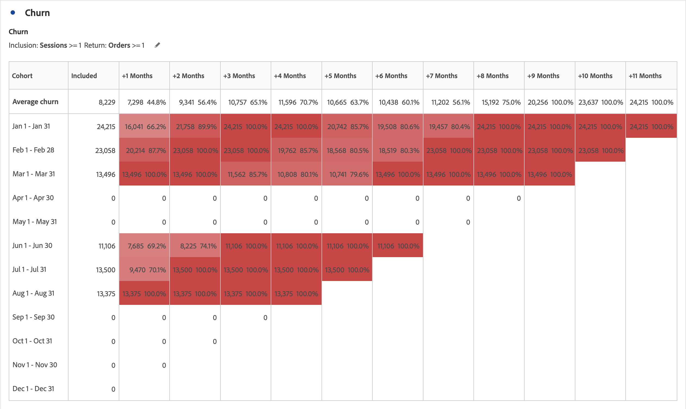

# Tableau de cohortes - Aperçu {#cohort-table-overview}

<!-- markdownlint-disable MD034 -->

>[!CONTEXTUALHELP]
>id="cja_workspace_cohorttable_button"
>title="Tableau de cohortes"
>abstract="Créez une visualisation de cohortes pour regrouper les utilisateurs en fonction de la fin d’un événement et analysez l’engagement et la perte de clientèle au fil du temps."

<!-- markdownlint-enable MD034 -->

<!-- markdownlint-disable MD034 -->

>[!CONTEXTUALHELP]
>id="cja_workspace_cohorttable_panel"
>title="Tableau de cohortes"
>abstract="Regroupez les utilisateurs en fonction de la fin d’un événement, puis analysez leur engagement et leur perte de clientèle au fil du temps.  **Paramètres ** **Critères d’inclusion** : composants utilisés pour définir vos cohortes initiales de visiteurs. **Critères de retour** : composants utilisés pour déterminer si un visiteur est revenu."

<!-- markdownlint-enable MD034 -->

Une *cohorte* est un groupe de personnes partageant des caractéristiques communes au cours d’une période spécifiée. Une visualisation  **[!UICONTROL {tableau de cohortes]** est utile, par exemple, pour savoir comment une cohorte interagit avec une marque. Vous pouvez facilement déceler des changements de tendances, pour y réagir en conséquence. (Vous trouverez des explications sur l’[!UICONTROL analyse des cohortes] sur le Web, tel le cours [Cohort Analysis 101](https://fr.wikipedia.org/wiki/Cohort_analysis) (en anglais).)

Après avoir créé un rapport de cohorte, vous pouvez en traiter les composants (dimensions, mesures et filtres spécifiques), puis partager le rapport avec les personnes de votre choix. Consultez la section [Traitement et partage](/help/analysis-workspace/curate-share/curate.md).

Exemples de ce que vous pouvez faire avec une [!UICONTROL table de cohortes] :

* Lancez des campagnes conçues pour déclencher une action spécifique.
* Ajustez le budget marketing exactement au bon moment au cours du cycle de vie des clients.
* Reconnaissez quand terminer un essai ou une offre pour en optimiser la valeur.
* Trouvez des idées de test A/B dans des domaines tels que le prix, le cheminement de mise à niveau, etc.

[!UICONTROL La table des cohortes] est disponible pour tous les clients Customer Journey Analytics ayant des droits d’accès à [!UICONTROL Analysis Workspace].

+++ Affichez une démonstration vidéo du tableau de cohortes.

>[!VIDEO](https://video.tv.adobe.com/v/23990/?quality=12)

{{videoaa}}

+++

>[!IMPORTANT]
>
>[!UICONTROL L’analyse des cohortes] ne prend pas en charge les mesures non filtrables (y compris les mesures calculées), les mesures non entières (telles que les recettes) ou les occurrences. Seules les mesures pouvant être utilisées dans les filtres peuvent être utilisées dans l’ [!UICONTROL analyse des cohortes], et elles ne peuvent être incrémentées que 1 à la fois.

## Fonctionnalités des tableaux de cohortes

Les capacités suivantes vous permettent d’exercer un contrôle précis sur les cohortes que vous créez :

### Table [!UICONTROL Rétention]

Une table de cohorte de [!UICONTROL rétention] renvoie des personnes : chaque cellule indique le nombre brut et le pourcentage de personnes dans la cohorte qui ont effectué l’action durant cette période. Vous pouvez inclure jusqu’à 3 mesures et 10 filtres.

### Table [!UICONTROL Churn]

Une table de cohortes [!UICONTROL perte de clientèle] est l’inverse d’une table de rétention et affiche les personnes qui ont abandonné ou n’ont jamais rempli les critères de retour de votre cohorte au fil du temps. Vous pouvez inclure jusqu’à 3 mesures et 10 filtres.

### [!UICONTROL Calcul variable]

Vous pouvez calculer la rétention ou la perte de clientèle en fonction de la colonne précédente, et non de la colonne incluse, appelée calcul variable.

### Table [!UICONTROL Latence]

Un tableau de latence mesure le temps qui s’est écoulé avant et après l’événement d’inclusion. La mesure de la latence est un excellent outil d’analyse avant et après. La colonne **[!UICONTROL Inclus]** se trouve au centre du tableau, tandis que les périodes avant et après l’événement d’inclusion sont affichées des deux côtés.

### Cohorte [!UICONTROL Dimension personnalisée]

Vous pouvez créer des cohortes en fonction d’une dimension sélectionnée, et non des cohortes en fonction du temps (qui sont les cohortes par défaut). Utilisez des dimensions telles que [!UICONTROL Ville géo], [!UICONTROL Canal marketing], [!UICONTROL campaign], [!UICONTROL product], [!UICONTROL page], [!UICONTROL région] ou toute autre dimension pour afficher l’évolution de la rétention. En fonction des différentes valeurs de ces dimensions.

>[!MORELIKETHIS]
>
>[Configurer une table de cohortes](/help/analysis-workspace/visualizations/cohort-table/t-cohort.md).
>

