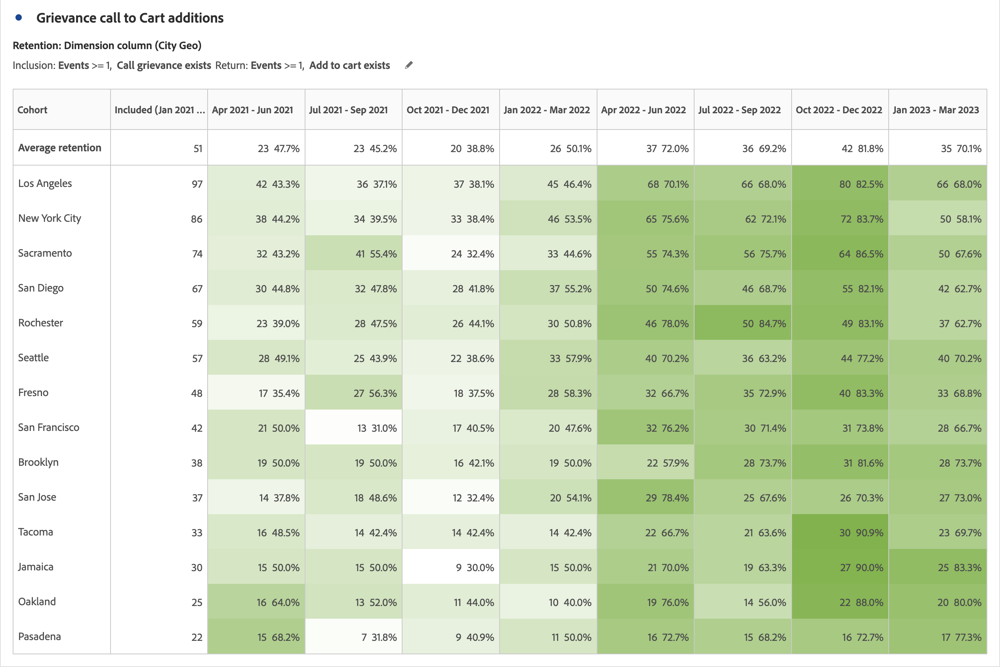

# Vue d’ensemble de la table de cohorte {#cohort-table-overview}

<!-- markdownlint-disable MD034 -->

>[!CONTEXTUALHELP]
>id="workspace_cohorttable_button"
>title="Table de cohorte"
>abstract="Créez une visualisation de cohorte pour regrouper les utilisateurs et utilisatrices en fonction de la fin d’un événement et analyser l’évolution de l’engagement et de l’attrition client."

<!-- markdownlint-enable MD034 -->

<!-- markdownlint-disable MD034 -->

>[!CONTEXTUALHELP]
>id="workspace_cohorttable_panel"
>title="Table de cohorte"
>abstract="Regroupez les utilisateurs et utilisatrices en fonction de la fin d’un événement, puis analysez l’évolution de l’engagement et de l’attrition client.  **Paramètres ** **Critères d’inclusion** : composants utilisés pour définir vos cohortes initiales de visiteurs et visiteuses. **Critères de retour** : composants utilisés pour savoir si un visiteur ou une visiteuse revient."

<!-- markdownlint-enable MD034 -->

>[!BEGINSHADEBOX]

*Cet article documente le tableau de cohortes dans **Customer Journey Analytics**. Voir [Tableau de cohorte](https://experienceleague.adobe.com/en/docs/analytics/analyze/analysis-workspace/visualizations/cohort-table/cohort-analysis) pour la version **Adobe Analytics**de cet article.*

>[!ENDSHADEBOX]

Une *cohorte* est un groupe de personnes partageant des caractéristiques communes sur une période spécifiée. Une visualisation  **[!UICONTROL Tableau de cohorte]** est utile, par exemple, pour savoir comment une cohorte interagit avec une marque. Vous pouvez facilement déceler des changements de tendances, pour y réagir en conséquence. (Vous trouverez des explications sur l’[!UICONTROL analyse des cohortes] sur le Web, tel le cours [Cohort Analysis 101](https://fr.wikipedia.org/wiki/Cohort_analysis) (en anglais).)

Après avoir créé un rapport de cohorte, vous pouvez en traiter les composants (dimensions, mesures et filtres spécifiques), puis partager le rapport avec les personnes de votre choix. Consultez la section [Traitement et partage](/help/analysis-workspace/curate-share/curate.md).

Exemples de ce que vous pouvez faire avec un [!UICONTROL tableau de cohortes] :

* Lancez des campagnes conçues pour déclencher une action spécifique.
* Ajustez le budget marketing exactement au bon moment au cours du cycle de vie des clients.
* Identifiez le moment où terminer une version d’évaluation ou une offre afin d’en optimiser la valeur.
* Trouvez des idées de test A/B dans des domaines tels que le prix, le cheminement de mise à niveau, etc.

[!UICONTROL Tableau de cohorte] est disponible pour tous les clients Customer Journey Analytics disposant de droits d’accès à [!UICONTROL Analysis Workspace].

+++ Regardez une vidéo de démonstration du tableau de cohorte.

>[!VIDEO](https://video.tv.adobe.com/v/23990/?quality=12)

{{videoaa}}

+++

>[!IMPORTANT]
>
>L’[!UICONTROL Analyse des cohortes] ne prend pas en charge les mesures non filtrables (y compris les mesures calculées), les mesures non entières (telles que le chiffre d’affaires) ou les occurrences. Seules les mesures pouvant être utilisées dans les filtres peuvent être utilisées dans [!UICONTROL Analyse des cohortes] et elles ne peuvent être incrémentées que de 1 à la fois.

Les tableaux de cohortes dans Customer Journey Analytics prennent en charge les mesures à double base (ou toute mesure numérique). Par exemple, la valeur Purchase.Value (un double) peut être utilisée comme mesure d’inclusion/retour. En outre, toutes les mesures transmises à Adobe Experience Platform par le biais du connecteur Source Analytics sont également doublées.

## Fonctionnalités du tableau de cohorte

Les capacités suivantes vous permettent d’exercer un contrôle précis sur les cohortes que vous créez :

### Table [!UICONTROL Retention]

Un tableau de cohorte [!UICONTROL Rétention] renvoie des personnes : chaque cellule de données affiche le nombre brut et le pourcentage de personnes de la cohorte qui ont effectué l’action au cours de cette période. Vous pouvez inclure jusqu’à 3 mesures et 10 filtres.

### Tableau [!UICONTROL résiliation]

Un tableau de cohortes [!UICONTROL Perte de clientèle] est l’inverse d’un tableau de rétention et montre les personnes qui ont abandonné ou qui n’ont jamais satisfait aux critères de retour de votre cohorte au fil du temps. Vous pouvez inclure jusqu’à 3 mesures et 10 filtres.

### [!UICONTROL Calcul variable]

Vous pouvez calculer la rétention ou l’attrition en fonction de la colonne précédente, et non de la colonne incluse, que l’on appelle calcul glissant.

### Tableau [!UICONTROL Latence]

Un tableau sur la latence mesure le temps écoulé avant et après l’événement d’inclusion. La mesure de la latence est un excellent outil pour l’analyse avant et après. La colonne **[!UICONTROL Inclus]** se trouve au centre du tableau, tandis que les périodes avant et après l’événement d’inclusion sont affichées des deux côtés.

### [!UICONTROL Dimension personnalisée] cohorte

Vous pouvez créer des cohortes basées sur une dimension sélectionnée et non sur le temps (qui sont les valeurs par défaut). Utilisez des dimensions telles que [!UICONTROL Ville géographique], [!UICONTROL Canal marketing], [!UICONTROL campagne], [!UICONTROL produit], [!UICONTROL page], [!UICONTROL region] ou toute autre dimension pour afficher l’évolution de la rétention. En fonction des différentes valeurs de ces dimensions.

>[!MORELIKETHIS]
>
>[Configurer un tableau de cohortes](/help/analysis-workspace/visualizations/cohort-table/t-cohort.md).
>

