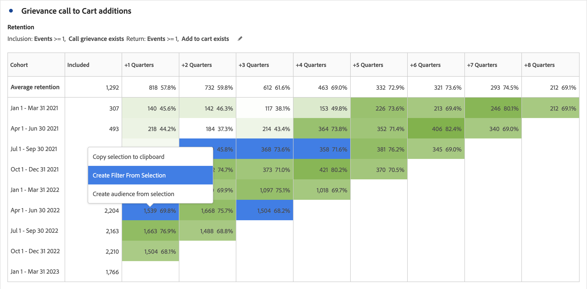

# Configuration d’une table de cohorte

Pour créer et configurer une [!UICONTROL table de cohortes] :

1. Ajoutez une visualisation  ****. Voir [Ajout d’une visualisation à un panneau](../freeform-analysis-visualizations.md#add-visualizations-to-a-panel).

1. Définissez les **[!UICONTROL critères d’inclusion]**, **[!UICONTROL les critères de retour]**, **[!UICONTROL le type de cohorte]** et **[!UICONTROL les paramètres]** tel qu’illustré dans le tableau ci-dessous.

   

   | Élément | Description |
   |--- |--- |
   | **[!UICONTROL Critères d’inclusion]** | Vous pouvez appliquer jusqu’à dix filtres d’inclusion et trois mesures d’inclusion. La mesure spécifie la cohorte à laquelle appartient un utilisateur. Par exemple, si la mesure d’inclusion est Commandes, seuls les utilisateurs qui ont passé une commande au cours de la période de l’analyse des cohortes sont inclus dans la cohorte initiale. L’opérateur par défaut entre les mesures est AND, mais vous pouvez le changer en OR. En outre, vous pouvez ajouter un filtrage numérique à ces mesures. Par exemple : `Sessions >= 1`.  |
   | **[!UICONTROL Critères de retour]** | Vous pouvez appliquer jusqu’à dix filtres de retour et trois mesures de retour. La mesure indique si l’utilisateur a été fidélisé (rétention) ou non (perte de clientèle). Par exemple, si la mesure de retour est Affichages de vidéos, seuls les utilisateurs qui ont affiché des vidéos au cours des périodes suivantes (après la période pendant laquelle ils ont été ajoutés à une cohorte) sont représentés comme fidélisés. Les sessions quantifient également la rétention. |
   | **[!UICONTROL Granularité]** | Granularité temporelle : jour, semaine, mois, trimestre ou année. |
   | **[!UICONTROL Type]** | **[!UICONTROL Rétention]** (par défaut) : une cohorte de **[!UICONTROL rétention]** mesure dans quelle mesure vos cohortes de personnes retournent sur votre propriété au fil du temps. Une cohorte de rétention est la cohorte standard et indique le comportement de l’utilisateur récurrent et récurrent. Une couleur verte indique une cohorte de [!UICONTROL rétention] dans le tableau. **[!UICONTROL Perte de clientèle ]**: une cohorte de**[!UICONTROL  perte de clientèle ]**(également appelée attrition ou abandon) mesure la façon dont vos cohortes de personnes abandonnent votre propriété au fil du temps. La perte de clientèle est l’inverse de la rétention : `Churn = 1 - Retention`. La [!UICONTROL perte de clientèle] est une bonne mesure de l’attractivité et de l’opportunité, car elle vous indique la fréquence à laquelle les clients ne reviennent pas. Vous pouvez utiliser la perte de clientèle pour analyser et identifier les zones d’intérêt : quels filtres de cohortes pourraient avoir besoin d’attention ? Une couleur rouge indique une cohorte de [!UICONTROL perte de clientèle] dans le tableau (semblable à l’abandon dans la visualisation**[!UICONTROL  Flux ]**).  |
   | **[!UICONTROL Paramètres]** | **[!UICONTROL Calcul variable]** : calculez la rétention ou la perte de clientèle en fonction de la colonne précédente, plutôt que de la colonne Inclus (par défaut). Le [!UICONTROL calcul variable] change la méthode de calcul pour vos périodes de « retour ». Le calcul normal trouve les utilisateurs qui répondent aux critères de retour et faisaient partie de la période d’inclusion. Qu’ils aient été ou non dans la cohorte pour la période précédente. Au lieu de cela, le [!UICONTROL calcul variable] trouve les utilisateurs qui répondent aux critères de « retour » et faisaient partie de la période précédente. Par conséquent, le [!UICONTROL calcul variable] filtre et fait passer par des entonnoirs les utilisateurs qui répondent continuellement aux critères de « retour », période après période. Les critères de [!UICONTROL retour] sont appliqués à chacune des périodes menant à la période sélectionnée.   **[!UICONTROL Tableau de latence ]**: une [!UICONTROL table de latence] mesure le temps qui s’est écoulé avant et après l’événement d’inclusion. [!UICONTROL Table de latence] est très pratique pour les analyses avant/après. Par exemple, vous allez lancer une campagne ou un produit et vous voulez suivre le comportement avant et après le lancement. Le [!UICONTROL tableau de latence] affiche côte à côte le comportement avant et après pour voir l’impact direct. Les cellules de préinclusion dans la [!UICONTROL table de latence] calculent les utilisateurs qui répondent aux critères d’ [!UICONTROL inclusion] pendant la période d’inclusion, puis répondent aux critères de [!UICONTROL retour] dans les périodes précédant la période d’inclusion. Notez que [!UICONTROL table de latence] et [!UICONTROL Cohorte de dimension personnalisée] ne peuvent pas être utilisés ensemble.  **[!UICONTROL Cohorte de dimension personnalisée]** : créez des cohortes en fonction de la dimension sélectionnée, plutôt que des cohortes en fonction du temps (par défaut). Nombre de clients veulent analyser leurs cohortes en fonction d’autres aspects que le temps. La nouvelle fonctionnalité Cohorte de dimension personnalisée vous fournit la flexibilité de créer des cohortes en fonction des dimensions de votre choix. Utilisez des dimensions, telles que le canal marketing, la campagne, le produit, la page, la région ou toute autre dimension, pour afficher l’évolution de la rétention en fonction des différentes valeurs de ces dimensions. La définition de filtre de cohorte de [!UICONTROL dimension personnalisée] applique la dimension uniquement dans le cadre de la période d’inclusion, et non dans le cadre de la définition du renvoi.  Après avoir choisi l’option [!UICONTROL Cohorte de dimension personnalisée], vous pouvez faire glisser et déposer n’importe quelle dimension dans la zone de dépôt. L’ajout de dimensions vous permet de comparer des éléments de dimension similaires sur la même période. Vous pouvez par exemple comparer les performances des villes côte à côte, des produits, des campagnes, etc. Le tableau de cohortes renvoie vos 14 premiers éléments de dimension. Cependant, vous pouvez utiliser un filtre  pour n’afficher que les éléments de dimension souhaités. Une [!UICONTROL cohorte de dimension personnalisée] ne peut pas être utilisée avec la fonction [!UICONTROL table de latence].  |

1. Cliquez sur **[!UICONTROL Créer]**.
1. Pour reconfigurer la [!UICONTROL table des cohortes], sélectionnez .

1. (Facultatif) Créez un filtre ou une audience d’après une sélection.

   Sélectionnez des cellules (contiguës ou non), puis cliquez avec le bouton droit de la souris > **[!UICONTROL Créer un filtre d’après la sélection]**.

   

1. Dans le [Créateur de filtres](/help/components/filters/filter-builder.md), modifiez davantage le filtre, puis cliquez sur **[!UICONTROL Enregistrer]**.

   Le filtre enregistré est disponible pour utilisation dans le panneau [!UICONTROL Filtre] dʼ[!UICONTROL Analysis Workspace].

## Paramètres

Vous pouvez définir des paramètres spécifiques pour une [!UICONTROL table de cohortes].

1. Sélectionnez  pour ajuster les paramètres de la [!UICONTROL table des cohortes].

   | Paramètre | Description |
   |---|---|
   | **Afficher uniquement le pourcentage** | Supprime la valeur numérique et affiche uniquement le pourcentage. |
   | **Arrondir le pourcentage à l’entier le plus proche** | Arrondit la valeur de pourcentage à l’entier le plus proche au lieu d’afficher la valeur décimale. |
   | **Afficher la ligne en pourcentage moyen** | Insère une nouvelle ligne en haut du tableau, puis ajoute la moyenne des valeurs dans chaque colonne. |

>[!MORELIKETHIS]
>
>[Ajouter une visualisation à un panneau](/help/analysis-workspace/visualizations/freeform-analysis-visualizations.md#add-visualizations-to-a-panel)
>[Paramètres de visualisation](/help/analysis-workspace/visualizations/freeform-analysis-visualizations.md#settings)
>[Menu contextuel de visualisation](/help/analysis-workspace/visualizations/freeform-analysis-visualizations.md#context-menu)
>

