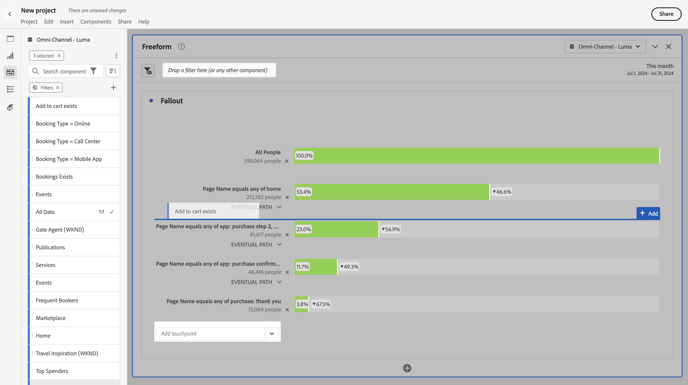

# Application de segments dans l’analyse des abandons

Dans Analysis Workspace, vous pouvez créer des segments d’après un point de contact, ajouter des segments comme point de contact et comparer des processus clés pour plusieurs segments.

>[!IMPORTANT]
>
>Les segments utilisés comme points de contrôle dans la visualisation Abandons doivent utiliser un conteneur qui se trouve à un niveau inférieur par rapport au contexte global de la visualisation Abandons. Dans le cas d’une visualisation Abandon dans le contexte d’une personne, les segments utilisés comme points de contrôle doivent être des segments basés sur une session ou un événement. Avec une visualisation des abandons en contexte de session, les segments utilisés comme points de contrôle doivent être des segments basés sur un événement. Si vous utilisez une combinaison non valide, l’abandon est de 100 %. Un avertissement s’affiche dans la visualisation des abandons lorsque vous ajoutez un segment incompatible comme point de contact. Certaines combinaisons de conteneurs de segments non valides entraînent des diagrammes d’abandons non valides, par exemple :
>
>* Utilisation d’un segment basé sur les personnes comme point de contact dans une visualisation des abandons avec contexte de personne
>* Utilisation d’un segment basé sur une personne comme point de contact dans une visualisation des abandons avec contexte de session
>* Utilisation d’un segment basé sur une session comme point de contact dans une visualisation des abandons avec contexte de session

## Création d’un segment à partir d’un point de contact

1. Créez un segment d’après un point de contact donné qui vous intéresse particulièrement et qu’il peut être utile d’appliquer à d’autres rapports. Cliquez avec le bouton droit sur le point de contact et sélectionnez **[!UICONTROL Créer un segment à partir du point de contact]**.

   

   Le [!UICONTROL créateur de segments] s’ouvre ; il est prérempli avec le segment séquentiel préconfiguré qui correspond au point de contact que vous avez sélectionné :

   

1. Nommez et décrivez le segment, puis enregistrez-le.

   Vous pouvez désormais utiliser ce segment dans le projet de votre choix.

## Ajout d’un segment comme point de contact

Si, par exemple, pour vos utilisateurs aux États-Unis, vous souhaitez connaître les tendances qui se dégagent et de quelle façon les abandons sont affectés, faites glisser le segment correspondant à ces utilisateurs sur l’abandon :

Vous pouvez aussi créer un point de contact ET en faisant glisser le segment des utilisateurs aux États-Unis sur un autre point de contrôle.

## Comparaison des segments dans la visualisation Abandons

Vous pouvez comparer un nombre illimité de segments dans la visualisation Abandons.

1. Sélectionnez les segments à comparer dans le panneau [!UICONTROL Segment] à gauche. Dans l’exemple, trois segments sont sélectionnés : *Informations de vol : Version de page A*, *Informations de vol : Version de page B* et *Informations de vol : Version de page C*.
1. Faites glisser les trois segments sur la zone de dépôt de segments en haut de la visualisation.

1. Facultatif : vous pouvez conserver *Toutes les visites* comme conteneur par défaut ou supprimer le conteneur.

   

1. Vous pouvez maintenant comparer les abandons entre les trois segments, par exemple pour savoir où un segment est plus performant qu’un autre, ou obtenir d’autres informations.
