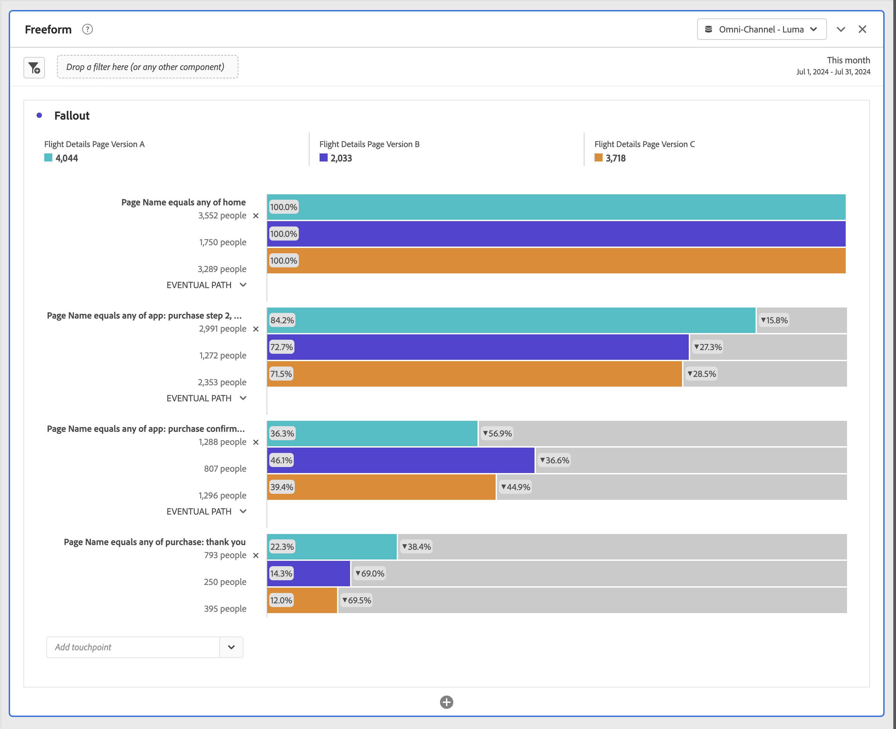

# Application de segments dans l’analyse des abandons

Vous pouvez créer des segments à partir d’un point de contact, ajouter des filtres comme point de contact et comparer les workflows clés à travers différents filtres dans Analysis Workspace.

>[!IMPORTANT]
>
>Les filtres utilisés comme points de contrôle dans les abandons doivent utiliser un conteneur qui se trouve à un niveau inférieur par rapport au contexte global de la visualisation des abandons. Dans le cas d’une visualisation Abandon dans le contexte d’une personne, les filtres utilisés comme points de contrôle doivent être des filtres basés sur une session ou un événement. Avec une visualisation des abandons en contexte de session, les filtres utilisés comme points de contrôle doivent être des filtres basés sur un événement. Si vous utilisez une combinaison non valide, l’abandon est de 100 %. Un avertissement s’affiche dans la visualisation des abandons lorsque vous ajoutez un filtre incompatible comme point de contact. Certaines combinaisons de conteneurs de filtres non valides entraînent des diagrammes Abandons non valides, tels que :
>
>* Utilisation d’un filtre basé sur les personnes comme point de contact dans une visualisation des abandons avec contexte de personne
>* Utilisation d’un filtre basé sur les personnes comme point de contact dans une visualisation des abandons avec contexte de session
>* Utilisation d’un filtre basé sur les sessions comme point de contact dans une visualisation des abandons avec contexte de session

## Création d’un filtre à partir d’un point de contact

1. Créez un filtre à partir d’un point de contact donné qui vous intéresse particulièrement et qu’il pourrait être utile d’appliquer à d’autres rapports. Cliquez avec le bouton droit sur le point de contact et sélectionnez **[!UICONTROL Créer un filtre à partir du point de contact]**.

   

   Le [!UICONTROL créateur de filtres] s’ouvre ; il est prérempli avec le filtre séquentiel préconfiguré qui correspond au point de contact que vous avez sélectionné :

   

1. Donnez un titre et une description au filtre et enregistrez-le.

   Vous pouvez maintenant utiliser ce filtre dans le projet de votre choix.

## Ajout d’un filtre comme point de contact

Si, par exemple, vous souhaitez connaître les tendances qui se dégagent pour vos utilisateurs aux États-Unis et de quelle façon les abandons sont affectés, faites glisser le filtre correspondant à ces utilisateurs sur les abandons :

Vous pouvez aussi créer un point de contact AND en faisant glisser le filtre des utilisateurs aux États-Unis sur un autre point de contrôle.

## Comparaison des filtres dans la visualisation des abandons

Vous pouvez comparer un nombre illimité de filtres dans la visualisation des abandons.

1. Sélectionnez les filtres à comparer dans le panneau [!UICONTROL Filtre] sur la gauche. Dans l’exemple, trois filtres sont sélectionnés : *Informations de vol : Version de page A*, *Informations de vol : Version de page B* et *Informations de vol : Version de page C*.
1. Faites glisser les trois filtres sur la zone de dépôt Filtre en haut de la visualisation.

1. Facultatif : vous pouvez conserver *Toutes les visites* comme conteneur par défaut ou supprimer le conteneur.

   

1. Vous pouvez maintenant comparer les abandons entre les trois filtres, par exemple pour savoir si un filtre est plus performant qu’un autre, ou obtenir d’autres informations.
