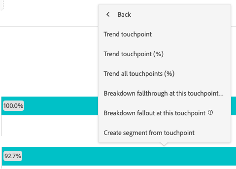

# Configuration d’une visualisation Abandons {#configure-fallout-visualization}

Vous pouvez spécifier des **points de contact** pour créer une séquence d’abandons multidimensionnelle. Dans de nombreux cas, un point de contact est une page de votre site. Ils ne se limitent toutefois pas à cela. Vous pouvez par exemple ajouter des événements, tels que des unités, ainsi que des personnes uniques et des visites récurrentes. Vous pouvez aussi ajouter des dimensions, telles qu’une catégorie, un type de navigateur ou un terme de recherche interne.

Il est possible en outre d’ajouter des segments dans un point de contact, Par exemple, vous pouvez comparer des segments, tels que les utilisateurs d’iOS et d’Android. Faites glisser les segments à comparer en haut de l’abandon pour ajouter des informations sur ces segments au rapport sur les abandons. Si vous souhaitez n’afficher que ces segments, vous pouvez supprimer la ligne de base Toutes les personnes.

Les visualisations des abandons ne comportent aucune limitation quant au nombre de points de contact que vous pouvez ajouter ou au nombre de composants que vous pouvez utiliser.

Vous pouvez effectuer un cheminement sur des dimensions, des mesures et des segments. Supposons, par exemple, que quelqu’un `shoes, shirt` regarde sur une page et que, sur la page suivante, il regarde `shirt, socks`. Le prochain rapport de flux de produits généré à partir des chaussures portera sur chemise et chaussettes, SAUF chemise.

## Utilisation

1. Ajoutez une visualisation  **[!UICONTROL Abandon]**. Voir [Ajouter une visualisation à un panneau](../freeform-analysis-visualizations.md#add-visualizations-to-a-panel).

1. Faites glisser un composant vers le menu déroulant **[!UICONTROL Ajouter un point de contact]**.

   >[!TIP]
   >
   >Vous pouvez ajouter une seule page au rapport sur les abandons, plutôt que la dimension entière. Cliquez sur la flèche droite  sur la dimension de page pour sélectionner une page spécifique, telle que **[!UICONTROL accueil]**, à ajouter au rapport sur les abandons.

   

1. Continuez à ajouter des points de contact jusqu’à ce que votre séquence soit complète.

   Les nombres encadrés dans la partie grise de la barre correspondent aux abandons entre les points de contact (et non à l’ensemble des abandons à ce point). Les nombres entourés dans la partie verte de la barre indiquent la réussite de l’abaissement du point de contact précédent au point de contact actuel.

   

   Lors de l’ajout de points de contact, vous pouvez effectuer l’une des opérations suivantes :

   * Combinez plusieurs composants en faisant glisser un ou plusieurs composants supplémentaires sur un seul point de contact.

     >[!NOTE]
     >
     >Plusieurs segments sont reliés par l’opérateur ET, mais plusieurs éléments, tels que des éléments de dimension et les mesures, sont reliés par l’opérateur OU.

   * Réorganisez les points de contact en les faisant glisser vers un autre niveau dans la hiérarchie des abandons.

   * Combinez deux points de contact en faisant glisser un point de contact sur un autre. Déposez le point de contact lorsque vous voyez le mot **[!UICONTROL Combiner]**.

   * Contraindre des points de contact individuels à l’événement suivant (par opposition à *éventuellement*) dans le chemin. Sous chaque point de contact se trouve un sélecteur avec les options **[!UICONTROL Chemin éventuel]** et **[!UICONTROL Événement suivant]**, comme illustré ici :

     | Option | Description |
     |---|---|
     | **[!UICONTROL Chemin définitif]** (par défaut) | Nombre de personnes qui *finiront* par accéder à la page suivante du chemin d’accès, mais pas nécessairement au prochain événement. |
     | **[!UICONTROL Événement suivant]** | Les personnes qui arriveront à la page suivante du parcours lors du prochain événement sont comptées. |

   * Pointez sur un point de contact pour afficher l’abandon et d’autres informations sur ce niveau. Les informations incluent le nom du point de contact, le nombre de personnes et le taux de réussite. Vous pouvez également comparer le taux de succès à d’autres points de contact.

## Paramètres {#settings}

>[!CONTEXTUALHELP]
>id="workspace_fallout_container"
>title="Conteneur d’abandons"
>abstract="Sélectionnez un conteneur pour analyser le cheminement. Cette sélection vous permet de comprendre l’engagement et de contraindre l’analyse au conteneur sélectionné."

Dans le cadre de la visualisation, des paramètres spécifiques sont disponibles.

| Conteneur d’abandons | Description |
|--- |--- |
| **[!UICONTROL Session]** ou **[!UICONTROL Personne]** | Permet de basculer entre [!UICONTROL Session] et [!UICONTROL Personne] afin d’analyser le cheminement de la personne. La valeur par défaut est [!UICONTROL Personne]. Ces paramètres permettent de comprendre l’engagement des personnes au niveau des personnes (sur les sessions) ou de contraindre l’analyse à une seule session. |

## Menu contextuel

Dans le cadre de la visualisation, des options de menu contextuel spécifiques sont disponibles.

### Accès au menu contextuel

Vous pouvez accéder au menu contextuel de l’une des manières suivantes :

* Pointez sur un point de contact dans la visualisation, puis sélectionnez **[!UICONTROL Cliquer pour analyser]**.

  

* Cliquez avec le bouton droit sur un point de contact dans la visualisation.

  

### Options du menu contextuel

Les options de menu contextuel suivantes sont disponibles :

| Option | Description |
|--- |--- |
| **[!UICONTROL Tendance du point de contact]** | Consultez dans un graphique linéaire les données sur les tendances d’un point de contact, avec quelques données de détection des anomalies prédéfinies. |
| **[!UICONTROL Tendance du point de contact (%)]** | Calcule la tendance du pourcentage total d’abandons. |
| **[!UICONTROL Tendance de tous les points de contact (%)]** | Calcule la tendance de tous les pourcentages des points de contact de l’abandon (sauf «**[!UICONTROL Toutes les personnes]** si inclus) sur le même graphique. |
| **[!UICONTROL Ventiler les abandons à ce point de contact]** | Vérifiez ce que les personnes ont fait entre deux points de contact (ce point de contact et le point de contact suivant) si elles ont continué jusqu’au point de contact suivant. Un tableau à structure libre présentant les dimensions est ainsi créé. Vous pouvez remplacer des dimensions et d’autres éléments du tableau. Par exemple, un tableau intitulé **[!UICONTROL Abandon : toutes les personnes > Page est égal à n’importe quel emplacement de l’accueil]** et contient **[!UICONTROL Page]** comme dimension et **[!UICONTROL Personnes]** segmenté par la mesure [segment rapide de projet uniquement](/help/components/segments/seg-quick.md) **[!UICONTROL Abandon : toutes les personnes > Page est égal à n’importe quel emplacement de l’accueil]** comme mesure. Inspectez le segment pour comprendre comment le segment de secours est déterminé. |
| **[!UICONTROL Ventiler les abandons à ce point de contact]** | Affichez ce que les personnes qui n’ont pas réussi à faire via le funnel ont fait immédiatement après l’étape sélectionnée. Un tableau à structure libre présentant les dimensions est ainsi créé. Vous pouvez remplacer des dimensions et d’autres éléments du tableau. Par exemple, un tableau intitulé **[!UICONTROL Abandon : personnes > Page est égal à n’importe quel accueil]** et contient **[!UICONTROL Page]** comme dimension et **[!UICONTROL Personnes]** segmenté par la mesure [segment rapide de projet uniquement](/help/components/segments/seg-quick.md) **[!UICONTROL Abandon : tous les visiteurs > Page est égal à n’importe quel accueil]** segment comme mesure. Examinez le segment pour comprendre comment le segment d’abandon est déterminé. |
| **[!UICONTROL Créer un segment à partir du point de contact]** | Créez un segment à partir du point de contact sélectionné. |

>[!MORELIKETHIS]
>
>[Ajouter une visualisation à un panneau](/help/analysis-workspace/visualizations/freeform-analysis-visualizations.md#add-visualizations-to-a-panel)
>[Paramètres de visualisation](/help/analysis-workspace/visualizations/freeform-analysis-visualizations.md#settings)
>[Menu contextuel de visualisation](/help/analysis-workspace/visualizations/freeform-analysis-visualizations.md#context-menu)
>

