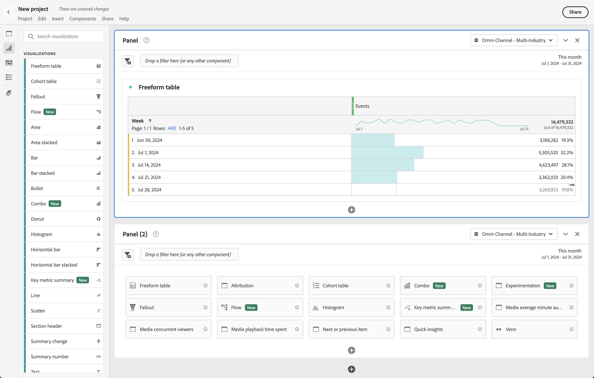
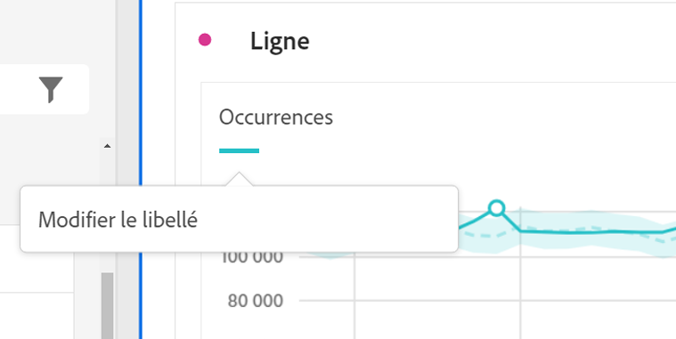
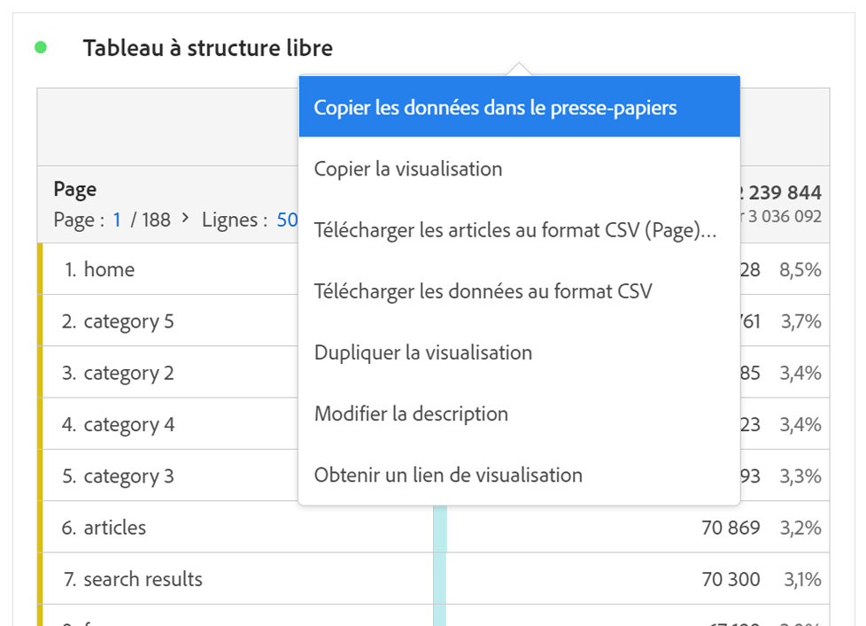
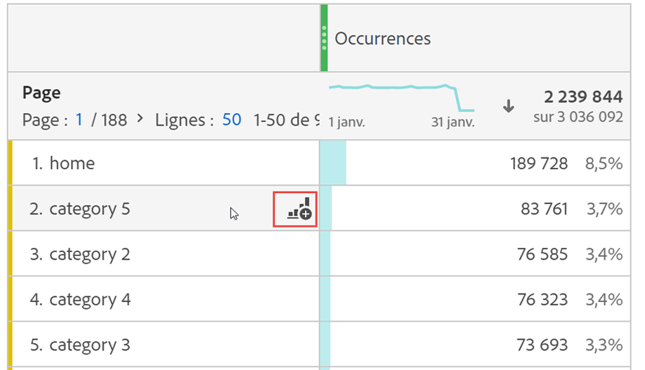

# Visualisations - Aperçu

Workspace offre une variété de visualisations pour créer des représentations visuelles de vos données. Par exemple, des graphiques à barres, des graphiques en anneau, des histogrammes, des graphiques en courbes, des cartes, des nuages de points, etc.

## Types

Voici les types de visualisation disponibles dans Analysis Workspace :

| Icône | Nom | Description |
| :---: | --- | ---| 
|  | [Surface](/help/analysis-workspace/visualizations/area.md) | Visualisation sous forme de graphique de surface. Semblable à un graphique linéaire, mais avec une zone colorée sous la ligne. Utilisez un diagramme de surface si vous avez plusieurs mesures et souhaitez visualiser la zone exprimée par l’intersection de plusieurs mesures. |
|  | [Barre](/help/analysis-workspace/visualizations/bar.md) | Visualisation Graphique à barre avec des barres verticales représentant plusieurs valeurs pour une ou plusieurs mesures. |
|  | [Barres empilées](/help/analysis-workspace/visualizations/bar.md) | Visualisation Graphique à barres empilées avec des barres verticales représentant plusieurs valeurs pour une ou plusieurs mesures. |
| 
 | [Puces](/help/analysis-workspace/visualizations/bullet-graph.md) | Visualisation Graphique à puces affichant comment comparer ou mesurer une valeur qui vous intéresse par rapport à d’autres plages de performances (objectifs). |
|  | [Table de cohorte](/help/analysis-workspace/visualizations/cohort-table/cohort-analysis.md) | Une visualisation Cohorte est un groupe de personnes partageant des caractéristiques communes au cours d’une période spécifique. Une table de cohorte est utile pour les analyses de la rétention, de lʼattrition ou de la latence. |
|  | [Combo](combo-charts.md) | Une visualisation Graphique combo facilite la création rapide d’une visualisation de comparaison sans qu’il soit nécessaire de créer un tableau au préalable. |
|  | [Anneau](/help/analysis-workspace/visualizations/donut.md) | Similaire à un graphique en secteurs, la visualisation en anneau présente les données comme des portions ou des segments d’un tout. |
|  | [Abandon](/help/analysis-workspace/visualizations/fallout/fallout-flow.md) | La visualisation Abandons indique où les personnes sont sorties (abandonné) d’une suite prédéfinie de pages et où elles ont poursuivi leur visite à travers ces pages (diminution). |
|  | [Flux](/help/analysis-workspace/visualizations/c-flow/flow.md) | La visualisation Flux présente les parcours exacts des clientes et clients sur vos sites web et dans vos applications. |
| 
 | [Tableau à structure libre](/help/analysis-workspace/visualizations/freeform-table/freeform-table.md) | Une visualisation Tableau à structure libre est une visualisation interactive. La visualisation Tableau à structure libre est la base de l’analyse des données dans Workspace. |
|  | [Histogramme](/help/analysis-workspace/visualizations/histogram.md) | Une visualisation Histogramme regroupe les personnes, les visites ou les événements en intervalles en fonction dʼun volume de mesure. |
|  | [Barre horizontale](/help/analysis-workspace/visualizations/horizontal-bar.md) | Visualisation Barres horizontales affichant des barres verticales représentant plusieurs valeurs pour une ou plusieurs mesures. |
|  | [Barres empilées horizontales](/help/analysis-workspace/visualizations/horizontal-bar.md) | Visualisation Barres horizontales empilées affichant des barres horizontales représentant plusieurs valeurs pour une ou plusieurs mesures. |
|  | [Zone de travail de parcours](/help/analysis-workspace/visualizations/journey-canvas/journey-canvas.md) | Une visualisation Zone de travail de parcours vous permet d’analyser les parcours que vous fournissez à vos utilisateurs et utilisatrices et à votre clientèle afin de mieux les connaître. |
|  | [Résumé des mesures clés](/help/analysis-workspace/visualizations/key-metric.md) | Une visualisation Résumé des mesures clés combine les visualisations Ligne, Synthèse des modifications et Synthèse des chiffres. |
|  | [Ligne](/help/analysis-workspace/visualizations/line.md) | Une visualisation Ligne représente les mesures sous la forme d’une ligne afin d’indiquer l’évolution des valeurs dans le temps. Un graphique en courbes utilise le temps le long de lʼaxe X. |
|  | [Dispersion](/help/analysis-workspace/visualizations/scatterplot.md) | Une visualisation Graphique de dispersion illustre la relation entre des éléments de dimension et trois mesures au maximum. |
|  | [En-tête de section](section-header.md) | Pour identifier et articuler des sections dans un panneau. |
|  | [Résumé des changements](/help/analysis-workspace/visualizations/summary-number-change.md) | Une visualisation Synthèse des modifications affiche la modification entre les cellules sélectionnées sous la forme d’un grand nombre ou d’un pourcentage. |
| 
 | [Numéro de résumé](/help/analysis-workspace/visualizations/summary-number-change.md) | Une visualisation Synthèse des chiffres affiche la cellule sélectionnée sous la forme d’un grand nombre. |
|  | [Texte](/help/analysis-workspace/visualizations/text.md) | Une visualisation Texte permet d’ajouter du texte défini par l’utilisateur ou l’utilisatrice dans Workspace. Utile pour ajouter du contexte supplémentaire à votre analyse et à vos informations, en plus de tirer parti des descriptions des panneaux/visualisations. |
|  | [Plan en arborescence](/help/analysis-workspace/visualizations/treemap.md)
 | Une visualisation Treemap présente les données hiérarchiques (structurées en arborescence) sous la forme d’un ensemble de rectangles imbriqués. |
|  | [Venn](/help/analysis-workspace/visualizations/venn.md) | Une visualisation Venn utilise des cercles pour représenter le chevauchement des mesures dʼun maximum de trois segments. |

<!-- Add beneath Horizontal bar in the table above: | [Journey canvas](/help/analysis-workspace/visualizations/journey-canvas/journey-canvas.md) | Similar to Fallout, Journey canvas shows where persons left (fell out) and continued through (fell through) a predefined sequence of pages. 
Unlike Fallout, Journey canvas supports not only linear journeys, but any number of entry points and paths. Furthermore, journeys can be created in Adobe Journey Optimizer and then analyzed in Journey canvas.
 | -->

## Ajouter des visualisations à un panneau

1. Ouvrez le projet Workspace dans lequel vous souhaitez ajouter une visualisation.

1. Utilisez l’une des méthodes suivantes pour ajouter la visualisation :

   

   * Dans le panneau de gauche, sélectionnez  **Visualisations**, puis faites glisser une visualisation vers le panneau auquel vous souhaitez l’ajouter.

   * Dans le panneau à l’emplacement duquel vous souhaitez ajouter la visualisation, sélectionnez , puis choisissez l’icône qui représente la visualisation à ajouter. Pointez sur l’icône pour chaque visualisation afin d’afficher le nom.

   * Ajoutez un [panneau vierge](/help/analysis-workspace/c-panels/blank-panel.md), puis sélectionnez la visualisation à ajouter.

   * Dans le menu contextuel d’une visualisation existante dans votre projet Analysis Workspace, sélectionnez **[!UICONTROL Dupliquer la visualisation]** ou **[!UICONTROL Copier la visualisation]**.

   * Utilisez le menu Workspace **[!UICONTROL Insérer]** pour insérer une visualisation.

   * Dans le menu contextuel d’un tableau à structure libre, sélectionnez **[!UICONTROL Visualiser]**. Sélectionnez ensuite la visualisation dans le sous-menu. En fonction de la sélection en cours dans le tableau, Workspace détermine la visualisation à proposer et interprète les données pour créer la visualisation demandée.

## Légende

Une légende de visualisation vous permet de relier les données dʼun tableau source à une série tracée dans la visualisation. La légende est interactive : vous pouvez sélectionner un élément de légende pour afficher/masquer une série dans la visualisation, ce qui s’avère utile si vous souhaitez simplifier les données visualisées.

De plus, vous pouvez renommer les étiquettes de légende pour rendre les visuels plus exploitables. Remarque : **il nʼest pas** possible de modifier les légendes des visualisations Treemap, Puce, Résumé des changements, Synthèse des chiffres, Texte, Structure libre, Histogramme, Cohorte ou Flux.

Pour modifier une étiquette de légende :

1. Effectuez un clic droit sur l’une des étiquettes de légende.
1. Cliquez sur **[!UICONTROL Modifier l’étiquette]**.

   

1. Saisissez le nouveau texte de l’étiquette.
1. Appuyez sur **[!UICONTROL Entrée]** pour enregistrer.

## Paramètres

Chaque visualisation possède ses propres paramètres. Pour accéder aux paramètres de visualisation, sélectionnez  **[!UICONTROL Paramètres]** dans l’en-tête de visualisation pour afficher une fenêtre contextuelle.

Selon la visualisation, vous pouvez configurer :

* des détails sur la source de données de la visualisation via l’onglet [**[!UICONTROL Source de données]**](#data-source), et
* les paramètres de la visualisation via l’onglet [**[!UICONTROL Paramètres]**](#settings-1).

### Source de données

Vous pouvez contrôler la source de données et les éléments ou positions de cette source de données qui correspondent à une visualisation. Pour plus d’informations, consultez [Gérer des sources de données](t-sync-visualization.md).

### Paramètres

La disponibilité des paramètres de visualisation dépend de la visualisation. Le tableau ci-dessous résume les paramètres les plus courants. Certaines visualisations comportent des paramètres spécifiques. Pour en savoir plus, consultez la documentation sur les visualisations individuelles.

| Option | Description |
| --- | --- |
| **[!UICONTROL Type de visualisation]** | Modifiez le type de visualisation utilisée pour représenter les données. |
| **[!UICONTROL Granularité]** | Modifiez la granularité temporelle des visualisations de tendances. Cette modification sʼapplique également au tableau de source de données. |
| **[!UICONTROL Pourcentages]** | Affichez les valeurs en pourcentages. |
| **[!UICONTROL Empilé à 100 %]** | Transformez le graphique en une visualisation empilée à 100 %.  Applicable uniquement pour une visualisation empilée sous forme de surface, barre et barre horizontale. |
| **[!UICONTROL Légende visible]** | Affichez le texte de la légende. |
| **[!UICONTROL Nombre max d’éléments]** | Limitez le nombre d’éléments affichés dans une visualisation. Lorsque cette option est sélectionnée, définissez le nombre maximal d’éléments. |
| **[!UICONTROL Afficher les annotations]** | Affichez les annotations effectuées pour cette visualisation. |
| **[!UICONTROL Masquer le titre]** | Masquez le titre de la visualisation. |
| **[!UICONTROL Faire commencer l’axe Y sur zéro]** | Forcez le bas de l’axe Y à zéro. Si toutes les valeurs mappées dans le graphique sont considérablement supérieures à zéro, le seuil de l’axe Y est par défaut non nul. Si vous activez cette option, l’axe Y est forcé à zéro (et le graphique est redessiné). |
| **[!UICONTROL Afficher l’axe double]** | Affichez les axes Y gauche et droit pour deux mesures différentes. Cette option s’applique uniquement si vous disposez de deux mesures. Les axes doubles sont utiles lorsque les mesures tracées sont de magnitudes différentes. |
| **[!UICONTROL Afficher l’axe X]** | Affichez l’axe X dans la visualisation. |
| **[!UICONTROL Afficher l’axe Y]** | Affichez l’axe Y dans la visualisation. |
| **[!UICONTROL Afficher les haltères sur les lignes]** | Affichez les haltères sur la visualisation linéaire dans une visualisation Combo. |
| **[!UICONTROL Normalisation]** | Forcez les mesures en proportions égales. Les proportions égales sont utiles lorsque les mesures tracées sont de magnitudes différentes. |
| **[!UICONTROL Afficher les anomalies]** | Améliorez les graphiques linéaires et les tableaux à structure libre en affichant la détection des anomalies. La détection des anomalies dans les visualisations linéaires comprend une valeur attendue (ligne en pointillé) et une plage attendue (bande ombrée). |
| **[!UICONTROL Afficher la prévision]** | Améliorez les graphiques linéaires et les tableaux à structure libre en affichant la détection des anomalies. |
| **[!UICONTROL Afficher la valeur minimale]** | Affichez la valeur minimale dans la visualisation. |
| **[!UICONTROL Afficher la valeur maximale]** | Affichez la valeur maximale dans la visualisation. |
| **[!UICONTROL Afficher la courbe de tendance]** | Affichez une courbe de tendance dans la visualisation. Lorsque cette option est sélectionnée, vous pouvez sélectionner le type de courbe de tendance dans le menu déroulant. |

Vous pouvez personnaliser les paramètres de toutes les visualisations que vous créez. Pour plus d’informations, consultez [Préférences utilisateur](/help/analysis-workspace/user-preferences.md).

## Menu contextuel {#right-click}

Utilisez le menu contextuel (disponible par le biais d’une autre sélection, par exemple en cliquant avec le bouton droit de la souris) sur un en-tête de visualisation pour accéder à des fonctionnalités supplémentaires pour une visualisation. Certaines options ne sont pas disponibles pour certains types de graphique.

| Option | Description |
| --- | --- |
| **[!UICONTROL Insérer une visualisation copiée]** | Collez (insérez) une visualisation copiée à un autre emplacement au sein du projet, ou dans un tout autre projet. |
| **[!UICONTROL Copier les données dans le presse-papiers]** | Copiez les données de la visualisation dans le presse-papiers. |
| **[!UICONTROL Copier la sélection dans le presse-papiers]** | Copiez la sélection de la visualisation dans le presse-papiers. |
| **[!UICONTROL Télécharger les éléments au format CSV (*nom de dimension*)]** | Téléchargez les éléments de dimension (jusqu’à 50 000 au maximum) de la visualisation sur votre appareil local. Un maximum de 50 000 éléments de dimension pour la dimension sélectionnée. |
| **[!UICONTROL Copier la visualisation]** | Copiez la visualisation pour vous permettre de l’insérer dans un autre emplacement au sein du projet, ou dans un autre projet. |
| **[!UICONTROL Télécharger les données au format CSV]** | Téléchargez les données affichées de la visualisation sur votre appareil local. |
| **[!UICONTROL Exporter le tableau complet]** | Exportez le tableau complet vers des emplacements cloud désignés. Consultez [Exports des rapports Customer Journey Analytics dans le cloud](../export/export-cloud.md) |
| **[!UICONTROL Dupliquer la visualisation]** | Créez un doublon exact de la visualisation. |
| **[!UICONTROL Modifier la description]** | Ajoutez (ou modifiez) une description textuelle de la visualisation. Consultez [Texte](text.md). |
| **[!UICONTROL Obtenir le lien de la visualisation]** | Copiez et partagez un lien directement vers la visualisation. Une boîte de dialogue Partager le lien affiche le lien. Sélectionnez Copier pour copier le lien dans votre presse-papiers. |
| **[!UICONTROL Recommencer]** | Supprimez la configuration de la visualisation actuelle afin que vous puissiez la reconfigurer de zéro. |

## Configuration

Certaines visualisation (comme Table de cohorte, Abandons, Flux, etc.) possèdent une boîte de dialogue de configuration pour vous aider à créer la visualisation. Utilisez  en haut de la visualisation pour accéder à la configuration et la modifier.

## Visualiser

Si vous ne savez pas quelle visualisation choisir, sélectionnez  **[!UICONTROL Visualiser]** dans une ligne de tableau à structure libre (disponible au survol de la souris). Cette sélection est la méthode la plus rapide pour ajouter une visualisation. Analysis Workspace s’affiche alors et détermine quelle visualisation serait la mieux adaptée à vos données. Par exemple, si une ligne est sélectionnée, un [graphique linéaire](line.md) à tendance est créé. Si trois lignes de segment sont sélectionnées, un diagramme de [Venn](venn.md) est créé.

