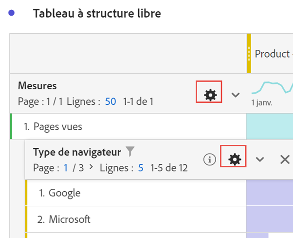
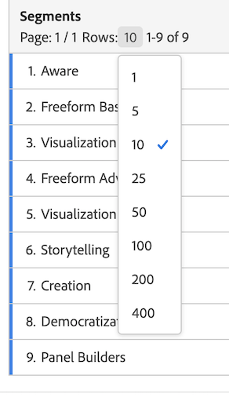

# Paramètres des lignes

>[!NOTE]
>
>Vous consultez la documentation d’Analysis Workspace pour Customer Journey Analytics. L’ensemble de ses fonctionnalités diffère légèrement de celui d’[Analysis Workspace dans la version Adobe Analytics traditionnelle](https://experienceleague.adobe.com/docs/analytics/analyze/analysis-workspace/home.html?lang=fr). [En savoir plus...](/help/getting-started/cja-aa.md)

Regardez une vidéo sur les paramètres des lignes et des colonnes ici :

>[!VIDEO](https://video.tv.adobe.com/v/40382/?quality=12)

Les configurations des lignes varient selon le composant déposé dans le tableau. Pour accéder aux paramètres de ligne dʼun tableau, cliquez sur lʼicône [!UICONTROL Paramètres] en regard dʼune dimension, dʼun filtre, dʼune mesure, dʼune période ou dʼune répartition :

| Paramètre | Description |
| --- | --- |
| Alignement des dates | Il s’agit d’un paramètre au niveau du tableau qui aligne les dates de chaque colonne afin qu’elles commencent toutes à partir de la même ligne. L’alignement des dates est activé par défaut lorsqu’une dimension temporelle est utilisée dans les lignes du tableau et que différentes périodes sont appliquées dans les colonnes. Par exemple, dans un tableau quotidien auquel les colonnes d’octobre et de septembre sont appliquées, la colonne de gauche commence au 1er octobre et la colonne de droite au 1er septembre. |
| Ventilation par position | Par défaut, ce paramètre est désactivé et les ventilations sont fixées aux éléments de la ligne statique. Par exemple, imaginons que vous ventilez les éléments de dimension des 3 premières pages (page d’accueil, résultats de recherche et passage en caisse) par canal marketing. Ensuite, vous quittez le projet et revenez deux semaines plus tard. Lors de la réouverture du projet, les 3 premières pages ont changé. Désormais, la page d’accueil, les résultats de recherche et le passage en caisse figurent sur les 4 à 6 premières pages. Par défaut, les ventilations des canaux marketing apparaîtront toujours sous la page d’accueil, les résultats de recherche et le passage en caisse, même si elles se trouvent maintenant dans les lignes 4 à 6.  En revanche, la **répartition par position** répartit toujours les 3 premiers éléments, quelle que soit leur nature. Pour revenir à notre exemple, lorsque vous rouvrez votre projet, les ventilations des canaux marketing sont liées aux 3 premières pages du tableau, et non à la page d’accueil, aux résultats de recherche et au passage en caisse qui se trouvent maintenant dans les lignes 4 à 6. |
| Pourcentages | **Calculer les pourcentages par colonne** est le paramètre par défaut. Les pourcentages visibles dans une colonne sont calculés en fonction du total de la colonne.  **Calcul des pourcentages par ligne** oblige le tableau à structure libre à calculer les pourcentages des cellules par ligne, et non pas par colonne, avec le total général comme dénominateur. Cette fonctionnalité est particulièrement utile pour les pourcentages de tendance. Ce paramètre est activé par défaut lors de l’utilisation de l’icône Visualiser. |
| Totaux des colonnes | Ces paramètres sont uniquement disponibles pour les lignes [statiques](/help/analysis-workspace/visualizations/freeform-table/column-row-settings/manual-vs-dynamic-rows.md).   **Afficher comme somme des lignes actuelles** affiche la somme des lignes du tableau côté client, ce qui signifie que le total ne dédupliquera *pas* de mesures telles que les visites ou les visiteurs.   **Afficher le total général** indique une somme côté serveur, ce qui signifie que le total dédupliquera les mesures. |

## Modification du nombre de lignes

Pour modifier le nombre de lignes affichées, procédez comme suit :

1. Cliquez sur le nombre en regard de [!UICONTROL Lignes] en haut du tableau.

   

1. Dans la liste déroulante, sélectionnez le nombre de lignes à afficher dans le tableau.