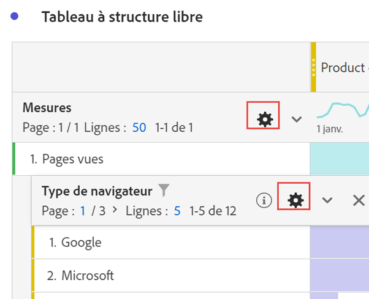
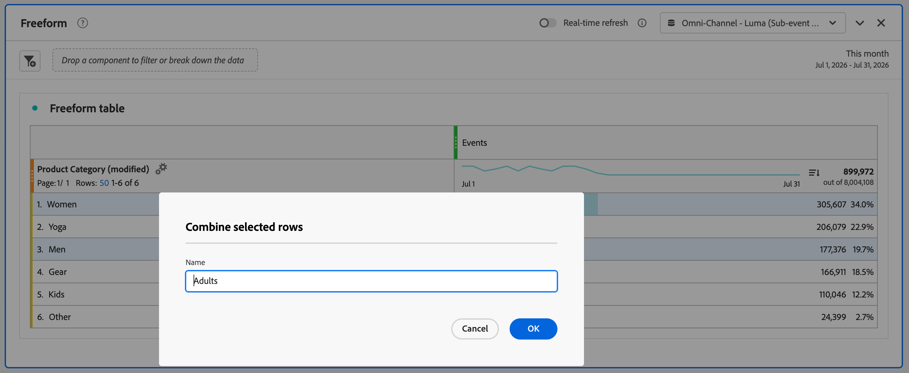

# Paramètres des lignes

Les paramètres des lignes varient selon le composant déposé dans le tableau. Pour accéder aux paramètres des lignes du tableau, sélectionnez  **[!UICONTROL Paramètres]** en regard d’une dimension, d’un segment, d’une mesure, d’une période ou d’une répartition dans chacun de ces objets.

| Paramètre | Description |
| --- | --- |
| **[!UICONTROL Répartition par position]** | Par défaut, ce paramètre est désactivé et les répartitions sont fixées aux éléments de la ligne statique. Par exemple, imaginons que vous répartissiez les éléments de la dimension 3 premières pages (page d’accueil, résultats de recherche et passage en caisse) par canal marketing. Ensuite, vous quittez le projet et revenez deux semaines plus tard. Lors de la réouverture du projet, les 3 premières pages ont changé. Désormais, la page d’accueil, les résultats de recherche et le passage en caisse figurent sur les 4 à 6 premières pages. Par défaut, vos répartitions de canal marketing apparaissent toujours sous Page d’accueil, Résultats de la recherche et Passage en caisse, même si elles se trouvent désormais dans les lignes 4 à 6.   En revanche, la **Répartition par position** répartit toujours les 3 premiers éléments, quelle que soit leur nature. Pour revenir à l’exemple, lorsque vous rouvrez votre projet, les répartitions des canaux marketing sont liées aux 3 premières pages du tableau. Elles ne sont pas liées à Page d’accueil, Résultats de recherche et Passage en caisse, qui se trouvent désormais dans les lignes 4 à 6. |
| **[!UICONTROL Pourcentages]** | **Calculer les pourcentages par colonne** (par défaut) : les pourcentages visibles dans une colonne sont calculés en fonction du total de la colonne.  **Calcul des pourcentages par ligne** : les pourcentages des cellules sont calculés par ligne, et non pas par colonne, avec le total général comme dénominateur. Ce calcul s’avère utile pour les pourcentages de tendance. |
| **[!UICONTROL Totaux des colonnes]** | Ces paramètres sont uniquement disponibles pour les [lignes statiques](/help/analysis-workspace/visualizations/freeform-table/column-row-settings/manual-vs-dynamic-rows.md).   L’option **Afficher comme somme des lignes actuelles** affiche la somme des lignes du tableau côté client, ce qui signifie que le total *ne dédupliquera pas* de mesures telles que les visites ou les personnes.   L’option **Afficher le total général** indique une somme côté serveur, ce qui signifie que le total dédupliquera les mesures. |

>[!BEGINSHADEBOX]

Voir  [Paramètres de ligne et de colonne dans un tableau à structure libre](https://experienceleague.adobe.com/fr/docs/analytics-learn/tutorials/analysis-workspace/building-freeform-tables/row-and-column-settings-in-freeform-tables){target="_blank"} pour une vidéo de démonstration.

{{videoaa}}

>[!ENDSHADEBOX]

## Modification du nombre de lignes

Pour modifier le nombre de lignes affichées, procédez comme suit :

1. Cliquez sur le nombre en regard de **[!UICONTROL Lignes]** en haut de la première colonne du tableau.

   

1. Dans le menu déroulant, sélectionnez le nombre de lignes que le tableau doit afficher.

## Menu contextuel

Les options de menu contextuel suivantes sont disponibles lors de la sélection de l’en-tête de dimension.

| Option | Description |
| --- | --- |
| **[!UICONTROL Copier la sélection dans le presse-papiers]** | Copiez la sélection de la visualisation dans le presse-papiers. |
| **[!UICONTROL Télécharger les éléments au format CSV (*nom de dimension*)]** | Téléchargez immédiatement les éléments de dimension (jusqu’à 50 000 au maximum) de la visualisation sur votre appareil local. Un maximum de 50 000 éléments de dimension pour la dimension sélectionnée. |
| **[!UICONTROL Télécharger la sélection au format CSV]** | Téléchargez immédiatement les éléments de dimension de la visualisation sur votre appareil local. |
| **[!UICONTROL Créer des liens hypertexte pour tous les éléments de dimension]** | Créez des liens hypertexte pour tous les éléments de dimension. Voir [Liens hypertexte pour les dimensions dans un tableau à structure libre](../freeform-table-hyperlinks.md) |
| **[!UICONTROL Modifier le lien hypertexte pour tous les éléments de dimension]** | Modifiez les liens hypertexte pour tous les éléments de dimension. Voir [Créer des liens hypertexte pour les dimensions dans un tableau à structure libre](../freeform-table-hyperlinks.md) |
| **[!UICONTROL Supprimer les liens hypertexte pour tous les éléments de dimension]** | Supprimez les liens hypertexte pour tous les éléments de dimension. Voir [Liens hypertexte pour les dimensions dans un tableau à structure libre](../freeform-table-hyperlinks.md) |
| **[!UICONTROL Supprimer]** | Supprime la dimension du tableau. |
| **[!UICONTROL Visualisation]** | Visualisez la dimension à l’aide de l’une des visualisations disponibles. |
| **[!UICONTROL Afficher uniquement les lignes sélectionnées]** | Affichez uniquement les éléments sélectionnés dans la visualisation. |
| **[!UICONTROL Créer une annotation à partir d’une sélection]** | Ouvrez les **[!UICONTROL Détails de l’annotation]** pour ajouter une annotation. |

Les options de menu contextuel supplémentaires suivantes sont disponibles lors de la sélection d’un ou de plusieurs éléments de dimension (première colonne) ou d’une ou de plusieurs cellules individuelles dans le tableau à structure libre.

| Option | Description |
| --- | --- |
| **[!UICONTROL Copier la sélection dans le presse-papiers]** | Copiez les informations dans les cellules sélectionnées du tableau à structure libre. |
| **[!UICONTROL Télécharger les éléments au format CSV (*nom de dimension*)]** | Téléchargez immédiatement les éléments de dimension (jusqu’à 50 000 au maximum) de la visualisation sur votre appareil local. Un maximum de 50 000 éléments de dimension pour la dimension sélectionnée. |
| **[!UICONTROL Créer un lien hypertexte]** | Créez un lien hypertexte pour l’élément. Voir [Liens hypertexte pour les dimensions dans un tableau à structure libre](../freeform-table-hyperlinks.md) |
| **[!UICONTROL Modifier le lien hypertexte]** | Modifiez un lien hypertexte pour l’élément. Voir [Liens hypertexte pour les dimensions dans un tableau à structure libre](../freeform-table-hyperlinks.md) |
| **[!UICONTROL Supprimer le lien hypertexte]** | Supprimez un lien hypertexte pour l’élément. Voir [Liens hypertexte pour les dimensions dans un tableau à structure libre](../freeform-table-hyperlinks.md) |
| **[!UICONTROL Télécharger la sélection au format CSV]** | Téléchargez immédiatement les éléments de dimension de la visualisation sur votre appareil local. |
| **[!UICONTROL Supprimer la sélection]** | Supprimer les lignes sélectionnées. |
| **[!UICONTROL Créer une alerte à partir de la sélection]** | Ouvrez le [créateur d’alertes](/help/components/c-intelligent-alerts/alert-builder.md) pour créer une alerte à partir de la sélection. |
| **[!UICONTROL Répartition]** | Ventilez l’élément de dimension. Faites votre choix dans la liste **[!UICONTROL Dimensions]**, **[!UICONTROL Mesures]**, **[!UICONTROL Segments]** ou **[!UICONTROL Périodes]**. Autre recherche d’un composant à l’aide de *Recherche*. |
| **[!UICONTROL Visualisation]** | Visualisez la sélection à l’aide de l’une des visualisations disponibles. |
| **[!UICONTROL Sélection de tendances]** | Créez une visualisation sous forme de graphique linéaire de tendance pour la sélection. |
| **[!UICONTROL Afficher uniquement les lignes sélectionnées]** | Affichez uniquement les lignes sélectionnées dans la visualisation. |
| **[!UICONTROL Afficher toutes les lignes]** | Affichez toutes les lignes de la visualisation. |
| **[!UICONTROL Renommer la ligne sélectionnée]** | Renommez la ligne sélectionnée. Saisissez un **[!UICONTROL Nom]** dans la boîte de dialogue **[!UICONTROL Renommer la ligne sélectionnée]**. Sélectionnez **[!UICONTROL OK]** pour confirmer ou **[!UICONTROL Annuler]** pour annuler. Une fois qu’une ligne d’un tableau à structure libre est renommée, le nom de la dimension dans la colonne d’en-tête est ajouté avec la mention **[!UICONTROL (modifié)]** et une icône  est disponible pour réinitialiser les lignes modifiées dans la colonne d’en-tête de dimension. Voir [Classifications intégrées](#inline-classifications). |
| **[!UICONTROL Combiner les lignes sélectionnées]** | Combiner les lignes sélectionnées. Saisissez un **[!UICONTROL Nom]** dans la boîte de dialogue **[!UICONTROL Combiner les lignes sélectionnées]**. Sélectionnez **[!UICONTROL OK]** pour confirmer ou **[!UICONTROL Annuler]** pour annuler. Une fois les lignes d’un tableau à structure libre combinées, le nom de la dimension dans la colonne d’en-tête est ajouté avec **[!UICONTROL (modifié)]** et une icône  est disponible pour réinitialiser les lignes modifiées dans la colonne d’en-tête de dimension. Voir [Classifications intégrées](#inline-classifications). |
| **[!UICONTROL Créer des lignes modifiées comme champ dérivé]** | *Vous devez être un administrateur produit Customer Journey Analytics pour voir cette option de menu contextuel.*  Disponible sur n’importe quelle ligne sélectionnée d’un tableau à structure libre qui est modifiée suite au changement de nom ou à la combinaison de lignes. Lorsque cette option est sélectionnée, l’[interface des champs dérivés](/help/data-views/derived-fields/derived-fields.md#create-a-derived-field) s’ouvre avec les modifications que vous avez apportées au tableau à structure libre déjà prérempli. Voir [Classifications intégrées](#inline-classifications). |
| **[!UICONTROL Créer une annotation à partir d’une sélection]** | Ouvrez le [créateur d’annotations](/help/components/annotations/create-annotations.md#annotation-builder) pour créer une annotation pour la sélection. |
| **[!UICONTROL Créer un segment à partir de la sélection]** | Ouvrez le [Créateur de segments](/help/components/segments/seg-builder.md) pour créer un segment à partir de la sélection. |
| **[!UICONTROL Créer une audience à partir de la sélection]** | Ouvrez le [Créateur d’audiences](/help/components/audiences/publish.md#audience-builder) pour créer une audience à partir de la sélection. |

Les options de menu contextuel supplémentaires suivantes sont disponibles lors de la sélection d’un en-tête de colonne de mesure.

| Option | Description |
|---|---|
| **[!UICONTROL Créer une mesure à partir d’une sélection]** | Créez une mesure à partir de la mesure sélectionnée. La mesure peut être Moyenne, Média, Colonne max, Colonne min, Somme de la colonne. Vous pouvez également sélectionner Ouvrir dans le créateur de mesures calculées pour créer une mesure calculée. |
| **[!UICONTROL Ajouter une colonne de période]** | Ajoutez une colonne de période. Plusieurs options vous sont proposées, la période de calendrier du panneau déterminant la *période* : <ul><li>**[!UICONTROL *Période* précédant cette période]**</li><li>**[!UICONTROL *Période* à cette période]**.</li><li>**[!UICONTROL Période personnalisée à cette période]**. Ouvre le **[!UICONTROL Créateur de périodes]** pour spécifier la période.</li></ul>Voir [Comparaison de dates](/help/components/date-ranges/time-comparison.md) pour plus d’informations. |
| **[!UICONTROL Comparaison de périodes]** | Ajoute des colonnes de comparaison de périodes. Disponible uniquement lorsque la dimension n’est pas temporelle. Plusieurs options permettent de déterminer la *période* : <ul><li>**[!UICONTROL *Période* précédant cette période]**</li><li>**[!UICONTROL Période personnalisée à cette période]**. Ouvre le **[!UICONTROL Créateur de périodes]** pour spécifier la période.</li></ul>Voir [Comparaison de dates](/help/components/date-ranges/time-comparison.md) pour plus d’informations. |
| **[!UICONTROL Modifier les modèles d’attribution]** | Modifiez le modèle d’attribution de la colonne. |
| **[!UICONTROL Comparer le modèle d’attribution]** | Spécifiez un nouveau modèle d’attribution et comparez-le au modèle d’attribution de la colonne sélectionnée. Une nouvelle colonne est ajoutée avec les nouvelles mesures de modèle d’attribution. Une colonne Changement en pourcentage est également ajoutée à des fins de comparaison. |
| **[!UICONTROL Réinitialiser les largeurs de colonne]** | Rétablissez la largeur par défaut des colonnes. |
| **[!UICONTROL Créer une annotation à partir d’une sélection]** | Ouvrez les **[!UICONTROL Détails de l’annotation]** pour ajouter une annotation. |
| **[!UICONTROL Créer un segment à partir de la sélection]** | Ouvrez le **[!UICONTROL Créateur de segments]** pour créer un segment à partir de la sélection. |
| **[!UICONTROL Créer une audience à partir de la sélection]** | Ouvrez la boîte de dialogue **[!UICONTROL Créer une audience]** pour créer une audience à partir de la sélection. |

## Modifier la hauteur des lignes

Vous pouvez définir la [densité d’affichage](https://experienceleague.adobe.com/fr/docs/analytics-platform/using/cja-workspace/build-workspace-project/view-density) d’un projet sur **[!UICONTROL Compact]**, **[!UICONTROL Confortable]** et **[!UICONTROL Développé]**.

## Classifications intégrées

Les classifications intégrées vous permettent de renommer ou de combiner des lignes dans un tableau à structure libre. Et pour créer un champ dérivé à partir des lignes modifiées d’un tableau.

L’exemple ci-dessous illustre comment utiliser les options de menu contextuel **[!UICONTROL Renommer la ligne sélectionnée]**, **[!UICONTROL Combiner les lignes sélectionnées]** et **[!UICONTROL Créer comme champ dérivé]**. Et comment réinitialiser le tableau à structure libre modifié.

* Renommez **[!UICONTROL Aucune valeur]** la ligne en **[!UICONTROL Autre]**.

  1. Sélectionnez **[!UICONTROL Renommer la ligne sélectionnée]** dans le menu contextuel de la ligne sélectionnée **[!UICONTROL Aucune valeur]**.

     

  1. Dans la boîte de dialogue **[!UICONTROL Renommer la ligne sélectionnée]** :

     

     1. Enter <code>Other</code> pour **[!UICONTROL Nom]**.
     1. Sélectionnez **[!UICONTROL OK]**.

* Combinez les lignes **[!UICONTROL Hommes]** et **[!UICONTROL Femmes]** dans une ligne **[!UICONTROL Adultes]**.

  1. Sélectionnez la ligne **[!UICONTROL Hommes]** et **[!UICONTROL Femmes]**.
  1. Sélectionnez **[!UICONTROL Combiner les lignes sélectionnées]** dans le menu contextuel de n’importe quelle ligne sélectionnée.

     

  1. Dans la boîte de dialogue **[!UICONTROL Combiner les lignes sélectionnées]** :

     

     1. Enter <code>Adults</code> pour **[!UICONTROL Nom]**.
     1. Sélectionnez **[!UICONTROL OK]**.

* Créez un champ dérivé à partir des modifications apportées au tableau à structure libre.

  1. Sélectionnez **[!UICONTROL Créer des lignes modifiées comme champ dérivé]** dans le menu contextuel pour toute ligne sélectionnée dans le tableau modifié.

     

  1. Inspectez, éventuellement modifiez et enregistrez la définition du champ dérivé en fonction de toutes les modifications apportées dans le tableau.

     

* Réinitialiser le tableau à structure libre à l’état avant les modifications.

  1. Sélectionnez  en regard de **[!UICONTROL _nom de la dimension _(modifié)]**.
  1. Sélectionnez **[!UICONTROL Réinitialiser les lignes modifiées]** dans la fenêtre contextuelle **[!UICONTROL Lignes renommées]**.

     
