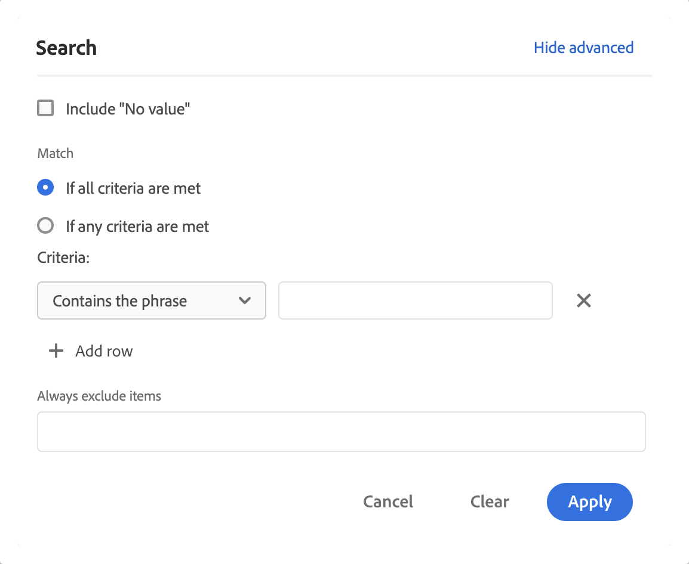

# Filtrer et trier des tableaux à structure libre

Les tableaux à structure libre dans Analysis Workspace sont la base de l’analyse de données interactive. Ils peuvent donc contenir des milliers de lignes d’informations. Le filtrage et le tri des données peuvent constituer des éléments essentiels à l’amélioration de l’affichage des informations les plus importantes.

<!--The following video covers filter and sort options in Analysis Workspace, in addition to pagination options:

>[!VIDEO](https://video.tv.adobe.com/v/23968)-->

## Filtrer des tableaux

Les filtres dans Analysis Workspace vous aident à afficher les informations les plus importantes.

>[!NOTE]
>
> Seuls les éléments de dimension dynamiques peuvent être filtrés comme décrit dans cette section. Les éléments de dimension statiques ne peuvent pas être filtrés. Pour plus d’informations, voir [Éléments de dimension dynamiques ou statiques dans les tables à structure libre](/help/analysis-workspace/visualizations/freeform-table/column-row-settings/manual-vs-dynamic-rows.md).

Vous pouvez utiliser plusieurs méthodes pour filtrer les lignes d’un tableau à structure libre.

- Exclusion de lignes spécifiques d’un tableau
- Application de filtres à un tableau
- Utilisation des filtres d’audience

Veillez à lire comment chaque méthode affecte les [totaux de table à structure libre](/help/analysis-workspace/visualizations/freeform-table/workspace-totals.md).

### Exclusion de lignes spécifiques d’un tableau

Vous pouvez exclure rapidement des lignes spécifiques de la table sans avoir à utiliser  **[!UICONTROL Filtre]**.

>[!NOTE]
>
>Lorsque vous excluez des lignes comme décrit dans cette section, une règle [!UICONTROL Toujours exclure les éléments] est ajoutée automatiquement dans la boîte de dialogue de filtre [!UICONTROL Avancé]. Vous pouvez afficher la règle appliquée en sélectionnant l’icône , puis [**[!UICONTROL Afficher avancé]**](#apply-a-simple-or-advanced-filter-to-a-table).

Pour exclure des lignes spécifiques d’un tableau à structure libre :

1. Pointez sur la ligne à exclure, puis sélectionnez .

   Maintenez la touche Maj enfoncée pour sélectionner une plage de lignes ou maintenez la touche Commande (sur Mac) ou la touche Ctrl (sous Windows) enfoncée pour sélectionner plusieurs lignes.

<!--### Right-click > Delete selected rows

Note: this option does not seem to work. AN-338422

1. Select 1 or more rows. 
1. Right-click and select **[!UICONTROL Delete Selected Rows]**. 

   This action will remove the rows from the table and apply a table filter.-->

### Application d’un filtre simple ou avancé à un tableau

Pour filtrer les données dans les tableaux à structure libre :

1. Pointez sur la colonne contenant les données à filtrer. <!--only some types of columns show the filter... Which? Just Dimensions?-->

1. Sélectionnez  **Filter** lorsqu’il apparaît.

   

   Les options suivantes sont disponibles dans la boîte de dialogue **[!UICONTROL Rechercher]** :

   {width="500"}

   | Option | Fonction |
   |---------|----------|
   | [!UICONTROL **Inclure &quot;Aucune valeur&quot;**] | Sélectionnez cette option pour afficher une ligne **[!UICONTROL Aucune valeur]** dans le tableau pour les données qui n’ont pas de valeur pour la dimension sélectionnée. Désélectionnez cette option pour masquer la ligne **[!UICONTROL Aucune valeur]**. |
   | [!UICONTROL **Mot ou expression de recherche**] | Indiquez un mot ou une expression à filtrer. Seules les lignes contenant le mot ou l’expression exacte spécifié(e) sont affichées. |

1. (Facultatif) Pour filtrer selon différents ou plusieurs critères, sélectionnez [!UICONTROL **Afficher les paramètres avancés**].

   Les options de filtrage avancées suivantes sont disponibles :

   {width=500}

   | Option | Fonction |
   |---------|----------|
   | [!UICONTROL **Inclure &quot;Aucune valeur&quot;**] | Sélectionnez cette option pour afficher une ligne **[!UICONTROL Aucune valeur]** dans le tableau pour les données qui n’ont pas de valeur pour la dimension sélectionnée. Désélectionnez cette option pour masquer la ligne **[!UICONTROL Aucune valeur]**. |
   | [!UICONTROL **Correspond à**] | Choisissez [!UICONTROL **Si tous les critères sont satisfaits**] pour afficher uniquement les données qui répondent à tous les critères que vous spécifiez. Cette option produit généralement des données plus précises.  Sélectionnez [!UICONTROL **Si l’un des critères est satisfait**] pour afficher les données qui répondent à l’un des critères de filtre que vous spécifiez. Cette option aboutit généralement à des données moins précises. |
   | [!UICONTROL **Critères**] | Sélectionnez l’une des options de filtre suivantes : <ul><li>[!UICONTROL **Contient l’expression**] (par défaut) : seules les données contenant l’expression exacte que vous spécifiez sont incluses dans les résultats filtrés. Les mots doivent être dans l’ordre spécifié dans le champ [!UICONTROL **Chercher un mot ou une expression**].</li><li>[!UICONTROL **Contient n’importe quel terme**] : seules les données contenant un ou plusieurs mots de l’expression que vous spécifiez sont incluses dans les résultats filtrés. </li><li>[!UICONTROL **Contient tous les termes**] : seules les données contenant tous les mots de l’expression que vous spécifiez sont incluses dans les résultats filtrés. Les mots n’ont pas nécessairement à être dans l’ordre spécifié dans le champ [!UICONTROL **Chercher un mot ou une expression**].</li><li>[!UICONTROL **Ne contient aucun terme**] : seules les données qui ne contiennent aucun des mots de l’expression que vous spécifiez sont incluses dans les résultats filtrés. </li><li>[!UICONTROL **Ne contient pas l’expression**] : seules les données qui ne contiennent pas l’expression exacte que vous spécifiez sont incluses dans les résultats filtrés. Les mots doivent être dans l’ordre spécifié dans le champ [!UICONTROL **Chercher un mot ou une expression**].</li><li>[!UICONTROL **Est égal à**] : seules les données qui correspondent exactement à l’expression que vous spécifiez sont incluses dans les résultats filtrés. </li><li>[!UICONTROL **N’est pas égal à**] : seules les données qui ne correspondent pas exactement à l’expression spécifiée sont incluses dans les résultats filtrés. </li><li>[!UICONTROL **Commence par**] : seules les données commençant par le mot ou l’expression exacte que vous spécifiez sont incluses dans les résultats filtrés. </li><li>[!UICONTROL **Se termine par**] : seules les données qui se terminent par le mot ou l’expression exacte que vous spécifiez sont incluses dans les résultats filtrés. </li></ul>Sélectionnez  [!UICONTROL **Ajouter une ligne**] pour ajouter plusieurs critères de filtre. L’option sélectionnée pour [!UICONTROL **Correspondance**] détermine **[!UICONTROL Si tous les critères sont satisfaits]** ou **[!UICONTROL Si l’un d’eux est satisfait]**. |
   | [!UICONTROL **Toujours exclure les éléments**] | Indiquez le nom des éléments que vous souhaitez exclure des données filtrées. |

1. Sélectionnez **[!UICONTROL Appliquer]** pour filtrer les données. Sélectionnez **[!UICONTROL Effacer]** pour effacer toutes les entrées. Sélectionnez **[!UICONTROL Annuler]** pour annuler et fermer la boîte de dialogue.   Une icône  **Filtre** colorée indique et affiche des détails lorsqu’un filtre est appliqué à la table.

### Utilisation des filtres d’audience

Pour plus d’informations, voir [Présentation des filtres](/help/components/filters/filters-overview.md) .

## Trier des tableaux

Vous pouvez trier les données d’un tableau à structure libre selon n’importe quelle colonne d’Analysis Workspace qui est une dimension ou une mesure. Une flèche indique comment les données sont triées (**↓** pour les valeurs descendantes, ou **↑** pour les valeurs ascendantes).

