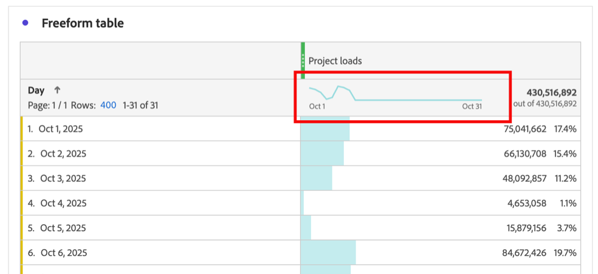

# Affichage des données de tendance pour un tableau à structure libre

Vous pouvez afficher la tendance des données incluses dans un tableau à structure libre. Ces données de tendances s’affichent dans les zones suivantes d’Analysis Workspace :

* [Graphiques sparkline](#use-sparklines-to-view-trended-data)

* [Visualisations en ligne](#use-line-visualizations-to-view-trended-data)

## Utiliser des graphiques sparkline pour afficher les données de tendance

Les graphiques sparkline sont affichés dans l’en-tête des colonnes de mesures des tableaux à structure libre.

Les graphiques sparkline incluent toujours :

* Données de tendance pour toutes les données de la colonne

* Tout critère de filtre de recherche appliqué à la dimension du tableau

  Pour plus d’informations, voir [Filtrer et trier](/help/analysis-workspace/visualizations/freeform-table/filter-and-sort.md).

## Utiliser les visualisations en ligne pour afficher les données de tendances

Les visualisations [Ligne](/help/analysis-workspace/visualizations/line.md) affichent les données du tableau à structure libre auquel elles sont connectées.

### Connecter une visualisation en ligne à un tableau à structure libre

Selon la manière dont et le moment où la visualisation en ligne a été ajoutée au projet, elle peut déjà être connectée au tableau à structure libre souhaité. Procédez comme suit pour vérifier ou pour le connecter manuellement :

1. Ajoutez une visualisation Ligne à un projet Analysis Workspace.

1. Sélectionnez le point en regard du nom de la visualisation, sélectionnez l’onglet **[!UICONTROL Source de données]**, puis sélectionnez le nom du tableau à structure libre que vous souhaitez connecter à la visualisation en ligne.

   

### Choisissez les données incluses dans la visualisation en ligne

Les données incluses dans la visualisation en ligne connectée diffèrent selon la cellule sélectionnée dans le tableau à structure libre.

Pour afficher une tendance de toutes les données du tableau à structure libre, sélectionnez la cellule de graphique sparkline dans le tableau à structure libre.

Lorsque la cellule de graphique sparkline est sélectionnée, la cellule s&#39;affiche en gris foncé.

Lorsque la cellule de graphique sparkline du tableau connecté est sélectionnée, les visualisations en ligne incluent :

* Données de tendance pour toutes les données de la colonne

* Tout critère de filtre de recherche appliqué à la dimension du tableau

  Pour plus d’informations, voir [Filtrer et trier](/help/analysis-workspace/visualizations/freeform-table/filter-and-sort.md).

Lorsque le graphique sparkline du tableau connecté n’est pas sélectionné, les visualisations linéaires incluent :

* Données de la ligne sélectionnée dans la table connectée. Si aucune ligne n’est sélectionnée, les données de la première dimension uniquement du tableau connecté s’affichent.

* Tous les critères de filtre de recherche appliqués à la dimension du tableau sont ignorés

  Pour plus d’informations, voir [Filtrer et trier](/help/analysis-workspace/visualizations/freeform-table/filter-and-sort.md).

## Inclure des critères de filtre dans les visualisations Ligne connectée

Pour plus d’informations sur le moment où les critères de filtre sont inclus dans les visualisations Ligne connectée, voir [Inclure les critères de filtre dans les données de tendance dans les graphiques sparkline et Ligne](/help/analysis-workspace/visualizations/freeform-table/filter-and-sort.md#include-filter-criteria-in-trended-data-in-sparklines-and-line-visualizations)
